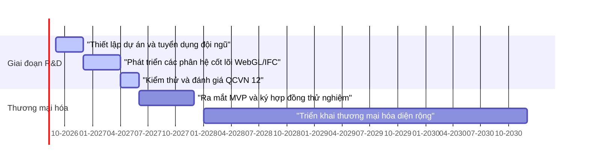

# TỔNG QUAN KẾ HOẠCH TÀI CHÍNH 5 NĂM (2026 - 2030)
## DỰ ÁN PHÁT TRIỂN VÀ THƯƠNG MẠI HÓA NỀN TẢNG MÔI TRƯỜNG DỮ LIỆU CHUNG BIM CDE CIC

---

## 1. TỔNG QUAN DỰ ÁN & MÔ HÌNH VẬN HÀNH

### 1.1. Bối cảnh và Tiến độ triển khai
Dự án phát triển nền tảng Môi trường dữ liệu chung BIM CDE CIC phục vụ ngành xây dựng tại Việt Nam, đáp ứng các tiêu chuẩn kỹ thuật về xử lý mô hình 3D (IFC/WebGL) và bảo mật thông tin theo Quy chuẩn kỹ thuật quốc gia QCVN 12.

*   **Thời gian thực hiện (giai đoạn R&D):** ~10 tháng, bắt đầu từ **tháng 09/2026** và hoàn thành xây dựng các phân hệ cốt lõi vào **giữa năm 2027**.
*   **Thời điểm bắt đầu thương mại hóa:** Dự kiến phát sinh doanh thu từ **giữa năm 2027**.
*   **Mô hình triển khai hạ tầng:** **Cloud-First** sử dụng các dịch vụ điện toán đám mây trong nước để vận hành mảng SaaS, giúp tối ưu hóa chi phí đầu tư ban đầu và tuân thủ các quy định về an ninh dữ liệu.

### 1.2. Biểu đồ tiến độ dự án (Gantt Chart)

### 1.3. Cơ cấu Nguồn vốn đầu tư ban đầu (CAPEX)
Tổng vốn đầu tư CAPEX dự kiến cho giai đoạn phát triển và chuẩn bị thương mại (2026–2027) là **25,1 tỷ VNĐ**. Cơ cấu nguồn vốn được phân bổ như sau:
*   **Vốn đối ứng của CIC (70%):** **17,6 tỷ VNĐ** (chịu trách nhiệm chính về nguồn vốn phát triển ban đầu).
*   **Nguồn tài trợ NATIF (30%):** **7,5 tỷ VNĐ** (hỗ trợ cho phần R&D công nghệ lõi và thử nghiệm).

---

## 2. GIẢ ĐỊNH TÀI CHÍNH CỐT LÕI

### 2.1. Giả định Nhân sự
*   **Đội ngũ phát triển (CAPEX):** Gồm **10 nhân sự lõi** trình độ cao, thực hiện cơ chế gộp vai trò (CTO kiêm Kiến trúc sư, PM kiêm BIM BA/QA, Backend kiêm DevOps) kết hợp công cụ AI hỗ trợ lập trình để tối ưu hiệu suất công việc trong 10 tháng phát triển.
*   **Đội ngũ vận hành (OPEX):** Thiết lập đội ngũ tinh gọn ban đầu gồm **12 người (năm 2027)**, sau đó tăng dần lên **20 người (năm 2028)** và ổn định ở mức **22 người (năm 2029-2030)** để đáp ứng sự tăng trưởng của lượng user SaaS và các hợp đồng On-Premise.

### 2.2. Giả định Hạ tầng đám mây trong nước (Cloud-First)
*   Để đáp ứng Luật An ninh mạng Việt Nam và Nghị định 13/2023/NĐ-CP về bảo vệ dữ liệu cá nhân, toàn bộ dữ liệu CDE của mảng SaaS được lưu trữ và vận hành trên hạ tầng Cloud của các nhà cung cấp uy tín trong nước (Viettel Cloud, VNPT Cloud, CMC Cloud).
*   Môi trường phát triển và kiểm thử năm 2026 được thuê Cloud theo cấu hình tối giản, sau đó mở rộng quy mô tài nguyên lưu trữ và băng thông truyền tải theo số lượng user hoạt động thực tế.
*   Đối với khách hàng mua gói **On-Premise** (Sở Xây dựng, PMU và Doanh nghiệp lớn): **Toàn bộ chi phí hạ tầng phần cứng cài đặt tại local do khách hàng tự chịu trách nhiệm chi trả và lắp đặt**. CIC chỉ bàn giao bộ cài và chịu trách nhiệm cấu hình phần mềm, hỗ trợ bảo trì hệ thống.

### 2.3. Giả định Định giá và Kênh bán hàng
Sản phẩm được khai thác qua 2 mô hình doanh thu chính:
1.  **SaaS (Software as a Service):** Tính phí thuê bao theo tháng trên mỗi user hoạt động. Đơn giá ARPU trung bình dự kiến là **0,5 triệu VNĐ/user/tháng** (tương đương 6 triệu VNĐ/user/năm).
2.  **On-Premise (Private Cloud/Local Server):** Bán License cài đặt tại hạ tầng của khách hàng.
    *   **Giá hợp đồng PMU:** Khởi điểm từ **2,0 tỷ VNĐ/HĐ** (2027), tăng dần lên **3,0 tỷ VNĐ/HĐ** (2030) tùy quy mô dự án.
    *   **Giá hợp đồng Sở Xây dựng:** Khởi điểm từ **1,8 tỷ VNĐ/HĐ** (2027), tăng dần lên **2,5 tỷ VNĐ/HĐ** (2030) tùy quy mô tỉnh/thành phố.
    *   **Giá hợp đồng Doanh nghiệp lớn:** Khởi điểm từ **3,0 tỷ VNĐ/HĐ** (2027), tăng dần lên **4,2 tỷ VNĐ/HĐ** (2030) tùy số lượng user nội bộ sử dụng.
    *   **Phí bảo trì hàng năm (AMC):** Tính bằng **15%** giá trị hợp đồng lũy kế của các năm trước (bắt đầu thu từ năm thứ 2 sau khi bàn giao hệ thống).

---

## 3. KẾ HOẠCH CHI PHÍ ĐẦU TƯ (CAPEX)

Tổng chi phí đầu tư giai đoạn phát triển R&D và chuẩn bị thương mại (2026 - 2027) là **25,1 tỷ VNĐ**. 

### 3.1. Bảng phân bổ chi tiết danh mục CAPEX (tỷ VNĐ)

| Mã danh mục | Hạng mục đầu tư | Năm 2026 | Năm 2027 | Tổng đầu tư | Khảo sát thực tế & Giải trình chi tiết |
| :--- | :--- | :---: | :---: | :---: | :--- |
| **CAP-01** | **Nhân sự phát triển lõi** | **3,1** | **4,7** | **7,8** | Quỹ lương của 10 nhân sự lõi trong 10 tháng phát triển. Mức lương thực tế khảo sát thị trường IT Việt Nam: CTO (~75-80 tr/tháng), Senior Đồ họa WebGL/BIM (~55 tr/tháng), Senior BE/DevOps (~42 tr/tháng), PM/BA (~55 tr/tháng). |
| **CAP-02** | **Trang thiết bị văn phòng** | **0,7** | **0,4** | **1,1** | Mua sắm Workstation chuyên dụng cho đội kỹ thuật BIM/WebGL (3 máy x 50 tr), laptop cấu hình cao cho dev (7 máy x 35 tr), thiết bị mạng, tường lửa văn phòng và setup hạ tầng an ninh local. |
| **CAP-03** | **Bản quyền & API tích hợp**| **3,0** | **3,0** | **6,0** | Phí bản quyền các thư viện SDK BIM/IFC thương mại và engine WebGL tối ưu hiệu năng hiển thị 3D nặng trong thời kỳ phát triển. |
| **CAP-04** | **Marketing & Sales ra mắt** | **0,9** | **4,5** | **5,4** | Nghiên cứu thị trường xây dựng năm 2026; Tổ chức hội thảo giới thiệu giải pháp BIM CDE cho khối PMU/Sở Xây dựng và chiến dịch marketing B2B trực tiếp năm 2027. |
| **CAP-05** | **Tư vấn, PM & Pháp lý** | **1,8** | **3,0** | **4,8** | Chi phí tư vấn kỹ thuật, kiểm định an ninh đạt chuẩn QCVN 12 của Bộ Thông tin & Truyền thông, đăng ký quyền sở hữu trí tuệ và thủ tục pháp lý thành lập sản phẩm. |
| | **TỔNG CỘNG CAPEX** | **9,5** | **15,6** | **25,1** | **CIC tự đối ứng 17,6 tỷ VNĐ (70%), NATIF tài trợ 7,5 tỷ VNĐ (30%)** |

---

## 4. KẾ HOẠCH CHI PHÍ VẬN HÀNH (OPEX)

Chi phí vận hành của dự án bao gồm chi phí nhân sự vận hành, chi phí thuê Cloud trong nước và các chi phí quản lý hành chính khác.

### 4.1. Chi tiết cơ cấu nhân sự vận hành (OPX-01)
Mức lương cứng và số lượng nhân sự vận hành được phân bổ như sau:

| Vị trí nhân sự vận hành | Mức lương cứng (tr VNĐ/tháng) | SL 2027 (6 tháng) | SL 2028 | SL 2029 - 2030 |
| :--- | :--- | :---: | :---: | :---: |
| Quản lý vận hành | 50 | 1 | 1 | 1 |
| Bảo trì BIM / IFC Support | 40 | 1 | 2 | 2 |
| Kỹ sư Backend / DevOps | 42 | 1 | 2 | 2 |
| Kỹ sư Frontend | 36 | 1 | 1 | 1 |
| Chuyên viên An ninh (Security Ops)| 45 | 1 | 1 | 1 |
| Kỹ sư QA / Kiểm thử | 30 | 1 | 1 | 1 |
| Nhân viên Sales (B2B/B2G) | 25 | 1 | 3 | 4 |
| Chăm sóc KH (Customer Success) | 25 | 1 | 3 | 4 |
| Hỗ trợ kỹ thuật (L1/L2 Support) | 20 | 2 | 4 | 4 |
| Nhân sự G&A (HR, Kế toán, Admin)| 22 | 2 | 2 | 2 |
| **TỔNG NHÂN SỰ VẬN HÀNH** | | **12** | **20** | **22** |
| **Quỹ lương cứng/tháng** | | **377 tr VNĐ** | **599 tr VNĐ** | **649 tr VNĐ** |

*Ghi chú về chi phí thực tế (OPEX nhân sự):*
Chi phí nhân sự thực tế hàng năm của doanh nghiệp bao gồm Lương cứng + **hệ số tải (Overhead Multiplier) từ 1.46 - 1.62** để chi trả bảo hiểm xã hội (21.5% lương đóng), bảo hiểm y tế, thuế TNCN do doanh nghiệp chịu, thưởng lương tháng 13 & thưởng hiệu quả, chi phí tuyển dụng/đào tạo và phúc lợi công đoàn:
*   **Năm 2027 (6 tháng):** **3,7 tỷ VNĐ** (quỹ lương cứng 377 tr/tháng x 6 tháng x hệ số tải 1,62).
*   **Năm 2028 (12 tháng):** **10,7 tỷ VNĐ** (quỹ lương cứng 599 tr/tháng x 12 tháng x hệ số tải 1,49).
*   **Năm 2029 - 2030 (12 tháng):** **11,4 tỷ VNĐ** (quỹ lương cứng 649 tr/tháng x 12 tháng x hệ số tải 1,46).

### 4.2. Chi tiết chi phí thuê Cloud trong nước (OPX-02)
Khảo sát thực tế chi phí thuê máy chủ ảo (vCPU, RAM, SSD Enterprise) và Object Storage lưu trữ dữ liệu BIM lớn từ các nhà cung cấp nội địa (Viettel, VNPT, CMC), chi phí thuê Cloud được lập kế hoạch như sau:

| Hạng mục chi tiết thuê Cloud | 2026 (Dev) | 2027 (Y1) | 2028 (Y2) | 2029 (Y3) | 2030 (Y4) | Khảo sát thực tế & Giải trình chi tiết |
| :--- | :---: | :---: | :---: | :---: | :---: | :--- |
| **Server lưu trữ BIM & Data** | 0,05 | 0,40 | 1,00 | 1,80 | 2,50 | Dung lượng lưu trữ Object Storage tích lũy tăng dần. Giá thuê trung bình trong nước: ~900 VNĐ/GB/tháng. Đạt quy mô lưu trữ hàng chục Terabyte vào năm 2030. |
| **Server xử lý WebGL & Node** | 0,05 | 0,40 | 0,80 | 1,20 | 1,60 | Thuê các VM cấu hình cao (16 vCPU, 64GB RAM) phục vụ dựng hình WebGL server-side và xử lý nén file BIM/IFC. |
| **Dịch vụ DevOps & Monitor** | 0,05 | 0,20 | 0,30 | 0,40 | 0,60 | Thuê các dịch vụ hạ tầng mạng Cloud, cân bằng tải (Load Balancer), hệ thống Firewall bảo mật Cloud và dịch vụ CI/CD. |
| **Bản quyền OS, DB & SSL** | 0,05 | 0,20 | 0,40 | 0,60 | 0,80 | Phí bản quyền hệ điều hành máy chủ, hệ quản trị cơ sở dữ liệu PostgreSQL Enterprise và chứng chỉ bảo mật SSL định kỳ. |
| **TỔNG OPEX THUÊ CLOUD** | **0,2** | **1,2** | **2,5** | **4,0** | **5,5** | **Tổng chi phí thuê Cloud 5 năm đạt 13,4 tỷ VNĐ.** |

### 4.3. Bảng tổng hợp chi phí vận hành OPEX dự án (tỷ VNĐ)

| Hạng mục OPEX | Năm 2026 | Năm 2027 | Năm 2028 | Năm 2029 | Năm 2030 |
| :--- | :---: | :---: | :---: | :---: | :---: |
| Nhân sự vận hành (OPX-01) | — | 3,7 | 10,7 | 11,4 | 11,4 |
| Thuê hạ tầng Cloud (OPX-02) | 0,2 | 1,2 | 2,5 | 4,0 | 5,5 |
| Các chi phí vận hành khác (Văn phòng, Marketing thường niên, License API định kỳ, kiểm thử pentest an ninh...) | — | 11,0 | 22,0 | 26,0 | 31,0 |
| **TỔNG OPEX VẬN HÀNH** | **0,2** | **15,9** | **35,2** | **41,4** | **47,9** |

---

## 5. KẾ HOẠCH DOANH THU

Doanh thu bắt đầu được ghi nhận từ năm 2027 sau khi hoàn thành thương mại hóa sản phẩm. Mục tiêu dài hạn đến năm 2030 dự án sở hữu tệp khách hàng B2G vững chắc gồm ít nhất **15 Sở Xây dựng** và **30 PMU (Ban quản lý dự án)** trên cả nước.

### 5.1. Giả định khối lượng và đơn giá khách hàng

| Phân khúc khách hàng | Năm 2026 | Năm 2027 | Năm 2028 | Năm 2029 | Năm 2030 |
| :--- | :---: | :---: | :---: | :---: | :---: |
| **1. Kênh SaaS** | | | | | |
| - Số lượng user cuối kỳ | 0 | 1.000 | 4.000 | 9.000 | 15.000 |
| - Đơn giá ARPU (tr VNĐ/user/tháng)| — | 0,5 | 0,5 | 0,52 | 0,55 |
| - Số tháng chạy thương mại | 0 | 6 | 12 | 12 | 12 |
| **2. Kênh On-Premise PMU** | | | | | |
| - Hợp đồng mới ký trong năm | 0 | 2 | 6 | 10 | 12 |
| - Giá trị hợp đồng mới (tỷ VNĐ/HĐ)| — | 2,0 | 2,3 | 2,6 | 3,0 |
| - Lũy kế số PMU sử dụng | 0 | 2 | 8 | 18 | 30 |
| **3. Kênh On-Premise Sở Xây dựng**| | | | | |
| - Hợp đồng mới ký trong năm | 0 | 1 | 3 | 5 | 6 |
| - Giá trị hợp đồng mới (tỷ VNĐ/HĐ)| — | 1,8 | 2,0 | 2,2 | 2,5 |
| - Lũy kế số Sở XD sử dụng | 0 | 1 | 4 | 9 | 15 |
| **4. Kênh On-Premise Doanh nghiệp**| | | | | |
| - Hợp đồng mới ký trong năm | 0 | 1 | 3 | 4 | 5 |
| - Giá trị hợp đồng mới (tỷ VNĐ/HĐ)| — | 3,0 | 3,4 | 3,8 | 4,2 |
| - Lũy kế số DN sử dụng | 0 | 1 | 4 | 8 | 13 |

### 5.2. Bảng tổng hợp kết quả doanh thu (tỷ VNĐ)

| Kênh doanh thu | Năm 2026 | Năm 2027 | Năm 2028 | Năm 2029 | Năm 2030 |
| :--- | :---: | :---: | :---: | :---: | :---: |
| Doanh thu SaaS | 0 | 3,0 | 24,0 | 56,2 | 99,0 |
| Doanh thu On-Premise PMU | 0 | 4,0 | 14,4 | 28,7 | 42,6 |
| Doanh thu On-Premise Sở Xây dựng| 0 | 1,8 | 6,3 | 12,2 | 17,8 |
| Doanh thu On-Premise Doanh nghiệp| 0 | 3,0 | 10,7 | 17,2 | 25,3 |
| **TỔNG DOANH THU DỰ ÁN** | **0** | **11,8** | **55,4** | **114,3** | **184,7** |

---

## 6. KẾT QUẢ TÀI CHÍNH & DÒNG TIỀN DỰ ÁN

### 6.1. Bảng dòng tiền P&L dự án tổng thể (tỷ VNĐ)

| Chỉ tiêu tài chính | Năm 2026 | Năm 2027 | Năm 2028 | Năm 2029 | Năm 2030 |
| :--- | :---: | :---: | :---: | :---: | :---: |
| **Doanh thu** | **0** | **11,8** | **55,4** | **114,3** | **184,7** |
| Lợi nhuận gộp (Biên LN 60%) | 0 | 7,1 | 33,2 | 68,6 | 110,8 |
| Chi phí đầu tư (CAPEX) | (9,5) | (15,6) | — | — | — |
| Chi phí vận hành (OPEX) | (0,2) | (15,9) | (35,2) | (41,4) | (47,9) |
| **Dòng tiền ròng dự án hàng năm**| **(9,7)** | **(24,4)** | **(2,0)** | **+27,2** | **+62,9** |
| **Dòng tiền ròng tích lũy dự án**| **(9,7)** | **(34,1)** | **(36,1)** | **(8,9)** | **+40,3** |

*Ghi chú: Lợi nhuận gộp (Biên lợi nhuận 60%) được tính sau khi trừ đi Giá vốn hàng bán (COGS chiếm 40% doanh thu). Khảo sát thực tế cơ cấu COGS 40% của các sản phẩm BIM CDE bao gồm các chi phí trực tiếp:*
1. **Chi phí triển khai local trực tiếp tại khách hàng (On-Premise B2G/B2B):** Chi phí khảo sát hạ tầng phòng máy chủ, cài đặt cấu hình hệ thống, import dữ liệu dự án ban đầu, công tác phí (đi lại, lưu trú) cho đội ngũ triển khai kỹ thuật tại 15 Sở Xây dựng và 30 Ban QLDA.
2. **Phí tích hợp và bản quyền API bên thứ ba phân bổ theo lượng sử dụng:** Bản quyền SDK phân tích file IFC (như ODA SDK), API bản đồ nền số, chi phí cổng thanh toán trực tuyến (1.5% - 2.5% doanh thu SaaS cho mảng B2C).
3. **Chi phí băng thông (Data Transfer Out) và CDN truyền tải dữ liệu BIM nặng:** Do file BIM/IFC có dung lượng rất lớn (từ vài trăm MB đến hàng GB), chi phí truyền tải dữ liệu qua mạng khi user thao tác xem mô hình 3D trên trình duyệt được hạch toán trực tiếp vào giá vốn dịch vụ.
4. **Chi phí đào tạo chuyển giao & nhân sự hỗ trợ trực tiếp:** Tổ chức các lớp đào tạo tập trung sử dụng phần mềm, chuyển giao tài liệu kỹ thuật, chi phí hỗ trợ L1/L2 trực tiếp xử lý lỗi hệ thống cho khách hàng giai đoạn đầu.

### 6.2. Bảng dòng tiền ròng của riêng chủ đầu tư CIC (tỷ VNĐ)
Do NATIF tài trợ 30% CAPEX phát triển, phần gánh vác dòng tiền đầu tư của CIC được tối ưu hóa đáng kể:

| Chỉ tiêu tài chính | Năm 2026 | Năm 2027 | Năm 2028 | Năm 2029 | Năm 2030 |
| :--- | :---: | :---: | :---: | :---: | :---: |
| Lợi nhuận gộp dự án | 0 | 7,1 | 33,2 | 68,6 | 110,8 |
| Chi phí đầu tư của CIC (70% CAPEX)| (6,7) | (10,9) | — | — | — |
| Chi phí vận hành của dự án (OPEX)| (0,2) | (15,9) | (35,2) | (41,4) | (47,9) |
| **Dòng tiền ròng CIC hàng năm** | **(6,9)** | **(19,7)** | **(2,0)** | **+27,1** | **+62,9** |
| **Dòng tiền ròng tích lũy CIC** | **(6,9)** | **(26,6)** | **(28,6)** | **(1,5)** | **+51,9** |

---

## 7. CÁC CHỈ SỐ HIỆU QUẢ TÀI CHÍNH (WACC = 12%)

Các chỉ số tài chính được tính toán trong khung thời gian 5 năm (2026 - 2030) với tỷ lệ chiết khấu chi phí sử dụng vốn bình quan (WACC) giả định là **12%/năm**:

*   **Chỉ số NPV toàn dự án:** đạt **+26,2 tỷ VNĐ** (Trạng thái: **Dương - Đạt yêu cầu khả thi cao**).
*   **Tỷ suất sinh lời nội bộ IRR toàn dự án:** đạt **37,0%** (Vượt xa chi phí sử dụng vốn 12%).
*   **Chỉ số NPV đầu tư của riêng CIC:** đạt **+33,2 tỷ VNĐ** (Trạng thái: **Rất hiệu quả**).
*   **Tỷ suất sinh lời nội bộ IRR đầu tư của CIC:** đạt **48,2%** (Dự án đạt hiệu quả siêu lợi nhuận cho chủ đầu tư nhờ đòn bẩy tài trợ 30% của NATIF).
*   **Hòa vốn dòng tiền năm:** Đạt được vào **Quý 2/2029** (Khi dòng tiền ròng năm chuyển sang dương mạnh mẽ +27,2 tỷ).
*   **Thời gian hoàn vốn lũy kế dự án:** **~ 4 năm** (Hoàn vốn vào khoảng **Quý 4/2029 / Đầu Quý 1/2030**).

---

## 8. PHÂN TÍCH RỦI RO & PHƯƠNG ÁN KIỂM SOÁT TÀI CHÍNH

### 8.1. Rủi ro trễ tiến độ phát triển R&D
*   **Mô tả:** Đội ngũ phát triển quá tinh gọn (10 người) để hoàn thành khối lượng công việc CDE đồ họa phức tạp trong 10 tháng. Nếu trễ tiến độ, thời điểm thương mại hóa 2027 bị dịch sang 2028 làm giảm đáng kể doanh thu tích lũy.
*   **Phương án kiểm soát:** 
    1.  Thiết lập cơ chế thưởng theo mốc hoàn thành công việc cụ thể (*milestone bonus*).
    2.  Trích lập quỹ phòng ngừa rủi ro outsource (dự trù sẵn 1–2 đối tác outsourcing uy tín để gánh bớt phần việc cắt nhỏ khi cao điểm, chi phí này hạch toán vào OPEX tư vấn).

### 8.2. Rủi ro chi phí hạ tầng Cloud phát sinh ngoài tầm kiểm soát
*   **Mô tả:** Dung lượng lưu trữ file BIM/IFC của khách hàng SaaS tăng nhanh đột biến khiến chi phí Cloud vượt quá dự toán.
*   **Phương án kiểm soát:**
    1.  Thiết kế kiến trúc tối ưu hóa nén và chuẩn hóa dữ liệu mô hình BIM trước khi lưu trữ (ví dụ: chuyển đổi file IFC sang định dạng nhị phân tối ưu của CIC để giảm 70% dung lượng lưu trữ server).
    2.  Áp dụng giới hạn dung lượng lưu trữ (*Storage quota*) cho từng cấp độ tài khoản SaaS. Nếu user vượt quá dung lượng miễn phí, bắt buộc phải trả phí phụ trội (hạch toán vào doanh thu phát sinh).

### 8.3. Rủi ro tiếp cận thị trường B2G (Sở Xây dựng và PMU) chậm
*   **Mô tả:** Quy trình phê duyệt ngân sách công để mua sắm hệ thống CDE tại các Sở Xây dựng và PMU kéo dài, dẫn đến không đạt mục tiêu số lượng hợp đồng mới hàng năm.
*   **Phương án kiểm soát:**
    1.  Tập trung tiếp cận trước vào các tỉnh/thành phố trọng điểm đang thí điểm chuyển đổi số xây dựng mạnh (như Hà Nội, TP.HCM, Đà Nẵng, Bình Dương).
    2.  Sử dụng chiến lược bán hàng kết hợp tư vấn giải pháp toàn diện cho các dự án đầu tư công, chứng minh lợi ích tiết kiệm 5-10% chi phí quản lý dự án để thuyết phục chủ đầu tư mua sắm sớm.
