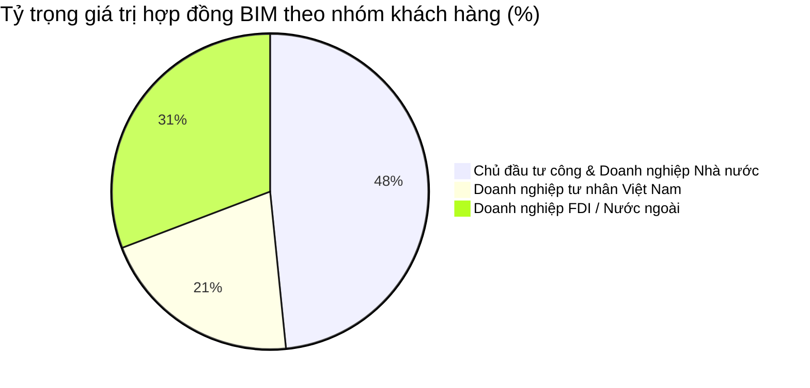

# BÁO CÁO ĐÁNH GIÁ TỔNG HỢP MẠNG LƯỚI TƯ VẤN BIM (TRUNG TÂM BIM)
*Thời gian lập báo cáo: 09/06/2026*
*Đơn vị thực hiện phân tích: Ban Kế hoạch - Tài chính & Ban Công nghệ (ERP)*

---

## 1. Lời mở đầu & Mục tiêu báo cáo

Mô hình Thông tin Công trình (**BIM - Building Information Modeling**) đang trở thành tiêu chuẩn bắt buộc và là xu hướng tất yếu trong ngành xây dựng, quản lý dự án tại Việt Nam.

Báo cáo này tập trung rà soát và đánh giá toàn diện **78 hợp đồng trực thuộc quản lý của Trung tâm BIM (BIM)** trong cơ sở dữ liệu hệ thống ERP, đồng thời bổ sung **phân tích doanh số & sản lượng bán các phần mềm phục vụ BIM**, **thống kê phân loại đối tượng khách hàng**, và **đánh giá tỷ lệ khách hàng quay lại** nhằm phân tích:
*   **Hiệu quả tài chính** riêng của Trung tâm BIM (doanh thu, lợi nhuận, dòng tiền thực thu).
*   **Mạng lưới đối tác thầu phụ & nhà cung cấp** (mạng ngoài của Trung tâm BIM).
*   **Cơ cấu chi phí triển khai** thực tế.
*   **Doanh số & sản lượng bán bản quyền phần mềm BIM & CDE** trên toàn hệ thống.
*   **Đặc điểm và phân loại mạng lưới khách hàng** của Trung tâm BIM.
*   **Tỷ lệ khách hàng quay lại** và mức độ trung thành của khách hàng.
*   **Đội ngũ nhân sự phụ trách chủ chốt** (mạng trong).
*   **Các rủi ro, cơ hội và kiến nghị giải pháp phát triển**.

---

## 2. Số liệu tài chính tổng quan mảng tư vấn BIM - Trung tâm BIM

Dựa trên dữ liệu tổng hợp từ 78 hợp đồng của Trung tâm BIM, kết quả tài chính tổng quan được ghi nhận như sau:

| Chỉ số tài chính | Giá trị (VND) | Tỷ lệ (%) | Nhận định & Đánh giá dòng tiền |
| :--- | :--- | :--- | :--- |
| **Tổng giá trị hợp đồng (có VAT)** | **66,134,952,935** | 100.0% | Quy mô các dự án BIM do Trung tâm BIM trực tiếp ký kết. |
| **Doanh thu dự kiến trước thuế** | **60,122,684,486** | 90.9% | Doanh thu thuần dự kiến sau khi trừ thuế VAT đầu ra. |
| **Chi phí ước tính triển khai** | **36,636,883,378** | 55.4% | Bao gồm chi phí thầu phụ, vật tư và chi phí triển khai. |
| **Lợi nhuận gộp quản trị dự kiến** | **24,048,735,662** | **36.36%** | **Biên lợi nhuận gộp dự kiến đạt mức 36.36%**, thể hiện hiệu quả sinh lời vượt trội của riêng Trung tâm BIM. |
| **Doanh thu thực tế đã ghi nhận (đã xuất VAT)** | **10,498,855,677** | 15.9% | Tỷ lệ xuất hóa đơn VAT còn thấp so với tổng giá trị ký kết. |
| **Tổng tiền thực thu (Cash Received)** | **23,767,255,400** | **35.94%** | **Thực thu dòng tiền đạt gần 36% giá trị ký kết**, cao gấp hơn 2.2 lần doanh thu đã xuất hóa đơn. |
| **Công nợ phải thu từ khách hàng** | **-12,373,076,380** | — | **Công nợ âm**: Trung tâm BIM thu trước tiền tạm ứng rất tốt, tối ưu dòng tiền hoạt động. |
| **Công nợ phải trả cho thầu phụ** | **12,671,566,697** | — | Các khoản phải trả cho thầu phụ/nhà cung cấp cần được thanh toán theo tiến độ nghiệm thu. |

> [!NOTE]
> **Đặc thù dòng tiền Trung tâm BIM:** 
> Việc công nợ phải thu đang âm **-12.37 tỷ VND** chứng tỏ Trung tâm BIM có năng lực đàm phán điều khoản tạm ứng và thu hồi công nợ giai đoạn đầu rất tốt. Tuy nhiên, việc doanh thu ghi nhận thực tế (đã xuất VAT) mới đạt **10.50 tỷ VND** (15.9%) đòi hỏi Trung tâm cần tập trung đẩy nhanh tiến độ hoàn thành các mốc bàn giao để nghiệm thu và xuất hóa đơn VAT tương ứng, đảm bảo tuân thủ quy định pháp luật về thuế đối với dòng tiền tạm ứng.

---

## 3. Phân tích theo trạng thái hợp đồng (Trung tâm BIM)

Hệ thống 78 hợp đồng của Trung tâm BIM được phân bổ theo các trạng thái như sau:

| Trạng thái hợp đồng | Số lượng | Tổng giá trị (VND) | Thực thu tiền mặt (VND) | Tỷ lệ thu hồi tiền mặt | Nhận xét |
| :--- | :---: | :--- | :--- | :---: | :--- |
| **Processing (Đang thực hiện)** | 56 | 59,413,921,151 | 18,483,017,272 | 31.1% | Chiếm gần 90% tổng giá trị hợp đồng. Đây là các dự án đang trong quá trình thực hiện, nguồn lực cần được tập trung cao độ để bàn giao đúng hạn. |
| **Completed (Hoàn thành)** | 16 | 2,898,979,414 | 2,678,312,828 | 92.4% | Các dự án đã thanh lý, công nợ thu hồi đạt mức cao. |
| **Acceptance (Nghiệm thu/Thanh lý)** | 6 | 3,822,052,370 | 2,605,925,300 | 68.2% | Đang làm thủ tục quyết toán, cần thu hồi nốt ~1.2 tỷ VND công nợ tồn đọng. |
| **Tổng cộng** | **78** | **66,134,952,935** | **23,767,255,400** | **35.94%** | |

---

## 4. Mạng lưới đối tác thầu phụ & nhà cung cấp (Trung tâm BIM)

Tổng giá trị mua thầu phụ và vật tư từ các đối tác của Trung tâm BIM là **12,603,541,318 VND**. Mạng lưới đối tác thầu phụ được cấu trúc như sau:

| Đối tác / Nhà cung cấp | Số hạng mục | Tổng giá trị mua (VND) | Doanh thu đầu ra tương ứng (VND) | Tỷ lệ Chi phí/Doanh thu | Sản phẩm/Dịch vụ cung cấp chính | Đánh giá năng lực đối tác |
| :--- | :---: | :--- | :--- | :---: | :--- | :--- |
| **CIC (Nội bộ)** | 33 | 7,096,300,000 | 22,582,244,545 | 31.4% | Điều phối nhân sự nội bộ công ty. | **Đầu mối cốt lõi**. Giúp giữ lại biên lợi nhuận cao (68.6%) cho công ty. |
| **Digicons** | 10 | 1,415,177,273 | 8,093,398,590 | **17.5%** | Dịch vụ tư vấn BIM, mô hình hóa và phối hợp thiết kế. | **Thầu phụ chiến lược xuất sắc**. Tỷ lệ chi phí cực kỳ tối ưu (chỉ 17.5%), mang lại hiệu quả tài chính rất cao cho các dự án hợp tác. |
| **TAK** | 1 | 2,533,333,333 | 4,209,158,829 | 60.2% | Dịch vụ thầu phụ tư vấn BIM chuyên sâu. | **Thầu phụ chuyên sâu**. Thực hiện gói thầu lớn, tỷ lệ chi phí ở mức trung bình khá (60.2%). |
| **Nhật Nam / Nhật Nam Infotech** | 13 | 825,700,000 | 7,899,856,673 | 10.5% | Dịch vụ tư vấn BIM, số hóa bản vẽ và dựng mô hình. | **Thầu phụ vệ tinh tin cậy**. Quy mô vừa và nhỏ nhưng chi phí rất thấp (10.5%), chất lượng dịch vụ ổn định. |
| **Kubus / OneCAD / Autodesk** | 4 | 203,050,000 | 889,009,091 | 22.8% | Bản quyền phần mềm quản lý BIM và license bổ trợ. | **Nhà cung cấp giải pháp**. Phục vụ phân phối phần mềm quản lý dự án BIM chuyên sâu. |
| **Đông Thái Sơn** | 1 | 225,000,000 | 679,806,944 | 33.1% | Dịch vụ tư vấn BIM. | Thầu phụ bổ trợ. |
| **Chuyên gia cá nhân & Khác** | 2 | 142,000,000 | 18,518,519 | — | Dịch vụ đào tạo và tư vấn BIM từ chuyên gia. | Mạng lưới chuyên gia độc lập hỗ trợ đào tạo. |
| *Không rõ nhà cung cấp* | 17 | 123,143,741 | 15,779,173,069 | 0.8% | Hạng mục bổ sung, chi phí lặt vặt. | Đang cần cập nhật lại thông tin nhà cung cấp trên ERP. |

---

## 5. Cơ cấu chi phí triển khai hợp đồng (Trung tâm BIM)

Tổng chi phí triển khai thực tế (Execution Costs) của Trung tâm BIM là **23,849,575,939 VND**.

Cơ cấu chi tiết chi phí triển khai:

| Khoản mục chi phí triển khai | Tần suất xuất hiện | Tổng số tiền (VND) | Tỷ trọng | Bản chất & Ý nghĩa nghiệp vụ |
| :--- | :---: | :--- | :---: | :--- |
| **Phí thuê chuyên gia (net & gross)** | 67 | **13,279,506,217** | **55.7%** | Chi trả cho các chuyên gia tư vấn BIM bên ngoài được thuê để hỗ trợ triển khai dự án. |
| **Phí thanh toán chứng từ** | 62 | **4,811,253,121** | **20.2%** | Chi phí hành chính, xử lý chứng từ pháp lý, thuế nhà thầu liên quan đến việc triển khai. |
| **Chi phí xúc tiến hợp đồng (DCS / Commission)** | 74 | **2,544,725,881** | **10.7%** | Chi phí hoa hồng, xúc tiến và phát triển thị trường để có được hợp đồng. |
| **Thưởng hoàn thành dự án** | 74 | **2,528,358,015** | **10.6%** | Thưởng cho đội ngũ triển khai nội bộ khi đạt các mốc tiến độ và hoàn thành bàn giao dự án. |
| **Ban lãnh đạo hỗ trợ & Khác** | 77 | **685,732,705** | **2.8%** | Chi phí phân bổ cho công tác hỗ trợ, giám sát của Ban lãnh đạo công ty và các phát sinh khác. |
| **Tổng cộng** | — | **23,849,575,939** | **100.0%** | |

---

## 6. Thống kê phân loại đối tượng khách hàng (Trung tâm BIM)

Dựa trên phân tích cơ cấu sở hữu pháp lý và tính chất của các đơn vị ký kết hợp đồng, mạng lưới khách hàng của Trung tâm BIM được phân chia thành 3 nhóm chính:

| Phân loại đối tượng khách hàng | Số lượng khách hàng | Số lượng hợp đồng | Tổng giá trị ký kết (VND) | Tỷ trọng giá trị | Thực thu tiền mặt (VND) | Tỷ lệ thu hồi tiền mặt | Đặc trưng & Hành vi thanh toán |
| :--- | :---: | :---: | :--- | :---: | :--- | :---: | :--- |
| **Chủ đầu tư công & DN Nhà nước** | 24 | 46 | **32,008,805,809** | **48.4%** | 10,823,077,203 | 33.8% | Các Ban quản lý dự án nhà nước và các Tổng công ty Nhà nước (như HUD, HUD-CIC, Viglacera, Tổng công ty 319...). Thủ tục hành chính chặt chẽ, thanh toán theo mốc ngân sách được duyệt. |
| **Doanh nghiệp tư nhân Việt Nam** | 20 | 24 | **13,724,516,591** | **20.8%** | 6,949,298,197 | **50.6%** | Các tổng công ty và doanh nghiệp tư nhân lớn trong nước (như ADC, các công ty CP xây dựng...). Quyết định nhanh, **tỷ lệ giải ngân thực tế cao nhất (50.6%)**. |
| **Doanh nghiệp FDI / Nước ngoài** | 4 | 8 | **20,401,630,535** | **30.8%** | 5,994,880,000 | 29.4% | Gồm các đối tác lớn như **Stellar**, **Sun Project**, **Junglim Architecture**, **Lotte Properties**. Yêu cầu kỹ thuật cao, giá trị trung bình hợp đồng lớn nhất (~2.55 tỷ VND/hợp đồng). |
| **Tổng cộng** | **48** | **78** | **66,134,952,935** | **100.0%** | **23,767,255,400** | **35.94%** | |

---

## 7. Đánh giá tỷ lệ khách hàng quay lại (Customer Retention Rate)

Chỉ số khách hàng quay lại (Repeat Customer Rate) phản ánh uy tín chuyên môn và chất lượng dịch vụ của Trung tâm BIM trong việc giữ chân và phát triển tệp khách hàng.

Thống kê chi tiết từ 78 hợp đồng của 48 khách hàng độc lập:

| Nhóm khách hàng | Số lượng khách hàng | Tỷ lệ số lượng | Tổng giá trị đóng góp (VND) | Tỷ trọng giá trị (Doanh số) | Nhận xét vai trò |
| :--- | :---: | :---: | :--- | :---: | :--- |
| **Khách hàng giao dịch 1 lần** | 38 | **79.2%** | 25,914,904,279 | 39.2% | Đóng vai trò mở rộng thị trường, phát triển cơ hội và tệp khách hàng mới. |
| **Khách hàng quay lại (>= 2 HĐ)** | 10 | **20.8%** | **40,220,048,656** | **60.8%** | **Động lực tăng trưởng doanh thu chủ chốt**. Chứng minh uy tín dịch vụ rất cao. |
| **Tổng cộng** | **48** | **100.0%** | **66,134,952,935** | **100.0%** | |

> [!TIP]
> **Quy luật Pareto (80/20) trong kinh doanh BIM:**
> Chỉ **20.8%** số lượng khách hàng quay lại ký tiếp hợp đồng nhưng đã mang lại tới **60.8%** tổng doanh số của Trung tâm BIM. Điều này thể hiện Trung tâm có chiến lược chăm sóc khách hàng cũ cực kỳ hiệu quả. Việc duy trì chất lượng dịch vụ để giữ chân nhóm khách hàng trung thành này có ý nghĩa sống còn đối với sự ổn định doanh thu của Trung tâm.

#### Khách hàng trung thành nhất (Ký từ 3 hợp đồng trở lên):
| Khách hàng | Số hợp đồng đã ký | Tổng giá trị (VND) | Thực thu tiền mặt (VND) | Tỷ lệ giải ngân | Đánh giá hành vi khách hàng |
| :--- | :---: | :--- | :--- | :---: | :--- |
| **DD&CN_HCM** (BQL DA Dân dụng TP.HCM) | 13 | **8,085,836,688** | 6,278,958,313 | **77.7%** | **Khách hàng VIP hàng đầu**. Ký liên tục 13 hợp đồng tư vấn BIM cho các dự án thành phần, giải ngân nhanh và uy tín rất cao. |
| **STELLAR., JSC** | 3 | **8,488,850,535** | 1,379,200,000 | 16.2% | Khách hàng tư nhân lớn. Quy mô gói thầu rất lớn, tiến độ giải ngân đang được triển khai. |
| **Ban Dân Dụng Hà Nội** | 4 | **7,567,344,060** | 1,617,635,000 | 21.4% | Khách hàng khối công chiến lược tại miền Bắc. |
| **TỔNG CÔNG TY 319 BỘ QUỐC PHÒNG** | 3 | **5,239,112,000** | 344,420,000 | 6.6% | Khách hàng doanh nghiệp nhà nước/quân đội quy mô lớn. |
| **JUNGLIM ARCHITECTURE VIETNAM** | 3 | **3,941,300,000** | 214,164,000 | 5.4% | Khối đối tác thiết kế FDI. Tiềm năng cộng tác thầu phụ lâu dài. |
| **Ban QLDA ĐTXD Công trình dân dụng Hà Nội** | 4 | **2,657,593,000** | 468,368,000 | 17.6% | Khách hàng công truyền thống. |
| **VĂN PHÒNG TƯ VẤN VÀ CHUYỂN GIAO CNXD** | 4 | **1,948,846,148** | 690,079,400 | 35.4% | Khách hàng liên kết chuyển giao công nghệ. |

#### Khách hàng quay lại ký đúng 2 hợp đồng:
*   **VCC (Tổng công ty Tư vấn Xây dựng Công nghiệp Việt Nam):** 2 hợp đồng, tổng giá trị **953,931,193 VND** (HĐ_009/BIM và HĐ_024/BIM).
*   **BQL DA ĐTXD khu vực I tỉnh Quảng Ninh:** 2 hợp đồng, tổng giá trị **698,803,032 VND** (HĐ_022/BIM và HĐ_041/BIM).
*   **BQL DA ĐTXD công trình dân dụng và công nghiệp tỉnh Đồng Tháp:** 2 hợp đồng, tổng giá trị **638,432,000 VND** (HĐ_067/BIM và HĐ_014/BIM).

---

## 8. Doanh số & Sản lượng bán phần mềm CDE và Quản lý BIM

Bên cạnh mảng dịch vụ tư vấn kỹ thuật, hoạt động bán bản quyền phần mềm hỗ trợ quy trình BIM và môi trường dữ liệu chung (**CDE - Common Data Environment**) cũng đóng góp đáng kể vào doanh thu chung của công ty. Phân tích kết quả kinh doanh đối với các giải pháp phần mềm CDE trên hệ thống hợp đồng ghi nhận các số liệu cụ thể sau:

### 8.1. Phân khúc phần mềm Autodesk ACC (Autodesk Construction Cloud / Docs / Collaborate Pro)
Autodesk Construction Cloud (ACC) và các sản phẩm liên quan như Autodesk Docs, BIM Collaborate Pro là bộ giải pháp CDE phổ biến nhất hiện nay.

*   **Tổng sản lượng bán ra:** **15 bộ / license** (thuê bao năm).
*   **Tổng doanh số bán ra:** **795,269,000 VND**.
*   **Tổng chi phí mua vào (giá vốn):** **628,139,200 VND**.
*   **Lợi nhuận gộp thương mại:** **167,129,800 VND** (Biên lợi nhuận gộp đạt **21.0%**).

#### Phân bổ doanh số ACC theo năm:
| Năm | Sản lượng (License) | Doanh số bán ra (VND) | Tỷ trọng doanh số | Nhận xét xu hướng |
| :---: | :---: | :--- | :---: | :--- |
| **2024** | 1 | 304,000,000 | 38.2% | Hợp đồng CDE lớn đầu tiên được triển khai. |
| **2025** | 3 | 306,350,000 | 38.5% | Duy trì doanh số ổn định qua các gói gia hạn. |
| **2026** | 11 | 184,919,000 | 23.3% | Sản lượng tăng đột biến nhưng chủ yếu là users lẻ. |

#### Phân bổ doanh số ACC theo Đơn vị bán:
| Đơn vị kinh doanh | Sản lượng (License) | Doanh số bán ra (VND) | Tỷ trọng | Vai trò trong mạng lưới |
| :--- | :---: | :--- | :---: | :--- |
| **Trung tâm DCS** | 3 | 510,350,000 | **64.2%** | **Đầu mối bán lớn** cho các tổng công ty xây dựng cần gói giải pháp nhiều users. |
| **Chi nhánh HCM (HCM)**| 11 | 184,919,000 | 23.2% | **Đầu mối bán lẻ** cho các văn phòng thiết kế phía Nam. |
| **Trung tâm BIM (BIM)** | 1 | 100,000,000 | 12.6% | Bán kèm theo gói dịch vụ tư vấn dự án. |
| **Tổng cộng** | **15** | **795,269,000** | **100.0%** | |

---

### 8.2. Phân khúc phần mềm quản lý BIMcollab (Kubus)
BIMcollab là giải pháp quản lý lỗi, điều phối mô hình BIM và môi trường dữ liệu chung CDE chuyên sâu của hãng Kubus (Hà Lan).

*   **Tổng sản lượng bán ra:** **5 bộ / license** (gói 20 người dùng hoặc license nổi).
*   **Tổng doanh số bán ra:** **427,500,000 VND**.
*   **Tổng chi phí mua vào (giá vốn):** **323,119,104 VND**.
*   **Lợi nhuận gộp thương mại:** **104,380,896 VND** (Biên lợi nhuận gộp đạt **24.4%**).
*   *Phân bổ:* **100% doanh số** của BIMcollab được ghi nhận vào năm **2024** và do **Trung tâm DCS** thực hiện qua hợp đồng cung cấp cho chủ đầu tư lớn.
*   *Chi tiết sản phẩm:* Gồm *BIMcollab Nexus (Premium)* - Doanh số **218.5 triệu VND** (Giá vốn: 165.6 triệu VND) và *BIMcollab Zoom (Floating)* - Doanh số **209.0 triệu VND** (Giá vốn: 157.5 triệu VND).

---

### 7.3. Phân khúc phần mềm CDE khác được ghi nhận (ProjectWise và Trimble Connect)
Hệ thống hợp đồng ghi nhận thêm doanh số từ 2 phần mềm CDE khác phục vụ các yêu cầu kỹ thuật đặc thù:

1.  **Bentley ProjectWise (CDE phân khúc cao cấp):**
    *   Giải pháp quản lý dữ liệu thiết kế và cộng tác BIM chuyên dụng cho các dự án hạ tầng lớn và giao thông (thường dùng ở các Viện thiết kế, Tổng công ty lớn như TEDI...).
    *   **Doanh số ghi nhận:** **468,353,000 VND** cho 3 licenses (phần lớn thuộc hợp đồng của Trung tâm DCS năm 2026 cung cấp cho khách hàng lớn trị giá **450,500,000 VND**).
2.  **Trimble Connect (CDE phân khúc tầm trung):**
    *   Giải pháp đám mây phối hợp mô hình BIM của hãng Trimble (thường dùng kết hợp với Tekla trong thiết kế kết cấu thép).
    *   **Doanh số ghi nhận:** **8,341,000 VND** cho 1 gói Trimble Connect Business Premium do Chi nhánh HCM phân phối năm 2026.

> [!TIP]
> **Nhận định kinh doanh phần mềm:**
> Việc đa dạng hóa dải sản phẩm từ phân khúc phổ thông đám mây (Autodesk ACC) đến chuyên sâu điều phối (BIMcollab) và hạ tầng quy mô lớn (Bentley ProjectWise) giúp công ty có năng lực cung cấp trọn gói giải pháp CDE cho mọi quy mô dự án.
> Biên lợi nhuận gộp của nhóm sản phẩm này tốt (từ **21% - 25%**), nên được tích hợp thành gói giải pháp bán kèm dịch vụ tư vấn kỹ thuật của Trung tâm BIM.

---

### 7.4. Chi tiết các đơn hàng bán phần mềm lớn nhất (Top 5)

1.  **HĐ_034/DCS_CIC_2026: Cung cấp phần mềm Bentley ProjectWise**
    *   *Sản phẩm:* Phần mềm ProjectWise i5 (giấy phép 12 tháng)
    *   *Đơn vị thực hiện:* Trung tâm DCS | *Nhà cung cấp:* Bentley
    *   *Doanh số:* **450,500,000 VND**
2.  **HĐ_146/DCS_CIC_2024: Cung cấp phần mềm BIMcollab & CDE**
    *   *Sản phẩm:* Phần mềm môi trường dữ liệu chung CDE - BIMcollab TWIN (Premium) thuê bao 02 năm
    *   *Đơn vị thực hiện:* Trung tâm DCS | *Nhà cung cấp:* Kubus
    *   *Doanh số:* **304,000,000 VND**
3.  **HĐ_146/DCS_CIC_2024: Cung cấp phần mềm BIMcollab & CDE**
    *   *Sản phẩm:* Phần mềm phối hợp BIM - BIMcollab Nexus (Premium) thuê bao 02 năm
    *   *Đơn vị thực hiện:* Trung tâm DCS | *Nhà cung cấp:* Kubus
    *   *Doanh số:* **218,500,000 VND**
4.  **HĐ_198/DCS_CIC_2025: Cung cấp phần mềm Autodesk**
    *   *Sản phẩm:* Phần mềm BIM Collaborate Pro - Renewal (10 Subscription, thuê bao 1 năm)
    *   *Đơn vị thực hiện:* Trung tâm DCS | *Nhà cung cấp:* OneCAD
    *   *Doanh số:* **148,600,000 VND**
5.  **HĐ_038/BIM_CIC_2025: Tư vấn BIM (DA 486 Ngọc Hồi)**
    *   *Sản phẩm:* Phần mềm Autodesk Docs - CLOUD Commercial New (10 users, thuê bao 1 năm)
    *   *Đơn vị thực hiện:* Trung tâm BIM | *Nhà cung cấp:* OneCAD
    *   *Doanh số:* **100,000,000 VND**

---

## 8. Mạng lưới nhân sự phụ trách chính (Trung tâm BIM)

Nguồn nhân lực của Trung tâm BIM chịu trách nhiệm quản lý 78 hợp đồng này tập trung hoàn toàn vào 2 nhân sự chủ chốt:

| Nhân sự phụ trách chính | Số lượng hợp đồng | Tổng giá trị quản lý (VND) | Tỷ trọng giá trị | Số tiền thực thu về (VND) | Tỷ lệ thu hồi tiền mặt | Vai trò và Nhận xét |
| :--- | :---: | :--- | :---: | :--- | :---: | :--- |
| **Nguyễn Đức Thành** | 54 | **46,547,614,765** | **70.4%** | 16,604,751,922 | 35.7% | **Trụ cột cốt lõi**. Quản lý phần lớn các dự án BIM lớn của Trung tâm, đầu mối điều phối thầu phụ chính. |
| **Nguyễn Quốc Anh** | 24 | **19,587,338,170** | **29.6%** | 7,162,503,478 | 36.6% | **Nhân tố chủ chốt thứ hai**. Đảm nhận các dự án BIM lớn ở khu vực miền Trung và miền Nam. |
| **Tổng cộng** | **78** | **66,134,952,935** | **100.0%** | **23,767,255,400** | **35.94%** | |

> [!CAUTION]
> **Rủi ro tập trung nhân sự (Key-person dependency):**
> Anh **Nguyễn Đức Thành** đang phụ trách tới **70.4%** tổng giá trị hợp đồng của Trung tâm BIM. Ban Giám đốc cần có phương án giảm tải, chia sẻ công việc cho anh Nguyễn Quốc Anh và phát triển đội ngũ kế cận để tránh rủi ro khi có biến động nhân sự.

---

## 9. Mạng lưới khách hàng hàng đầu (Top Customers)

Dưới đây là Top 10 khách hàng lớn nhất đóng đóng góp vào doanh thu BIM của Trung tâm:

| Khách hàng | Số HĐ | Tổng giá trị ký kết (VND) | Thực thu tiền mặt (VND) | Tỷ lệ thu hồi tiền mặt | Nhận xét phân khúc khách hàng |
| :--- | :---: | :--- | :--- | :---: | :--- |
| **STELLAR., JSC** | 3 | **8,488,850,535** | 1,379,200,000 | 16.2% | Khách hàng tư nhân lớn. Dự án đang trong giai đoạn triển khai mạnh. |
| **DD&CN_HCM** (BQL DA Dân dụng & Công nghiệp TP.HCM) | 13 | **8,085,836,688** | 6,278,958,313 | **77.7%** | **Khách hàng công chiến lược**. Số lượng hợp đồng nhiều nhất (13 HĐ), tỷ lệ giải ngân rất cao (77.7%). Uy tín thanh toán cực tốt. |
| **SUN PROJECT MANAGEMENT** | 1 | **7,971,480,000** | 4,401,516,000 | 55.2% | Doanh nghiệp tư nhân nước ngoài. Hợp đồng tư vấn đào tạo BIM lớn nhất dự án đơn lẻ. |
| **Ban Dân Dụng Hà Nội** | 4 | **7,567,344,060** | 1,617,635,000 | 21.4% | Khách hàng công lớn tại thủ đô. |
| **TỔNG CÔNG TY 319 BỘ QUỐC PHÒNG** | 3 | **5,239,112,000** | 344,420,000 | 6.6% | Doanh nghiệp quân đội. Giá trị ký kết lớn nhưng tỷ lệ giải ngân còn chậm (6.6%). |
| **JUNGLIM ARCHITECTURE VIETNAM** | 3 | **3,941,300,000** | 214,164,000 | 5.4% | Đơn vị thiết kế Hàn Quốc. Đối tác thầu phụ/thiết kế BIM tiềm năng. |
| **ADC** | 1 | **2,865,456,000** | 1,611,508,000 | 56.2% | Khách hàng tư nhân. Dòng tiền về đúng tiến độ. |
| **Ban QLDA ĐTXD Công trình dân dụng TP. Hà Nội** | 4 | **2,657,593,000** | 468,368,000 | 17.6% | Khách hàng công. |
| **HUD-CIC** | 1 | **2,550,000,000** | 0 | 0.0% | Doanh nghiệp nhà nước liên kết. Dự án chuẩn bị triển khai. |
| **VĂN PHÒNG TƯ VẤN VÀ CHUYỂN GIAO CÔNG NGHỆ XÂY DỰNG** | 4 | **1,948,846,148** | 690,079,400 | 35.4% | Khách hàng bổ trợ. |

---

## 10. Danh sách 5 hợp đồng lớn nhất của Trung tâm BIM

1.  **HĐ_026/BIM_CIC_2025: Tư vấn và đào tạo BIM**
    *   *Khách hàng:* SUN PROJECT MANAGEMENT CONSULTANCY LIMITED LIABILITY COMPANY
    *   *Giá trị hợp đồng:* **7,971,480,000 VND**
    *   *Trạng thái:* Processing (Đang thực hiện) | *Thực thu:* 4,401,516,000 VND (55.2%)
2.  **HĐ_013/BIM_CIC_2026: Tư vấn BIM (DA Vành Đai 3.5)**
    *   *Khách hàng:* Ban QLDA đầu tư xây dựng công trình dân dụng thành phố Hà Nội (Ban Dân Dụng Hà Nội)
    *   *Giá trị hợp đồng:* **5,366,140,060 VND**
    *   *Trạng thái:* Processing (Đang thực hiện) | *Thực thu:* 1,617,635,000 VND (21.4%)
3.  **HĐ_059/BIM_CIC_2025: Tư vấn và Đào tạo BIM (Dự án Đầu tư hệ thống ứng dụng BIM vào hoạt động sản xuất cho Tổng Công ty 319 Bộ Quốc Phòng)**
    *   *Khách hàng:* TỔNG CÔNG TY 319 BỘ QUỐC PHÒNG
    *   *Giá trị hợp đồng:* **4,837,712,000 VND**
    *   *Trạng thái:* Processing (Đang thực hiện) | *Thực thu:* 0 VND
4.  **HĐ_007/BIM_CIC_2026: Tư vấn BIM (DA Bàu Vá)**
    *   *Khách hàng:* STELLAR., JSC
    *   *Giá trị hợp đồng:* **4,545,891,535 VND**
    *   *Trạng thái:* Processing (Đang thực hiện) | *Thực thu:* 0 VND
5.  **HĐ_038/BIM_CIC_2025: Tư vấn BIM (DA 486 Ngọc Hồi)**
    *   *Khách hàng:* STELLAR., JSC
    *   *Giá trị hợp đồng:* **3,448,000,000 VND**
    *   *Trạng thái:* Processing (Đang thực hiện) | *Thực thu:* 1,379,200,000 VND (40.0%)

---

## 11. Đánh giá tổng hợp & Kiến nghị giải pháp

### 11.1. Điểm mạnh và cơ hội
1.  **Hiệu suất sinh lời cực cao:** Biên lợi nhuận gộp quản trị đạt **36.36%** (lợi nhuận dự kiến hơn 24.0 tỷ VND). Đây là mảng dịch vụ mang lại giá trị gia tăng rất tốt.
2.  **Khả năng tự tài trợ dòng tiền tạm ứng:** Thực thu tiền mặt đạt **23.77 tỷ VND**, công nợ phải thu từ khách hàng âm lớn, cho thấy Trung tâm tận dụng rất tốt dòng vốn tạm ứng của khách hàng để triển khai dự án.
3.  **Tỷ lệ khách hàng quay lại mang tính quyết định:** Nhóm khách hàng quay lại chỉ chiếm **20.8%** số lượng nhưng đóng góp tới **60.8%** giá trị doanh thu của Trung tâm.
4.  **Giải pháp CDE đa dạng:** Công ty đã phân phối thành công nhiều loại CDE từ tầm trung (Trimble Connect), phổ thông (Autodesk ACC) đến chuyên sâu (BIMcollab) và doanh nghiệp lớn (Bentley ProjectWise), mở ra cơ hội tích hợp giải pháp toàn diện cho khách hàng tư vấn kỹ thuật.
5.  **Phát triển phân khúc khách hàng giá trị cao:** Phân khúc doanh nghiệp FDI đóng góp giá trị hợp đồng trung bình lớn (~2.55 tỷ VND/hợp đồng), mở ra hướng đi tối ưu hiệu suất so với các gói thầu công quy mô nhỏ lẻ.

### 11.2. Điểm yếu và rủi ro chính
1.  **Rủi ro tập trung nhân sự (Key-person):** Nguyễn Đức Thành phụ trách **70.4%** mảng BIM, tạo ra sự mất cân bằng và rủi ro lớn khi có biến động nhân sự.
2.  **Phụ thuộc vào chuyên gia thuê ngoài:** Phí chuyên gia ngoài chiếm **55.7%** tổng chi phí triển khai dự án, dẫn tới hạn chế tích lũy năng lực nội bộ và rủi ro tăng chi phí.
3.  **Chậm xuất hóa đơn VAT ghi nhận doanh thu:** Doanh thu ghi nhận thực tế mới đạt **15.9%** tổng giá trị hợp đồng, cần đẩy nhanh hồ sơ nghiệm thu mốc dự án để xuất hóa đơn VAT tương ứng.
4.  **Khối Nhà nước chiếm tỷ trọng lớn nhất (48.4%):** Tuy đây là thế mạnh, nhưng tiến độ phê duyệt giải ngân mốc trung bình thấp (33.8%) và thủ tục hành chính phức tạp có thể tạo ra điểm nghẽn về nghiệm thu doanh thu.

### 11.3. Kiến nghị giải pháp
*   **Chia sẻ tải trọng quản lý:** Bổ sung nhân sự trợ lý quản lý dự án để chia sẻ tải trọng công việc từ anh Nguyễn Đức Thành, đồng thời đào tạo nhân lực kế cận.
*   **Đẩy mạnh nghiệm thu mốc và xuất hóa đơn:** Phối hợp cùng Kế toán đẩy nhanh tiến độ làm hồ sơ nghiệm thu giai đoạn với chủ đầu tư để tiến hành xuất hóa đơn VAT, tránh rủi ro pháp lý về thuế do thu trước tiền tạm ứng quá lâu.
*   **Phát triển nhân lực cơ hữu:** Từng bước tuyển dụng và đào tạo các kỹ sư BIM cơ hữu để tự thực hiện các nhiệm vụ chuyên môn cơ bản, giảm dần tỷ trọng chi phí thuê chuyên gia ngoài.
*   **Chăm sóc khách hàng cũ (Repeat Client Strategy):** Tập trung tối đa vào việc nâng cao chất lượng dịch vụ cho nhóm 10 khách hàng quay lại (đặc biệt là Ban QLDA Dân dụng TP.HCM, Stellar...) vì nhóm này mang lại 60.8% doanh thu. Kế hoạch tiếp cận gia hạn/tư vấn giai đoạn tiếp theo của dự án đối với nhóm này cần được tự động hóa trên ERP.
*   **Khai thác gói giải pháp liên kết (Tư vấn + Phần mềm):** Xây dựng quy trình bán hàng liên kết, chủ động đề xuất giải pháp CDE (ACC / BIMcollab / ProjectWise) đi kèm dịch vụ tư vấn BIM để khai thác tối đa doanh thu từ nhóm khách hàng chủ đầu tư.
*   **Tập trung thúc đẩy dòng tiền khối FDI:** Theo dõi sát sao các hợp đồng thuộc phân khúc FDI để thực hiện nghiệm thu theo đúng tiến độ và đôn đốc dòng tiền thanh toán còn lại (hơn 14.4 tỷ VND).
