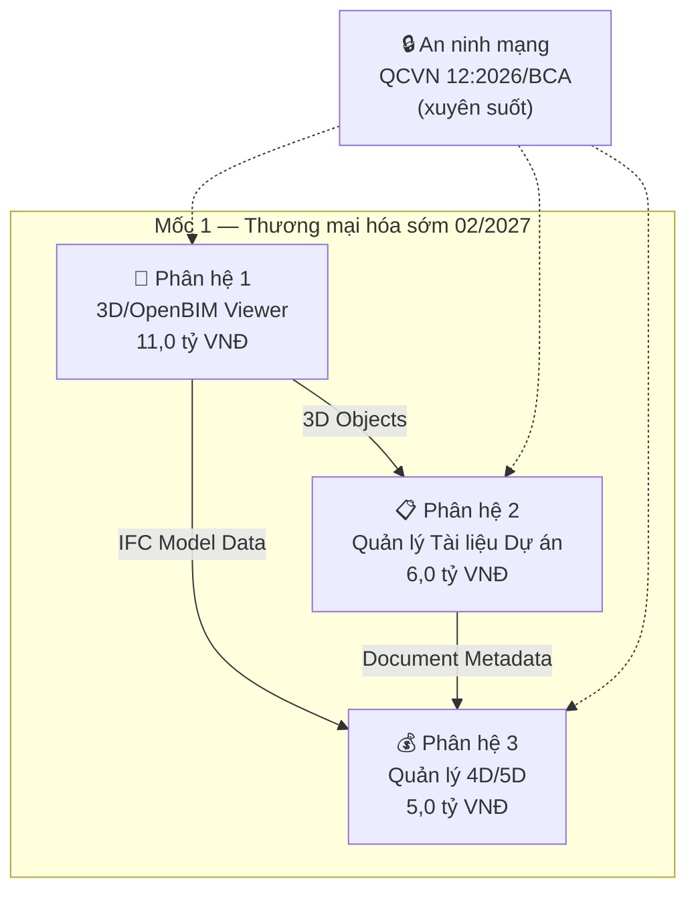
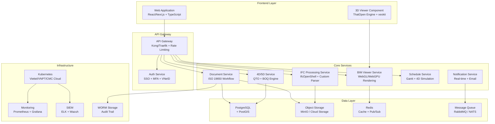
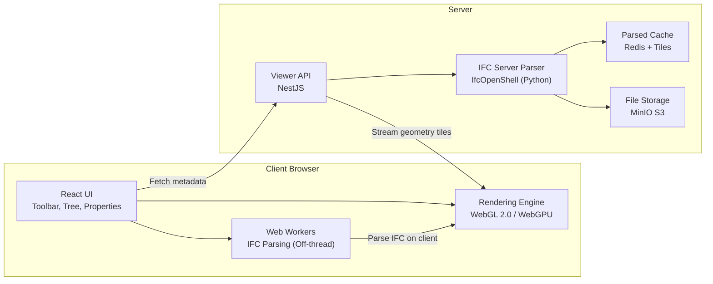
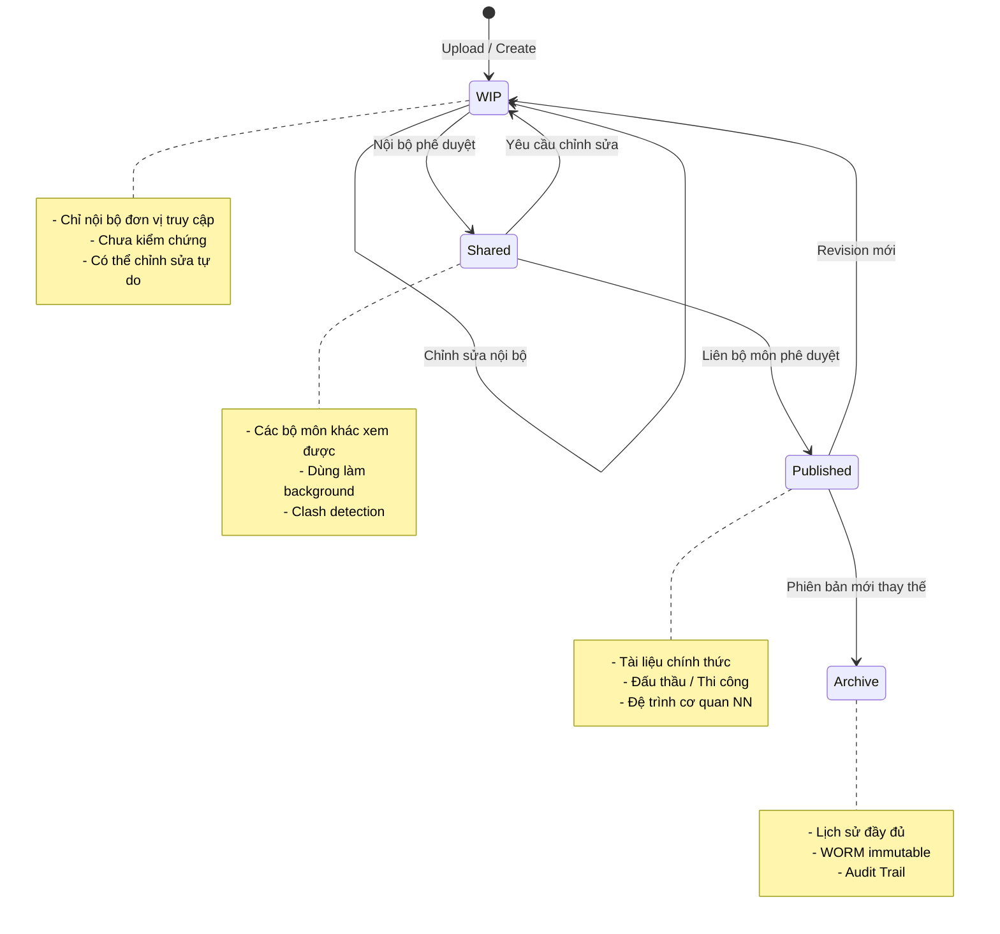
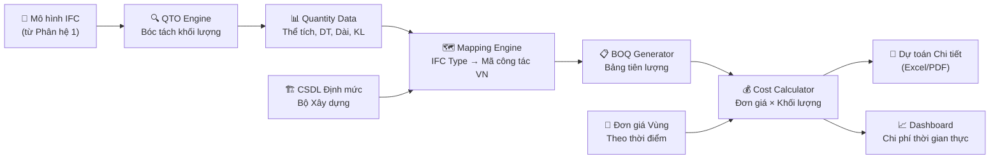
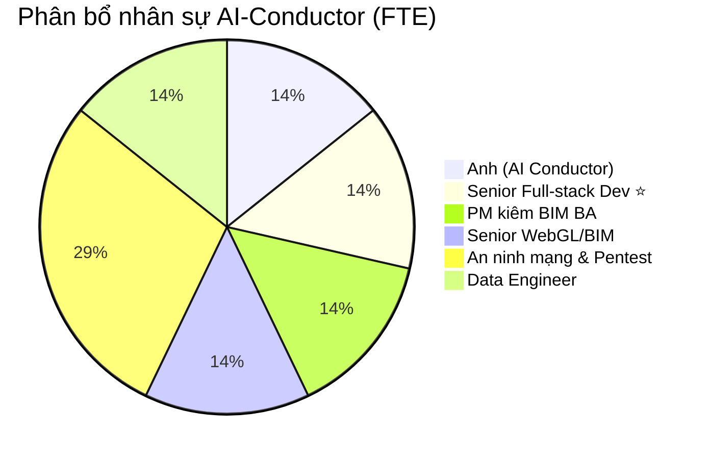
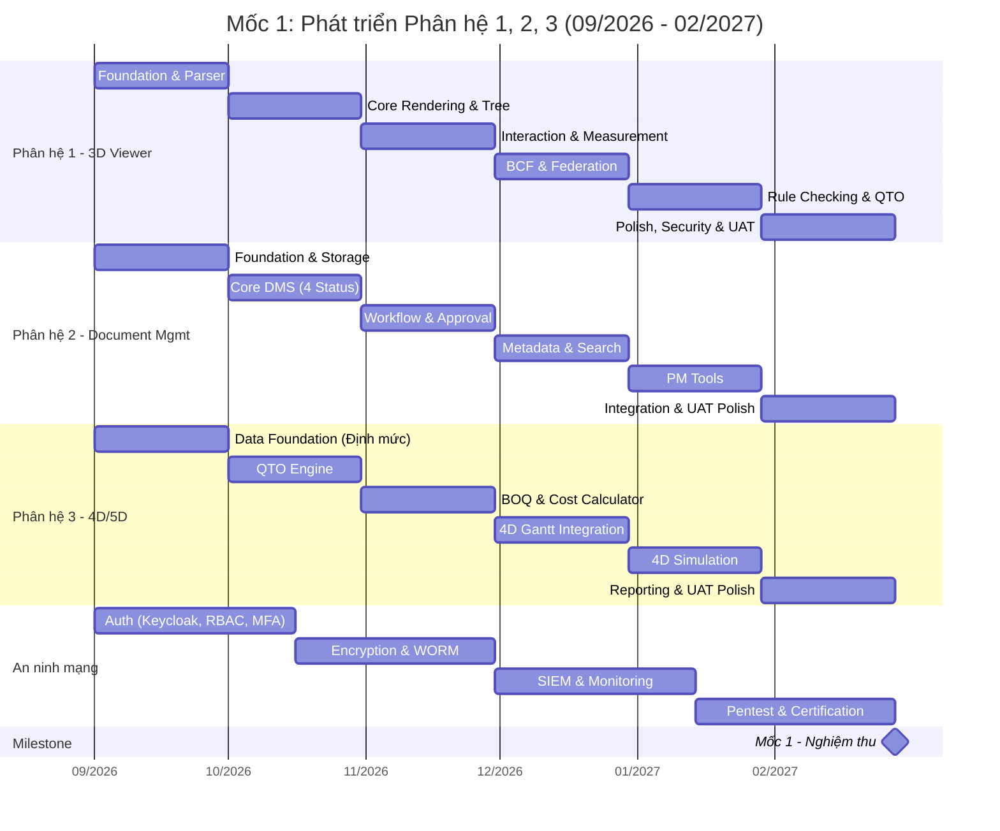

# KẾ HOẠCH PHÁT TRIỂN PHÂN HỆ 1, 2, 3 — MỐC NGHIỆM THU 1
## Nền tảng CDE CIC BIM — Giai đoạn R&D (09/2026 – 02/2027)

> **Mục tiêu Mốc 1:** Hoàn thành 3 phân hệ lõi, đạt chứng nhận QCVN 12 giai đoạn 1, ký ≥3 LOI, bắt đầu thương mại hóa sớm.
> **Tổng kinh phí 3 phân hệ:** 22,0 tỷ VNĐ (NSNN 7,0 tỷ + CIC 15,0 tỷ)
> **Đội ngũ:** 6-7 nhân sự chính theo mô hình AI-Conductor (Founder prompt AI + Chuyên gia review + AI tools), tối ưu hóa từ 16 người truyền thống.

---

## 1. Tổng quan 3 Phân hệ

| # | Phân hệ | Kinh phí | NSNN | CIC | Thời gian |
|---|---------|:---:|:---:|:---:|:---:|
| 1 | **Trực quan hóa 3D / OpenBIM Viewer** | 11,0 tỷ | 7,0 tỷ | 4,0 tỷ | 18 tháng (tiếp tục tối ưu) |
| 2 | **Quản lý Tài liệu Dự án Số** | 6,0 tỷ | 0 | 6,0 tỷ | 6 tháng |
| 3 | **Quản lý Tiến độ & Chi phí 4D/5D** | 5,0 tỷ | 0 | 5,0 tỷ | 6 tháng |
| — | **An ninh mạng (xuyên suốt)** | *(thuộc NV5)* | — | — | 18 tháng |

---

## 2. Kiến trúc Hệ thống Tổng thể

### 2.1. Kiến trúc Microservices

### 2.2. Tech Stack đề xuất

| Tầng | Công nghệ | Lý do chọn |
|------|-----------|------------|
| **Frontend** | React 19 + Next.js 15 + TypeScript | Ecosystem lớn, SSR/SSG, TypeScript type-safety |
| **3D Engine** | ThatOpen Engine (web-ifc) + xeokit-sdk + IfcOpenShell | Open-source first, tự chủ mã nguồn, hỗ trợ IFC 4.0+ |
| **Backend** | Go (Chi/Gin) + Python (FastAPI) | Go cho API Gateway, Document, Workflows (nhẹ, nhanh, concurrent tốt); Python cho xử lý IFC, QTO, AI/ML |
| **Database** | PostgreSQL 16 + PostGIS | Hỗ trợ GIS, JSONB cho metadata linh hoạt |
| **Object Storage** | MinIO (self-hosted) / Viettel Cloud Storage | Tương thích S3 API, lưu trữ file BIM lớn |
| **Cache** | Redis 7 | Session, cache IFC parsed data, pub/sub |
| **Message Queue** | RabbitMQ / NATS | Async processing cho IFC parsing, notification |
| **Search** | Elasticsearch / OpenSearch | Full-text search tài liệu, audit log |
| **Container** | Docker + Kubernetes (K8s) | Orchestration, scaling, multi-cloud (Viettel Cloud primary, VNPT DR) |
| **CI/CD** | GitLab CI / GitHub Actions | Tự động hóa build, test, deploy |
| **Monitoring** | Prometheus + Grafana + Loki | Metrics, alerting, log aggregation |
| **Security** | Keycloak (IAM), Wazuh (SIEM), Vault (secrets) | RBAC, MFA, audit trail, QCVN 12 compliance |

---

## 3. Chi tiết Phân hệ 1: Trực quan hóa 3D / OpenBIM Viewer

### 3.1. Phạm vi chức năng

> [!IMPORTANT]
> Đây là phân hệ **rủi ro kỹ thuật cao nhất** và **chiếm 50% tổng kinh phí Mốc 1**. NSNN tài trợ 7,0/11,0 tỷ cho nhiệm vụ này do tính chất R&D lõi.

#### Tính năng cốt lõi (Must-have — Mốc 1)

| # | Tính năng | Mô tả chi tiết | Độ ưu tiên |
|---|-----------|----------------|:---:|
| F1.1 | **IFC Parser & Loader** | Đọc và giải mã file IFC 2x3, IFC4, IFC4.3; phân tích cấu trúc STEP file; hỗ trợ tệp ≤500MB | 🔴 P0 |
| F1.2 | **3D WebGL Renderer** | Hiển thị mô hình 3D trên trình duyệt (Chrome, Edge, Firefox); LOD (Level of Detail) tự động; frustum culling, occlusion culling | 🔴 P0 |
| F1.3 | **Spatial Tree Navigation** | Cây phân cấp không gian IFC (IfcProject → IfcSite → IfcBuilding → IfcStorey → Elements); chọn/ẩn/hiện theo tầng, bộ môn | 🔴 P0 |
| F1.4 | **Property Inspector** | Xem toàn bộ thuộc tính (Pset) của cấu kiện; tìm kiếm theo GlobalId, Name, Type | 🔴 P0 |
| F1.5 | **Measurement Tools** | Đo khoảng cách 2 điểm, đo diện tích mặt phẳng, đo thể tích | 🟠 P1 |
| F1.6 | **Section Plane (Cắt mặt cắt)** | Cắt mặt bằng/mặt đứng/mặt cắt tùy ý qua mô hình 3D | 🟠 P1 |
| F1.7 | **BCF Issue Tracking** | Tạo, quản lý vấn đề (issue) trực tiếp trên mô hình; export/import BCF 2.1+ | 🟠 P1 |
| F1.8 | **Model Federation** | Chồng xếp nhiều file IFC từ nhiều bộ môn (Kiến trúc, Kết cấu, MEP) vào 1 view | 🟡 P2 |
| F1.9 | **Auto Rule Checking** | Tự động kiểm tra mô hình vs quy chuẩn VN (chỉ giới, mật độ, chiều cao, khoảng lùi, PCCC) | 🟡 P2 |
| F1.10 | **Streaming/Chunking** | Phân mảnh dữ liệu lớn, tải progressive cho file >200MB | 🟡 P2 |

#### Tính năng mở rộng (Nice-to-have — hoàn thiện ở Mốc 2)

| # | Tính năng | Mô tả |
|---|-----------|-------|
| F1.11 | **Clash Detection** | Phát hiện va chạm giữa các bộ môn (hard/soft/clearance clash) |
| F1.12 | **WebGPU Support** | Chuyển đổi sang WebGPU cho hiệu năng tốt hơn khi browser hỗ trợ |
| F1.13 | **Annotation & Markup** | Ghi chú, đánh dấu trực tiếp trên mô hình 3D |

### 3.2. Kiến trúc kỹ thuật Viewer

**Chiến lược xử lý IFC Hybrid:**

1. **Client-side parsing** (web-ifc / ThatOpen): Cho file nhỏ (≤100MB), parse trực tiếp trong Web Worker
2. **Server-side parsing** (IfcOpenShell + Python): Cho file lớn (100–500MB), server parse → tạo geometry tiles → stream về client
3. **Caching layer**: Parsed geometry + metadata được cache trong Redis/disk để tải lại nhanh

### 3.3. Nhân sự phân hệ 1 (Mô hình AI-Conductor)

| Vai trò | Số lượng | Trách nhiệm chính |
|---------|:---:|-------------------|
| Anh (AI Product Conductor) | 1 | Chỉ đạo AI (Claude Code/Antigravity) generate component và parser logic |
| Senior Full-stack Dev ⭐ | 1 (chung) | Giám sát chất lượng code AI viết, review logic và integration |
| Senior Đồ họa WebGL/BIM | 1 | GPU profiling, LOD/culling, tối ưu Three.js/WebGL cho file lớn |
| PM kiêm BIM BA | 0.5 (chung) | Nghiệp vụ QTO, auto rule checking, validation dữ liệu đầu ra |

### 3.4. Phân chia Sprint (6 tháng = 12 Sprint × 2 tuần)

| Sprint | Thời gian | Mục tiêu | Deliverables |
|:---:|:---:|-----------|--------------|
| S1-S2 | T9–T10/2026 | **Foundation & Parser** | Setup project, CI/CD, IFC parser prototype (web-ifc), basic WebGL scene |
| S3-S4 | T10–T11/2026 | **Core Rendering** | LOD system, culling, Spatial Tree, Property Inspector |
| S5-S6 | T11–T12/2026 | **Interaction** | Measurement tools, Section Plane, element picking/highlighting |
| S7-S8 | T12/2026–T1/2027 | **Advanced Viewer** | BCF integration, Model Federation (multi-file), large file streaming |
| S9-S10 | T1–T2/2027 | **Rule Checking & QTO** | Auto compliance check vs VN standards (phase 1), QTO extraction |
| S11-S12 | T2/2027 | **Polish, Security & UAT** | Performance optimization, stress test 500MB, security hardening, UAT release |

> [!WARNING]
> **Phương án dự phòng:** Nếu sau Sprint 8 (~tháng 1/2027), hiệu năng engine mã nguồn mở chưa đạt yêu cầu xử lý file >300MB → chuyển sang xeokit commercial license (đã dự trù ngân sách trong CAP-03) hoặc triển khai server-side rendering hybrid.

---

## 4. Chi tiết Phân hệ 2: Quản lý Tài liệu Dự án Số

### 4.1. Phạm vi chức năng

#### Tính năng cốt lõi (Must-have — Mốc 1)

| # | Tính năng | Mô tả chi tiết | Độ ưu tiên |
|---|-----------|----------------|:---:|
| F2.1 | **4 Trạng thái ISO 19650** | WIP → Shared → Published → Archive; quy tắc chuyển trạng thái, kiểm soát quyền truy cập theo vùng | 🔴 P0 |
| F2.2 | **Upload & Chunking** | Upload file đa định dạng (IFC, DWG, PDF, DOC...); tự động phân mảnh file >500MB; resumable upload | 🔴 P0 |
| F2.3 | **Version Control** | Lịch sử phiên bản tự động; so sánh phiên bản; rollback; diff view cho text-based files | 🔴 P0 |
| F2.4 | **Approval Workflow** | Luồng phê duyệt đa cấp (Submit → Review → Approve/Reject); chữ ký số PKI; template workflow tùy biến | 🔴 P0 |
| F2.5 | **Metadata Schema** | Cấu trúc metadata nội địa hóa (BEP, EIR theo chuẩn VN); trường bắt buộc: mã dự án 13 ký tự, bộ môn, giai đoạn, revision | 🔴 P0 |
| F2.6 | **Audit Trail (WORM)** | Ghi vết mọi thao tác bất biến (ai làm gì, khi nào, trên file nào); không thể xóa/sửa; đóng dấu thời gian | 🔴 P0 |
| F2.7 | **Search & Filter** | Full-text search nội dung tài liệu; filter theo metadata, trạng thái, bộ môn, ngày tạo | 🟠 P1 |
| F2.8 | **Folder Structure Template** | Template cây thư mục chuẩn theo BEP VN (theo bộ môn, giai đoạn, loại tài liệu) | 🟠 P1 |
| F2.9 | **Notification Engine** | Thông báo realtime (WebSocket) + email khi có file mới, yêu cầu phê duyệt, deadline | 🟠 P1 |
| F2.10 | **Digital PM Tools** | Gantt chart, Task management, Nhật ký thi công điện tử, RFI, Change Order | 🟡 P2 |

### 4.2. Mô hình dữ liệu ISO 19650

### 4.3. Nhân sự phân hệ 2 (Mô hình AI-Conductor)

| Vai trò | Số lượng | Trách nhiệm chính |
|---------|:---:|-------------------|
| Anh (AI Product Conductor) | 1 | Prompt AI (v0, Bolt, Claude) generate UI components, Go backend logic |
| Senior Full-stack Dev ⭐ | 1 | Review code, cấu hình K8s, Go microservices, Keycloak/VNeID integration |
| Senior Frontend/UX | 1 | Thiết kế UX/UI flow, đóng vai trò AI Conductor cho tầng giao diện |
| PM kiêm BIM BA | 1 | Quy trình tài liệu ISO 19650, metadata schema Việt Nam |
| Senior An ninh mạng | 0.5 (chung) | Thiết kế bảo mật, giám sát audit trail (WORM), cấu hình bảo mật |

### 4.4. Phân chia Sprint (6 tháng)

| Sprint | Thời gian | Mục tiêu | Deliverables |
|:---:|:---:|-----------|--------------|
| S1-S2 | T9–T10/2026 | **Foundation & Storage** | Database schema, S3 storage setup, file upload service (chunked), auth/RBAC |
| S3-S4 | T10–T11/2026 | **Core DMS** | 4 trạng thái ISO 19650, version control, folder structure template |
| S5-S6 | T11–T12/2026 | **Workflow & Approval** | Approval workflow engine (BPMN-like), notification service, digital signature integration |
| S7-S8 | T12/2026–T1/2027 | **Metadata & Search** | Metadata schema (BEP/EIR VN), full-text search (Elasticsearch), audit trail WORM |
| S9-S10 | T1–T2/2027 | **PM Tools** | Gantt chart, task management, RFI, Change Order, nhật ký thi công |
| S11-S12 | T2/2027 | **Integration & UAT** | Tích hợp với Viewer (PH1), UI/UX polish, load test, security audit, UAT release |

---

## 5. Chi tiết Phân hệ 3: Quản lý Tiến độ & Chi phí 4D/5D

### 5.1. Phạm vi chức năng

#### Tính năng cốt lõi (Must-have — Mốc 1)

| # | Tính năng | Mô tả chi tiết | Độ ưu tiên |
|---|-----------|----------------|:---:|
| F3.1 | **QTO Engine** | Tự động bóc tách khối lượng (Quantity Take-Off) từ mô hình IFC: thể tích, diện tích, chiều dài, trọng lượng theo cấu kiện | 🔴 P0 |
| F3.2 | **BOQ Generator** | Lập bảng tiên lượng dự toán (Bill of Quantities) từ QTO; mapping cấu kiện IFC → mã công tác định mức VN | 🔴 P0 |
| F3.3 | **Định mức & Đơn giá VN** | Tích hợp cơ sở dữ liệu định mức xây dựng của Bộ XD; hỗ trợ đơn giá theo vùng và thời điểm (API đơn giá) | 🔴 P0 |
| F3.4 | **Gantt Chart 4D** | Biểu đồ tiến độ liên kết với cấu kiện 3D; mô phỏng trực quan quá trình thi công theo thời gian | 🟠 P1 |
| F3.5 | **4D Simulation** | Animation thi công 4D: highlight cấu kiện theo timeline; phát/tạm dừng/tua; snapshot | 🟠 P1 |
| F3.6 | **Cost Tracking** | Theo dõi chi phí thực tế vs dự toán; cảnh báo vượt ngân sách; báo cáo chênh lệch | 🟠 P1 |
| F3.7 | **Progress Reporting** | Nghiệm thu khối lượng hoàn thành theo đợt; xác nhận % hoàn thành trên mô hình 3D | 🟡 P2 |
| F3.8 | **Change Detection** | Phát hiện thay đổi thiết kế (so sánh 2 phiên bản IFC); tự động tính khối lượng phát sinh | 🟡 P2 |
| F3.9 | **Export Reports** | Xuất báo cáo dự toán, nghiệm thu theo biểu mẫu chuẩn VN (Excel, PDF) | 🟡 P2 |

### 5.2. Luồng xử lý QTO → BOQ

### 5.3. Cơ sở dữ liệu Định mức

| Thành phần | Mô tả | Nguồn dữ liệu |
|-----------|-------|----------------|
| **Mã công tác** | Danh mục mã công việc xây dựng theo bộ định mức quốc gia | TT BXD (cập nhật định kỳ) |
| **Hao phí định mức** | Vật liệu, nhân công, máy thi công cho mỗi đơn vị công tác | Bộ Xây dựng ban hành |
| **Đơn giá vùng** | Đơn giá nhân công, vật liệu, ca máy theo từng địa phương | Sở Xây dựng các tỉnh/TP |
| **Hệ số điều chỉnh** | Hệ số vùng, hệ số theo tính chất công trình | Văn bản hướng dẫn BXD |
| **IFC–Mapping Rules** | Bảng ánh xạ IfcWall/IfcSlab/IfcBeam... → Mã công tác VN | CIC tự xây dựng + BIMAGE tư vấn |

### 5.4. Nhân sự phân hệ 3 (Mô hình AI-Conductor)

| Vai trò | Số lượng | Trách nhiệm chính |
|---------|:---:|-------------------|
| Anh (AI Product Conductor) | 1 | Prompt AI phát triển logic QTO, BOQ generator (Python/FastAPI) |
| Senior Full-stack Dev ⭐ | 1 (chung) | Đảm bảo hiệu năng API gRPC giữa Go và Python, review schema database |
| Data Engineer | 1 | ETL định mức đơn giá BXD, thiết kế CSDL định mức và mapping rules |
| PM kiêm BIM BA | 0.5 | Validate nghiệp vụ nghiệm thu, bóc tách khối lượng |

### 5.5. Phân chia Sprint (6 tháng)

| Sprint | Thời gian | Mục tiêu | Deliverables |
|:---:|:---:|-----------|--------------|
| S1-S2 | T9–T10/2026 | **Data Foundation** | CSDL định mức + đơn giá (ETL từ nguồn BXD), database schema, mapping rules draft |
| S3-S4 | T10–T11/2026 | **QTO Engine** | Bóc tách tự động từ IFC (walls, slabs, beams, columns, foundations) |
| S5-S6 | T11–T12/2026 | **BOQ & Cost** | Mapping IFC → mã công tác VN, BOQ generator, cost calculation |
| S7-S8 | T12/2026–T1/2027 | **4D Integration** | Gantt chart, liên kết task → IFC elements, 4D timeline view |
| S9-S10 | T1–T2/2027 | **4D Simulation** | Animation thi công, progress tracking, cost dashboard |
| S11-S12 | T2/2027 | **Reporting & Polish** | Export Excel/PDF theo biểu mẫu VN, nghiệm thu đợt, change detection, UAT release |

---

## 6. An ninh Mạng — Xuyên suốt 3 Phân hệ (QCVN 12:2026/BCA)

> [!CAUTION]
> An ninh mạng KHÔNG phải phân hệ riêng mà là **yêu cầu bắt buộc xuyên suốt** từ Sprint 1. Mọi service phải tuân thủ Security by Design.

### 6.1. Checklist QCVN 12 cho Mốc 1

| # | Yêu cầu QCVN 12 | Giải pháp kỹ thuật | Sprint target |
|---|------------------|-------------------|:---:|
| 1 | Quản lý tài khoản & quyền (2.2.7) | Keycloak RBAC + MFA (TOTP/SMS) | S1-S2 |
| 2 | Bảo vệ đường truyền | TLS 1.3, VPN/IPsec cho On-Premise | S1-S2 |
| 3 | Mã hóa dữ liệu nhạy cảm | AES-256 at rest, TLS in transit | S3-S4 |
| 4 | Dấu thời gian (2.2.22) | Timestamping service (RFC 3161) | S5-S6 |
| 5 | WORM storage (2.2.22) | Immutable audit log, write-once storage | S5-S6 |
| 6 | Giám sát SIEM (2.2.9, 2.2.14) | Wazuh + ELK Stack | S7-S8 |
| 7 | Sao lưu & DR (2.2.12, 2.2.21) | Cross-region backup, DR site | S9-S10 |
| 8 | Pentest & đánh giá | Pentest nội bộ + thuê đơn vị kiểm định | S11-S12 |

### 6.2. Nhân sự an ninh

| Vai trò | Số lượng | Trách nhiệm |
|---------|:---:|-------------|
| Senior Chuyên viên An ninh | **1** | Kiến trúc bảo mật, QCVN 12 compliance, SIEM, PKI |
| Pentester | **1** | Pentest liên tục, vulnerability scanning, code review bảo mật |

---

## 7. Phân bổ Nhân sự Tổng thể — Mô hình AI-Conductor (6-7 người)

| # | Vị trí | SL | PH1 | PH2 | PH3 | Security | Lương (tr/tháng) | Ghi chú vai trò |
|---|--------|:---:|:---:|:---:|:---:|:---:|:---:|-----------------|
| 1 | **Anh (AI Product Conductor)** | 1 | ◆ | ◆ | ◆ | | — | Prompt chính cho AI, quản lý nghiệp vụ và định hướng |
| 2 | **Senior Full-stack Dev** ⭐ | 1 | ◆ | ◆ | ◆ | ◇ | 55 | **Then chốt:** Review code AI, quản trị kiến trúc, setup Go/K8s |
| 3 | **PM kiêm BIM BA** | 1 | ◇ | ◆ | ◆ | | 55 | Nghiệp vụ QLDA, BEP/EIR, giao tiếp Sở XD pilot |
| 4 | **Senior WebGL/BIM** | 1 | ◆ | | ◇ | | 55 | Tối ưu engine 3D, LOD/culling, WebGL performance |
| 5 | **Senior An ninh mạng** | 1 | | | | ◆ | 45 | Pháp lý QCVN 12, an toàn dữ liệu, liên hệ Bộ Công an |
| 6 | **Pentester** | 1 | | | | ◆ | 38 | Kiểm thử xâm nhập, rà quét an toàn code AI viết |
| 7 | **Data Engineer** | 1 | | | ◆ | | 38 | CSDL định mức BXD, mapping rules, ETL đơn giá |
| | **TỔNG** | **6-7** | | | | | **~248-286 tr** | **Tiết kiệm ~259 tr/tháng (~7.5 tỷ/18 tháng)** |

*Chú thích: ◆ = chính, █ = phụ trách, ◇ = hỗ trợ*

---

## 8. Timeline Tổng hợp — 6 tháng (09/2026 – 02/2027)

---

## 9. Tiêu chí Nghiệm thu Mốc 1

| # | Tiêu chí | Đo lường cụ thể | Pass/Fail |
|---|----------|-----------------|:---------:|
| 1 | **IFC Viewer hoạt động** | Đọc đúng chuẩn ISO 16739, xử lý mượt file ≤500MB trên Chrome/Edge | ☐ |
| 2 | **4 trạng thái ISO 19650** | WIP→Shared→Published→Archive hoạt động đúng quy trình, quyền truy cập đúng theo vùng | ☐ |
| 3 | **QTO chính xác** | Sai số bóc tách khối lượng ≤5% so với bóc thủ công (test 3 dự án thực tế) | ☐ |
| 4 | **BOQ theo định mức VN** | Mapping IFC → mã công tác đúng ≥90% cho công tác phổ biến (bê tông, thép, xây, trát) | ☐ |
| 5 | **Audit Trail WORM** | Log bất biến, có dấu thời gian, không thể xóa/sửa | ☐ |
| 6 | **QCVN 12 giai đoạn 1** | Đạt ≥18/22 tiêu chí QCVN 12 (100% dữ liệu trên cloud nội địa) | ☐ |
| 7 | **Hiệu năng** | Thời gian load viewer <10s cho file 200MB; API response p95 <500ms | ☐ |
| 8 | **Khách hàng pilot** | ≥3 LOI (Letter of Intent) đã ký | ☐ |
| 9 | **Pentest** | Không có lỗ hổng Critical/High chưa xử lý | ☐ |

---

## 10. Quản trị Rủi ro — Top 5

| # | Rủi ro | XS | TĐ | Mức | Phương án giảm thiểu |
|---|--------|:---:|:---:|:---:|----------------------|
| R1 | **Hiệu năng IFC engine không đạt** — file >300MB lag, crash | TB | Cao | 🔴 | ① Benchmark mỗi sprint; ② Dự phòng xeokit commercial; ③ Server-side rendering fallback |
| R2 | **Tuyển dụng Senior WebGL/BIM khó** — thị trường khan hiếm | Cao | Cao | 🔴 | ① Headhunter từ T7/2026; ② Cho phép remote; ③ Training internal từ senior 3D game dev |
| R3 | **CSDL Định mức không đầy đủ** — dữ liệu BXD chưa số hóa tốt | TB | TB | 🟠 | ① CIC có 30+ năm kinh nghiệm định mức; ② Nhập thủ công + OCR; ③ Phase 1 tập trung 5 nhóm công tác phổ biến nhất |
| R4 | **Trễ chứng nhận QCVN 12** — quy trình kiểm định kéo dài | TB | TB | 🟠 | ① Thuê tư vấn QCVN 12 từ đầu; ② Pentest nội bộ liên tục; ③ Nộp hồ sơ sớm T1/2027 |
| R5 | **Scope creep** — yêu cầu tính năng phình to | Cao | TB | 🟠 | ① Agile strict sprint scope; ② Feature freeze từ Sprint 11; ③ Backlog Mốc 2 cho tính năng phụ |

---

## 11. Kế hoạch Kiểm thử & Đảm bảo Chất lượng

### 11.1. Chiến lược kiểm thử

| Loại test | Công cụ | Tần suất | Phạm vi |
|-----------|---------|----------|---------|
| **Unit Test** | Jest (FE), Pytest (BE) | Mỗi commit (CI) | Coverage ≥80% |
| **Integration Test** | Playwright, Supertest | Mỗi sprint | API endpoints, workflow flows |
| **E2E Test** | Playwright | Mỗi sprint | Critical user journeys |
| **IFC Validation** | Custom test suite + IfcOpenShell | Mỗi sprint | 50+ sample IFC files (IFC2x3, IFC4, IFC4.3) |
| **Performance Test** | k6, Lighthouse | Mỗi 2 sprint | Load test 100 concurrent users, file sizes 10MB–500MB |
| **Security Test** | OWASP ZAP, Burp Suite, Wazuh | Mỗi sprint (auto) + Pentest manual T3/2027 | OWASP Top 10, QCVN 12 checklist |
| **UAT** | Manual + Pilot customers | Sprint 13-14 | 3 dự án thực tế từ THT/Lotte/Ecoba |

### 11.2. Bộ dữ liệu kiểm thử IFC

| # | File mẫu | Kích thước | Mục đích test |
|---|----------|:---:|--------------|
| 1 | IFC Schependomlaan (mẫu chuẩn) | ~5MB | Basic parsing, spatial tree |
| 2 | Duplex Apartment (buildingSMART) | ~1MB | Multi-storey, MEP |
| 3 | Sample hospital project | ~100MB | Medium complexity, federation |
| 4 | Large infrastructure model | ~300MB | Stress test, streaming |
| 5 | Dự án pilot THT/Lotte (thực tế VN) | ~200-500MB | Real-world validation |

---

## 12. Kế hoạch Triển khai Hạ tầng Cloud

### 12.1. Môi trường phát triển (từ Sprint 1)

| Môi trường | Mục đích | Cloud Provider | Ước tính chi phí/tháng |
|-----------|----------|----------------|:---:|
| **Dev** | Phát triển, test nội bộ | Viettel Cloud | ~15 triệu |
| **Staging** | Integration test, UAT | Viettel Cloud | ~20 triệu |
| **Production** | Thương mại hóa sớm (từ T3/2027) | Viettel Cloud (Primary) | ~50 triệu |
| **DR** | Disaster Recovery | VNPT Cloud (Secondary) | ~20 triệu |

### 12.2. Cấu hình Production tối thiểu (Mốc 1)

| Thành phần | Spec | Số lượng |
|-----------|------|:---:|
| App Server (K8s worker) | 8 vCPU, 32GB RAM | 3 nodes |
| IFC Processing Server | 16 vCPU, 64GB RAM, GPU | 2 nodes |
| Database (PostgreSQL HA) | 8 vCPU, 32GB RAM, 500GB SSD | 2 nodes (primary + replica) |
| Redis Cluster | 4 vCPU, 16GB RAM | 3 nodes |
| Object Storage | 5TB initial | Managed service |
| Load Balancer | Managed | 1 |

---

## User Review Required

> [!IMPORTANT]
> ### Câu hỏi cần phản hồi trước khi triển khai:

### Quyết định Kiến trúc & Cloud

1. **Kiến trúc Go + Python + TypeScript:** Anh có đồng ý với đề xuất chuyển dịch backend hoàn toàn sang Go (hiệu năng cao, concurrent tốt) kết hợp Python (IfcOpenShell & AI) để thay thế cho Node.js/NestJS không?

2. **Hạ tầng Multi-Cloud:** Đề xuất chọn **Viettel Cloud làm Primary** (đáp ứng tốt nhất QCVN 12 và an toàn thông tin cấp độ 4 của chính phủ), **VNPT Cloud làm DR site** (khác ISP, dự phòng rủi ro), và **FPT Cloud làm GPU on-demand** (giá tốt, MIG support). Anh có đồng ý phương án này không?

### Nhân sự & Vận hành AI-Conductor

3. **Tuyển dụng Senior Full-stack Dev ⭐:** Đây là vị trí then chốt bắt buộc phải có để giám sát và review 100% code AI viết nhằm tránh rủi ro bảo mật và technical debt ẩn. Anh đã có ứng viên tiềm năng nào cho vị trí này chưa?

4. **Kế hoạch Outsource hạ tầng:** Do cắt giảm đội DevOps, chúng ta cần một khoản ngân sách nhỏ (~100-200 triệu) để thuê ngoài thiết lập hạ tầng Kubernetes (K8s) ban đầu trên Viettel Cloud và làm load test / pentest trước khi release. Anh có đồng ý không?

### Nghiệp vụ & Dữ liệu

5. **CSDL Định mức:** Dữ liệu định mức xây dựng của Bộ Xây dựng hiện tại CIC đang lưu trữ ở dạng nào (Database SQL, Excel, API hay PDF scan)? Điều này ảnh hưởng trực tiếp đến kế hoạch ETL của Data Engineer.

6. **Khách hàng Pilot:** Xác nhận lại danh sách Sở Xây dựng và Ban quản lý dự án (PMU) nào sẽ tham gia pilot đợt đầu để PM thiết kế biểu mẫu và workflow phù hợp quy trình thẩm định công.

---

## Verification Plan

### Automated Tests
- `npm test` — Unit tests FE (Jest) — target coverage ≥80%
- `pytest` — Unit tests BE (Pytest) — target coverage ≥80%
- `npx playwright test` — E2E tests
- `k6 run load-test.js` — Performance test
- `owasp-zap scan` — Security scan

### Manual Verification
- IFC file rendering validation (50+ sample files)
- QTO accuracy test vs manual takeoff (≤5% variance)
- Approval workflow walkthrough with pilot customer
- QCVN 12 checklist review with security consultant
- UAT session with THT/Lotte/Ecoba project managers

### Milestone Gate Criteria
- Tất cả 9 tiêu chí nghiệm thu ở Mục 9 phải đạt PASS
- Pentest report không có lỗ hổng Critical/High
- ≥3 LOI đã ký
- Demo thành công cho Bộ Xây dựng (nếu có yêu cầu)
