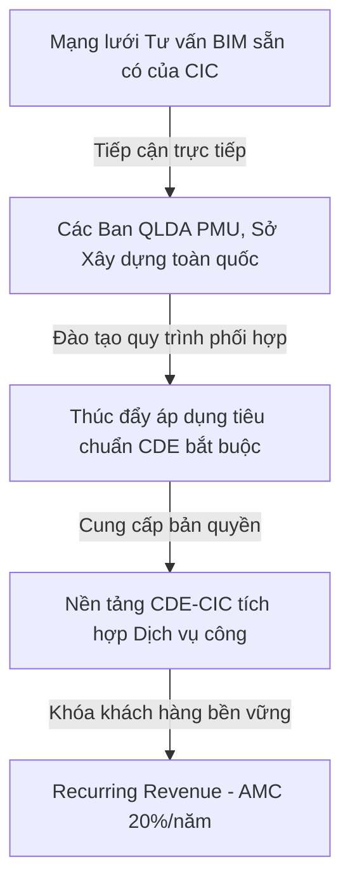
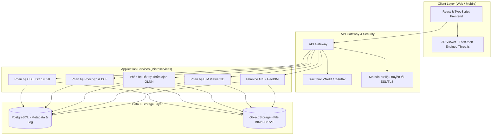
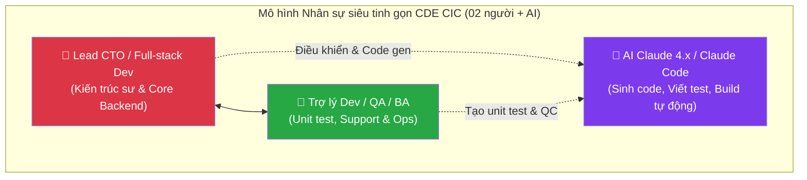

# Báo cáo Nghiên cứu Khả thi Dự án CDE CIC
## Đề án Nghiên cứu Công nghệ, Thiết kế Kiến trúc và Kế hoạch Thương mại hóa Nền tảng CDE

> **Phiên bản:** v1.0 (Bản chính thức)  
> **Ngày lập báo cáo:** 04/07/2026  
> **Đơn vị thực hiện:** Công ty Cổ phần Công nghệ và Tư vấn CIC  
> **Mục đích:** Đánh giá toàn diện năng lực công nghệ của các đối thủ trong nước và quốc tế, từ đó đề xuất mô hình kiến trúc, phương án nhân sự tối ưu hóa bằng AI, dự toán tài chính 5 năm và lộ trình triển khai chi tiết cho hệ thống CDE CIC trước khi ra quyết định đầu tư.

---

## Tóm tắt Tổng quan cho Ban Giám đốc (Executive Summary)

**Cơ hội:** Hành lang pháp lý mới (NĐ 217/2026: BIM bắt buộc cấp II+, CDE bắt buộc cấp I+ đầu tư công) tạo ra thị trường bắt buộc tại phân khúc B2G. Thị trường khả dụng gồm 34 Sở Xây dựng, ~102 Ban QLDA cấp tỉnh và các doanh nghiệp xây dựng lớn. Không đối thủ nào (quốc tế lẫn nội địa) hiện đáp ứng QCVN 12:2026/BCA — tạo cửa sổ first-mover 1–2 năm.

**Giải pháp:** Nền tảng CDE CIC tự chủ 100%, kiến trúc Go + Python + TypeScript, triển khai On-Premise trên hạ tầng cloud nội địa do khách hàng lựa chọn và mua sắm (Viettel Cloud/VNPT Cloud/FPT Cloud hoặc máy chủ riêng), CIC tư vấn & setup để đảm bảo tuân thủ QCVN 12. Bán On-Premise trọn gói (0,75–1,5 tỷ/HĐ, không giới hạn user) + phí bảo trì AMC 20%/năm.

**Tài chính (5 năm):**

| Chỉ tiêu | Giá trị |
|:---|:---:|
| Doanh thu tổng | 52,35 tỷ VNĐ |
| Lợi nhuận ròng sau thuế (TNDN 20%) | 14,66 tỷ VNĐ |
| Biên lợi nhuận ròng | ~28% |
| CAPEX giai đoạn thương mại hóa | 0 (sunk cost CIC tự chịu) |
| Dự phòng vốn lưu động | 1–2 tỷ VNĐ |

**Rủi ro chính:** Rủi ro phụ thuộc nhân sự (Bus Factor) cao (2 nhân sự cốt lõi); PMU có thể không dùng CDE thương mại; đối thủ nội địa có thể bắt kịp về sự tuân thủ; các tập đoàn công nghệ lớn (Big Tech) tại Việt Nam có thể tự xây dựng CDE.

**Khuyến nghị:** Phê duyệt triển khai Giai đoạn 1 với 5 điều kiện — xem §7.3.

---

## Chương 1: Mở đầu & Tóm tắt Dự án (Executive Summary)

### 1.1. Bối cảnh & Lý do đầu tư

#### 1.1.1. Bối cảnh pháp lý và xu hướng công nghệ
Trong những năm gần đây, việc áp dụng Mô hình thông tin công trình (BIM - Building Information Modeling) đã trở thành xu thế bắt buộc nhằm tối ưu hóa chi phí, thời gian và chất lượng trong hoạt động xây dựng toàn cầu. Tại Việt Nam, sau giai đoạn triển khai theo Quyết định số 258/QĐ-TTg của Thủ tướng Chính phủ, Quốc hội đã ban hành **Luật Xây dựng số 135/2025/QH15** ngày 10/12/2025 (quy định tại Điều 7 và Điều 14 về bắt buộc ứng dụng khoa học công nghệ, chuyển đổi số, mô hình BIM và xây dựng hệ thống cơ sở dữ liệu quốc gia về xây dựng), làm nền tảng pháp lý cao nhất cho chuyển đổi số ngành xây dựng. Cụ thể hóa Luật, Chính phủ đã ban hành **Nghị định số 217/2026/NĐ-CP quy định chi tiết một số điều của Luật Xây dựng về quản lý hoạt động xây dựng** (ban hành ngày 19/6/2026, có hiệu lực từ 01/7/2026), trong đó **Điều 8** quy định **bắt buộc áp dụng BIM cho công trình xây dựng mới từ cấp II trở lên** (kể từ giai đoạn lập Báo cáo nghiên cứu khả thi/Báo cáo kinh tế-kỹ thuật), và **bắt buộc thiết lập, vận hành Môi trường dữ liệu chung (CDE)** đối với **công trình cấp I trở lên thuộc dự án đầu tư công** (các cấp khác được khuyến khích). CDE phục vụ quản lý, lưu trữ, chia sẻ và kiểm soát tập tin gốc của mô hình BIM nhằm thiết lập một Nguồn dữ liệu sự thật duy nhất (Single Source of Truth - SSOT) xuyên suốt vòng đời dự án.

Để hiện thực hóa lộ trình pháp lý trên, việc thiết lập một Môi trường dữ liệu chung (CDE - Common Data Environment) là yêu cầu kỹ thuật tiên quyết. CDE đóng vai trò là hạ tầng dữ liệu số trung tâm, lưu trữ, quản lý và điều phối toàn bộ thông tin của dự án xây dựng từ giai đoạn chuẩn bị, thiết kế, thi công đến bàn giao vận hành.

#### 1.1.2. Cơ sở thực tiễn và cơ hội thương mại từ Mạng lưới tư vấn BIM và cung cấp CDE CIC

Quyết định đầu tư xây dựng nền tảng CDE CIC của Ban Lãnh đạo CIC không chỉ dựa trên xu hướng pháp lý mà còn được bảo đảm vững chắc bởi dữ liệu thực tế hoạt động kinh doanh chuyên biệt của hai mảng BIM và CDE, được trích xuất trực tiếp từ cơ sở dữ liệu hệ thống CIC-ERP tính đến tháng 6/2026:

##### a) Thị trường sẵn có và tệp khách hàng VIP trung thành của mảng BIM & CDE
   - Nhờ hoạt động mạnh mẽ trong mảng tư vấn BIM và phân phối phần mềm, CIC đã xây dựng được một tệp khách hàng VIP vững chắc, tạo bước đệm hoàn hảo để thương mại hóa CDE-CIC nội địa. Phân tích dữ liệu từ hệ thống ERP mang lại các Insight chiến lược sau:
   - **Hiệu quả Tài chính Khối Kinh doanh Lõi**: Đã ký kết **78 hợp đồng** với tổng giá trị **66,13 tỷ VNĐ** (chính xác là 66.134.952.935 VNĐ), mang lại biên lợi nhuận gộp quản trị trung bình đạt **36,36%**.
   - **Insight Khách hàng: Sự trung thành & Giá trị vòng đời (LTV) cao**: Toàn hệ thống ghi nhận **48 khách hàng độc bản**. Đặc biệt, nhóm khách hàng quay lại (phát sinh từ 2 hợp đồng trở lên) chỉ chiếm **20,8%** (10 khách hàng) nhưng đóng góp tới **40,22 tỷ VNĐ** (chính xác là 40.220.048.656 VNĐ), tương đương **60,8% tổng doanh số** toàn thời gian của mảng. Điều này chứng minh tỷ lệ giữ chân khách hàng cao của sản phẩm.
   - **Cơ cấu Phân khúc Khách hàng Chiến lược**: Sự áp đảo của khối **Chính phủ (B2G)** và các **Tập đoàn lớn**, khớp 100% với định hướng sản phẩm CDE-CIC On-Premise:
     * *Khối Cơ quan QLNN & PMU (B2G)*: Ngân sách công lớn, yêu cầu bảo mật cao, bắt buộc tuân thủ pháp lý (QCVN 12). Phù hợp bán gói **On-Premise (0,75 tỷ/HĐ)**. Tiêu biểu: Ban QLDA DD&CN TP.HCM (8,5 tỷ); Ban QLDA DD TP.Hà Nội (7,5 tỷ).
     * *Khối CĐT & Tập đoàn lớn (Enterprise)*: Đầu tư hàng chục tỷ đồng cho CDE ngoại, yêu cầu quản trị đa dự án. Rất phù hợp bán gói **On-Premise Doanh nghiệp (1,5 tỷ/HĐ)**. Tiêu biểu: Đô thị DL Cần Giờ (19,1 tỷ); TCT 319 BQP (5,2 tỷ); Eurowindow.
     * *Khối FDI & Tư vấn Quốc tế*: Tuân thủ tiêu chuẩn BIM toàn cầu (ISO 19650). Tiềm năng triển khai **bản quyền On-Premise doanh nghiệp**. Tiêu biểu: Daewoo E&C (3,9 tỷ); Junglim Architecture (3,9 tỷ).
   - **Insight cốt lõi**: Tệp khách hàng VIP B2G và Enterprise sẵn có này là lợi thế thương mại quan trọng. Thay vì tốn hàng chục tỷ đồng chi phí giáo dục thị trường, CIC có thể lập tức chào bán chéo (cross-selling) giải pháp CDE-CIC nội địa, rút ngắn thời gian hoàn vốn. *(Các số liệu kinh doanh nêu trên trích từ hệ thống CIC‑ERP 6/2026 — là số nội bộ, cần khảo sát/kiểm toán độc lập trước khi dùng làm căn cứ đầu tư chính thức.)*

##### b) Khắc phục tình trạng phụ thuộc phần mềm nước ngoài và rò rỉ lợi nhuận (Profit Leakage)
   - Việc bán lại bản quyền phần mềm nước ngoài làm CIC đối mặt với biên lợi nhuận thấp hơn và rủi ro rò rỉ lợi nhuận lớn cho các hãng nước ngoài. Đặc biệt, các giải pháp cloud nước ngoài (như Autodesk ACC lưu trữ trên AWS US Cloud) không thể đáp ứng các yêu cầu kỹ thuật an ninh mạng tại **Thông tư 47/2026/TT-BCA (QCVN 12:2026/BCA)** — quy chuẩn yêu cầu hạ tầng lưu trữ phải đặt trong lãnh thổ Việt Nam, nhà cung cấp phải có đại diện pháp lý tại VN, và cấm phần mềm tự động gửi dữ liệu ra nước ngoài (call-home) — áp dụng cho mọi hệ thống lưu trữ tài liệu điện tử trong cơ quan Nhà nước (hiệu lực từ 01/7/2026, lộ trình tuân thủ 12–18 tháng tùy cấp độ hệ thống).
   - Đầu tư phát triển nền tảng CDE CIC tự chủ 100%, triển khai On-Premise trên hạ tầng đám mây nội địa (Viettel Cloud/VNPT Cloud/FPT Cloud) do khách hàng lựa chọn, kèm dịch vụ tư vấn & setup của CIC để đảm bảo tuân thủ, là lời giải triệt để. Nó giúp CIC bảo vệ tệp khách hàng đầu tư công VIP sẵn có, giữ lại toàn bộ dòng doanh thu bản quyền On-Premise, và tạo động lực tăng trưởng đột phá nhờ chiến lược bán chéo (bundle): **Dịch vụ tư vấn BIM + Bản quyền phần mềm CDE CIC**.

Từ những cơ sở thực tiễn trên, việc phát triển CDE mang thương hiệu Việt Nam (CDE CIC) là bước đi chiến lược, cấp thiết để CIC bảo vệ tệp khách hàng VIP sẵn có, khai thác phân khúc B2G màu mỡ trước các quy định an ninh mới, và tối ưu hóa hiệu quả tài chính doanh nghiệp.

#### 1.1.3. CDE - "Bộ não" trung tâm hội tụ của Bản sao số (Digital Twin)
Trong kỷ nguyên số hóa ngành xây dựng và quản lý đô thị thông minh, một Bản sao số (Digital Twin) thực sự không thể tồn tại nếu thiếu đi một Môi trường dữ liệu chung (CDE). CDE đóng vai trò là "bộ não" trung tâm, nơi hội tụ và đồng bộ hóa ba trụ cột công nghệ cốt lõi:
1. **BIM (Building Information Modeling)**: Cung cấp thông tin hình học 3D chi tiết, thuộc tính kỹ thuật và vòng đời cấu kiện của toàn bộ công trình từ thiết kế đến thi công.
2. **GIS (Geographic Information System)**: Định vị công trình trong không gian địa lý, cung cấp bối cảnh môi trường, dữ liệu địa hình, bản đồ số và kết nối hạ tầng kỹ thuật đô thị xung quanh.
3. **IoT (Internet of Things)**: Truyền dữ liệu telemetry thời gian thực từ các cảm biến đo đạc (nhiệt độ, độ ẩm, ứng suất kết cấu, điện năng tiêu thụ, lưu lượng người và thiết bị vận hành).

Sự tích hợp chặt chẽ này biến CDE từ một kho lưu trữ tài liệu đơn thuần thành một hệ điều hành bản sao số sống động. Mọi biến động vật lý ngoài thực địa được cảm biến IoT ghi nhận, định vị chính xác trên không gian GIS và phản ánh trực quan trên mô hình BIM của CDE. Đây chính là nền tảng cốt lõi để hiện thực hóa các giải pháp quản lý đô thị thông minh, tối ưu hóa bảo trì dự phòng (predictive maintenance) và mô phỏng phản ứng sự cố trong thời gian thực.

#### Kết luận §1.1

Ba yếu tố trên — **(i)** hành lang pháp lý bắt buộc (NĐ 217: CDE bắt buộc cấp I+ đầu tư công, QCVN 12: tiêu chuẩn ANM loại trừ cloud nước ngoài), **(ii)** tệp khách hàng B2G/Enterprise sẵn có (48 khách hàng, 66,13 tỷ doanh thu, biên LN 36%), và **(iii)** tiềm năng Digital Twin dài hạn — hội tụ thành luận cứ đầu tư rõ ràng: CIC có cả cơ sở pháp lý, nền tảng thương mại lẫn tầm nhìn công nghệ để phát triển nền tảng CDE tự chủ.

### 1.2. Mục tiêu chiến lược và Định hướng phát triển CDE CIC
Để định hình rõ nét vai trò và hướng đi của dự án, Ban chỉ đạo R&D xác lập các mục tiêu và định hướng phát triển cụ thể của CDE CIC như sau:

1. **Mục tiêu ngắn hạn (1 - 2 năm)**:
   - **Tự chủ công nghệ 100%**: Phát triển hoàn chỉnh hệ thống quản lý dữ liệu bản vẽ, mô hình BIM và luồng phê duyệt theo tiêu chuẩn ISO 19650, thay thế hoàn toàn phần mềm ngoại nhập.
   - **Thương mại hóa nhanh**: Chuyển đổi tối thiểu 30% tệp khách hàng BIM hiện tại sang sử dụng bản quyền CDE CIC, tạo nguồn doanh thu bản quyền & bảo trì ổn định.
   - **Xây dựng cấu hình tham chiếu đạt chuẩn Cấp độ 3 (Thông tư 47/2026/TT-BCA)**: Thiết lập một cấu hình triển khai tham chiếu (reference deployment) trên Viettel Cloud, hoàn thành thủ tục đánh giá độc lập và nhận giấy chứng nhận hợp quy Thông tư 47/2026/TT-BCA (QCVN 12:2026/BCA) của Cục A05 (Bộ Công an) cho cấu hình này trong vòng 12 tháng kể từ khi vận hành thử nghiệm, làm mẫu nhân bản khi tư vấn & setup hạ tầng cho từng khách hàng On-Premise (Viettel/VNPT/FPT). *Lưu ý: hồ sơ hợp quy/đảm bảo an toàn hệ thống của mỗi khách hàng vẫn do đơn vị chủ quản hệ thống (PMU/Sở) đứng tên; CIC đóng vai trò tư vấn & setup giúp khách hàng đạt đánh giá cấp độ nhanh hơn nhờ cấu hình mẫu đã kiểm chứng, không "chứng nhận thay" khách hàng.*
   - **Liên thông dữ liệu quốc gia**: Tích hợp liên thông trực tiếp với Cổng NDXP/LGSP quốc gia và API của Bộ Xây dựng (`csdlhdxd.gov.vn`), phục vụ công tác nộp file mô hình thiết kế, thẩm định quy hoạch và cấp phép xây dựng số (Ưu tiên thực hiện sớm để tạo lợi thế cạnh tranh B2G).

2. **Mục tiêu dài hạn (3 - 5 năm)**:
   - **Số 1 phân khúc B2G**: Trở thành nền tảng CDE tiêu chuẩn được lựa chọn hàng đầu bởi các Ban Quản lý dự án trọng điểm, các Sở Xây dựng và doanh nghiệp nhà nước tại Việt Nam.
   - **Bộ não đô thị thông minh (GeoBIM Digital Twin)**: Phát triển CDE của CIC thành nền tảng lõi và bộ não Digital Twin phục vụ thí điểm quản lý quy hoạch và phát triển đô thị thông minh tại các thành phố trực thuộc trung ương thí điểm Digital Twin theo Nghị quyết số 57/NQ-CP của Chính phủ.

3. **Định hướng phát triển sản phẩm**:
   - **Chủ quyền dữ liệu**: Triển khai On-Premise trên hạ tầng đám mây nội địa do khách hàng lựa chọn (Viettel Cloud/VNPT Cloud/FPT Cloud), với sự tư vấn & setup của CIC để bảo đảm an toàn thông tin cấp độ 3 và tuân thủ tuyệt đối quy định lưu trữ dữ liệu quốc gia.
   - **Mở rộng dựa trên OpenBIM**: Tuân thủ tuyệt đối định dạng file mở IFC (OpenBIM), cung cấp hệ thống API mở (REST, gRPC) để dễ dàng tích hợp với các hệ thống ERP doanh nghiệp và phần mềm quản lý đầu tư công khác.
   - **Tập trung dữ liệu & Khai thác tài sản số**: Định vị CDE là nền tảng tập trung dữ liệu toàn diện của dự án xây dựng, tối ưu hóa lưu trữ, quản lý vòng đời tài liệu và khai thác hiệu quả tài sản số (digital assets) kết hợp trợ lý ảo AI để hỗ trợ phát triển, sinh test tự động và quản trị vận hành hệ thống.

### 1.3. Mục đích báo cáo
Báo cáo này phân tích sâu sắc cấu trúc công nghệ của các giải pháp CDE nội địa (NovaCDE, VinaCDE, BuildTab,...) và quốc tế (Autodesk Construction Cloud, Trimble Connect,...), từ đó kiến nghị:
* Mô hình kiến trúc phần mềm tối ưu dựa trên nền tảng Go + Python + TypeScript.
* Mô hình triển khai On-Premise trên hạ tầng cloud nội địa do khách hàng lựa chọn (Viettel Cloud/VNPT Cloud/FPT Cloud), kèm dịch vụ tư vấn & setup của CIC đạt quy chuẩn an ninh mạng QCVN 12:2026/BCA và Cấp độ 3; CIC duy trì một cấu hình tham chiếu Dual-Cloud (Viettel Cloud chính, VNPT dự phòng) làm mẫu.
* Mô hình nhân sự siêu tinh gọn phối hợp AI (Mô hình AI-Conductor), gồm đúng 02 nhân sự cốt lõi (CTO kiêm Developer chính và 01 Trợ lý Dev/QA/BA) làm việc cùng AI Claude để tối ưu hóa tối đa chi phí.
* Dự toán tài chính chi tiết trong vòng 5 năm (CAPEX = 0 VNĐ, chi phí vận hành ~65% doanh thu, lợi nhuận gộp ~35%) và lộ trình triển khai cụ thể theo Sprint.

### 1.4. Khuyến nghị kỹ thuật then chốt
* **Định dạng lưu trữ mở & Engine độc lập**: Sử dụng IFC 4.0 làm định dạng dữ liệu hình học cốt lõi (OpenBIM), kết hợp ThatOpen Engine render trực tiếp trên trình duyệt bằng WebGL/WebGPU để loại bỏ sự phụ thuộc vào các engine thương mại đắt đỏ của nước ngoài.
* **R&D mô hình AI-Conductor & Khai thác dữ liệu**: Phát triển mô hình AI-Conductor giúp tối ưu hóa nhân sự tối đa còn 2 người, sử dụng AI thế hệ mới để hỗ trợ viết code, tạo kịch bản kiểm thử, và tự động hóa quy trình nghiệp vụ.
* **Đồng bộ CSDL Quốc gia & Hỗ trợ Thẩm định số**: Xây dựng phân hệ API liên thông trực tiếp với CSDL Quốc gia về hoạt động xây dựng (`csdlhdxd.gov.vn`) để tự động đồng bộ mô hình hoàn công; tích hợp công cụ hỗ trợ cơ quan QLNN tự động kiểm tra sự tuân thủ quy chuẩn (mật độ, khoảng lùi, chiều cao), phát hiện xung đột và trích xuất khối lượng phục vụ thẩm định thiết kế, nghiệm thu số không dùng giấy.
* **Tuân thủ Quy chuẩn Thông tư 47/2026/TT-BCA (QCVN 12:2026/BCA)**: Tư vấn & setup hệ thống lưu trữ trên đám mây nội địa (Viettel/VNPT/FPT) do khách hàng lựa chọn, tích hợp định danh VNeID SSO và cơ chế ghi log bất biến (Immutable WORM logging) để đáp ứng tuyệt đối các yêu cầu về an ninh mạng quốc gia phục vụ khối đầu tư công (B2G).

---

## Chương 2: Khung Pháp lý, Quy chuẩn & Yêu cầu Tuân thủ Quốc gia (National Regulatory & Compliance Framework)

Giai đoạn cuối năm 2025 và giữa năm 2026 đánh dấu bước ngoặt lịch sử khi Nhà nước Việt Nam ban hành đồng loạt **Luật Xây dựng mới** cùng **5 Nghị định cốt lõi** hướng dẫn thi hành, chính thức luật hóa mô hình thông tin công trình (BIM) và Cơ sở dữ liệu quốc gia về hoạt động xây dựng. Chương này tổng hợp đầy đủ các căn cứ pháp lý then chốt làm nền tảng cho toàn bộ đề xuất kỹ thuật, kinh doanh và vận hành của CDE CIC.

### 2.1. Tổng quan Hành lang Pháp lý Số hóa Ngành Xây dựng (2025-2026)

| # | Văn bản pháp lý | Ngày ban hành | Phạm vi điều chỉnh chính | Ý nghĩa với CDE CIC |
|:---:|:---|:---:|:---|:---|
| 1 | **Luật Xây dựng số 135/2025/QH15** | 10/12/2025 | Luật hóa BIM, CSDL quốc gia về XD | Nền tảng pháp lý gốc cho số hóa ngành XD |
| 2 | **Nghị định số 217/2026/NĐ-CP** | 19/06/2026 | Quản lý hoạt động XD, BIM bắt buộc | BIM bắt buộc cấp II+; CDE bắt buộc cấp I+ đầu tư công |
| 3 | **Nghị định số 212/2026/NĐ-CP** | 17/06/2026 | CSDL quốc gia, năng lực hoạt động XD | Hạ tầng CNTT, AI, liên thông dữ liệu |
| 4 | **Nghị định số 207/2026/NĐ-CP** | 19/06/2026 | Quản lý chất lượng công trình XD | BIM trong thi công, nghiệm thu |
| 5 | **Nghị định số 210/2026/NĐ-CP** | 19/06/2026 | Hợp đồng xây dựng | Hợp đồng tư vấn BIM hợp pháp |
| 6 | **Nghị định số 206/2026/NĐ-CP** | 15/06/2026 | Quản lý chi phí đầu tư XD | Định mức giá, chi phí CNTT trong dự toán |
| 7 | **Thông tư số 47/2026/TT-BCA** | 12/05/2026 | Thông tư 47/2026/TT-BCA (QCVN 12:2026/BCA) về an ninh mạng | Quy chuẩn an ninh hạ tầng Cloud nội địa |

### 2.2. BIM được Luật hóa — Luật Xây dựng số 135/2025/QH15

Luật Xây dựng số 135/2025/QH15 được Quốc hội thông qua ngày 10/12/2025 đã chính thức đưa **mô hình thông tin công trình (BIM)** vào hệ thống pháp luật quốc gia:

* **Điểm b Khoản 3 Điều 7** — Chính sách phát triển của Nhà nước: Quy định ưu tiên ứng dụng công nghệ thông tin, chuyển đổi số, đổi mới sáng tạo và **mô hình thông tin công trình (BIM)** trong hoạt động xây dựng nhằm nâng cao hiệu quả quản lý đầu tư xây dựng.
* **Điều 14** — Hệ thống thông tin và Cơ sở dữ liệu quốc gia về hoạt động xây dựng: Quy định cụ thể việc xây dựng CSDL quốc gia làm **tham chiếu gốc** phục vụ các thủ tục hành chính, quy hoạch, rà soát giá và định mức xây dựng.

> **Ý nghĩa**: CDE CIC không còn là giải pháp "nice-to-have" mà trở thành **công cụ đáp ứng chính sách phát triển quốc gia**, phục vụ trực tiếp mục tiêu chuyển đổi số ngành xây dựng theo Luật.

### 2.3. BIM Bắt buộc & CDE Mandate — Nghị định số 217/2026/NĐ-CP

Nghị định số 217/2026/NĐ-CP (ban hành ngày 19/06/2026, có hiệu lực từ 01/7/2026) quy định chi tiết một số điều của Luật Xây dựng về quản lý hoạt động xây dựng. Đây là văn bản **quan trọng nhất** đối với CDE CIC vì trực tiếp mandate việc áp dụng BIM và CDE:

* **Điều 8 Khoản 1 Điểm a** — BIM bắt buộc: Quy định bắt buộc áp dụng mô hình thông tin công trình (BIM) đối với **các công trình xây dựng mới từ cấp II trở lên**.
* **Điều 8 Khoản 3 Điểm a** — Định dạng mở: Yêu cầu sử dụng **định dạng IFC (Industry Foundation Classes)** hoặc định dạng mở tương đương khi nộp mô hình BIM, đảm bảo tính liên thông và không phụ thuộc vào phần mềm độc quyền.
* **Điều 8 Khoản 4** — CDE bắt buộc: Yêu cầu Chủ đầu tư thiết lập và vận hành **Môi trường dữ liệu chung (CDE)** để quản lý, lưu trữ tập tin gốc của mô hình BIM đối với công trình **cấp I trở lên thuộc dự án đầu tư công**. Các cấp công trình khác được **khuyến khích** áp dụng.
* **Điều 8 Khoản 5 Điểm b** — Số hóa hồ sơ: BIM có thể **thay thế hồ sơ giấy** truyền thống khi đáp ứng điều kiện pháp lý về chữ ký số.
* **Điều 8 Khoản 5 Điểm đ** — Nộp BIM hoàn công: Chủ đầu tư phải thực hiện việc **cập nhật mô hình BIM hoàn công đã được chuẩn hóa vào Cơ sở dữ liệu quốc gia** về hoạt động xây dựng.
* **Điều 8 Khoản 5 Điểm c** — Thẩm định bằng dữ liệu BIM: Cho phép và khuyến khích cơ quan chuyên môn về xây dựng sử dụng dữ liệu BIM để phục vụ công tác thẩm định thiết kế cơ sở và kiểm tra nghiệm thu. Nội dung thẩm định bằng dữ liệu BIM bao gồm: vị trí, hình khối, kích thước chủ yếu; phương án kiến trúc, kết cấu chính; tổ chức không gian, hệ thống kỹ thuật; kiểm tra sự tuân thủ quy chuẩn kỹ thuật, tiêu chuẩn áp dụng; kiểm tra xung đột kỹ thuật và trích xuất các chỉ tiêu chủ yếu.

> **Ý nghĩa**: NĐ 217 tạo ra **thị trường bắt buộc** cho CDE CIC tại phân khúc B2G — mọi công trình cấp I trở lên của dự án đầu tư công đều **phải có CDE**. Đặc biệt, quy định tại **Khoản 5 Điểm c Điều 8** mở ra cơ hội thương mại cực lớn cho CIC trong việc cung cấp **Phân hệ hỗ trợ thẩm định tự động** cho các Sở Xây dựng và cơ quan chuyên môn về xây dựng cấp Bộ/tỉnh, trực tiếp phục vụ công tác thẩm định thiết kế cơ sở không dùng giấy theo lộ trình chuyển đổi số quốc gia.

### 2.4. CSDL Quốc gia & Hạ tầng CNTT Số — Nghị định số 212/2026/NĐ-CP

Nghị định số 212/2026/NĐ-CP (ban hành ngày 17/06/2026) quy định về Hệ thống thông tin và Cơ sở dữ liệu quốc gia về hoạt động xây dựng:

* **Khoản 3 Điều 4** — Hệ thống vận hành tập trung: CSDL quốc gia vận hành tại địa chỉ `https://csdlhdxd.gov.vn`, bao gồm các cấu phần cơ sở dữ liệu, hạ tầng kỹ thuật CNTT và **điện toán đám mây**.
* **Điểm c Khoản 5 Điều 4** — AI & Dữ liệu lớn: Quy định ứng dụng các nền tảng **phân tích dữ liệu lớn và trí tuệ nhân tạo (AI)** phục vụ quản lý nhà nước, trên cơ sở dữ liệu được chuẩn hóa, liên thông và cập nhật theo thời gian thực.
* **Điều 6** — Cơ chế kết nối và chia sẻ: Quy định cơ chế thu thập, đồng bộ dữ liệu dự án, công trình, quy hoạch, định mức giá và năng lực hoạt động xây dựng từ các bộ, ngành, địa phương.

> **Ý nghĩa**: CDE CIC cần tích hợp **cổng API liên thông** với `csdlhdxd.gov.vn` từ thiết kế ban đầu để đáp ứng yêu cầu đồng bộ dữ liệu dự án theo NĐ 212.

### 2.5. BIM trong Thi công & Nghiệm thu — Nghị định số 207/2026/NĐ-CP

Nghị định số 207/2026/NĐ-CP (ban hành ngày 19/06/2026) quy định chi tiết về quản lý chất lượng công trình xây dựng:

* **Điểm a Khoản 1 Điều 11** — Ứng dụng BIM: Quy định quyền thỏa thuận của chủ đầu tư và nhà thầu trong việc **lựa chọn ứng dụng giải pháp CNTT, mô hình thông tin công trình (BIM) để quản lý thi công, quản lý chất lượng, nghiệm thu và bàn giao công trình xây dựng**.
* **Điểm b Khoản 1 Điều 11** — Số hóa hồ sơ hoàn công: Quy định **lập hồ sơ hoàn thành công trình dưới dạng tập tin điện tử**, mở ra xu hướng số hóa 100% hồ sơ hoàn công.

> **Ý nghĩa**: NĐ 207 mở ra thị trường **as-built BIM** và **số hóa hồ sơ hoàn công** — đây chính là phân hệ quản lý tài liệu (Document Management) của CDE CIC.

### 2.6. Hợp đồng Tư vấn BIM & Quản lý Chi phí — Nghị định số 210 & 206/2026

#### Nghị định số 210/2026/NĐ-CP — Hợp đồng xây dựng:
* **Điểm a Khoản 2 Điều 8** — Tư vấn BIM hợp pháp: Quy định cụ thể việc đưa công việc **"tư vấn lập mô hình thông tin công trình (BIM)"** vào nội dung và phạm vi công việc cấu thành của một **hợp đồng tư vấn xây dựng hợp pháp**, thiết lập hành lang chi phí chính thức cho các dự án B2G.

#### Nghị định số 206/2026/NĐ-CP — Quản lý chi phí đầu tư xây dựng:
* **Khoản 6 Điều 3** — Cập nhật CSDL: Hệ thống giá, định mức xây dựng, chỉ số giá do cơ quan nhà nước ban hành, công bố được **cập nhật vào Hệ thống thông tin, CSDL quốc gia** về hoạt động xây dựng.
* **Điều 26 Khoản 2** — Chi phí CNTT trong tư vấn: Chi phí tư vấn xây dựng bao gồm **"chi phí ứng dụng khoa học công nghệ, quản lý hệ thống thông tin công trình"** — đây là **cơ sở pháp lý trực tiếp** để chi phí phần mềm CDE/BIM được tính hợp pháp vào dự toán tư vấn xây dựng.
* **Điều 37** — Định mức xây dựng: Hỗ trợ luận điểm rằng chi phí CDE CIC có thể được Chủ đầu tư đưa vào dự toán hợp pháp.

> **Ý nghĩa**: CDE CIC vừa là **công cụ thực hiện** vừa là **đối tượng hưởng lợi** từ hành lang pháp lý. Chi phí triển khai CDE CIC có căn cứ pháp lý rõ ràng để được Chủ đầu tư đưa vào dự toán dự án đầu tư công.

### 2.7. Sở hữu Trí tuệ đối với Mã nguồn do AI tạo ra

Đây là vùng pháp lý chưa hoàn toàn ngã ngũ và **cần tư vấn luật sư SHTT** để khẳng định phạm vi bảo hộ. Theo cách hiểu hiện hành, phần mã nguồn do AI tự sinh có thể không được bảo hộ quyền tác giả trực tiếp; do đó quy trình phát triển của CDE CIC quy định:
* Toàn bộ mã nguồn do AI gợi ý phải được các kỹ sư công nghệ của dự án rà soát, tinh chỉnh và tích hợp thủ công.
* Nhật ký mã nguồn (Git commit) phải do tài khoản định danh của kỹ sư thuộc CIC thực hiện.
* Hợp đồng lao động quy định rõ điều khoản chuyển nhượng toàn bộ quyền sở hữu trí tuệ đối với mọi sản phẩm code tạo ra trong quá trình làm việc cho CIC (Work for Hire), đảm bảo tính pháp lý vững chắc cho tài sản công nghệ của CIC.

Theo quy định pháp lý quốc tế về sở hữu trí tuệ phần mềm, việc giao tiếp giữa hai hệ thống độc lập qua giao thức mạng tiêu chuẩn (API/gRPC JSON) không cấu thành hành vi tạo tác phẩm phái sinh (derivative work), do đó phần logic nghiệp vụ chạy ở backend của CDE CIC có cơ sở được bảo hộ tốt hơn (phạm vi cụ thể cần luật sư SHTT xác nhận).

### 2.8. Đảm bảo Chủ quyền Dữ liệu số & An ninh mạng Quốc gia

CDE CIC phục vụ phân khúc B2G (dự án đầu tư công) phải tuân thủ nghiêm ngặt các quy chuẩn an ninh quốc gia:

* **Thông tư 47/2026/TT-BCA (QCVN 12:2026/BCA)**: Quy chuẩn kỹ thuật quốc gia về an ninh mạng cho **hệ thống thông tin lưu trữ tài liệu điện tử** trong cơ quan Đảng, Nhà nước. *Lưu ý: QCVN 12 không trực tiếp bắt buộc mua phần mềm CDE cụ thể, mà đặt 22 nhóm yêu cầu kỹ thuật an ninh mạng (lưu trữ nội địa, WORM log, hash toàn vẹn, sao lưu air-gap, cấm call-home...) mà bất kỳ hệ thống lưu trữ TLĐT nào cũng phải đáp ứng. Các yêu cầu này tạo rào cản tự nhiên loại trừ cloud nước ngoài và shared drive đơn giản.* CDE CIC được triển khai On-Premise trên hạ tầng Cloud nội địa do khách hàng lựa chọn (Viettel Cloud/VNPT Cloud/FPT Cloud), với CIC tư vấn & setup để hướng tới đáp ứng đầy đủ; đồng thời CIC duy trì một cấu hình tham chiếu Dual-Cloud (Viettel Cloud + VNPT Cloud) làm mẫu đã kiểm chứng. Lộ trình tuân thủ: hệ thống cấp 3,4,5 phải đáp ứng trong 12 tháng (hạn 01/7/2027), cấp 1,2 trong 18 tháng (hạn 01/1/2028).
* **Luật Dữ liệu số 60/2024/QH15**: Tuân thủ quy định bảo vệ dữ liệu lớn trong hệ sinh thái xây dựng.
* **Luật Bảo vệ Dữ liệu cá nhân số 91/2025/QH15**: Bảo vệ thông tin cá nhân của người dùng hệ thống (nhân sự ban quản lý dự án, các thành viên tham gia dự án).

> **Giải pháp kỹ thuật tương thích**:
> * Triển khai On-Premise trên hạ tầng nội địa khách hàng lựa chọn (Viettel/VNPT/FPT), với cấu hình tham chiếu Dual-Cloud (Viettel Cloud làm chính, VNPT làm dự phòng) của CIC làm mẫu, đảm bảo chủ quyền dữ liệu đặt hoàn toàn tại Việt Nam.
> * Cơ chế ghi nhật ký kiểm toán bất biến (Audit Trail WORM) chống giả mạo, đáp ứng Thông tư 47/2026/TT-BCA (QCVN 12:2026/BCA).
> * Tích hợp cổng API mở (REST/gRPC) sẵn sàng kết nối trực tiếp với Cổng CSDL quốc gia tại `https://csdlhdxd.gov.vn`.

---

## Chương 3: Phân tích Thị trường & Đối thủ Cạnh tranh (Market & Competitor Analysis)

### 3.0. Quy mô Thị trường Mục tiêu (TAM/SAM/SOM)

Để đánh giá tiềm năng thương mại của CDE CIC, báo cáo ước tính quy mô thị trường theo phương pháp bottom-up dựa trên cơ cấu hành chính và quy định pháp lý hiện hành (7/2026):

| Cấp độ | Định nghĩa | Ước tính quy mô |
|:---|:---|:---|
| **TAM** (Toàn bộ thị trường) | Tất cả tổ chức tại VN có nhu cầu CDE/BIM (cả công và tư) | ~200+ đơn vị (Sở XD, PMU, tư vấn, nhà thầu, CĐT lớn) |
| **SAM** (Thị trường khả dụng) | Đơn vị bắt buộc hoặc có nhu cầu cao về CDE theo NĐ 217 | **34 Sở XD** (34 tỉnh/TP) + **~102 Ban QLDA cấp tỉnh** (34 × ~3 Ban/tỉnh) + Ban QLDA cấp Bộ/TW + DN xây dựng lớn |
| **SOM** (Mục tiêu 5 năm) | Khách hàng CDE CIC nhắm tới 2027–2030 | 26 PMU + 12 Sở + 11 DN = **49 đơn vị** (Bảng 6.4a) |

> *Nguồn ước tính: Bộ Nội vụ (cơ cấu 34 tỉnh/TP trực thuộc TW sau sắp xếp), NĐ 217/2026/NĐ-CP, dữ liệu CIC-ERP. SOM = mục tiêu lũy kế đến 2030 tại Bảng 6.4a. Quy mô TAM cần khảo sát bổ sung để xác nhận chính xác.*

**Phân tích:** SOM/SAM ≈ 49/(34+102+BộTW+DN) cho thấy mục tiêu thâm nhập thị trường ở mức **vừa phải** (~25-30% phân khúc B2G trong 5 năm). Biến số rủi ro lớn nhất là tốc độ thâm nhập thực tế, phụ thuộc vào chu kỳ mua sắm công và mức sẵn sàng ứng dụng BIM tại các địa phương.

### 3.1a. Tổng quan đối thủ Việt Nam

Do tính chất phân khúc thị trường có sự khác biệt rõ rệt giữa giải pháp nội địa và quốc tế, bảng tổng hợp tech stack các đối thủ Việt Nam được trình bày dưới đây để thuận tiện cho việc so sánh và đánh giá:

> **Lưu ý đọc bảng:** Với **CDE CIC**, ký hiệu 🎯 là **mục tiêu thiết kế (chưa triển khai)**, ✅ là tính năng đã có; còn với đối thủ là **hiện trạng thực tế**. Các hạng mục 🎯 (QCVN 12, NDXP/LGSP, VNeID, 5D/GIS/FM/AI) là **kế hoạch**, không phải lợi thế đã hiện hữu.

#### Bảng 3.1a: So sánh Tech Stack các CDE Việt Nam & CDE CIC (Đề xuất)

| Tiêu chí | **NovaCDE** (Hài Hòa) | **VinaCDE** (TGL Solutions) | **BuildTab CDE+** | **BIMNEXT** (DP Unity) | **ADSCivil CDE** (Baezeni) | **CDE CIC** (Đề xuất) |
|----------|:---:|:---:|:---:|:---:|:---:|:---:|
| **Giải thưởng** | Sao Khuê 2024 | Sao Khuê 2025 | — | — | — | — |
| **Kiến trúc** | Microservices, Cloud | Cloud-based | Cloud-based | Cloud-based, Web | Cloud-based | **Polyglot Microservices** |
| **3D/BIM Engine** | ODA SDK (Thương mại) | Tự phát triển | Autodesk APS (Forge) | Tự phát triển | Tự phát triển | **Hybrid (ThatOpen + IfcOpenShell)** |
| **Định dạng file** | RVT, DWG, IFC, NWD | IFC, DWG, PDF | Revit, NWD, IFC | Office, PDF, CAD | 30+ định dạng | **IFC, DWG, RVT, PDF, Office** |
| **Backend** | .NET / Java | .NET | .NET / Java | .NET | C++ core + .NET | **Go + Python** |
| **Frontend** | Web-based (SPA) | Web-based (SPA) | Web-based (SPA) | Web-based | Web-based | **React + Next.js (TypeScript)** |
| **ISO 19650** | ✅ Đầy đủ | ✅ Đầy đủ | ✅ Đầy đủ | ⚠️ Cơ bản | ⚠️ Cơ bản | **🎯 Đầy đủ** |
| **GIS/GeoBIM** | ✅ GIS 3D | ❌ | ❌ | ✅ BIM trên GIS | ❌ | **🎯 Roadmap GĐ2** |
| **4D/5D BIM** | ⚠️ Cơ bản | ❌ | ❌ | ✅ Tiền độ/sản lượng | ❌ | **🎯 Roadmap GĐ2** |
| **FM (Vận hành)** | ❌ | ❌ | ✅ BuildTab FMs | ❌ | ❌ | **🎯 Roadmap GĐ2** |
| **AI/ML** | ✅ Phân loại tài liệu | ❌ | ❌ | ❌ | ❌ | **🎯 Roadmap GĐ2** |
| **API mở** | ✅ REST API | ✅ Hệ sinh thái | ✅ API | ⚠️ Hạn chế | ⚠️ Hạn chế | **🎯 gRPC + REST** |
| **Thị trường** | SME, hạ tầng giao thông | SME, nhà thầu, tư vấn | Enterprise, vận hành | Quản lý dự án | Hạ tầng giao thông | **B2G (PMU, Sở XD), Enterprise** |
| **Hạ tầng Cloud** | VN Cloud | VN Cloud | AWS + VN Cloud | VN Cloud | VN Cloud / Server riêng | **🎯 On-Premise (Viettel/VNPT/FPT do khách chọn)** |
| **Thông tư 47/2026/TT-BCA (QCVN 12:2026/BCA)** | ❌ Chưa có | ❌ Chưa có | ⚠️ Khó (AWS) | ❌ Chưa có | ❌ Chưa có | **🎯 Thiết kế tuân thủ từ đầu** |
| **VNeID SSO** | ❌ | ❌ | ❌ | ❌ | ❌ | **🎯 Tích hợp định danh VNeID** |

### 3.1b. Tổng quan đối thủ Quốc tế

Do tính chất phân khúc thị trường có sự khác biệt rõ rệt giữa giải pháp nội địa và quốc tế, bảng tổng hợp tech stack các đối thủ Quốc tế được trình bày dưới đây để thuận tiện cho việc so sánh và đánh giá:

#### Bảng 3.1b: So sánh Tech Stack các CDE Quốc tế & CDE CIC (Đề xuất)

| Tiêu chí | **Autodesk ACC** | **Trimble Connect** | **Bentley ProjectWise** | **BIMcollab** | **CDE CIC** (Đề xuất) |
|----------|:---:|:---:|:---:|:---:|:---:|
| **Quốc gia** | Mỹ | Mỹ | Mỹ | Hà Lan | Việt Nam |
| **Kiến trúc** | Multi-service, Cloud | Cloud-based | Client-Server / Cloud | Cloud-based, SaaS | **Polyglot Microservices** |
| **3D/BIM Engine** | Autodesk APS (Độc quyền) | Trimble 3D Engine | Bentley iModel.js | BIMcollab Viewer | **Hybrid (ThatOpen + IfcOpenShell)** |
| **Định dạng file** | 60+ định dạng | RVT, IFC, DWG, SKP | DGN, RVT, IFC, DWG | IFC, BCF, PDF | **IFC, DWG, RVT, PDF, Office** |
| **Backend** | Java, Go, .NET, Python | .NET (C#) | .NET + C++ core | .NET (C#) | **Go + Python** |
| **Frontend** | React + TypeScript | JavaScript / TypeScript | Angular + TypeScript | React + TypeScript | **React + Next.js (TypeScript)** |
| **ISO 19650** | ✅ Đầy đủ | ✅ Đầy đủ | ✅ Đầy đủ | ✅ Đầy đủ | **🎯 Đầy đủ** |
| **GIS/GeoBIM** | ✅ Tích hợp Esri | ✅ Tích hợp GIS | ✅ Cực mạnh (iModel) | ⚠️ Hạn chế | **🎯 Roadmap GĐ2** |
| **4D/5D BIM** | ✅ Autodesk Takeoff | ✅ Trimble Gecat | ✅ Bentley Synchro | ❌ | **🎯 Roadmap GĐ2** |
| **FM (Vận hành)** | ✅ Autodesk Tandem | ✅ Trimble FM | ✅ Bentley AssetWise | ❌ | **🎯 Roadmap GĐ2** |
| **AI/ML** | ✅ Autodesk AI | ⚠️ Hạn chế | ✅ Bentley AI | ❌ | **🎯 Roadmap GĐ2** |
| **Hạ tầng Cloud** | AWS (Global) | AWS + Azure | Azure (Global) | Azure (EU) | **🎯 On-Premise (Viettel/VNPT/FPT do khách chọn)** |
| **Thông tư 47/2026/TT-BCA (QCVN 12:2026/BCA)** | ❌ Không đạt (US Cloud) | ❌ Không đạt (US Cloud) | ❌ Không đạt (US Cloud) | ❌ Không đạt (EU Cloud) | **🎯 Thiết kế tuân thủ từ đầu** |
| **Liên thông NDXP**| ❌ | ❌ | ❌ | ❌ | **🎯 Hỗ trợ liên thông LGSP/NDXP** |
| **VNeID SSO** | ❌ | ❌ | ❌ | ❌ | **🎯 Tích hợp định danh VNeID** |

---

### 3.2. Phân tích chi tiết đối thủ Việt Nam

> **Bối cảnh thị trường (cập nhật từ nghiên cứu khoa học gần nhất):** Theo nghiên cứu *"Nghiên cứu một số hệ thống Môi trường dữ liệu chung (CDE) phổ biến tại Việt Nam trong quản lý dữ liệu dự án áp dụng BIM"* (ThS Nguyễn Thị Hồng Hạnh và cộng sự, Trường ĐH Giao thông vận tải, đăng trên *Tạp chí Xây dựng — Bộ Xây dựng*, 19/11/2025), thị trường CDE Việt Nam phân hóa thành hai nhóm rõ rệt: **(i) nhóm quốc tế** (Autodesk Construction Cloud, Trimble Connect) — tích hợp sâu hệ sinh thái BIM toàn cầu nhưng chi phí cao, máy chủ đặt nước ngoài; **(ii) nhóm nội địa** (VinaCDE, ADSCivil CDE, BIMNEXT, NovaCDE) — lợi thế bản địa hóa, chi phí hợp lý, máy chủ trong nước và tuân thủ pháp lý Việt Nam. Đáng chú ý: **chưa nền tảng nội địa nào** trong khảo sát đạt chứng nhận an toàn thông tin Cấp độ 3 (Thông tư 47/2026/TT-BCA), tích hợp liên thông NDXP/LGSP hay định danh VNeID — đây chính là khoảng trống chiến lược mà CDE CIC nhắm tới (xem §3.2.6).

Một đặc điểm quan trọng: phần lớn đối thủ nội địa mạnh là do **đứng trên một hệ sinh thái phần mềm thiết kế/ERP sẵn có** để tạo lợi thế bán kèm (bundle) và khóa khách hàng (Vendor Lock-in).

```mermaid
graph TD
    subgraph "Đối thủ: Khóa bằng Công cụ thiết kế"
        Tool[Phần mềm Thiết kế/CAD/IoT] -->|Bán kèm cực rẻ/Free| CDE_Op[CDE của đối thủ]
        CDE_Op -->|Khóa dữ liệu định dạng riêng| Lock[Khách hàng không thể rời bỏ]
    end

    subgraph "CDE-CIC: Phá thế bằng Liên thông Pháp lý B2G"
        CIC_Consult[Mạng lưới Tư vấn BIM của CIC] -->|Tư vấn quy trình| CDE_CIC[CDE-CIC]
        CDE_CIC -->|Độc quyền cổng dịch vụ công| Gov[Liên thông CSDL QLNN & Thẩm định Sở/Bộ]
        Gov -->|Bắt buộc tuân thủ pháp lý| Lock2[Chủ đầu tư ưu tiên lựa chọn]
    end
```

CIC hoàn toàn có thể phá vỡ thế độc quyền của đối thủ và tái lập lợi thế cạnh tranh nhờ vào tệp khách hàng BIM, mạng lưới tư vấn thiết kế sẵn có kết hợp với tính năng cổng dịch vụ công thẩm định liên thông pháp lý.

##### Bảng 3.2: Ma trận Phân tích Chi tiết các Đối thủ CDE Nội địa tại Việt Nam

| Đối thủ (Nhà phát triển) | Hệ sinh thái & Thị trường mục tiêu | Các Tính năng chính nổi bật | Điểm mạnh (Cần học hỏi) | Điểm yếu (Cơ hội CDE-CIC khai thác) |
| :--- | :--- | :--- | :--- | :--- |
| **NovaCDE** *(Harmony AT)* | • Hệ sinh thái thiết kế hạ tầng Nova. • Phân khúc: Giao thông & Hạ tầng công cộng (Hội thảo cùng TEDI). | • Quản lý tài liệu dự án. • Viewer 3D trực tuyến (DWG, IFC). • Tích hợp dữ liệu Point Cloud & 3D GIS. • Kết nối hệ thống CMMS. | • Thương hiệu uy tín >25 năm thiết kế hạ tầng. • Lợi thế bán kèm (bundle) với phần mềm thiết kế đường Nova để khóa khách hàng. | • Chưa đạt Thông tư 47/2026/TT-BCA (QCVN 12:2026/BCA), chưa liên thông NDXP/LGSP & định danh VNeID. • Chưa có phân hệ dự toán 5D theo định mức BXD. • Phụ thuộc ODA SDK tốn chi phí bản quyền lõi. |
| **VinaCDE** *(TGL Solutions)* | • Hệ sinh thái VCC (VinaCAD, VinaBuild, ONSITER). • Phân khúc: Nhà thầu, đơn vị tư vấn SME. | • Dashboard, Files, Issues, RFIs, Submittals. • Quy trình 4 trạng thái ISO 19650. • Tích hợp Revit, AutoCAD, Tekla. | • VinaCAD miễn phí tạo phễu khách hàng lớn. • Quy trình bản địa hóa tốt nhờ IDD Việt Nam tư vấn. • Định giá Standard/Premium rất rẻ và minh bạch. | • Chưa tích hợp BIM-GIS, thiếu phân hệ 4D/5D và FM. • Engine hiển thị 3D tự phát triển hiệu năng hạn chế với mô hình lớn. • Chưa đạt Thông tư 47/2026/TT-BCA (QCVN 12:2026/BCA), chưa liên thông NDXP/LGSP & VNeID. |
| **BuildTab** *(BuildTab Vietnam)* | • Sản phẩm BuildTab CDE+ và BuildTab FMs. • Phân khúc: Chủ đầu tư, đơn vị quản lý vận hành tòa nhà. | • Quản lý tài sản chuyên sâu chuẩn COBie. • QR code thiết bị, bảo trì phòng ngừa. • Tích hợp Power BI. | • Phân hệ quản lý tài sản, thiết bị (FM/EAM/CMMS) chuyên sâu nhất trong nhóm nội địa. | • **Phụ thuộc Autodesk APS (Forge)** để hiển thị 3D  →  Đẩy dữ liệu ra máy chủ AWS nước ngoài, **không đáp ứng Thông tư 47/2026/TT-BCA (QCVN 12:2026/BCA)** cho đầu tư công. • Chưa liên thông NDXP/LGSP & VNeID. |
| **BIMNEXT** *(DP Unity)* | • Nền tảng BIMNEXT 3.0. • Phân khúc: Nhà thầu thi công, giám sát sản lượng hiện trường. | • BIM 4D/5D gắn tiến độ Gantt với đơn giá hợp đồng. • Tích hợp phần cứng quan trắc IoT. | • Mạnh nhất về quản lý thi công, sản lượng giải ngân thực tế tại công trường. • Tích hợp IoT tốt cho Digital Twin. | • Phân hệ quản lý tài liệu ISO 19650 ở mức cơ bản. • Engine hiển thị 3D chưa tối ưu. • Chưa đạt Thông tư 47/2026/TT-BCA (QCVN 12:2026/BCA), chưa liên thông NDXP/LGSP & VNeID. |
| **ADSCivil CDE** *(Baezeni)* | • Hệ sinh thái thiết kế hạ tầng ADSCivil. • Phân khúc: Đơn vị tư vấn giao thông (vd Tư vấn Trường Sơn). | • Quản lý tài liệu 4 trạng thái ISO 19650. • Tích hợp BIM-GIS cho dự án tuyến. • Bảo mật mã hóa 2 chiều. | • Tích hợp liền mạch với bộ thiết kế hạ tầng ADSCivil, tạo lợi thế bán kèm lớn cho tư vấn giao thông. | • Hệ tính năng hẹp, ít phân hệ mở rộng, khả năng tích hợp yếu. • Chuyên biệt giao thông, hạn chế ở mảng dân dụng/công nghiệp. • Chưa đạt Thông tư 47/2026/TT-BCA (QCVN 12:2026/BCA), chưa liên thông NDXP/LGSP & VNeID. |

#### 3.2.6. Tổng kết & Khoảng trống thị trường — Định vị của CDE CIC
Tổng hợp khảo sát 5 đối thủ nội địa cho thấy ba kết luận chiến lược:

1. **Khoảng trống B2G chưa ai lấp:** *Không một đối thủ nội địa nào* hiện đáp ứng đồng thời các yêu cầu kỹ thuật an ninh mạng theo **QCVN 12:2026/BCA** (hạ tầng nội địa, WORM log, hash toàn vẹn, cấm call-home) + **liên thông NDXP/LGSP** + **định danh VNeID** — bộ ba yêu cầu thực tế bắt buộc của phân khúc đầu tư công. Hệ thống cấp 3+ phải tuân thủ QCVN 12 trước 01/7/2027 (12 tháng sau khi TT47 có hiệu lực). Đây là khoảng trống mà CDE CIC nhắm chiếm trước. *Lưu ý: với đối thủ nội địa, đây là lợi thế **tiên phong (first‑mover) ~1–2 năm** — họ có thể hoàn thiện sự tuân thủ trong 12–18 tháng (xem §3.6), nên cần tận dụng nhanh.*
2. **Mô hình hệ sinh thái là chìa khóa:** Các đối thủ mạnh đều dựa trên hệ sinh thái sẵn có (Nova, VinaCAD/VCC, ADSCivil, DP Unity). CIC tái lập lợi thế này bằng **tệp khách hàng BIM & mạng lưới tư vấn sẵn có** + chiến lược bundle "Tư vấn BIM + License CDE CIC".
3. **Tham chiếu định giá:** Giá công khai của đối thủ (VinaCDE 2,9–8,2 triệu/tháng theo gói; BuildTab Single User từ 50 triệu) cho thấy khung giá On-Premise của CDE CIC (§6.1) là cạnh tranh và hợp lý; đồng thời phân khúc On-Prem B2G cấp Bộ/tỉnh còn nhiều dư địa định giá cao mà nhóm SME-focused chưa khai thác.

> *Nguồn tham chiếu: website sản phẩm các nhà cung cấp (novabim.vn, vina-cde.com, buildtab.vn, bimnext.dpunity.com, baezenisoft.com) và nghiên cứu khoa học của Trường ĐH Giao thông vận tải trên Tạp chí Xây dựng — Bộ Xây dựng (19/11/2025). Thông tin kiến trúc/đánh giá có thể không phản ánh đầy đủ năng lực thực tế và lộ trình cập nhật của đối thủ.*

### 3.7. Phân tích SWOT — CDE CIC

| | **Tích cực** | **Tiêu cực** |
|:---:|:---|:---|
| **Nội bộ** | **Điểm mạnh (Strengths)** | **Điểm yếu (Weaknesses)** |
| | • Tệp 48 khách hàng BIM/CDE sẵn có, biên LN 36% | • Đội ngũ core chỉ 2 người (Bus Factor cao) |
| | • Thiết kế tuân thủ QCVN 12 từ đầu | • Sản phẩm mới đạt ~70%, còn ~30% (tối ưu, đóng gói thương mại) |
| | • Tự chủ công nghệ 100%, không phụ thuộc engine thương mại | • Phụ thuộc AI (Claude) cho mô hình phát triển |
| | • Chi phí vận hành thấp nhờ mô hình AI-Conductor | • Chưa có chứng nhận QCVN 12 (mới chỉ là mục tiêu thiết kế) |
| **Bên ngoài** | **Cơ hội (Opportunities)** | **Thách thức (Threats)** |
| | • NĐ 217 tạo thị trường bắt buộc (CDE cấp I+ đầu tư công) | • NovaCDE có thể bắt kịp về sự tuân thủ trong 12–18 tháng |
| | • Không đối thủ nào (nội + ngoại) đạt QCVN 12 hiện tại | • Tập đoàn công nghệ lớn trong nước (FPT, Viettel, VNPT) có thể tự xây CDE |
| | • NĐ 206 cho phép đưa chi phí CDE vào dự toán đầu tư công | • PMU dùng giải pháp lưu trữ chung (shared drive) tự phát — tuy nhiên các giải pháp này không đáp ứng QCVN 12 |
| | • Xu hướng Digital Twin, Smart City tại VN | • Tốc độ áp dụng BIM tại các PMU/Sở Xây dựng hiện còn thấp |

---

### 3.3. Phân tích chi tiết đối thủ Quốc tế

#### 3.3.1. Autodesk Construction Cloud (ACC)
Giải pháp hàng đầu thế giới về công nghệ CDE. 
* **Điểm mạnh**: Sở hữu bộ viewer mạnh mẽ hỗ trợ hơn 60 định dạng file, tính năng quản lý vòng đời dự án (từ thiết kế đến thi công) cực kỳ đồng bộ.
* **Điểm yếu**: Chi phí sử dụng quá cao ($60 - $100/user/tháng — đây là bộ ACC đầy đủ; gói CDE cơ bản Autodesk Docs rẻ hơn nhiều, dùng trong so sánh TCO §6.1.2), không hỗ trợ cài đặt tại chỗ (On-Premise) và lưu trữ dữ liệu tại máy chủ nước ngoài (vi phạm quy định an toàn thông tin của các dự án đầu tư công tại Việt Nam).

#### 3.3.2. Trimble Connect
Sử dụng công nghệ lưu trữ đám mây của AWS và Azure.
* **Điểm mạnh**: Hỗ trợ định dạng file mở IFC cực tốt, giao thức API REST mạnh mẽ, chi phí dễ chịu hơn Autodesk ($25 - $50/user/tháng).
* **Điểm yếu**: Hệ thống phân quyền chưa tối ưu theo sát quy trình phê duyệt tài liệu của Việt Nam, khó khăn trong việc tích hợp định danh công vụ trong nước.

#### 3.3.3. Bentley ProjectWise
Nền tảng CDE lâu đời và uy tín bậc nhất dành cho các dự án hạ tầng quy mô siêu lớn.
* **Điểm mạnh**: Công nghệ Bentley iModel.js cho phép đồng bộ hóa dữ liệu từ nhiều nguồn khác nhau, quản lý mô hình lớn và phức tạp (cầu đường, sân bay, nhà máy điện) cực kỳ ổn định.
* **Điểm yếu**: Chi phí bản quyền cực kỳ đắt đỏ, quy trình triển khai phức tạp và yêu cầu cấu hình phần cứng hạ tầng rất cao.

#### 3.3.4. BIMcollab
Giải pháp chuyên biệt tập trung vào phối hợp và kiểm soát lỗi thiết kế.
* **Điểm mạnh**: Đi đầu về định dạng BCF (BIM Collaboration Format) giúp trao đổi ghi chú lỗi thiết kế giữa các phần mềm thiết kế nhanh chóng.
* **Điểm yếu**: Hệ tính năng hẹp (chủ yếu phục vụ thiết kế phối hợp), thiếu các tính năng thi công ngoài hiện trường và quản lý tài chính 5D.

---

### 3.4. Xu hướng Công nghệ trong ngành CDE toàn cầu
Kiến trúc công nghệ AEC thế giới đang trải qua bước chuyển mình mạnh mẽ trong giai đoạn 2024-2026:
* **Kiến trúc Backend**: Chuyển dịch từ các framework .NET/Java truyền thống sang kiến trúc vi dịch vụ đa ngôn ngữ sử dụng Go (tốc độ cao, đồng thời tốt) và Python (xử lý AI/ML và dữ liệu hình học).
* **3D Engine**: Thay thế các viewer độc quyền đắt đỏ bằng các thư viện mã nguồn mở chạy WebAssembly (WASM) như ThatOpen Engine (web-ifc), giúp render mượt mà các file IFC lớn ngay trên trình duyệt mà không cần cài đặt thêm phần mềm.
* **Đồ họa**: Nâng cấp từ WebGL 2.0 lên tiêu chuẩn WebGPU mới, hỗ trợ truy cập trực tiếp vào phần cứng card đồ họa để hiển thị hàng triệu đa giác mượt mà hơn.

---

### 3.5. Ma trận Cạnh tranh Công nghệ

Dưới đây là ma trận đánh giá năng lực công nghệ thực tế giữa CDE CIC và các đối thủ cạnh tranh chủ yếu:

| Tính năng kỹ thuật | NovaCDE | VinaCDE | BuildTab | BIMNEXT | Autodesk ACC | **CDE CIC** (Đề xuất) |
|:---|:---:|:---:|:---:|:---:|:---:|:---:|
| **Tự chủ mã nguồn 3D engine** | ⚠️ ODA | ✅ | ❌ APS | ✅ | ❌ APS | **🎯 Tự chủ 100%** |
| **Hiển thị IFC 4.0+ mượt** | ✅ | ⚠️ | ✅ | ⚠️ | ✅ | **🎯 Đạt tiêu chuẩn** |
| **Xử lý file lớn ≥500MB** | ⚠️ | ❌ | ✅ | ❌ | ✅ | **🎯 Đạt tiêu chuẩn** |
| **Quy trình ISO 19650** | ✅ | ✅ | ✅ | ⚠️ | ✅ | **🎯 Đạt tiêu chuẩn** |
| **Bản đồ số GeoBIM/GIS** | ✅ | ❌ | ❌ | ✅ | ✅ | **🎯 Roadmap GĐ2** |
| **Dự toán 5D Định mức BXD** | ⚠️ | ❌ | ❌ | ⚠️ | ❌ | **🎯 Roadmap GĐ2** |
| **Bảo trì thiết bị FM** | ❌ | ❌ | ✅ | ❌ | ✅ | **🎯 Roadmap GĐ2** |
| **An toàn mạng Thông tư 47/2026/TT-BCA (QCVN 12:2026/BCA)** | ❌ | ❌ | ❌ | ❌ | ❌ | **🎯 Thiết kế tuân thủ từ đầu** |
| **Liên thông NDXP/LGSP** | ❌ | ❌ | ❌ | ❌ | ❌ | **🎯 Đạt tiêu chuẩn** |
| **Trợ lý AI Agent** | ⚠️ | ❌ | ❌ | ❌ | ✅ | **🎯 Roadmap GĐ2** |
| **Backend hiệu năng cao** | ❌ (.NET) | ❌ (.NET) | ❌ | ❌ | ✅ (Go/Java)| **🎯 Go + Python** |

> *Ghi chú: 🎯 = Mục tiêu thiết kế (sản phẩm đang trong giai đoạn phát triển). ✅ = Tính năng đã triển khai thực tế. Thông tin kiến trúc đối thủ được tổng hợp từ tài liệu công khai, website sản phẩm và đánh giá suy luận — có thể không phản ánh đầy đủ năng lực thực tế.*

---

### 3.6. Phân tích Phản ứng Cạnh tranh (Competitive Response Analysis)

Khi CDE CIC ra mắt thị trường, các đối thủ hiện hữu sẽ không đứng yên. Dưới đây là dự báo phản ứng và phương án đối phó của CDE CIC:

| Đối thủ | Phản ứng dự kiến | Mức độ đe dọa | Phương án đối phó CDE CIC |
|---|---|:---:|---|
| **NovaCDE** | Bổ sung sự tuân thủ Thông tư 47/2026/TT-BCA (QCVN 12:2026/BCA), hạ giá cạnh tranh phân khúc B2G. Có thể đạt Thông tư 47/2026/TT-BCA (QCVN 12:2026/BCA) trong 12-18 tháng. | 🔴 Cao | Tận dụng lợi thế tiên phong (first-mover) Thông tư 47/2026/TT-BCA (QCVN 12:2026/BCA) (nếu đạt trước) kết hợp với chi phí đầu tư và vận hành cực kỳ cạnh tranh nhờ mô hình nhân sự tối giản phối hợp AI. |
| **VinaCDE** | Khai thác tệp khách hàng VinaCAD sẵn có, ưu đãi giá bundle. | 🟠 TB | Không cạnh tranh trực tiếp ở phân khúc SME. Tập trung B2G/Enterprise — phân khúc VinaCDE chưa mạnh. |
| **BuildTab** | Mở rộng module FM, giảm phụ thuộc Autodesk APS. | 🟡 Thấp | BuildTab bị vendor lock-in APS sâu — chi phí chuyển đổi rất cao. Lợi thế cloud nội địa của CDE CIC là rào cản tự nhiên. |
| **Autodesk ACC** | Mở đại lý tại VN, hạ giá cho thị trường Đông Nam Á. | 🟠 TB | Autodesk không thể đặt server tại VN → không bao giờ đạt Thông tư 47/2026/TT-BCA (QCVN 12:2026/BCA). Với Autodesk, lợi thế về sự tuân thủ quy chuẩn là rào cản pháp lý **dài hạn** (chừng nào quy định lưu trữ dữ liệu trong nước còn hiệu lực). |

**Chiến lược tổng quan**: CDE CIC không cần "thắng" ở mọi phân khúc. Chỉ cần chiếm vững **phân khúc B2G (PMU, Sở Xây dựng)** — nơi các yêu cầu kỹ thuật theo QCVN 12:2026/BCA (lưu trữ nội địa, WORM log, cấm call-home) và VNeID SSO tạo rào cản tự nhiên mà không đối thủ nào hiện đáp ứng — là đủ để xây dựng doanh thu nền tảng ổn định. Hệ thống cấp 3+ phải đáp ứng QCVN 12 trước 01/7/2027. Mở rộng sang nhóm Doanh nghiệp lớn là bước tiếp theo khi product-market fit đã được xác nhận.

---

## Chương 4: Kiến trúc Công nghệ & Các Phân hệ Tính năng Cốt lõi của CDE-CIC

Để đảm bảo tính khả thi về mặt kỹ thuật và khả năng cạnh tranh vượt trội so với các giải pháp quốc tế, nền tảng CDE-CIC được thiết kế dựa trên kiến trúc công nghệ hiện đại, tối ưu hóa năng lực xử lý dữ liệu BIM lớn (BIM Big Data) và tuân thủ các quy chuẩn khắt khe về an toàn thông tin của Việt Nam.

### 4.1. Sơ đồ Kiến trúc Công nghệ Tổng thể (System Architecture)

Nền tảng CDE-CIC được xây dựng theo kiến trúc hướng dịch vụ (SOA / Microservices) chia làm 3 lớp cốt lõi:

1.  **Lớp Trình diễn (Client Layer)**: Giao diện Web SPA (Single Page Application) sử dụng **React & TypeScript**, kết hợp **ThatOpen Engine (web-ifc/WASM) trên WebGL/WebGPU** để kết xuất mô hình 3D trực tiếp trên trình duyệt mà không yêu cầu người dùng cài đặt thêm plugin hoặc phần mềm bổ trợ.
2.  **Lớp Nghiệp vụ (Application Services)**: Hệ thống Microservices viết bằng **Go + Python**, được container hóa bằng Docker và quản lý bởi Kubernetes (K8s). Lớp này tích hợp cổng xác thực tập trung kết nối với **Cơ sở dữ liệu VNeID** và tuân thủ quy định kiểm soát an ninh thông tin Cấp độ 3.
3.  **Lớp Dữ liệu (Data & Storage Layer)**:
    *   **Cơ sở dữ liệu quan hệ (PostgreSQL)**: Lưu trữ toàn bộ siêu dữ liệu (metadata), lịch sử phiên bản, nhật ký thay đổi (audit log) và luồng phê duyệt tài liệu.
    *   **Lưu trữ đối tượng (Object Storage - S3 tương thích MinIO)**: Lưu trữ các tệp tin mô hình BIM gốc (IFC, RVT, DGN, v.v.) và tài liệu dự án lớn với cơ chế mã hóa AES-256 tĩnh.

---

### 4.2. Phân chia Lộ trình các Phân hệ Tính năng theo Giai đoạn

Để tối ưu hóa tài nguyên R&D và nhanh chóng thương mại hóa sản phẩm, các tính năng của CDE-CIC được phân bổ rõ ràng theo 2 giai đoạn:

| Phân hệ chức năng | Mô tả chi tiết | Phân kỳ |
| :--- | :--- | :---: |
| **1. Quản lý Tài liệu (CDE ISO 19650)** | Quy trình phê duyệt tài liệu (WIP  →  Shared  →  Published  →  Archived), phân quyền chi tiết, so sánh bản vẽ DWG/PDF. | **Giai đoạn 1** *(Hiện tại)* |
| **2. Xem Mô hình 3D (BIM Viewer)** | Kết xuất trực tiếp IFC/RVT/DGN trên WebGL; xem thuộc tính cấu kiện, cắt mặt phẳng, đo đạc kích thước. So sánh mô hình 3D trực quan. | **Giai đoạn 1** *(Hiện tại)* |
| **3. Phối hợp & Xử lý va chạm (BCF)** | Quản lý vấn đề (Issue Tracking) theo chuẩn BCF, chụp màn hình ghi chú, đánh dấu lỗi, xuất nhập tệp tin `.bcfzip` kết nối Revit/Navisworks. | **Giai đoạn 1** *(Hiện tại)* |
| **4. Hỗ trợ Thẩm định trực tuyến (QLNN)** | Cấp tài khoản riêng cho Cơ quan QLNN (Sở/Bộ) để tiếp nhận hồ sơ BIM, thẩm định tính tuân thủ quy chuẩn và phản hồi kết quả trực tiếp. | **Giai đoạn 1** *(Hiện tại)* |
| **5. Bản đồ số & Quản lý vận hành (GIS/FM)** | Đặt mô hình 3D lên nền GIS (VN-2000); tích hợp chuẩn COBie, QR code thiết bị phục vụ quản lý vận hành bảo trì công trình (Digital Twin). | **Giai đoạn 2** *(Roadmap)* |

---

### 4.3. Chi tiết các Phân hệ Tính năng Nghiệp vụ

#### 1. Phân hệ Quản lý Tài liệu chung (CDE Document Management - ISO 19650) - [GIAI ĐOẠN 1]
Đây là phân hệ nền tảng thiết lập không gian làm việc cộng tác thống nhất cho Chủ đầu tư, Ban Quản lý dự án, Tư vấn và Nhà thầu:
*   **Cấu trúc thư mục chuẩn hóa**: Tự động khởi tạo và phân quyền thư mục theo đúng quy trình **ISO 19650** (WIP  →  Shared  →  Published  →  Archived).
*   **Luồng phê duyệt tự động & Ký số liên thông**: Cho phép thiết lập luồng trình duyệt bản vẽ, tài liệu ký số động qua nhiều cấp. Tích hợp ký số trực tiếp trên mô hình BIM (IFC) và bản vẽ (PDF/DWG), hỗ trợ cả **chữ ký số công cộng** và **chữ ký số chuyên dùng Chính phủ (VGCA)** để phê duyệt pháp lý trực tuyến thay thế hồ sơ giấy (theo Điều 8 Khoản 5 Điểm b NĐ 217).
*   **Quản lý phiên bản tự động (Version Control)**: Tự động đánh chỉ số phiên bản khi tải file mới trùng tên, lưu trữ lịch sử và cho phép so sánh sự khác biệt (Compare PDF/DWG) giữa hai phiên bản bản vẽ trực quan.
*   **Nhật ký bất biến đạt chuẩn QCVN 12 (Immutable Audit Trail / WORM Log)**: Áp dụng công nghệ ghi nhật ký hệ thống bất biến (Write Once, Read Many) cho toàn bộ thao tác upload, download, phê duyệt, đảm bảo dữ liệu lịch sử không thể bị chỉnh sửa hay xóa bỏ bởi bất kỳ ai (kể cả quản trị viên), tuân thủ tuyệt đối Thông tư 47/2026/TT-BCA.

#### 2. Phân hệ Trực quan hóa Mô hình 3D (BIM 3D Web Viewer) - [GIAI ĐOẠN 1]
Bộ kết xuất đồ họa hiệu năng cao được tối ưu hóa cho hạ tầng mạng Việt Nam:
*   **Hỗ trợ đa định dạng**: Đọc trực tiếp các tệp tin **IFC (2x3, 4, 4x3)**, **RVT**, **DWG**, **DGN** thông qua bộ chuyển đổi dữ liệu tối ưu riêng của CIC.
*   **Công cụ tương tác mô hình**: Cắt mặt phẳng (Sectioning) theo trục X, Y, Z; đo đạc kích thước (Distance, Area, Angle); bóc tách xem thuộc tính cấu kiện (BIM Property Viewer) chi tiết của từng đối tượng trong mô hình.
*   **So sánh mô hình 3D (3D Model Compare)**: Tô màu trực quan các cấu kiện bị Thay đổi (Vàng), Thêm mới (Xanh lá), hoặc Bị xóa (Đỏ) giữa hai phiên bản thiết kế.

#### 3. Phân hệ Phối hợp Thiết kế & Quản lý Va chạm (Coordination - BCF) - [GIAI ĐOẠN 1]
Tối ưu hóa quy trình phối hợp thiết kế giữa các bộ môn Kiến trúc - Kết cấu - Cơ điện (MEP):
*   **Tích hợp chuẩn BCF (BIM Collaboration Format)**: Tạo và quản lý các yêu cầu làm rõ thiết kế (Issues) kèm theo tọa độ camera 3D, ảnh chụp màn hình ghi chú và gán người chịu trách nhiệm xử lý. Xuất nhập file `.bcfzip` tương thích với Revit, Navisworks, Tekla.
*   **Báo cáo va chạm trực quan**: Tổng hợp và phân loại các điểm xung đột thiết kế, theo dõi tiến độ xử lý va chạm thông qua biểu đồ trực quan (Dashboard).

#### 4. Phân hệ Hỗ trợ Thẩm định trực tuyến QLNN & Liên thông CSDL Quốc gia (Building Permit, Review & National DB Sync) - [GIAI ĐOẠN 1]
Tính năng chiến lược giúp CDE-CIC xây dựng vị thế dẫn đầu tại phân khúc dịch vụ công (B2G) và đảm bảo tuân thủ tuyệt đối quy định của Chính phủ:
*   **Cổng tiếp nhận hồ sơ BIM trực tuyến**: Cung cấp giao diện làm việc riêng biệt cho cán bộ Sở Xây dựng / Bộ Xây dựng tiếp nhận hồ sơ thiết kế và mô hình BIM từ chủ đầu tư.
*   **Kiểm tra sự tuân thủ quy chuẩn tự động bằng AI (AI-powered Compliance Checker)**: Tích hợp thư viện luật và quy chuẩn xây dựng Việt Nam, ứng dụng AI kết hợp bộ quy tắc (Rule-based) để tự động quét mô hình IFC, phát hiện và cảnh báo các sai phạm về mật độ xây dựng, khoảng lùi, chiều cao tối đa và chỉ giới đường đỏ trực tiếp trên mô hình 3D (theo NĐ 212/2026/NĐ-CP & NĐ 217/2026/NĐ-CP).
*   **Tự động bóc tách khối lượng thẩm định dự toán (Automated QTO)**: Tự động trích xuất khối lượng cấu kiện từ mô hình IFC theo định dạng bảng khối lượng tiêu chuẩn của Việt Nam, liên thông với hệ thống đơn giá định mức của Bộ Xây dựng trên CSDLQG nhằm phục vụ công tác thẩm duyệt dự toán (theo NĐ 206/2026/NĐ-CP).
*   **Đồng bộ CSDL Quốc gia về hoạt động xây dựng (National DB Sync)**: Tích hợp cơ chế tự động đóng gói mô hình BIM (.ifc, .rvt) kèm chữ ký số và kết nối thông qua API liên thông trực tiếp với hệ thống `csdlhdxd.gov.vn` của Bộ Xây dựng (theo NĐ 212/2026/NĐ-CP và NĐ 217/2026/NĐ-CP).
*   **Nhật ký thẩm định & Phê duyệt điện tử**: Cho phép cán bộ ghi chú lỗi trực tiếp lên mô hình, ký số phê duyệt và kết xuất báo cáo kết quả thẩm định thiết kế tự động gửi về hệ thống Một cửa điện tử của tỉnh.

#### 5. Phân hệ Tích hợp Bản đồ số GIS & Quản lý tài sản (GeoBIM & FM) - [GIAI ĐOẠN 2]
Phục vụ công tác quản lý đô thị thông minh và vận hành bảo trì công trình sau hoàn công:
*   **Tích hợp GeoBIM**: Đặt mô hình công trình 3D lên bản đồ số **GIS (3D Cesium/Leaflet)** dựa trên hệ tọa độ quốc gia **VN-2000**, phục vụ phân tích quy hoạch không gian và quản lý hạ tầng kỹ thuật xung quanh.
*   **Quản lý tài sản & Thiết bị (Asset Management)**: Gán thông tin bảo dưỡng, hạn bảo hành, hướng dẫn vận hành vào từng cấu kiện thiết bị (bơm, thang máy, hệ thống điều hòa) trên mô hình 3D phục vụ công tác quản lý vận hành tòa nhà thông minh (Digital Twin FM) thông qua mã QR và biểu đồ COBie.
*   **Nghiệm thu số và Quản lý chất lượng tại hiện trường (Mobile BIM/CDE)**: Ứng dụng di động (Mobile App) tích hợp thực tế tăng cường (AR) giúp kỹ sư công trường đối chiếu mô hình thiết kế với thực tế thi công, ghi nhận biên bản nghiệm thu chất lượng công việc xây dựng số, ký số hiện trường và đồng bộ trực tiếp lên CDE (theo NĐ 207/2026/NĐ-CP).

---
## Chương 5: Kế hoạch Nhân sự & Mô hình R&D Tinh gọn phối hợp AI (Lean R&D & Operations Model)

### 5.1. Bối cảnh: Mô hình R&D Tối giản phối hợp AI (AI-Conductor)
Trong bối cảnh năng lực của các công cụ AI lập trình phát triển vượt bậc (Claude Code, Antigravity, Cursor, v0), việc duy trì một đội ngũ R&D cồng kềnh truyền thống không còn tối ưu về mặt chi phí và tốc độ đối với doanh nghiệp tư nhân tự đầu tư 100% như CIC. 

CDE CIC áp dụng mô hình **AI-Conductor siêu tinh gọn**: Rút gọn tối đa đội ngũ trực tiếp xuống còn **02 nhân sự con người**, làm việc phối hợp chặt chẽ với AI Claude hỗ trợ viết code, tạo kịch bản kiểm thử và quản lý dự án.

### 5.2. Cơ cấu Đội ngũ Nhân sự Tinh gọn

Đội hình R&D và vận hành cốt lõi gồm đúng 2 người:
1. **Lead CTO / Full-stack Developer (01 người)**:
   - *Vai trò*: Trực tiếp làm kiến trúc sư hệ thống, kiểm soát nghiệp vụ xây dựng (ISO 19650), chỉ đạo và viết các module cốt lõi (Go/Python Backend, Three.js Frontend).
   - *Vận hành AI*: Đóng vai trò "Conductor" (nhạc trưởng), giao việc cho AI Claude sinh code, sau đó trực tiếp kiểm tra (review), tối ưu hóa cấu trúc và duyệt mã nguồn.
2. **Trợ lý Dev / QA / BA / Vận hành (01 người)**:
   - *Vai trò*: Phối hợp viết code bổ trợ, viết kịch bản kiểm thử tự động, chuẩn bị dữ liệu nghiệp vụ, viết tài liệu kỹ thuật/API và hỗ trợ khách hàng giai đoạn đầu.
   - *Vận hành AI*: Sử dụng AI để tự động hóa việc viết unit test, sinh dữ liệu mock, và hỗ trợ QA/QC nhanh chóng.

> *Lưu ý về nhân sự*: Các nhân sự cốt lõi thuộc biên chế của Trung tâm phần mềm và ứng dụng AI của CIC và đã được chi trả lương cố định từ nguồn ngân sách hoạt động chung của Trung tâm (dự án CDE CIC không phát sinh chi phí lương cứng trực tiếp). Trung tâm sẽ được hưởng tỷ lệ phân bổ từ doanh thu sản phẩm CDE CIC (trích từ tổng chi phí vận hành 65% tại §6.2) làm nguồn kinh phí hoạt động, chi trả thu nhập tăng thêm và tái đầu tư nâng cấp sản phẩm.

#### Kế hoạch Mở rộng Nhân sự theo Số lượng Hợp đồng

Đội ngũ ban đầu 2 người là nền tảng khởi động. Kế hoạch mở rộng nhân sự được xây dựng dựa trên số lượng hợp đồng triển khai và vận hành thực tế nhằm đảm bảo chất lượng bàn giao On-Premise và hỗ trợ kỹ thuật kịp thời:

| Lũy kế số lượng hợp đồng | Nhân sự bổ sung | Vai trò | Chi phí thêm/tháng |
|:---|:---|:---|:---:|
| 1 hợp đồng | Giữ 2 người core | — | 0 |
| 2–5 hợp đồng | +1 người | Dev/Triển khai On-Premise (hỗ trợ cài đặt, bàn giao) | ~15 tr |
| 6–15 hợp đồng | +1 người | Hỗ trợ khách hàng (tận dụng Sales từ các trung tâm khác) | ~15 tr |
| > 15 hợp đồng | +2 người | Dev + PM triển khai | ~40 tr |

> Kế hoạch mở rộng đảm bảo năng lực triển khai tương xứng với số lượng hợp đồng. Chi phí nhân sự bổ sung đã được tính trong tổng chi phí vận hành (65% DT) tại §6.2.1.

### 5.3. Ma trận Phân bổ Rủi ro Tổng thể — Nhân sự, Kỹ thuật & Chiến lược

Do đội ngũ cực kỳ tinh gọn, rủi ro phụ thuộc vào nhân sự và công cụ là có thật. Dưới đây là ma trận kiểm soát rủi ro:

| Rủi ro kỹ thuật & Vận hành | Mức độ | Phương án phòng ngừa và giảm thiểu |
|---|:---:|---|
| **AI sinh mã nguồn sai logic nghiệp vụ hoặc tạo lỗ hổng** | 🔴 Cao | Áp dụng quy trình duyệt code thủ công nghiêm ngặt bởi CTO. Bắt buộc viết Unit Test tự động cho mọi API quan trọng với tỷ lệ phủ code (Coverage) ≥85% để phát hiện lỗi ngay lập tức. |
| **Nợ kỹ thuật tích tụ do code sinh tự động** | 🟠 Trung bình | Dành riêng 1 ngày cuối của mỗi Sprint (chu kỳ 2 tuần) để refactor, dọn dẹp mã nguồn thừa, chuẩn hóa cấu trúc thư mục và chú thích tài liệu kỹ thuật. |
| **Rủi ro phụ thuộc vào Lead CTO (Single Point of Failure)** | 🔴 Cao | Tài liệu hóa chi tiết kiến trúc, API và sơ đồ CSDL tại `Docs/`. Toàn bộ mã nguồn và lịch sử phát triển được lưu trên GitHub Cloud riêng tư của CIC. Trợ lý Dev phải nắm bắt được toàn bộ quy trình CI/CD và deployment để sẵn sàng khôi phục hệ thống khi cần. |
| **Rò rỉ tài khoản quản trị cloud hoặc API keys** | 🟠 Trung bình | Kích hoạt bắt buộc xác thực đa nhân tố (MFA) trên GitHub, Viettel Cloud Console. Quản lý API keys bằng GitHub Secrets và HashiCorp Vault tối giản, không bao giờ commit key lên repo. |
| **PMU dùng giải pháp lưu trữ chung (shared drive) tự phát** — NĐ 217 chưa yêu cầu mua phần mềm cụ thể | 🟠 Trung bình | Phối hợp Bộ Xây dựng xây dựng hướng dẫn kỹ thuật chuẩn CDE; chứng minh shared drive không đáp ứng tiêu chuẩn ISO 19650 và đặc biệt không thể đáp ứng tiêu chuẩn an ninh mạng QCVN 12 (thiếu hash toàn vẹn, WORM log, sao lưu air-gap). |
| **Tập đoàn công nghệ lớn (Big Tech) VN tự xây CDE** — FPT, Viettel, VNPT có năng lực kỹ thuật và quan hệ B2G sâu rộng | 🟠 Trung bình | Lợi thế tiên phong (first-mover) + chuyên môn BIM chuyên sâu là rào cản. Cân nhắc hợp tác chiến lược với Viettel Cloud thay vì cạnh tranh. |
| **NovaCDE bắt kịp sự tuân thủ QCVN 12** — có thể đạt trong 12–18 tháng | 🟠 Trung bình | Tận dụng 1–2 năm first-mover; ký hợp đồng dài hạn (3–5 năm) với PMU để giữ chân khách hàng. |
| **Tốc độ áp dụng BIM tại PMU/Sở thấp** — năng lực số hóa của cán bộ QLNN hiện còn hạn chế | 🟠 Trung bình | Đưa đào tạo BIM miễn phí vào gói triển khai; xây dựng template quy trình sẵn dùng cho từng loại công trình. |
| **Thay đổi hoặc hoãn chính sách** — NĐ 217 có thể bị sửa đổi hoặc gia hạn lộ trình | 🟡 Thấp | Đa dạng hóa phân khúc (không chỉ B2G); phát triển thêm kênh Enterprise tư nhân. |
| **Phụ thuộc Anthropic (Claude AI)** — thay đổi giá, điều khoản sử dụng hoặc ngừng dịch vụ | 🟡 Thấp | Thiết kế hệ thống hỗ trợ multi-LLM (OpenAI, Google, local LLM); không khóa vào một nhà cung cấp AI duy nhất. |

## Chương 6: Mô hình Kinh doanh, Kế hoạch Tài chính & Lộ trình Triển khai (Business Model, Financial Plan & Deployment Roadmap)

### 6.1. Mô hình Kinh doanh & Chiến lược Định giá
Kiến trúc tài chính và mô hình kinh doanh của dự án được xây dựng tương thích hoàn toàn với Mô hình quản trị nhân sự tối giản kết hợp AI (Phương án C - AI-Conductor) đã đề xuất.

#### 6.1.1. Các kênh doanh thu chính:
1. **On-Premise PMU**: Bàn giao bản quyền trọn gói và triển khai trên hạ tầng riêng của các Ban Quản lý Dự án Đầu tư công cấp Bộ, tỉnh/thành phố.
2. **On-Premise Sở Xây dựng**: Cung cấp giải pháp dùng chung cấp Sở nhằm số hóa công tác thẩm định thiết kế, cấp phép xây dựng và liên thông LGSP Bộ Xây dựng.
3. **On-Premise Doanh nghiệp**: Bản quyền trọn gói cho các Tập đoàn xây dựng lớn có nhu cầu bảo mật thông tin nội bộ cực cao.
4. **Dịch vụ bảo trì và vận hành (AMC)**: Thu phí bảo trì hàng năm bằng **20% giá trị hợp đồng** On-Premise lũy kế, bắt đầu từ năm thứ hai sau khi bàn giao để tạo dòng tiền tái diễn (recurring revenue) ổn định.

#### 6.1.2. Chiến lược Định giá (Ước tính giai đoạn 2027-2030):
* **On-Premise PMU**: Giá license trọn gói dao động từ **0.7 tỷ đến 0.8 tỷ VNĐ/HĐ** (trung bình **0.75 tỷ VNĐ/HĐ**).
* **On-Premise Sở Xây dựng**: Giá license dao động từ **0.7 tỷ đến 0.8 tỷ VNĐ/HĐ** (trung bình **0.75 tỷ VNĐ/HĐ**).

* **On-Premise Doanh nghiệp**: Giá license ở mức **1.5 tỷ VNĐ/HĐ**.

#### Bảng Benchmark Giá Các Giải pháp CDE Trên Thị trường (Tham khảo 7/2026)

Để định vị giá cạnh tranh, dưới đây là bảng tham khảo giá các giải pháp CDE quốc tế và nội địa:

| Giải pháp | Quốc gia | Mô hình | Giá tham khảo | QCVN 12 |
|:---|:---:|:---|:---|:---:|
| **Autodesk Forma Data Management** (trước đây Autodesk Docs) | Mỹ | Subscription/user/năm | ~$500/user/năm | ❌ |
| **Autodesk Forma Design Collaboration** (BIM Collaborate Pro) | Mỹ | Subscription/user/năm | ~$705/user/năm | ❌ |
| **Trimble Connect Pro** | Mỹ | Subscription/user/năm | ~$149/user/năm | ❌ |
| **Trimble Connect Innovate** | Mỹ | Subscription/user/năm | ~$349/user/năm | ❌ |
| **Bentley ProjectWise** | Mỹ | Subscription/user/năm | ~$960/user/năm | ❌ |
| **BIMcollab** (Basic – Enterprise) | Hà Lan | Subscription/user/tháng | €12,5–25/user/tháng | ❌ |
| **VinaCDE** | VN | Linh hoạt theo dự án | Không công khai | ❌ |
| **NovaCDE** | VN | Linh hoạt theo dự án | Không công khai | ❌ |
| **BuildTab CDE+** | VN | Linh hoạt theo dự án | Không công khai | ❌ |
| **CDE CIC** | **VN** | **On-Premise trọn gói** | **0,75–1,5 tỷ VNĐ/HĐ** (không giới hạn user) | **🎯** |

> *Nguồn: website chính thức các nhà cung cấp, Autodesk eStore, Trimble Connect, BIMcollab Webshop (truy cập 7/2026). Lưu ý: Autodesk đã rebrand ACC thành Forma for Construction (3/2026). Giá đối thủ nội địa VN không công khai — cần liên hệ trực tiếp.*

**Lợi thế cạnh tranh cốt lõi — Rào cản kỹ thuật QCVN 12:**
Lợi thế cạnh tranh cốt lõi của CDE CIC tại phân khúc B2G không phải giá rẻ mà là **khả năng đáp ứng rào cản kỹ thuật an ninh mạng** theo QCVN 12:2026/BCA. *Lưu ý: QCVN 12 không bắt buộc mua phần mềm CDE cụ thể, nhưng đặt ra 22 nhóm yêu cầu (hạ tầng nội địa, WORM log, hash toàn vẹn, sao lưu air-gap, cấm call-home, đánh giá ANM định kỳ...) khiến cloud nước ngoài và shared drive đơn giản không thể đáp ứng.* Toàn bộ đối thủ quốc tế bị loại do server đặt nước ngoài; đối thủ nội địa chưa ai đạt QCVN 12 (tạo lợi thế first-mover 1–2 năm). Hệ thống cấp 3+ phải tuân thủ trước **01/7/2027** (12 tháng sau hiệu lực), cấp 1,2 trước **01/1/2028** (18 tháng). Mức giá 0,75 tỷ/HĐ (On-Premise, không giới hạn user) có tính cạnh tranh khi quy đổi TCO 3 năm so với giải pháp quốc tế.

---

#### Căn cứ pháp lý đưa chi phí CDE vào dự toán đầu tư xây dựng

Theo hệ thống văn bản pháp lý mới ban hành năm 2026, chi phí triển khai và vận hành CDE CIC có căn cứ pháp lý rõ ràng để được Chủ đầu tư đưa vào dự toán dự án đầu tư công:

* **NĐ 206/2026/NĐ-CP Điều 26 Khoản 2**: Chi phí tư vấn xây dựng bao gồm *"chi phí ứng dụng khoa học công nghệ, quản lý hệ thống thông tin công trình"* — đây là cơ sở pháp lý trực tiếp để chi phí phần mềm CDE/BIM được tính hợp pháp vào chi phí tư vấn.
* **NĐ 206/2026/NĐ-CP Điều 37**: Định mức xây dựng bao gồm định mức chi phí quản lý dự án và tư vấn, hỗ trợ việc xác định mức giá dịch vụ CDE CIC hợp lý theo quy định nhà nước.
* **NĐ 210/2026/NĐ-CP Điểm a Khoản 2 Điều 8**: Công việc *"tư vấn lập mô hình thông tin công trình (BIM)"* được chuẩn hóa pháp lý trong phạm vi hợp đồng tư vấn xây dựng — CDE CIC có thể cung cấp dưới dạng **hợp đồng tư vấn công nghệ** hoặc **hợp đồng cung cấp bản quyền phần mềm** tùy theo phân loại gói thầu.
* **Thông tư số 60/2025/TT-BXD** (sửa đổi, bổ sung các Thông tư 11/2021/TT-BXD, 12/2021/TT-BXD, 13/2021/TT-BXD): Định mức chi phí áp dụng BIM — căn cứ xác định mức giá dịch vụ BIM cạnh tranh.

### 6.1bis. Cơ sở, Giả định & Phương pháp luận Tài chính (Financial Basis & Methodology)

Mục này minh bạch hóa **toàn bộ cơ sở, giả định và công thức** của mô hình tài chính, để mọi con số đều **truy vết được tới một căn cứ** (dữ liệu nội bộ CIC-ERP hoặc benchmark ngành) thay vì áp đặt. Mô hình xây theo nguyên tắc **bottom-up**: doanh thu được dựng từ số lượng hợp đồng/người dùng × đơn giá, *không* scale ngược từ một con số tổng.

#### 6.1bis.1. Bảng giả định gốc & căn cứ (Assumptions Register)

| Giả định | Giá trị dùng | Căn cứ / Benchmark đối chiếu | Đánh giá |
|:---|:---|:---|:---:|
| **Biên LN gộp** | **35%** (chi phí ~65% DT) | On-Premise đặt biên gộp 35% theo mô hình chi phí % doanh thu (§6.2.1) | Thận trọng¹ |
| **Phí bảo trì AMC** | 20%/năm giá trị HĐ On-Prem lũy kế | On-Prem chuẩn 15-25% (Oracle/SAP 22%; vendor nhỏ 12-18% — Forrester) | Hợp lý |
| **Số user/HĐ mục tiêu** | Bottom-up theo năm | Neo vào tệp 48 khách hàng độc bản + 10 khách quay lại (CIC-ERP 6/2026) | Cần khảo sát³ |

> ¹ *Biên gộp 35% đặt thận trọng do mô hình nặng triển khai, đào tạo và customization On-Prem cho B2G; phù hợp đặc thù phần mềm On-Premise B2G (nặng triển khai, đào tạo, customization).*
> ³ *Số lượng user/HĐ mục tiêu là biến rủi ro lớn nhất — cần khảo sát thị trường củng cố. Đây là giả định "mỏng" nhất của mô hình.*

#### 6.1bis.2. Hệ thống công thức tính toán (Formula Reference)

| Chỉ tiêu | Công thức | Ghi chú |
|:---|:---|:---|
| **DT On-Prem (năm t)** | `HĐ_mới(t) × Giá_HĐ(t) + AMC(t)` | Theo từng phân khúc PMU/Sở XD/DN |
| **AMC (năm t)** | `Σ giá_trị_HĐ_lũy_kế_trước(t) × 20%` | Doanh thu tái diễn từ năm sau |
| **Tổng doanh thu** | `DT_PMU + DT_SởXD + DT_DN` | |
| **Chi phí vận hành (năm t)** | Doanh_thu(t) × 65% | Nghiên cứu, phát triển, vận hành + Marketing & Sales + Chuyên gia |
| **Lợi nhuận gộp** | Doanh_thu(t) × 35% | Mô hình On-Premise |
| **Dòng tiền ròng (năm t)** | = Lợi nhuận gộp(t) × (1 − 20%) | CAPEX = 0; thuế TNDN 20% (ước tính thận trọng) |

#### 6.1bis.3. Đối chiếu Benchmark ngành (Industry Benchmarking)

| Chỉ số | CDE CIC | Benchmark ngành 2026 | Kết luận |
|:---|:---:|:---|:---:|
| Biên LN gộp | ~35% | Phần mềm On-Prem/B2G (nặng triển khai & dịch vụ) | ⚠️ Thận trọng (đặt biên thấp) |
| AMC | 20% | On-Prem 15-25% (Oracle/SAP 22%) | ✅ Hợp lý |

#### 6.1bis.4. Lưu ý phương pháp luận trọng yếu

1. **Không dùng IRR/NPV làm chỉ số quyết định**: do cơ cấu chi phí siêu tinh gọn, các chỉ số suất sinh lời bị méo. Báo cáo ưu tiên **dòng tiền ròng lũy kế**, **nhu cầu vốn lưu động đỉnh điểm** và **lợi thế đạt quy chuẩn an ninh mạng QCVN 12:2026/BCA và Cấp độ 3**.
2. **Biến rủi ro lớn nhất là doanh thu** (số user/HĐ, tốc độ thâm nhập thị trường), không phải chi phí — cần khảo sát thị trường để củng cố.
3. **Mọi giả định đều điều chỉnh được** trực tiếp tại **tab Tài chính** (chế độ Giá trị hoặc % Doanh thu), giúp Ban lãnh đạo tự kiểm thử độ nhạy.

> *Nguồn benchmark: phần mềm doanh nghiệp On-Premise (Oracle/SAP; Forrester — phí bảo trì); định mức Bộ Xây dựng. Dữ liệu kinh doanh CDE CIC: hệ thống CIC-ERP (6/2026).*

### 6.2. Mô hình Chi phí Vận hành theo % Doanh thu

Sản phẩm CDE CIC **đã hoàn thiện khoảng 70% các phân hệ lõi** (Giai đoạn 1); phần còn lại (~30%) là công việc tối ưu hóa hiệu năng, hoàn thiện quy trình ISO 19650 đầy đủ và đóng gói thương mại, được thực hiện song song với giai đoạn thương mại hóa ban đầu (xem lộ trình §6.7). Chi phí phát triển đến thời điểm hiện tại (lương CTO, license AI, cloud dev) là **chi phí đã đầu tư (sunk cost)** do CIC tự chịu, không tính vào dự toán đầu tư mới. Do đó, **CAPEX cho giai đoạn thương mại hóa = 0 VNĐ**; phần hoàn thiện 30% còn lại được thực hiện bởi chính đội ngũ core trong ngân sách vận hành (65% doanh thu) chứ không phát sinh CAPEX riêng. Chi phí vận hành bao gồm cả **chi phí cố định** (lương đội ngũ core) và **chi phí biến đổi** (marketing, sales, thưởng) theo mô hình **On-Premise**.

#### 6.2.1. Cơ cấu chi phí (tỷ trọng trên doanh thu)

| Khoản mục | Tỷ trọng | Diễn giải |
|:---|:---:|:---|
| Chi phí vận hành (Nghiên cứu, phát triển, vận hành + Marketing & Sales + Chuyên gia) | **65%** | Chi phí hỗn hợp trích lập theo tỷ lệ doanh thu thực tế, bao gồm: hoạt động của Trung tâm phần mềm và ứng dụng AI, chi phí Marketing & Sales (tận dụng nguồn lực chung từ các trung tâm khác) và chi phí thuê chuyên gia tư vấn B2G/BIM. |
| **Lợi nhuận gộp** | **35%** | |
| **Tổng** | **100%** | |

> Mô hình chi phí biến đổi 100% đối với dự án CDE: Chi phí vận hành được phân bổ theo tỷ lệ 65% doanh thu thực tế thu về (bao gồm chi phí cho Trung tâm phần mềm và ứng dụng AI tự cân đối quỹ lương cốt lõi và phát triển, và chi phí cho Marketing & Sales & Chuyên gia). Lợi nhuận gộp sau phân bổ đạt 35%. **Hạ tầng do đơn vị khách hàng tự trang bị & mua sắm (On-Premise) — không tính vào chi phí của CIC.**

#### 6.2.2. Chi phí vận hành quy đổi theo kế hoạch doanh thu (tỷ VNĐ)

| Khoản mục | 2026 | 2027 | 2028 | 2029 | 2030 | Tổng 5 năm |
|:---|:---:|:---:|:---:|:---:|:---:|:---:|
| Chi phí vận hành (65% DT) | — | 1,47 | 5,66 | 10,14 | 16,77 | **34,04** |
| *Lợi nhuận gộp (35% DT)* | *—* | *0,78* | *3,04* | *5,46* | *9,03* | ***18,31*** |

*(Doanh thu On-Premise 5 năm = 52,35 tỷ — chi tiết tại Bảng 6.4b. Chênh lệch nhỏ do làm tròn 2 chữ số.)*

#### 6.2.3. Đối chiếu Cost base thực tế của đội ngũ core với ngân sách 65% (Kiểm chứng tính khả thi)

Để tránh mô hình "65% doanh thu" bị hiểu là một tỷ lệ phân bổ kế toán thuần túy, mục này đối chiếu trực tiếp với **chi phí thực tế** của đội ngũ 2 nhân sự core (theo mô hình AI-Conductor tại Chương 5):

| Khoản mục | Ước tính chi phí thực/năm | Ghi chú |
|:---|:---:|:---|
| Lương 2 nhân sự core (CTO + Trợ lý Dev/QA/BA) | ~0,8–1,0 tỷ | Theo biên chế Trung tâm phần mềm & ứng dụng AI, §5.2 |
| License AI (Claude Code/Max) + công cụ dev + hạ tầng dev/test | ~0,1 tỷ | |
| **Cost base cố định năm 1–2** | **~1,0–1,1 tỷ/năm** | Chưa gồm chi phí một lần (đánh giá QCVN 12 ~0,1–0,2 tỷ) |

| Năm | Ngân sách 65% DT | Cost base thực (2 người + AI) | Dư địa |
|:---|:---:|:---:|:---:|
| 2027 | 1,47 tỷ | ~1,0–1,1 tỷ (+ ~0,1–0,2 tỷ chứng nhận QCVN 12 một lần) | Đủ, sát ngưỡng |
| 2028 | 5,66 tỷ | ~1,5–2 tỷ (bổ sung 1 người theo §5.2) | Dư lớn |
| 2029–2030 | 10,14–16,77 tỷ | scale theo headcount mở rộng (§5.2) | Dư rất lớn |

> **Kết luận**: Với cost base thực tế của mô hình 2 người + AI (~1 tỷ/năm), ngân sách 65% doanh thu **đủ trang trải** ngay từ năm đầu có doanh thu (2027) mà không cần bù chéo từ nguồn khác; biên lợi nhuận gộp 35% là dư địa có thật, không phải một tỷ lệ kế toán đặt sẵn. Đây cũng là cơ sở kiểm chứng tiêu chuẩn tại tiêu chí Go/No-Go (§6.8): nếu chi phí thực tế phát sinh (kể cả khi mở rộng nhân sự) vượt 65% doanh thu ở một năm bất kỳ, đây là tín hiệu No-Go cần đánh giá lại, bất kể biên kế toán 35% vẫn hiển thị dương.

### 6.3. Kế hoạch Chuyển giao Công nghệ và Đào tạo Vận hành
Vì nền tảng công nghệ CDE CIC đã hoàn thành khoảng 70% việc xây dựng các phân hệ cốt lõi (Viewer 3D, Quản lý tài liệu theo ISO 19650), dự án không cần giai đoạn R&D phát triển sản phẩm ban đầu từ đầu mà chuyển trọng tâm sớm sang giai đoạn thương mại hóa; 30% còn lại (tối ưu hiệu năng, hoàn thiện quy trình, đóng gói) được hoàn thiện song song với chuyển giao công nghệ và đào tạo vận hành cho các đối tác PMU, Sở Xây dựng và Doanh nghiệp lớn.

Kế hoạch chuyển giao được thực hiện theo quy trình 3 giai đoạn:
1.  **Giai đoạn 1: Triển khai thử nghiệm (Pilot)**: Áp dụng thử nghiệm tại 2-3 PMU lớn và Sở Xây dựng để tinh chỉnh các trường metadata và luồng phê duyệt theo đặc thù địa phương.
2.  **Giai đoạn 2: Đào tạo & Chuyển giao (Training)**: Tổ chức các khóa học hướng dẫn áp dụng CDE và BIM cho cán bộ quản lý dự án, tư vấn giám sát và nhà thầu.
3.  **Giai đoạn 3: Vận hành & Hỗ trợ kỹ thuật thường trực (Support)**: Cung cấp dịch vụ hỗ trợ kỹ thuật 24/7, vá lỗi và cập nhật định kỳ các quy chuẩn pháp lý mới nhất.

### 6.3bis. Kế hoạch Tiếp cận Thị trường B2G (Go-to-Market)

Phễu bán hàng B2G của CDE CIC được thiết kế phù hợp với đặc thù mua sắm công tại Việt Nam:

| Giai đoạn | Hoạt động | Thời gian ước tính | Trách nhiệm |
|:---|:---|:---:|:---|
| **1. Tiếp cận** | Tận dụng mạng lưới tư vấn BIM sẵn có, tham gia hội thảo Sở XD, giới thiệu từ khách hàng hiện tại | Liên tục | Marketing & CTO |
| **2. Demo/Pilot** | Triển khai thử nghiệm miễn phí 1-3 tháng tại PMU/Sở XD mục tiêu, thu thập phản hồi | 1–3 tháng | CTO + Trợ lý |
| **3. Đấu thầu** | Lập hồ sơ dự thầu, bảo lãnh dự thầu, thuyết trình năng lực | 2–4 tháng | CTO + Đối tác tư vấn đấu thầu |
| **4. Ký hợp đồng** | Đàm phán điều khoản, ký hợp đồng bản quyền On-Premise | 1–2 tháng | Ban GĐ |
| **5. Triển khai** | Cài đặt, cấu hình, đào tạo, nghiệm thu | 1–3 tháng | CTO + Trợ lý |

**Chu kỳ bán hàng B2G ước tính:** 6–12 tháng từ tiếp cận đến ký hợp đồng. Chi phí đấu thầu (lập HSDT, bảo lãnh) được tính trong tổng chi phí vận hành (65% DT).

**Kênh tiếp cận ưu tiên:**
1. Cross-selling từ tệp 48 khách hàng BIM hiện tại (CIC-ERP 6/2026)
2. Hội thảo chuyên ngành tại Sở Xây dựng các tỉnh/TP trọng điểm
3. Hợp tác với Viettel Cloud để giới thiệu gói bundle Cloud + CDE CIC
4. Tham gia các chương trình chuyển đổi số ngành xây dựng của Bộ Xây dựng

### 6.4. Kế hoạch Doanh thu dự kiến 5 năm (tỷ VNĐ)

Doanh thu tập trung hoàn toàn vào **mô hình On-Premise** (bán bản quyền trọn gói + phí bảo trì AMC 20%/năm) cho ba phân khúc: PMU đầu tư công, Sở Xây dựng và Doanh nghiệp lớn.

##### Bảng 6.4a: Khối lượng hợp đồng On-Premise mục tiêu

| Phân khúc | Tiêu chí | 2026 | 2027 | 2028 | 2029 | 2030 |
|:---|:---|:---:|:---:|:---:|:---:|:---:|
| **On-Prem PMU** | Hợp đồng mới ký (HĐ) | 0 | 1 | 5 | 8 | 12 |
| | Lũy kế số PMU | 0 | 1 | 6 | 14 | 26 |
| **On-Prem Sở XD** | Hợp đồng mới ký (HĐ) | 0 | 0 | 2 | 4 | 6 |
| | Lũy kế số Sở | 0 | 0 | 2 | 6 | 12 |
| **On-Prem DN** | Hợp đồng mới ký (HĐ) | 0 | 1 | 2 | 3 | 5 |
| | Lũy kế số DN | 0 | 1 | 3 | 6 | 11 |

##### Bảng 6.4b: Chi tiết doanh thu theo kênh (tỷ VNĐ)

| Phân khúc | Công thức | 2026 | 2027 | 2028 | 2029 | 2030 | Tổng |
|:---|:---|:---:|:---:|:---:|:---:|:---:|:---:|
| **On-Prem PMU** | HĐ mới × 0,75 + AMC 20% lũy kế | — | 0,75 | 3,90 | 6,90 | 11,10 | **22,65** |
| **On-Prem Sở XD** | HĐ mới × 0,75 + AMC 20% lũy kế | — | — | 1,50 | 3,30 | 5,40 | **10,20** |
| **On-Prem Doanh nghiệp** | HĐ mới × 1,5 + AMC 20% lũy kế | — | 1,50 | 3,30 | 5,40 | 9,30 | **19,50** |
| **TỔNG CỘNG DOANH THU** | **3 phân khúc On-Premise** | **—** | **2,25** | **8,70** | **15,60** | **25,80** | **52,35** |

### 6.5. Hiệu quả tài chính và dòng tiền dự án

Vì **CAPEX cho giai đoạn thương mại hóa = 0** và chi phí chủ yếu biến đổi theo doanh thu, dòng tiền ròng của dự án dương kể từ năm có doanh thu đầu tiên. Thuế TNDN được tính với thuế suất phổ thông 20% (ước tính thận trọng; có thể được ưu đãi thuế R&D nếu đăng ký theo Luật Công nghệ cao).

#### 6.5.1. Bảng dòng tiền dự án (tỷ VNĐ)

| Chỉ tiêu | 2026 | 2027 | 2028 | 2029 | 2030 | Tổng |
|:---|:---:|:---:|:---:|:---:|:---:|:---:|
| **Doanh thu (On-Premise)** | — | 2,25 | 8,70 | 15,60 | 25,80 | **52,35** |
| Chi phí vận hành (~65% DT) | — | (1,47) | (5,66) | (10,14) | (16,77) | **(34,04)** |
| **Lợi nhuận gộp (~35%)** | **—** | **0,78** | **3,04** | **5,46** | **9,03** | **18,31** |
| Thuế TNDN (20% LN gộp) | — | (0,16) | (0,61) | (1,09) | (1,81) | **(3,66)** |
| **Lợi nhuận ròng sau thuế** | **—** | **0,63** | **2,44** | **4,37** | **7,23** | **14,66** |
| **Dòng tiền ròng lũy kế** | **—** | **0,63** | **3,06** | **7,43** | **14,66** | |

> Dự án **100% vốn CIC**, không vay nợ. Dòng tiền dương ngay từ 2027. *Lưu ý: Thuế TNDN tính thuế suất phổ thông 20%; nếu được ưu đãi thuế R&D công nghệ cao, lợi nhuận ròng sẽ cao hơn.*

#### 6.5.2. Các chỉ số hiệu quả cốt lõi

| Chỉ số | Giá trị | Ghi chú |
|:---|:---:|:---|
| Tổng doanh thu 5 năm | 52,35 tỷ | On-Premise: PMU 22,65 + Sở 10,20 + DN 19,50 |
| Tổng lợi nhuận gộp 5 năm | 18,31 tỷ | Biên ~35% |
| Thuế TNDN (20%) | (3,66) tỷ | Thuế suất phổ thông; có thể được ưu đãi |
| **Lợi nhuận ròng sau thuế 5 năm** | **14,66 tỷ** | **Biên ~28% sau thuế** |
| Dự phòng vốn lưu động | 1–2 tỷ | Chu kỳ thanh toán B2G 3–6 tháng |

> Báo cáo **không dùng IRR/NPV** làm chỉ số quyết định; ưu tiên **doanh thu, lợi nhuận ròng sau thuế và lợi thế tuân thủ pháp lý**.

### 6.6. Cơ cấu tự cấp vốn & nhu cầu vốn lưu động
Đặc điểm nổi bật của mô hình tài chính CDE-CIC là khả năng **tự cấp vốn (Self-funding)**. 
- **CAPEX = 0**: Sản phẩm đã hoàn thiện công nghệ lõi.
- **Không gánh chi phí hạ tầng**: Mô hình On-Premise — đơn vị khách hàng tự lựa chọn và mua sắm hạ tầng (Cloud nội địa Viettel/VNPT hoặc máy chủ riêng); CIC không chịu chi phí vận hành hạ tầng.
- **OPEX trích lập theo doanh thu**: Chi phí vận hành được trích lập 65% theo doanh thu thực tế thu về để tự cân đối, phục vụ chi trả cho hoạt động của Trung tâm phần mềm và ứng dụng AI (nguồn thu nhập và hoạt động của đội ngũ core), công tác Marketing & Sales (tận dụng chung) và thuê chuyên gia tư vấn. Dự án không chịu rủi ro gánh nặng lương cứng trực tiếp.

Nhờ cơ cấu chi phí chủ yếu biến đổi theo doanh thu, rủi ro tài chính ở mức kiểm soát được; biến số quyết định là **tốc độ hiện thực hóa doanh thu** (thâm nhập B2G, chu kỳ mua sắm công). **Lưu ý:** Cần dự phòng vốn lưu động tối thiểu 1–2 tỷ VNĐ cho giai đoạn chờ thanh toán hợp đồng B2G (chu kỳ thanh toán đầu tư công thường 3–6 tháng sau nghiệm thu).

### 6.7. Lộ trình triển khai tổng thể

Để tối ưu hóa dòng tiền và kiểm soát rủi ro, lộ trình triển khai được điều chỉnh để khớp hoàn toàn với tiến độ phát triển của mô hình AI-Conductor:

1. **Giai đoạn 1 (Tháng 1 - 6 / Q3/2026 - Q1/2027) - Hoàn thiện 30% còn lại của Phân hệ cốt lõi 1, 2, 3**:
   * *Mục tiêu kỹ thuật*: Hoàn thiện phần còn lại (~30%) của các phân hệ cốt lõi đã có sẵn ~70%: Quản lý hồ sơ, tài liệu thiết kế (Phân hệ 1); Thiết lập luồng phê duyệt và kiểm soát phiên bản theo tiêu chuẩn ISO 19650 (Phân hệ 2); Bộ hiển thị đồ họa 3D BIM Viewer cơ bản (Phân hệ 3).
   * *Mục tiêu thương mại*: Tiến hành chạy thử nghiệm (Pilot) và triển khai thương mại hóa bước đầu (02 hợp đồng On-Premise thử nghiệm) từ đầu năm 2027.
2. **Giai đoạn 2 (Tháng 7 - 18 / Q2/2027 - Q1/2028) - Định hướng phát triển nâng cao**:
   * *Định hướng kỹ thuật*: Phát triển các phân hệ nâng cao gồm: Bản đồ số GeoBIM/GIS; Quản lý vận hành/FM; Phân hệ bảo mật an ninh đạt chuẩn QCVN 12:2026/BCA & SSO; Đóng gói thương mại hóa.
   * *Mục tiêu thương mại*: Thương mại hóa đầy đủ toàn bộ nền tảng từ đầu năm 2028.
   * *Lưu ý*: Chi tiết ngân sách và lộ trình R&D Giai đoạn 2 sẽ được lập riêng khi đạt tiêu chí Go/No-Go của Giai đoạn 1 (xem §6.8).

3. **Giai đoạn 3 (Tháng 19 - 60 / Q2/2028 - 2030) - Vận hành Thương mại rộng rãi**:
   * *Mục tiêu*: Phát triển kinh doanh rộng rãi trên toàn quốc, mở rộng nhân sự theo kế hoạch (§5.2) để vận hành độc lập.

### 6.8. Tiêu chí Đánh giá Chuyển giai đoạn (Go/No-Go Criteria)

Để kiểm soát rủi ro và tối ưu phân bổ nguồn lực, việc chuyển từ Giai đoạn 1 sang Giai đoạn 2 phải đạt các tiêu chí tối thiểu sau:

| Tiêu chí | Mục tiêu tối thiểu (Go) | Ngưỡng dừng (No-Go) |
|:---|:---|:---|
| **Pilot thành công** | ≥ 2 PMU/Sở hoàn thành pilot, phản hồi tích cực | 0 pilot thành công sau 6 tháng |
| **Hợp đồng thương mại** | ≥ 1 HĐ On-Premise ký và thu tiền | 0 HĐ sau 9 tháng thương mại hóa |
| **Chứng nhận QCVN 12** | Hoàn thành đánh giá và nộp hồ sơ chứng nhận | Không thể đáp ứng yêu cầu kỹ thuật QCVN 12 |
| **Ổn định sản phẩm** | Bug rate < 5 lỗi nghiêm trọng/tháng | Sản phẩm không ổn định sau 3 sprint liên tiếp |
| **Chi phí thực tế của Trung tâm ≤ 65% doanh thu** (xem §6.2.3) | Chi phí thực tế (lương, công cụ, mở rộng nhân sự) nằm trong ngân sách 65% DT | Chi phí thực tế vượt 65% DT trong 2 quý liên tiếp |

> Tiêu chí được đánh giá mỗi quý bởi Ban Giám đốc CIC. Nếu đạt ngưỡng "No-Go" ở bất kỳ tiêu chí nào, dự án sẽ được đánh giá lại trước khi quyết định tiếp tục hoặc dừng.

---

## Chương 7: Kết luận & Khuyến nghị (Conclusion & Recommendations)

### 7.1. Tổng kết đánh giá

Dự án CDE CIC là bước đi chiến lược nhằm xây dựng năng lực tự chủ công nghệ số của CIC trong lĩnh vực quản lý dữ liệu BIM quốc gia. Đánh giá tổng hợp cho thấy:

**Về pháp lý:** Hành lang pháp lý mới gồm **Luật Xây dựng 135/2025/QH15**, **NĐ 217/2026/NĐ-CP** (BIM bắt buộc cấp II+, CDE bắt buộc cấp I+ đầu tư công), **NĐ 212/2026/NĐ-CP** (CSDL quốc gia) và **NĐ 206/2026/NĐ-CP** (chi phí CDE vào dự toán tư vấn) đã tạo ra thị trường bắt buộc tại phân khúc B2G cho nền tảng CDE tại Việt Nam.

**Về công nghệ:** Kiến trúc Polyglot Microservices (Go + Python + TypeScript) triển khai On-Premise trên hạ tầng đám mây nội địa do khách hàng lựa chọn (Viettel Cloud/VNPT Cloud/FPT Cloud), với CIC tư vấn & setup, cho phép đáp ứng quy chuẩn an ninh mạng QCVN 12:2026/BCA — lợi thế mà các đối thủ quốc tế (Autodesk, Trimble, Bentley) không thể đạt được do server đặt nước ngoài.

**Về thương mại:** Tệp khách hàng BIM hiện tại (48 đơn vị, 78 hợp đồng) và mạng lưới tư vấn BIM sẵn có tạo nền tảng cho chiến lược cross-selling CDE CIC. Mô hình On-Premise với giá 0,75–1,5 tỷ/HĐ (không giới hạn user) có tính cạnh tranh so với giải pháp quốc tế.

**Về tài chính:** Doanh thu dự kiến 5 năm đạt 52,35 tỷ VNĐ, lợi nhuận ròng sau thuế ước tính ~14,66 tỷ (biên ~28% sau thuế TNDN 20%). Dòng tiền dương kể từ năm có doanh thu đầu tiên (2027). Tuy nhiên, các giả định về số lượng hợp đồng/năm cần được kiểm chứng thông qua khảo sát thị trường thực tế.

### 7.2. Các rủi ro trọng yếu cần lưu ý

Bên cạnh các cơ hội, Ban lãnh đạo cần cân nhắc các rủi ro chính: **(i)** Rủi ro phụ thuộc nhân sự (Bus Factor) cao (đội ngũ cốt lõi 2 người); **(ii)** Khả năng PMU diễn giải CDE theo nghĩa rộng (shared drive + quy trình thủ công) thay vì phần mềm thương mại; **(iii)** Đối thủ nội địa (NovaCDE, VinaCDE) có thể hoàn thiện sự tuân thủ QCVN 12 trong 12–18 tháng; **(iv)** Các tập đoàn công nghệ lớn (Big Tech) Việt Nam (FPT, Viettel, VNPT) có thể tự xây dựng giải pháp CDE tương tự. Các phương án giảm thiểu chi tiết được trình bày tại §5.3.

### 7.3. Khuyến nghị

Trên cơ sở phân tích, báo cáo khuyến nghị Ban giám đốc **phê duyệt** triển khai Giai đoạn 1 với các điều kiện:
1. Áp dụng tiêu chí Go/No-Go (§6.8) để đánh giá hiệu quả trước khi chuyển sang Giai đoạn 2.
2. Dự phòng vốn lưu động tối thiểu 1–2 tỷ VNĐ cho giai đoạn chờ thanh toán B2G.
3. Tư vấn thuế để xác nhận khả năng hưởng ưu đãi thuế TNDN cho sản phẩm R&D công nghệ cao.
4. Tư vấn luật sư SHTT về phạm vi bảo hộ mã nguồn do AI hỗ trợ sinh tạo.
5. Tiến hành khảo sát thị trường 5–10 PMU/Sở XD để kiểm chứng giả định doanh thu.

---

## Phụ lục A: Thuật ngữ (Glossary)

| Thuật ngữ | Viết tắt | Giải thích |
|:---|:---:|:---|
| Môi trường dữ liệu chung | **CDE** | Common Data Environment — hệ thống tập trung quản lý, chia sẻ dữ liệu dự án xây dựng |
| Mô hình thông tin công trình | **BIM** | Building Information Modeling — mô hình 3D số chứa thông tin kỹ thuật xuyên suốt vòng đời công trình |
| Industry Foundation Classes | **IFC** | Định dạng tệp mở cho dữ liệu BIM, do buildingSMART ban hành |
| BIM Collaboration Format | **BCF** | Định dạng trao đổi ghi chú lỗi thiết kế giữa các phần mềm BIM |
| ISO 19650 | — | Bộ tiêu chuẩn quốc tế về quản lý thông tin trong vòng đời công trình sử dụng BIM |
| Quy chuẩn kỹ thuật quốc gia về an ninh mạng | **QCVN 12** | QCVN 12:2026/BCA — quy chuẩn an ninh mạng cho hệ thống thông tin lưu trữ tài liệu điện tử trong cơ quan Đảng, Nhà nước (ban hành kèm TT 47/2026). Lưu ý: đặt tiêu chuẩn kỹ thuật, không bắt buộc mua phần mềm cụ thể |
| Nguồn dữ liệu sự thật duy nhất | **SSOT** | Single Source of Truth — nguyên tắc tất cả dữ liệu chính thức chỉ lưu tại một nơi duy nhất |
| Nhật ký bất biến | **WORM** | Write Once, Read Many — cơ chế ghi log không thể sửa/xóa, phục vụ kiểm toán |
| Triển khai tại chỗ | **On-Premise** | Mô hình cài đặt phần mềm trên hạ tầng riêng của khách hàng (không dùng cloud chung) |
| Phí bảo trì hàng năm | **AMC** | Annual Maintenance Contract — phí duy trì, cập nhật và hỗ trợ kỹ thuật sau bàn giao |
| Doanh nghiệp bán cho Chính phủ | **B2G** | Business-to-Government — phân khúc khách hàng là cơ quan nhà nước |
| Ban Quản lý dự án | **PMU** | Project Management Unit — đơn vị quản lý dự án đầu tư công |
| Nền tảng tích hợp, chia sẻ dữ liệu quốc gia | **NDXP** | Trục liên thông dữ liệu quốc gia |
| Nền tảng tích hợp, chia sẻ dữ liệu cấp tỉnh | **LGSP** | Local Government Service Platform |
| Định danh điện tử quốc gia | **VNeID** | Ứng dụng định danh điện tử do Bộ Công an quản lý |
| Bản sao số | **Digital Twin** | Bản sao kỹ thuật số phản ánh thực thể vật lý theo thời gian thực |
| Hệ thông tin địa lý | **GIS** | Geographic Information System — hệ thống quản lý dữ liệu không gian địa lý |
| Quản lý vận hành tài sản | **FM** | Facility Management — quản lý bảo trì, vận hành công trình sau hoàn công |
| Internet vạn vật | **IoT** | Internet of Things — mạng lưới cảm biến thu thập dữ liệu thời gian thực |
| Hệ tọa độ quốc gia Việt Nam | **VN-2000** | Hệ quy chiếu tọa độ chính thức dùng trong bản đồ và quy hoạch tại Việt Nam |
| Chi phí đầu tư ban đầu | **CAPEX** | Capital Expenditure — vốn đầu tư ban đầu cho tài sản/phát triển sản phẩm |
| Chi phí vận hành | **OPEX** | Operational Expenditure — chi phí hoạt động thường xuyên |
| Tổng chi phí sở hữu | **TCO** | Total Cost of Ownership — tổng chi phí mua + vận hành trong một khoảng thời gian |
| Thuế thu nhập doanh nghiệp | **TNDN** | Thuế suất phổ thông 20% tại Việt Nam |
| Construction Operations Building Information Exchange | **COBie** | Chuẩn trao đổi thông tin vận hành công trình từ mô hình BIM |

