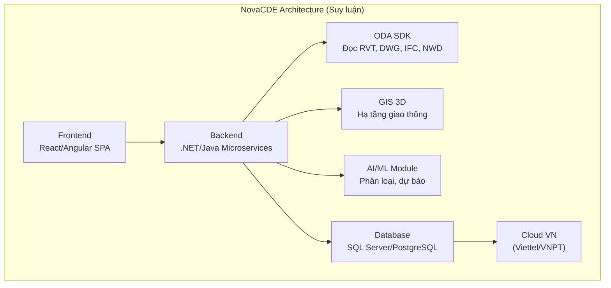
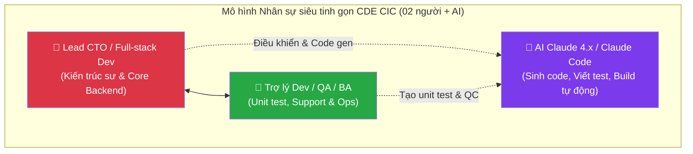

# Báo cáo Nghiên cứu Khả thi Dự án CDE CIC
## Đề án Nghiên cứu Công nghệ, Thiết kế Kiến trúc và Kế hoạch Thương mại hóa Nền tảng CDE

> **Phiên bản:** v2.0 (rà soát, hiệu đính & chuẩn hóa số liệu)  
> **Ngày lập báo cáo:** 30/06/2026  
> **Đơn vị thực hiện:** Công ty Cổ phần Công nghệ và Tư vấn CIC  
> **Mục đích:** Đánh giá toàn diện năng lực công nghệ của các đối thủ trong nước và quốc tế, từ đó đề xuất mô hình kiến trúc, phương án nhân sự tối ưu hóa bằng AI, dự toán tài chính 5 năm và lộ trình triển khai chi tiết cho hệ thống CDE CIC trước khi ra quyết định đầu tư.

---

> ### Nhật ký hiệu đính v1 → v2 (Changelog)
> Phiên bản v2 khắc phục các mâu thuẫn nội bộ và sai sót đã được phát hiện qua rà soát độc lập, đảm bảo tính nhất quán phục vụ ra quyết định đầu tư:
> 1. **Chuẩn hóa CAPEX = 3,50 tỷ VNĐ** (theo các bảng bóc tách chi tiết §5.2a/5.2b/5.3b). Sửa bảng dòng tiền §5.5.1 vốn ghi nhầm 14,50 tỷ.
> 2. **Chuẩn hóa OPEX 5 năm = 33,30 tỷ VNĐ** (theo bảng chi tiết §5.2c). Sửa §1.3 (ghi nhầm 10,65 tỷ) và §5.5.1 (ghi nhầm 70,90 tỷ).
> 3. **Cơ cấu vốn = 100% CIC tự đầu tư.** Loại bỏ giả định "30% Ngân sách Nhà nước" mâu thuẫn ở §5.5.2.
> 4. **Tính lại toàn bộ NPV/IRR/dòng tiền/điểm hòa vốn** trên cơ sở số liệu đã chuẩn hóa, cho cả 3 kịch bản A/B/C.
> 5. **Phạm vi sản phẩm:** GIS/GeoBIM, 4D/5D, FM, AI/ML được xác định là **Roadmap Giai đoạn 2** (sau MVP) — cập nhật ma trận cạnh tranh §3.1/§3.5 cho nhất quán với lộ trình §5.6.
> 6. **Hiệu đính pháp lý & mốc thời gian:** NĐ 217/2026/NĐ-CP ban hành **19/6/2026**, hiệu lực 01/7/2026; làm rõ phạm vi *bắt buộc* (BIM cấp II+; CDE cấp I+ đầu tư công) và cơ chế tuân thủ QCVN 12:2026/BCA.
> 7. **Sửa lỗi đánh số chương** (trùng "Chương 5") và cập nhật thế hệ model AI.

---

## Chương 1: Mở đầu & Tóm tắt Dự án (Executive Summary)

### 1.1. Bối cảnh & Lý do đầu tư

#### 1.1.1. Bối cảnh pháp lý và xu hướng công nghệ
Trong những năm gần đây, việc áp dụng Mô hình thông tin công trình (BIM - Building Information Modeling) đã trở thành xu thế bắt buộc nhằm tối ưu hóa chi phí, thời gian và chất lượng trong hoạt động xây dựng toàn cầu. Tại Việt Nam, sau giai đoạn triển khai theo Quyết định số 258/QĐ-TTg của Thủ tướng Chính phủ, Quốc hội đã ban hành **Luật Xây dựng số 135/2025/QH15** ngày 10/12/2025 (quy định tại Điều 7 và Điều 14 về bắt buộc ứng dụng khoa học công nghệ, chuyển đổi số, mô hình BIM và xây dựng hệ thống cơ sở dữ liệu quốc gia về xây dựng), làm nền tảng pháp lý cao nhất cho chuyển đổi số ngành xây dựng. Cụ thể hóa Luật, Chính phủ đã ban hành **Nghị định số 217/2026/NĐ-CP quy định chi tiết một số điều của Luật Xây dựng về quản lý hoạt động xây dựng** (ban hành ngày 19/6/2026, có hiệu lực từ 01/7/2026), trong đó **Điều 8** quy định **bắt buộc áp dụng BIM cho công trình xây dựng mới từ cấp II trở lên** (kể từ giai đoạn lập Báo cáo nghiên cứu khả thi/Báo cáo kinh tế-kỹ thuật), và **bắt buộc thiết lập, vận hành Môi trường dữ liệu chung (CDE)** đối với **công trình cấp I trở lên thuộc dự án đầu tư công** (các cấp công trình khác được khuyến khích áp dụng). CDE phục vụ quản lý, lưu trữ, chia sẻ và kiểm soát tập tin gốc của mô hình BIM, kiểm tra xung đột và hỗ trợ bóc tách khối lượng (QTO) phục vụ lập dự toán, quản lý chi phí đầu tư xây dựng.

Để hiện thực hóa lộ trình pháp lý trên, việc thiết lập một Môi trường dữ liệu chung (CDE - Common Data Environment) là yêu cầu kỹ thuật tiên quyết. CDE đóng vai trò là hạ tầng dữ liệu số trung tâm, lưu trữ, quản lý và điều phối toàn bộ thông tin của dự án xây dựng từ giai đoạn chuẩn bị, thiết kế, thi công đến bàn giao vận hành.

#### 1.1.2. Cơ sở thực tiễn và cơ hội thương mại từ Mạng lưới tư vấn BIM và cung cấp CDE CIC
Quyết định đầu tư xây dựng nền tảng CDE CIC của Ban Lãnh đạo CIC không chỉ dựa trên xu hướng pháp lý mà còn được bảo đảm vững chắc bởi dữ liệu thực tế hoạt động kinh doanh chuyên biệt của hai mảng BIM và CDE, được trích xuất trực tiếp từ cơ sở dữ liệu hệ thống CIC-ERP tính đến tháng 6/2026:

1. **Thị trường sẵn có và tệp khách hàng VIP trung thành của mảng BIM & CDE**:
   - **Mảng dịch vụ tư vấn BIM**: Dịch vụ tư vấn BIM của CIC đã khẳng định vị thế vững chắc trên thị trường với **23 hợp đồng lớn** được thực hiện trực tiếp bởi Trung tâm BIM, đạt tổng giá trị ký kết **24.17 tỷ VNĐ**. Lợi nhuận gộp quản trị thực tế đạt tới **9.45 tỷ VNĐ** với biên lợi nhuận gộp quản trị đạt **39.1%**, cho thấy hiệu quả tài chính vượt trội của mảng dịch vụ tư vấn chuyên sâu này.
   - **Mảng cung cấp giải pháp CDE ngoại nhập**: Song song với dịch vụ tư vấn, CIC đang phân phối các giải pháp CDE và bản quyền phần mềm ngoại nhập (Autodesk ACC, Trimble Connect, Bentley ProjectWise, BIMcollab) thông qua Trung tâm CSS với **16 hợp đồng**, đạt tổng giá trị ký kết **21.36 tỷ VNĐ**, lợi nhuận gộp quản trị đạt **5.94 tỷ VNĐ** (biên lợi nhuận gộp quản trị đạt **27.8%**).
   - **Tổng hợp hai mảng lõi**: Tổng cộng cả hai mảng dịch vụ BIM và phân phối phần mềm CDE, CIC đã ký kết **39 hợp đồng** với tổng giá trị **45.53 tỷ VNĐ**, mang lại **15.39 tỷ VNĐ** lợi nhuận gộp quản trị cho công ty, đạt biên lợi nhuận gộp quản trị trung bình **33.8%**.
   - **Thống kê tệp khách hàng chuyên biệt**: Phân tích hành vi từ hệ thống ERP chỉ ra tính bền vững và sự tin tưởng tuyệt đối của tệp khách hàng trong mảng này. Toàn hệ thống ghi nhận **89 khách hàng độc bản** phát sinh giao dịch liên quan đến dịch vụ BIM và phần mềm CDE. Trong đó, số lượng khách hàng quay lại (phát sinh từ 2 hợp đồng trở lên) đạt **14.6% (13 khách hàng)** nhưng đóng góp tới **61.41 tỷ VNĐ**, tương đương **63.6%** tổng doanh số toàn thời gian của riêng mảng này (96.51 tỷ VNĐ).
   - Tiêu biểu là các khách hàng VIP thuộc khối Chủ đầu tư công, Ban Quản lý dự án (B2G) và doanh nghiệp lớn đã ký kết nhiều hợp đồng giá trị cao của riêng mảng BIM & CDE:
     * *Công ty Cổ phần Đô thị Du lịch Cần Giờ*: **2 hợp đồng** với tổng giá trị **19.17 tỷ VNĐ** (đã thu thực tế 0.45 tỷ VNĐ) - Cung cấp giải pháp phần mềm CDE.
     * *Ban QLDA ĐTXD các công trình Dân dụng và Công nghiệp TP.HCM*: **15 hợp đồng** với tổng giá trị **8.53 tỷ VNĐ** (đã thu thực tế 4.47 tỷ VNĐ) - Dịch vụ tư vấn BIM.
     * *Công ty Cổ phần Thiết kế Xây dựng Stellar*: **3 hợp đồng** với tổng giá trị **8.49 tỷ VNĐ** (đã thu thực tế 2.39 tỷ VNĐ) - Dịch vụ tư vấn BIM.
     * *Công ty TNHH tư vấn quản lý dự án Mặt Trời*: **1 hợp đồng** với tổng giá trị **7.97 tỷ VNĐ** - Dịch vụ tư vấn BIM.
     * *Ban QLDA ĐTXD công trình Dân dụng TP Hà Nội*: **4 hợp đồng** với tổng giá trị **7.57 tỷ VNĐ** - Dịch vụ tư vấn BIM.
     * *Tổng công ty 319 Bộ Quốc phòng*: **3 hợp đồng** với tổng giá trị **5.24 tỷ VNĐ** - Dịch vụ tư vấn BIM.
     * *Công ty TNHH Daewoo Engineering & Construction Việt Nam*: **1 hợp đồng** với tổng giá trị **3.97 tỷ VNĐ** - Dịch vụ tư vấn BIM.
     * *Công ty TNHH Junglim Architecture Vietnam*: **3 hợp đồng** với tổng giá trị **3.94 tỷ VNĐ** - Dịch vụ tư vấn BIM.
     * *Công ty TNHH Tư vấn Xây dựng Ánh Dương*: **1 hợp đồng** với tổng giá trị **2.87 tỷ VNĐ** - Dịch vụ tư vấn BIM.
     * *Công ty Cổ phần Eurowindow*: **2 hợp đồng** với tổng giá trị **1.49 tỷ VNĐ** - Cung cấp giải pháp phần mềm CDE.
   - Tệp khách hàng VIP trung thành này là tài sản thương mại vô giá. Khi nền tảng CDE CIC ra mắt, đây sẽ là nhóm người dùng thực tế khổng lồ sẵn có, giúp tối ưu hóa chi phí tiếp thị, đảm bảo khả năng thương mại hóa nhanh chóng và khả năng bán chéo (cross-selling) rất cao.

2. **Khắc phục tình trạng phụ thuộc phần mềm nước ngoài và rò rỉ lợi nhuận (Profit Leakage)**:
   - Việc bán lại bản quyền phần mềm nước ngoài làm CIC đối mặt với biên lợi nhuận thấp hơn và rủi ro rò rỉ lợi nhuận lớn cho các hãng nước ngoài. Đặc biệt, các giải pháp cloud nước ngoài (như Autodesk ACC lưu trữ trên AWS US Cloud) không thể tuân thủ Quy chuẩn an ninh mạng quốc gia **QCVN 12:2026/BCA** (buộc phải lưu trữ dữ liệu trong nước đối với khối đầu tư công B2G).
   - Đầu tư phát triển nền tảng CDE CIC tự chủ 100% đặt trên hạ tầng đám mây nội địa (Viettel Cloud + VNPT Cloud) là lời giải triệt để. Nó giúp CIC bảo vệ tệp khách hàng đầu tư công VIP sẵn có, giữ lại toàn bộ dòng doanh thu SaaS, và tạo động lực tăng trưởng đột phá nhờ chiến lược bán chéo (bundle): **Dịch vụ tư vấn BIM + Bản quyền phần mềm CDE CIC**.

3. **Giải quyết điểm nghẽn chi phí nhân sự triển khai**:
   - Báo cáo chỉ ra chi phí triển khai thực tế của Trung tâm BIM chiếm tới 55.4% tổng giá trị hợp đồng, trong đó **phí thuê chuyên gia bên ngoài chiếm tới 55.7%** tổng chi phí.
   - Hệ thống CDE CIC tích hợp các công cụ tự động hóa R&D và động cơ AI bóc tách khối lượng (QTO) sẽ hỗ trợ đội ngũ tư vấn tự động hóa các tác vụ lặp đi lặp lại, nâng cao tỷ lệ tự thực hiện của nhân sự cơ hữu, từ đó tối ưu hóa cơ cấu chi phí dịch vụ và gia tăng biên lợi nhuận gộp cho CIC.

Từ những cơ sở thực tiễn trên, việc phát triển CDE mang thương hiệu Việt Nam (CDE CIC) là bước đi chiến lược, cấp thiết để CIC bảo vệ tệp khách hàng VIP sẵn có, khai thác phân khúc B2G màu mỡ trước các quy định an ninh mới, và tối ưu hóa hiệu quả tài chính doanh nghiệp.

#### 1.1.3. CDE - "Bộ não" trung tâm hội tụ của Bản sao số (Digital Twin)
Trong kỷ nguyên số hóa ngành xây dựng và quản lý đô thị thông minh, một Bản sao số (Digital Twin) thực sự không thể tồn tại nếu thiếu đi một Môi trường dữ liệu chung (CDE). CDE đóng vai trò là "bộ não" trung tâm, nơi hội tụ và đồng bộ hóa ba trụ cột công nghệ cốt lõi:
1. **BIM (Building Information Modeling)**: Cung cấp thông tin hình học 3D chi tiết, thuộc tính kỹ thuật và vòng đời cấu kiện của toàn bộ công trình từ thiết kế đến thi công.
2. **GIS (Geographic Information System)**: Định vị công trình trong không gian địa lý, cung cấp bối cảnh môi trường, dữ liệu địa hình, bản đồ số và kết nối hạ tầng kỹ thuật đô thị xung quanh.
3. **IoT (Internet of Things)**: Truyền dữ liệu telemetry thời gian thực từ các cảm biến đo đạc (nhiệt độ, độ ẩm, ứng suất kết cấu, điện năng tiêu thụ, lưu lượng người và thiết bị vận hành).

Sự tích hợp chặt chẽ này biến CDE từ một kho lưu trữ tài liệu đơn thuần thành một hệ điều hành bản sao số sống động. Mọi biến động vật lý ngoài thực địa được cảm biến IoT ghi nhận, định vị chính xác trên không gian GIS và phản ánh trực quan trên mô hình BIM của CDE. Đây chính là nền tảng cốt lõi để hiện thực hóa các giải pháp quản lý đô thị thông minh, tối ưu hóa bảo trì dự phòng (predictive maintenance) và mô phỏng phản ứng sự cố trong thời gian thực.

### 1.2. Mục tiêu chiến lược và Định hướng phát triển CDE CIC
Để định hình rõ nét vai trò và hướng đi của dự án, Ban chỉ đạo R&D xác lập các mục tiêu và định hướng phát triển cụ thể của CDE CIC như sau:

1. **Mục tiêu ngắn hạn (1 - 2 năm)**:
   - **Tự chủ công nghệ 100%**: Phát triển hoàn chỉnh hệ thống quản lý dữ liệu bản vẽ, mô hình BIM và luồng phê duyệt theo tiêu chuẩn ISO 19650, thay thế hoàn toàn phần mềm ngoại nhập.
   - **Thương mại hóa nhanh**: Chuyển đổi tối thiểu 30% tệp khách hàng BIM hiện tại sang sử dụng bản quyền CDE CIC, tạo nguồn doanh thu SaaS ổn định.
   - **Tuân thủ an ninh QCVN 12**: Thiết kế và vận hành hệ thống đáp ứng các yêu cầu của QCVN 12:2026/BCA, lập hồ sơ xác định cấp độ an toàn thông tin (hướng tới Cấp độ 3) và hoàn thành đánh giá an ninh độc lập trong vòng 12 tháng kể từ khi vận hành thử nghiệm. *Lưu ý: QCVN 12:2026/BCA điều chỉnh hệ thống lưu trữ tài liệu điện tử trong cơ quan Đảng, Nhà nước (không chứa bí mật nhà nước); trách nhiệm tuân thủ thuộc về chủ quản hệ thống theo từng triển khai. CDE CIC định vị là nền tảng được thiết kế sẵn-sàng-tuân-thủ để chủ đầu tư/cơ quan nhà nước dễ dàng đạt cấp độ an toàn khi triển khai.*
   - **Liên thông dữ liệu quốc gia**: Tích hợp liên thông trực tiếp với Cổng NDXP/LGSP quốc gia và API của Bộ Xây dựng (`csdlhdxd.gov.vn`), phục vụ công tác nộp file mô hình thiết kế, thẩm định quy hoạch và cấp phép xây dựng số (Ưu tiên thực hiện sớm để tạo lợi thế cạnh tranh B2G).

2. **Mục tiêu dài hạn (3 - 5 năm)**:
   - **Số 1 phân khúc B2G**: Trở thành nền tảng CDE tiêu chuẩn được lựa chọn hàng đầu bởi các Ban Quản lý dự án trọng điểm, các Sở Xây dựng và doanh nghiệp nhà nước tại Việt Nam.
   - **Bộ não đô thị thông minh (GeoBIM Digital Twin)**: Phát triển CDE của CIC thành nền tảng lõi và bộ não Digital Twin phục vụ thí điểm quản lý quy hoạch và phát triển đô thị thông minh tại các thành phố trực thuộc trung ương thí điểm Digital Twin theo Nghị quyết số 57/NQ-CP của Chính phủ.

3. **Định hướng phát triển sản phẩm**:
   - **Chủ quyền dữ liệu**: Đặt toàn bộ hệ thống trên hạ tầng đám mây nội địa (Viettel Cloud), bảo đảm an toàn thông tin cấp độ 3 và tuân thủ tuyệt đối quy định lưu trữ dữ liệu quốc gia.
   - **Mở rộng dựa trên OpenBIM**: Tuân thủ tuyệt đối định dạng file mở IFC (OpenBIM), cung cấp hệ thống API mở (REST, gRPC) để dễ dàng tích hợp với các hệ thống ERP doanh nghiệp và phần mềm quản lý đầu tư công khác.
   - **Tập trung dữ liệu & Khai thác tài sản số**: Định vị CDE là nền tảng tập trung dữ liệu toàn diện của dự án xây dựng, tối ưu hóa lưu trữ, quản lý vòng đời tài liệu và khai thác hiệu quả tài sản số (digital assets) kết hợp trợ lý ảo AI để hỗ trợ phát triển, sinh test tự động và quản trị vận hành hệ thống.


### 1.3. Mục đích báo cáo
Báo cáo này phân tích sâu sắc cấu trúc công nghệ của các giải pháp CDE nội địa (NovaCDE, VinaCDE, BuildTab,...) và quốc tế (Autodesk Construction Cloud, Trimble Connect,...), từ đó kiến nghị:
* Mô hình kiến trúc phần mềm tối ưu dựa trên nền tảng Go + Python + TypeScript.
* Mô hình hạ tầng đám mây bảo mật cao Dual-Cloud (Viettel Cloud làm Primary, VNPT làm DR) tuân thủ QCVN 12.
* Mô hình nhân sự siêu tinh gọn phối hợp AI (Mô hình AI-Conductor), gồm đúng 02 nhân sự cốt lõi (CTO kiêm Developer chính và 01 Trợ lý Dev/QA/BA) làm việc cùng AI Claude để tối ưu hóa tối đa chi phí.
* Dự toán tài chính chi tiết trong vòng 5 năm (CAPEX 3,50 tỷ VNĐ; OPEX lũy kế 5 năm 33,30 tỷ VNĐ) và lộ trình triển khai cụ thể theo Sprint.

### 1.4. Khuyến nghị kỹ thuật then chốt
* **Định dạng lưu trữ mở & Engine độc lập**: Sử dụng IFC 4.0 làm định dạng dữ liệu hình học cốt lõi (OpenBIM), kết hợp ThatOpen Engine render trực tiếp trên trình duyệt bằng WebGL/WebGPU để loại bỏ sự phụ thuộc vào các engine thương mại đắt đỏ của nước ngoài.
* **R&D mô hình AI-Conductor & Khai thác dữ liệu**: Phát triển mô hình AI-Conductor giúp tối ưu hóa nhân sự tối đa còn 2 người, sử dụng AI thế hệ mới để hỗ trợ viết code, tạo kịch bản kiểm thử, và tự động hóa quy trình nghiệp vụ.
* **Tuân thủ Quy chuẩn QCVN 12/BCA**: Thiết lập hệ thống lưu trữ hoàn toàn trên đám mây nội địa (Viettel Cloud), tích hợp định danh VNeID SSO và cơ chế ghi log bất biến (Immutable WORM logging) để đáp ứng tuyệt đối các yêu cầu về an ninh mạng quốc gia phục vụ khối đầu tư công (B2G).

---

## Chương 2: Khung Pháp lý, Quy chuẩn & Yêu cầu Tuân thủ Quốc gia (National Regulatory & Compliance Framework)

Giai đoạn cuối năm 2025 và giữa năm 2026 đánh dấu bước ngoặt lịch sử khi Nhà nước Việt Nam ban hành đồng loạt **Luật Xây dựng mới** cùng **5 Nghị định cốt lõi** hướng dẫn thi hành, chính thức luật hóa mô hình thông tin công trình (BIM) và Cơ sở dữ liệu quốc gia về hoạt động xây dựng. Chương này tổng hợp đầy đủ các căn cứ pháp lý then chốt làm nền tảng cho toàn bộ đề xuất kỹ thuật, kinh doanh và vận hành của CDE CIC.

### 2.1. Tổng quan Hành lang Pháp lý Số hóa Ngành Xây dựng (2025-2026)

| # | Văn bản pháp lý | Ngày ban hành | Phạm vi điều chỉnh chính | Ý nghĩa với CDE CIC |
|:---:|:---|:---:|:---|:---|
| 1 | **Luật Xây dựng số 135/2025/QH15** | 10/12/2025 | Luật hóa BIM, CSDL quốc gia về XD | Nền tảng pháp lý gốc cho số hóa ngành XD |
| 2 | **Nghị định số 217/2026/NĐ-CP** | 19/06/2026 | Quản lý hoạt động XD, BIM bắt buộc | BIM bắt buộc cấp II+; CDE bắt buộc cấp I+ đầu tư công |
| 3 | **Nghị định số 212/2026/NĐ-CP** | 17/06/2026 | CSDL quốc gia, năng lực hoạt động XD | Hạ tầng CNTT, AI, liên thông dữ liệu |
| 4 | **Nghị định số 207/2026/NĐ-CP** | 19/06/2026 | Quản lý chất lượng công trình XD | BIM trong thi công, nghiệm thu |
| 5 | **Nghị định số 210/2026/NĐ-CP** | 19/06/2026 | Hợp đồng xây dựng | Hợp đồng tư vấn BIM hợp pháp |
| 6 | **Nghị định số 206/2026/NĐ-CP** | 15/06/2026 | Quản lý chi phí đầu tư XD | Định mức giá, chi phí CNTT trong dự toán |
| 7 | **Thông tư số 47/2026/TT-BCA** | 2026 | QCVN 12:2026/BCA về an ninh mạng | Quy chuẩn an ninh hạ tầng Cloud nội địa |

### 2.2. BIM được Luật hóa — Luật Xây dựng số 135/2025/QH15

Luật Xây dựng số 135/2025/QH15 được Quốc hội thông qua ngày 10/12/2025 đã chính thức đưa **mô hình thông tin công trình (BIM)** vào hệ thống pháp luật quốc gia:

* **Điểm b Khoản 3 Điều 7** — Chính sách phát triển của Nhà nước: Quy định ưu tiên ứng dụng công nghệ thông tin, chuyển đổi số, đổi mới sáng tạo và **mô hình thông tin công trình (BIM)** trong hoạt động xây dựng nhằm nâng cao hiệu quả quản lý đầu tư xây dựng.
* **Điều 14** — Hệ thống thông tin và Cơ sở dữ liệu quốc gia về hoạt động xây dựng: Quy định cụ thể việc xây dựng CSDL quốc gia làm **tham chiếu gốc** phục vụ các thủ tục hành chính, quy hoạch, rà soát giá và định mức xây dựng.

> **Ý nghĩa**: CDE CIC không còn là giải pháp "nice-to-have" mà trở thành **công cụ đáp ứng chính sách phát triển quốc gia**, phục vụ trực tiếp mục tiêu chuyển đổi số ngành xây dựng theo Luật.

### 2.3. BIM Bắt buộc & CDE Mandate — Nghị định số 217/2026/NĐ-CP

Nghị định số 217/2026/NĐ-CP (ban hành ngày 19/06/2026, có hiệu lực từ 01/7/2026) quy định chi tiết một số điều của Luật Xây dựng về quản lý hoạt động xây dựng. Đây là văn bản **quan trọng nhất** đối với CDE CIC vì trực tiếp mandate việc áp dụng BIM và CDE:

* **Điều 8 Khoản 1 Điểm a** — BIM bắt buộc: Quy định bắt buộc áp dụng mô hình thông tin công trình (BIM) đối với **các công trình xây dựng mới từ cấp II trở lên**.
* **Điều 8 Khoản 3 Điểm a** — Định dạng mở: Yêu cầu sử dụng **định dạng IFC (Industry Foundation Classes)** hoặc định dạng mở tương đương khi nộp mô hình BIM, đảm bảo tính liên thông và không phụ thuộc vào phần mềm độc quyền.
* **Điều 8 Khoản 4** — CDE bắt buộc: Yêu cầu Chủ đầu tư thiết lập và vận hành **Môi trường dữ liệu chung (CDE)** để quản lý, lưu trữ tập tin gốc của mô hình BIM đối với công trình **cấp I trở lên thuộc dự án đầu tư công**. Các cấp công trình khác được **khuyến khích** áp dụng.
* **Điều 8 Khoản 5 Điểm b** — Số hóa hồ sơ: BIM có thể **thay thế hồ sơ giấy** truyền thống khi đáp ứng điều kiện pháp lý về chữ ký số.
* **Điều 8 Khoản 5 Điểm đ** — Nộp BIM hoàn công: Chủ đầu tư phải thực hiện việc **cập nhật mô hình BIM hoàn công đã được chuẩn hóa vào Cơ sở dữ liệu quốc gia** về hoạt động xây dựng.
* **Điều 8 Khoản 5 Điểm c** — Thẩm định bằng dữ liệu BIM: Cho phép và khuyến khích cơ quan chuyên môn về xây dựng sử dụng dữ liệu BIM để phục vụ công tác thẩm định thiết kế cơ sở và kiểm tra nghiệm thu. Nội dung thẩm định bằng dữ liệu BIM bao gồm: vị trí, hình khối, kích thước chủ yếu; phương án kiến trúc, kết cấu chính; tổ chức không gian, hệ thống kỹ thuật; kiểm tra sự tuân thủ quy chuẩn kỹ thuật, tiêu chuẩn áp dụng; kiểm tra xung đột kỹ thuật và trích xuất các chỉ tiêu chủ yếu.

> **Ý nghĩa**: NĐ 217 tạo ra **thị trường bắt buộc** cho CDE CIC tại phân khúc B2G — mọi công trình cấp I trở lên của dự án đầu tư công đều **phải có CDE**. Đặc biệt, quy định tại **Khoản 5 Điểm c Điều 8** mở ra cơ hội thương mại cực lớn cho CIC trong việc cung cấp **Phân hệ hỗ trợ thẩm định tự động** cho các Sở Xây dựng và cơ quan chuyên môn về xây dựng cấp Bộ/tỉnh, trực tiếp phục vụ công tác thẩm định thiết kế cơ sở không dùng giấy theo lộ trình chuyển đổi số quốc gia.

### 2.4. CSDL Quốc gia & Hạ tầng CNTT Số — Nghị định số 212/2026/NĐ-CP

Nghị định số 212/2026/NĐ-CP (ban hành ngày 17/06/2026) quy định về Hệ thống thông tin và Cơ sở dữ liệu quốc gia về hoạt động xây dựng:

* **Khoản 3 Điều 4** — Hệ thống vận hành tập trung: CSDL quốc gia vận hành tại địa chỉ `https://csdlhdxd.gov.vn`, bao gồm các cấu phần cơ sở dữ liệu, hạ tầng kỹ thuật CNTT và **điện toán đám mây**.
* **Điểm c Khoản 5 Điều 4** — AI & Dữ liệu lớn: Quy định ứng dụng các nền tảng **phân tích dữ liệu lớn và trí tuệ nhân tạo (AI)** phục vụ quản lý nhà nước, trên cơ sở dữ liệu được chuẩn hóa, liên thông và cập nhật theo thời gian thực.
* **Điều 6** — Cơ chế kết nối và chia sẻ: Quy định cơ chế thu thập, đồng bộ dữ liệu dự án, công trình, quy hoạch, định mức giá và năng lực hoạt động xây dựng từ các bộ, ngành, địa phương.

> **Ý nghĩa**: CDE CIC cần tích hợp **cổng API liên thông** với `csdlhdxd.gov.vn` từ thiết kế ban đầu để đáp ứng yêu cầu đồng bộ dữ liệu dự án theo NĐ 212.

### 2.5. BIM trong Thi công & Nghiệm thu — Nghị định số 207/2026/NĐ-CP

Nghị định số 207/2026/NĐ-CP (ban hành ngày 19/06/2026) quy định chi tiết về quản lý chất lượng công trình xây dựng:

* **Điểm a Khoản 1 Điều 11** — Ứng dụng BIM: Quy định quyền thỏa thuận của chủ đầu tư và nhà thầu trong việc **lựa chọn ứng dụng giải pháp CNTT, mô hình thông tin công trình (BIM) để quản lý thi công, quản lý chất lượng, nghiệm thu và bàn giao công trình xây dựng**.
* **Điểm b Khoản 1 Điều 11** — Số hóa hồ sơ hoàn công: Quy định **lập hồ sơ hoàn thành công trình dưới dạng tập tin điện tử**, mở ra xu hướng số hóa 100% hồ sơ hoàn công.

> **Ý nghĩa**: NĐ 207 mở ra thị trường **as-built BIM** và **số hóa hồ sơ hoàn công** — đây chính là phân hệ quản lý tài liệu (Document Management) của CDE CIC.

### 2.6. Hợp đồng Tư vấn BIM & Quản lý Chi phí — Nghị định số 210 & 206/2026

#### Nghị định số 210/2026/NĐ-CP — Hợp đồng xây dựng:
* **Điểm a Khoản 2 Điều 8** — Tư vấn BIM hợp pháp: Quy định cụ thể việc đưa công việc **"tư vấn lập mô hình thông tin công trình (BIM)"** vào nội dung và phạm vi công việc cấu thành của một **hợp đồng tư vấn xây dựng hợp pháp**, thiết lập hành lang chi phí chính thức cho các dự án B2G.

#### Nghị định số 206/2026/NĐ-CP — Quản lý chi phí đầu tư xây dựng:
* **Khoản 6 Điều 3** — Cập nhật CSDL: Hệ thống giá, định mức xây dựng, chỉ số giá do cơ quan nhà nước ban hành, công bố được **cập nhật vào Hệ thống thông tin, CSDL quốc gia** về hoạt động xây dựng.
* **Điều 26 Khoản 2** — Chi phí CNTT trong tư vấn: Chi phí tư vấn xây dựng bao gồm **"chi phí ứng dụng khoa học công nghệ, quản lý hệ thống thông tin công trình"** — đây là **cơ sở pháp lý trực tiếp** để chi phí phần mềm CDE/BIM được tính hợp pháp vào dự toán tư vấn xây dựng.
* **Điều 37** — Định mức xây dựng: Hỗ trợ luận điểm rằng chi phí CDE CIC có thể được Chủ đầu tư đưa vào dự toán hợp pháp.

> **Ý nghĩa**: CDE CIC vừa là **công cụ thực hiện** vừa là **đối tượng hưởng lợi** từ hành lang pháp lý. Chi phí triển khai CDE CIC có căn cứ pháp lý rõ ràng để được Chủ đầu tư đưa vào dự toán dự án đầu tư công.

### 2.7. Sở hữu Trí tuệ đối với Mã nguồn do AI tạo ra

Theo quy định hiện hành, mã nguồn do AI tự động sinh ra không được bảo hộ bản quyền tác giả trực tiếp. Do đó, quy trình phát triển của CDE CIC quy định:
* Toàn bộ mã nguồn do AI gợi ý phải được các kỹ sư công nghệ của dự án rà soát, tinh chỉnh và tích hợp thủ công.
* Nhật ký mã nguồn (Git commit) phải do tài khoản định danh của kỹ sư thuộc CIC thực hiện.
* Hợp đồng lao động quy định rõ điều khoản chuyển nhượng toàn bộ quyền sở hữu trí tuệ đối với mọi sản phẩm code tạo ra trong quá trình làm việc cho CIC (Work for Hire), đảm bảo tính pháp lý vững chắc cho tài sản công nghệ của CIC.

Theo quy định pháp lý quốc tế về sở hữu trí tuệ phần mềm, việc giao tiếp giữa hai hệ thống độc lập qua giao thức mạng tiêu chuẩn (API/gRPC JSON) không cấu thành hành vi tạo tác phẩm phái sinh (derivative work), do đó phần logic nghiệp vụ chạy ở backend của CDE CIC hoàn toàn được bảo hộ độc quyền 100%.

### 2.8. Đảm bảo Chủ quyền Dữ liệu số & An ninh mạng Quốc gia

CDE CIC phục vụ phân khúc B2G (dự án đầu tư công) phải tuân thủ nghiêm ngặt các quy chuẩn an ninh quốc gia:

* **QCVN 12:2026/BCA** (ban hành kèm Thông tư số 47/2026/TT-BCA): Quy chuẩn kỹ thuật quốc gia về an ninh mạng đối với hệ thống thông tin. CDE CIC đặt hạ tầng Cloud hoàn toàn trong nước (Viettel Cloud + VNPT Cloud) để đáp ứng tuyệt đối.
* **Luật Dữ liệu số 60/2024/QH15**: Tuân thủ quy định bảo vệ dữ liệu lớn trong hệ sinh thái xây dựng.
* **Luật Bảo vệ Dữ liệu cá nhân số 91/2025/QH15**: Bảo vệ thông tin cá nhân của người dùng hệ thống (nhân sự ban quản lý dự án, kỹ sư thi công).

> **Giải pháp kỹ thuật tương thích**:
> * Mô hình Dual-Cloud (Viettel Cloud làm chính, VNPT làm dự phòng) đảm bảo chủ quyền dữ liệu đặt hoàn toàn tại Việt Nam.
> * Cơ chế ghi nhật ký kiểm toán bất biến (Audit Trail WORM) chống giả mạo, đáp ứng QCVN 12.
> * Tích hợp cổng API mở (REST/gRPC) sẵn sàng kết nối trực tiếp với Cổng CSDL quốc gia tại `https://csdlhdxd.gov.vn`.

---


## Chương 3: Phân tích Thị trường & Đối thủ Cạnh tranh (Market & Competitor Analysis)

### 3.1a. Tổng quan đối thủ Việt Nam

Do tính chất phân khúc thị trường có sự khác biệt rõ rệt giữa giải pháp nội địa và quốc tế, bảng tổng hợp tech stack các đối thủ Việt Nam được trình bày dưới đây để thuận tiện cho việc so sánh và đánh giá:

Do tính chất phân khúc thị trường có sự khác biệt rõ rệt giữa giải pháp nội địa và quốc tế, bảng tổng hợp tech stack được chia làm hai phần để thuận tiện cho việc so sánh và đánh giá:

#### Bảng 3.1a: So sánh Tech Stack các CDE Việt Nam & CDE CIC (Đề xuất)

| Tiêu chí | **NovaCDE** (Hài Hòa) | **VinaCDE** (TGL Solutions) | **BuildTab CDE+** | **BIMNEXT** (DP Unity) | **ADSCivil CDE** (Baezeni) | **CDE CIC** (Đề xuất) |
|----------|:---:|:---:|:---:|:---:|:---:|:---:|
| **Giải thưởng** | Sao Khuê 2024 | Sao Khuê 2025 | — | — | — | — |
| **Kiến trúc** | Microservices, Cloud | Cloud-based | Cloud-based | Cloud-based, Web | Cloud-based | **Polyglot Microservices** |
| **3D/BIM Engine** | ODA SDK (Thương mại) | Tự phát triển | Autodesk APS (Forge) | Tự phát triển | Tự phát triển | **Hybrid (ThatOpen + IfcOpenShell)** |
| **Định dạng file** | RVT, DWG, IFC, NWD | IFC, DWG, PDF | Revit, NWD, IFC | Office, PDF, CAD | 30+ định dạng | **IFC, DWG, RVT, PDF, Office** |
| **Backend** | .NET / Java | .NET | .NET / Java | .NET | C++ core + .NET | **Go + Python** |
| **Frontend** | Web-based (SPA) | Web-based (SPA) | Web-based (SPA) | Web-based | Web-based | **React + Next.js (TypeScript)** |
| **ISO 19650** | ✅ Đầy đủ | ✅ Đầy đủ | ✅ Đầy đủ | ⚠️ Cơ bản | ⚠️ Cơ bản | **🎯 Đầy đủ** |
| **GIS/GeoBIM** | ✅ GIS 3D | ❌ | ❌ | ✅ BIM trên GIS | ❌ | **🎯 Roadmap GĐ2** |
| **4D/5D BIM** | ⚠️ Cơ bản | ❌ | ❌ | ✅ Tiền độ/sản lượng | ❌ | **🎯 Roadmap GĐ2** |
| **FM (Vận hành)** | ❌ | ❌ | ✅ BuildTab FMs | ❌ | ❌ | **🎯 Roadmap GĐ2** |
| **AI/ML** | ✅ Phân loại tài liệu | ❌ | ❌ | ❌ | ❌ | **🎯 Roadmap GĐ2** |
| **API mở** | ✅ REST API | ✅ Hệ sinh thái | ✅ API | ⚠️ Hạn chế | ⚠️ Hạn chế | **🎯 gRPC + REST** |
| **Thị trường** | SME, hạ tầng giao thông | SME, nhà thầu, tư vấn | Enterprise, vận hành | Quản lý dự án | Hạ tầng giao thông | **B2G (PMU, Sở XD), Enterprise** |
| **Hạ tầng Cloud** | VN Cloud | VN Cloud | AWS + VN Cloud | VN Cloud | VN Cloud / Server riêng | **🎯 Viettel Cloud + VNPT Cloud (DR)** |
| **QCVN 12** | ❌ Chưa có | ❌ Chưa có | ⚠️ Khó (AWS) | ❌ Chưa có | ❌ Chưa có | **🎯 Thiết kế tuân thủ từ đầu** |
| **VNeID SSO** | ❌ | ❌ | ❌ | ❌ | ❌ | **🎯 Tích hợp định danh VNeID** |

### 3.1b. Tổng quan đối thủ Quốc tế

Do tính chất phân khúc thị trường có sự khác biệt rõ rệt giữa giải pháp nội địa và quốc tế, bảng tổng hợp tech stack các đối thủ Quốc tế được trình bày dưới đây để thuận tiện cho việc so sánh và đánh giá:

#### Bảng 3.1b: So sánh Tech Stack các CDE Quốc tế & CDE CIC (Đề xuất)

| Tiêu chí | **Autodesk ACC** | **Trimble Connect** | **Bentley ProjectWise** | **BIMcollab** | **CDE CIC** (Đề xuất) |
|----------|:---:|:---:|:---:|:---:|:---:|
| **Quốc gia** | Mỹ | Mỹ | Mỹ | Hà Lan | Việt Nam |
| **Kiến trúc** | Multi-service, Cloud | Cloud-based | Client-Server / Cloud | Cloud-based, SaaS | **Polyglot Microservices** |
| **3D/BIM Engine** | Autodesk APS (Độc quyền) | Trimble 3D Engine | Bentley iModel.js | BIMcollab Viewer | **Hybrid (ThatOpen + IfcOpenShell)** |
| **Định dạng file** | 60+ định dạng | RVT, IFC, DWG, SKP | DGN, RVT, IFC, DWG | IFC, BCF, PDF | **IFC, DWG, RVT, PDF, Office** |
| **Backend** | Java, Go, .NET, Python | .NET (C#) | .NET + C++ core | .NET (C#) | **Go + Python** |
| **Frontend** | React + TypeScript | JavaScript / TypeScript | Angular + TypeScript | React + TypeScript | **React + Next.js (TypeScript)** |
| **ISO 19650** | ✅ Đầy đủ | ✅ Đầy đủ | ✅ Đầy đủ | ✅ Đầy đủ | **🎯 Đầy đủ** |
| **GIS/GeoBIM** | ✅ Tích hợp Esri | ✅ Tích hợp GIS | ✅ Cực mạnh (iModel) | ⚠️ Hạn chế | **🎯 Roadmap GĐ2** |
| **4D/5D BIM** | ✅ Autodesk Takeoff | ✅ Trimble Gecat | ✅ Bentley Synchro | ❌ | **🎯 Roadmap GĐ2** |
| **FM (Vận hành)** | ✅ Autodesk Tandem | ✅ Trimble FM | ✅ Bentley AssetWise | ❌ | **🎯 Roadmap GĐ2** |
| **AI/ML** | ✅ Autodesk AI | ⚠️ Hạn chế | ✅ Bentley AI | ❌ | **🎯 Roadmap GĐ2** |
| **Hạ tầng Cloud** | AWS (Global) | AWS + Azure | Azure (Global) | Azure (EU) | **🎯 Viettel Cloud + VNPT Cloud (DR)** |
| **QCVN 12** | ❌ Không đạt (US Cloud) | ❌ Không đạt (US Cloud) | ❌ Không đạt (US Cloud) | ❌ Không đạt (EU Cloud) | **🎯 Thiết kế tuân thủ từ đầu** |
| **Liên thông NDXP**| ❌ | ❌ | ❌ | ❌ | **🎯 Hỗ trợ liên thông LGSP/NDXP** |
| **VNeID SSO** | ❌ | ❌ | ❌ | ❌ | **🎯 Tích hợp định danh VNeID** |

---

### 3.2. Phân tích chi tiết đối thủ Việt Nam

> **Bối cảnh thị trường (cập nhật từ nghiên cứu khoa học gần nhất):** Theo nghiên cứu *"Nghiên cứu một số hệ thống Môi trường dữ liệu chung (CDE) phổ biến tại Việt Nam trong quản lý dữ liệu dự án áp dụng BIM"* (ThS Nguyễn Thị Hồng Hạnh và cộng sự, Trường ĐH Giao thông vận tải, đăng trên *Tạp chí Xây dựng — Bộ Xây dựng*, 19/11/2025), thị trường CDE Việt Nam phân hóa thành hai nhóm rõ rệt: **(i) nhóm quốc tế** (Autodesk Construction Cloud, Trimble Connect) — tích hợp sâu hệ sinh thái BIM toàn cầu nhưng chi phí cao, máy chủ đặt nước ngoài; **(ii) nhóm nội địa** (VinaCDE, ADSCivil CDE, BIMNEXT, NovaCDE) — lợi thế bản địa hóa, chi phí hợp lý, máy chủ trong nước và tuân thủ pháp lý Việt Nam. Đáng chú ý: **chưa nền tảng nội địa nào** trong khảo sát đạt chứng nhận an ninh QCVN 12, tích hợp liên thông NDXP/LGSP hay định danh VNeID — đây chính là khoảng trống chiến lược mà CDE CIC nhắm tới (xem §3.2.6).

Một đặc điểm quan trọng: phần lớn đối thủ nội địa mạnh là do **đứng trên một hệ sinh thái phần mềm thiết kế/ERP sẵn có** (Nova, VinaCAD, ADSCivil, DP Unity), tạo lợi thế bán kèm (bundle) và khóa khách hàng — một mô hình mà CIC hoàn toàn có thể tái lập nhờ tệp khách hàng BIM & mạng lưới tư vấn sẵn có.

#### 3.2.1. NovaCDE (Hài Hòa / Harmony AT) — Đối thủ nội địa hàng đầu mảng hạ tầng giao thông
NovaCDE do **Công ty TNHH Công nghệ cao Hài Hòa (Harmony AT, thành lập 2002)** phát triển — đơn vị tiên phong phần mềm thiết kế đường & hạ tầng tại Việt Nam (tiền thân từ 1998, là nền tảng của hầu hết phần mềm thiết kế đường hiện nay). Đạt **giải Sao Khuê 2024** (hạng mục Đổi mới sáng tạo). NovaCDE nằm trong hệ sinh thái **Nova** (Nova thiết kế hạ tầng + Nova CDE), máy chủ đặt tại Việt Nam, tích hợp dữ liệu Point Cloud và bản đồ **3D GIS** phục vụ hạ tầng giao thông.

*Tính năng chính (theo công bố sản phẩm):* quản lý tài liệu vòng đời dự án; xem mô hình BIM trực tuyến (DWG, IFC) không cần cài phần mềm; trao đổi & đánh dấu lỗi trực tiếp trên mô hình; quy trình theo chuẩn ngành xây dựng Việt Nam; tùy chọn cài đặt On-Premise trên máy chủ Chủ đầu tư; kiểm tra chất lượng (QA/QC) mô hình BIM; theo dõi tiến độ qua mô hình; tích hợp GIS 3D; kết nối hệ thống quản lý công trình (CMMS). Hài Hòa có quan hệ đối tác chiến lược với khối tư vấn giao thông lớn (hội thảo cùng **TEDI** — Tổng công ty Tư vấn thiết kế GTVT, 13/7/2024).



* **Điểm mạnh cần học hỏi**:
  - **Hệ sinh thái thiết kế hạ tầng sâu** (>25 năm): Nova CDE bán kèm bộ Nova thiết kế đường — lợi thế bundle và khóa khách hàng khối tư vấn giao thông (TEDI và tương tự).
  - Xử lý trực tiếp định dạng thiết kế (RVT/DWG) và tích hợp **GIS 3D + Point Cloud** — phù hợp dự án tuyến, cầu đường.
  - Định hướng thị trường ngách tốt (hạ tầng giao thông công cộng), uy tín thương hiệu lâu năm.
* **Điểm yếu CDE CIC có thể khai thác**:
  - **Chưa đạt QCVN 12**, chưa có liên thông NDXP/LGSP và **chưa tích hợp VNeID** — chưa sẵn sàng cho yêu cầu B2G mới.
  - Chưa có phân hệ **5D dựa trên định mức Bộ Xây dựng**; thiên về giao thông, ít phủ mảng dân dụng/công nghiệp.
  - Phụ thuộc thư viện đọc file thương mại (ODA SDK) làm tăng chi phí bản quyền lõi so với hướng OpenBIM (ThatOpen) của CDE CIC.

#### 3.2.2. VinaCDE (TGL Solutions) — Hệ sinh thái VinaCAD / Vietnam Construction Cloud
VinaCDE do **Công ty Cổ phần TGL Solutions** phát triển, đạt **giải Sao Khuê 2025** và xếp hạng 5 sao "Dịch vụ chuyển đổi số xây dựng" (2024); từng xuất hiện trên VTV3. VinaCDE là lớp lõi của hệ sinh thái **VCC (Vietnam Construction Cloud)** gồm **VinaCAD** (phần mềm CAD miễn phí, tương thích AutoCAD), **VinaCDE**, **VinaBuild** (vận hành hiện trường) và định hướng tích hợp ERP **ONSITER**. Quy trình nghiệp vụ được đồng phát triển/tư vấn bởi **IDD Việt Nam** (ký kết hợp tác 04/03/2025) nên sát thực tế BIM trong nước.

*Tính năng:* Dashboard, Files, Issues, RFIs, Submittals, Transmittals, Chat nhóm dự án; so sánh phiên bản bản vẽ; kiểm tra xung đột; quy trình 4 trạng thái ISO 19650 (WIP–Shared–Published–Archive); tích hợp Revit/AutoCAD/Tekla. Đã triển khai cho dự án phức tạp (vd Metropole Plot 14, 36 tầng).

*Bảng giá công khai (lợi thế minh bạch, dùng làm tham chiếu định giá cho CDE CIC):* gói **Standard từ 2,9 triệu/tháng** (≤25 user, upload ≤500MB/file); **Premium từ 8,2 triệu/tháng** (≤50 user, ≤2GB/file); **Enterprise** thương lượng.
* **Điểm mạnh**: Hệ sinh thái VCC + VinaCAD miễn phí tạo phễu khách hàng lớn; quy trình bản địa hóa tốt nhờ IDD; định giá minh bạch, dễ tiếp cận SME.
* **Điểm yếu CDE CIC có thể khai thác**: Theo nghiên cứu ĐH GTVT, VinaCDE **chưa có tích hợp BIM–GIS** (mới ở lộ trình); thiếu **4D/5D, FM**; engine hiển thị 3D tự phát triển còn cơ bản, hiệu năng mô hình lớn hạn chế; **chưa có QCVN 12 / NDXP / VNeID**. Tập trung phân khúc SME — chưa mạnh ở B2G trọng điểm.

#### 3.2.3. BuildTab (CDE+ & FMs) — Mạnh quản lý vận hành, phụ thuộc Autodesk APS ở mảng FM
**BuildTab Vietnam** cung cấp hai sản phẩm theo ISO 19650 và QĐ 348/QĐ-BXD: **BuildTab CDE+** (quản lý tài liệu, viewer IFC/RVT/NWD/DWG trên trình duyệt, quy trình phê duyệt nhiều bước) và **BuildTab FMs** (quản lý tài sản/vận hành — EAM + CMMS, nhập liệu theo chuẩn **COBie**, QR code thiết bị, bảo trì phòng ngừa/dự đoán, ứng dụng di động tại hiện trường).

*Tích hợp:* Revit, Navisworks, Excel, **Power BI**, API; hạ tầng lưu trữ tại Việt Nam.
*Bảng giá công khai:* **Single User từ 50 triệu/thuê bao** (1 user, không giới hạn dự án, 80GB); **Project Base** và **Enterprise** liên hệ.
* **Điểm mạnh**: Phân hệ **FM/EAM/CMMS chuyên sâu** nhất nhóm nội địa (COBie, QR, Power BI) — đây là mảng CDE CIC chưa làm (xếp Roadmap GĐ2).
* **Điểm yếu (Vendor Lock-in)**: Mảng **FMs sử dụng Autodesk Platform Services (APS)** để hiển thị/xử lý 3D — phát sinh phí API theo lưu lượng và **đẩy dữ liệu bản vẽ ra máy chủ AWS nước ngoài**, **không đáp ứng QCVN 12** cho dự án đầu tư công (dù trang giới thiệu tự nhận "phát triển độc lập" — thực tế phân hệ FM vẫn phụ thuộc APS). Chưa có liên thông NDXP/LGSP, VNeID.

#### 3.2.4. BIMNEXT (DP Unity) — Mạnh nhất về 4D/5D thi công + năng lực IoT/quan trắc
BIMNEXT (phiên bản **3.0**) do **Công ty Cổ phần Công nghệ DP Unity** (TP.HCM, >20 năm quản lý dự án, ~18 năm triển khai công nghệ xây dựng) phát triển trên nền tảng tự chủ. Đây là đối thủ **mạnh nhất nhóm nội địa về BIM 4D/5D giai đoạn thi công**: gắn cấu kiện mô hình với biểu đồ Gantt, mã hóa thông tin tiến độ và **giá trị theo đơn giá hợp đồng** phục vụ quản lý sản lượng, giải ngân (đã được dẫn chứng trên *Tạp chí Xây dựng*). DP Unity còn phát triển **phần cứng quan trắc (IoT)** giám sát điều kiện vật lý công trình — năng lực hiếm có, liên quan trực tiếp đến định hướng Digital Twin.
* **Điểm mạnh**: 4D/5D thi công + tích hợp BIM trên nền GIS; năng lực IoT/quan trắc bổ trợ Digital Twin.
* **Điểm yếu CDE CIC có thể khai thác**: Quản lý chi phí 5D chi tiết còn hạn chế, **engine hiển thị 3D chưa tối ưu**; chưa có QCVN 12 / NDXP / VNeID; phân hệ quản lý tài liệu ISO 19650 ở mức cơ bản so với các đối thủ thuần CDE.

#### 3.2.5. ADSCivil CDE (Baezeni) — Chuyên sâu hạ tầng giao thông, hệ tính năng hẹp
ADSCivil CDE do **Công ty TNHH Phần mềm Baezeni (Baezenisoft)** phát triển, là một cấu phần trong bộ giải pháp thiết kế hạ tầng giao thông **ADSCivil** (Road, Sewer, Roadmarking, Survey, Intersection, VPV…). CDE tuân thủ **ISO 19650** với 4 trạng thái (WIP/Shared/Published/Archived), viewer 2D/3D trên trình duyệt (DWG, IFC, RCS, RVT, Office, PDF), kiểm soát phiên bản, **mã hóa 2 chiều**, tùy chọn linh hoạt máy chủ và **tích hợp BIM–GIS cho hạ tầng giao thông**. Đã bàn giao cho khối tư vấn giao thông (vd Công ty CP Tư vấn Trường Sơn, 04/03/2025).
* **Điểm mạnh**: Tích hợp liền mạch với bộ thiết kế ADSCivil (giống mô hình Nova) — bundle tốt cho khách hàng hạ tầng; BIM–GIS cho dự án tuyến.
* **Điểm yếu CDE CIC có thể khai thác**: Hệ tính năng **hẹp, ít phân hệ mở rộng**, khả năng tích hợp hệ thống yếu; chuyên biệt giao thông nên hạn chế ở dân dụng/công nghiệp; chưa có QCVN 12 / NDXP / VNeID / 5D định mức Bộ XD.

#### 3.2.6. Tổng kết & Khoảng trống thị trường — Định vị của CDE CIC
Tổng hợp khảo sát 5 đối thủ nội địa cho thấy ba kết luận chiến lược:

1. **Khoảng trống B2G chưa ai lấp:** *Không một đối thủ nội địa nào* hiện đạt đồng thời **QCVN 12 + liên thông NDXP/LGSP + định danh VNeID** — đúng bộ ba yêu cầu bắt buộc của phân khúc đầu tư công sau 01/7/2026. Đây là "đại dương xanh" mà CDE CIC nhắm chiếm trước (first-mover).
2. **Mô hình hệ sinh thái là chìa khóa:** Các đối thủ mạnh đều dựa trên hệ sinh thái sẵn có (Nova, VinaCAD/VCC, ADSCivil, DP Unity). CIC tái lập lợi thế này bằng **tệp khách hàng BIM & mạng lưới tư vấn sẵn có** + chiến lược bundle "Tư vấn BIM + License CDE CIC".
3. **Tham chiếu định giá:** Giá công khai của đối thủ (VinaCDE 2,9–8,2 triệu/tháng theo gói; BuildTab Single User từ 50 triệu) cho thấy khung giá SaaS/On-Prem của CDE CIC (§5.1) là cạnh tranh và hợp lý; đồng thời phân khúc On-Prem B2G cấp Bộ/tỉnh còn nhiều dư địa định giá cao mà nhóm SME-focused chưa khai thác.

> *Nguồn tham chiếu: website sản phẩm các nhà cung cấp (novabim.vn, vina-cde.com, buildtab.vn, bimnext.dpunity.com, baezenisoft.com) và nghiên cứu khoa học của Trường ĐH Giao thông vận tải trên Tạp chí Xây dựng — Bộ Xây dựng (19/11/2025). Thông tin kiến trúc/đánh giá có thể không phản ánh đầy đủ năng lực thực tế và lộ trình cập nhật của đối thủ.*

---

### 3.3. Phân tích chi tiết đối thủ Quốc tế

#### 3.3.1. Autodesk Construction Cloud (ACC)
Giải pháp hàng đầu thế giới về công nghệ CDE. 
* **Điểm mạnh**: Sở hữu bộ viewer mạnh mẽ hỗ trợ hơn 60 định dạng file, tính năng quản lý vòng đời dự án (từ thiết kế đến thi công) cực kỳ đồng bộ.
* **Điểm yếu**: Chi phí sử dụng quá cao ($60 - $100/user/tháng), không hỗ trợ cài đặt tại chỗ (On-Premise) và lưu trữ dữ liệu tại máy chủ nước ngoài (vi phạm quy định an toàn thông tin của các dự án đầu tư công tại Việt Nam).

#### 3.3.2. Trimble Connect
Sử dụng công nghệ lưu trữ đám mây của AWS và Azure.
* **Điểm mạnh**: Hỗ trợ định dạng file mở IFC cực tốt, giao thức API REST mạnh mẽ, chi phí dễ chịu hơn Autodesk ($25 - $50/user/tháng).
* **Điểm yếu**: Hệ thống phân quyền chưa tối ưu theo sát quy trình phê duyệt tài liệu của Việt Nam, khó khăn trong việc tích hợp định danh công vụ trong nước.

#### 3.3.3. Bentley ProjectWise
Nền tảng CDE lâu đời và uy tín bậc nhất dành cho các dự án hạ tầng quy mô siêu lớn.
* **Điểm mạnh**: Công nghệ Bentley iModel.js cho phép đồng bộ hóa dữ liệu từ nhiều nguồn khác nhau, quản lý mô hình lớn và phức tạp (cầu đường, sân bay, nhà máy điện) cực kỳ ổn định.
* **Điểm yếu**: Chi phí bản quyền cực kỳ đắt đỏ, quy trình triển khai phức tạp và yêu cầu cấu hình phần cứng hạ tầng rất cao.

#### 3.3.4. BIMcollab
Giải pháp chuyên biệt tập trung vào phối hợp và kiểm soát lỗi thiết kế.
* **Điểm mạnh**: Đi đầu về định dạng BCF (BIM Collaboration Format) giúp trao đổi ghi chú lỗi thiết kế giữa các phần mềm thiết kế nhanh chóng.
* **Điểm yếu**: Hệ tính năng hẹp (chủ yếu phục vụ thiết kế phối hợp), thiếu các tính năng thi công ngoài hiện trường và quản lý tài chính 5D.

---

### 3.4. Xu hướng Công nghệ trong ngành CDE toàn cầu
Kiến trúc công nghệ AEC thế giới đang trải qua bước chuyển mình mạnh mẽ trong giai đoạn 2024-2026:
* **Kiến trúc Backend**: Chuyển dịch từ các framework .NET/Java truyền thống sang kiến trúc vi dịch vụ đa ngôn ngữ sử dụng Go (tốc độ cao, đồng thời tốt) và Python (xử lý AI/ML và dữ liệu hình học).
* **3D Engine**: Thay thế các viewer độc quyền đắt đỏ bằng các thư viện mã nguồn mở chạy WebAssembly (WASM) như ThatOpen Engine (web-ifc), giúp render các file IFC lớn ngay trên trình duyệt mà không cần cài đặt thêm phần mềm. *Lưu ý kỹ thuật: để đạt mượt mà với file ≥500MB, bắt buộc phải xây dựng pipeline server-side chuyển đổi IFC → định dạng Fragments/3D Tiles, kết hợp streaming + culling + khử trùng lặp hình học (do trình duyệt có giới hạn bộ nhớ ~2GB và IFC thô không tối ưu cho hiển thị). Đây là khối lượng kỹ thuật đáng kể cần được dự trù trong kế hoạch R&D Phân hệ 1.*
* **Đồ họa**: Nâng cấp từ WebGL 2.0 lên tiêu chuẩn WebGPU mới, hỗ trợ truy cập trực tiếp vào phần cứng card đồ họa để hiển thị hàng triệu đa giác mượt mà hơn.

---

### 3.5. Ma trận Cạnh tranh Công nghệ

Dưới đây là ma trận đánh giá năng lực công nghệ thực tế giữa CDE CIC và các đối thủ cạnh tranh chủ yếu:

| Tính năng kỹ thuật | NovaCDE | VinaCDE | BuildTab | BIMNEXT | Autodesk ACC | **CDE CIC** (Đề xuất) |
|:---|:---:|:---:|:---:|:---:|:---:|:---:|
| **Tự chủ mã nguồn 3D engine** | ⚠️ ODA | ✅ | ❌ APS | ✅ | ❌ APS | **🎯 Tự chủ 100%** |
| **Hiển thị IFC 4.0+ mượt** | ✅ | ⚠️ | ✅ | ⚠️ | ✅ | **🎯 Đạt tiêu chuẩn** |
| **Xử lý file lớn ≥500MB** | ⚠️ | ❌ | ✅ | ❌ | ✅ | **🎯 Đạt tiêu chuẩn** |
| **Quy trình ISO 19650** | ✅ | ✅ | ✅ | ⚠️ | ✅ | **🎯 Đạt tiêu chuẩn** |
| **Bản đồ số GeoBIM/GIS** | ✅ | ❌ | ❌ | ✅ | ✅ | **🎯 Roadmap GĐ2** |
| **Dự toán 5D Định mức BXD** | ⚠️ | ❌ | ❌ | ⚠️ | ❌ | **🎯 Roadmap GĐ2** |
| **Bảo trì thiết bị FM** | ❌ | ❌ | ✅ | ❌ | ✅ | **🎯 Roadmap GĐ2** |
| **An toàn mạng QCVN 12** | ❌ | ❌ | ❌ | ❌ | ❌ | **🎯 Thiết kế tuân thủ từ đầu** |
| **Liên thông NDXP/LGSP** | ❌ | ❌ | ❌ | ❌ | ❌ | **🎯 Đạt tiêu chuẩn** |
| **Trợ lý AI Agent** | ⚠️ | ❌ | ❌ | ❌ | ✅ | **🎯 Roadmap GĐ2** |
| **Backend hiệu năng cao** | ❌ (.NET) | ❌ (.NET) | ❌ | ❌ | ✅ (Go/Java)| **🎯 Go + Python** |

> *Ghi chú: 🎯 = Mục tiêu thiết kế (sản phẩm đang trong giai đoạn phát triển). ✅ = Tính năng đã triển khai thực tế. **🎯 Roadmap GĐ2** = tính năng nâng cao (GeoBIM/GIS, 4D/5D, FM, Trợ lý AI) thuộc Giai đoạn 2 — phát triển sau khi MVP lõi (Viewer IFC, ISO 19650, liên thông CSDL, an ninh QCVN 12/VNeID) đã đạt product-market fit; chi tiết lộ trình & ngân sách tại §5.6. Thông tin kiến trúc đối thủ được tổng hợp từ tài liệu công khai, website sản phẩm và đánh giá suy luận — có thể không phản ánh đầy đủ năng lực thực tế.*

---

### 3.6. Phân tích Phản ứng Cạnh tranh (Competitive Response Analysis)

Khi CDE CIC ra mắt thị trường, các đối thủ hiện hữu sẽ không đứng yên. Dưới đây là dự báo phản ứng và phương án đối phó của CDE CIC:

| Đối thủ | Phản ứng dự kiến | Mức độ đe dọa | Phương án đối phó CDE CIC |
|---|---|:---:|---|
| **NovaCDE** | Bổ sung compliance QCVN 12, hạ giá cạnh tranh phân khúc B2G. Có thể đạt QCVN 12 trong 12-18 tháng. | 🔴 Cao | Tận dụng lợi thế first-mover QCVN 12 (nếu đạt trước) kết hợp với chi phí đầu tư và vận hành cực kỳ cạnh tranh nhờ mô hình nhân sự tối giản phối hợp AI. |
| **VinaCDE** | Khai thác tệp khách hàng VinaCAD sẵn có, ưu đãi giá bundle. | 🟠 TB | Không cạnh tranh trực tiếp ở phân khúc SME. Tập trung B2G/Enterprise — phân khúc VinaCDE chưa mạnh. |
| **BuildTab** | Mở rộng module FM, giảm phụ thuộc Autodesk APS. | 🟡 Thấp | BuildTab bị vendor lock-in APS sâu — chi phí chuyển đổi rất cao. Lợi thế cloud nội địa của CDE CIC là rào cản tự nhiên. |
| **Autodesk ACC** | Mở đại lý tại VN, hạ giá cho thị trường Đông Nam Á; về lý thuyết có thể hợp tác đặt hạ tầng qua cloud nội địa. | 🟠 TB | Hiện Autodesk lưu dữ liệu trên US Cloud → chưa đáp ứng yêu cầu lưu trữ trong nước. Đây là **lợi thế cấu trúc trong trung hạn** của CDE CIC (rào cản chuyển đổi lớn, không phải tuyệt đối/vĩnh viễn) đối với phân khúc đầu tư công. |

**Chiến lược tổng quan**: CDE CIC không cần "thắng" ở mọi phân khúc. Chỉ cần chiếm vững **phân khúc B2G (PMU, Sở Xây dựng)** — nơi QCVN 12 và VNeID SSO là yêu cầu bắt buộc mà không đối thủ nào hiện đáp ứng — là đủ để xây dựng doanh thu nền tảng ổn định. Mở rộng sang Enterprise và SaaS là bước tiếp theo khi product-market fit đã được xác nhận.

---

## Chương 4: Kế hoạch Nhân sự & Mô hình R&D Tinh gọn phối hợp AI (Lean R&D & Operations Model)

### 4.1. Bối cảnh: Mô hình R&D Tối giản phối hợp AI (AI-Conductor)
Trong bối cảnh năng lực của các công cụ AI lập trình phát triển vượt bậc (Claude Code, Antigravity, Cursor, v0), việc duy trì một đội ngũ R&D cồng kềnh truyền thống không còn tối ưu về mặt chi phí và tốc độ đối với doanh nghiệp tư nhân tự đầu tư 100% như CIC. 

CDE CIC áp dụng mô hình **AI-Conductor siêu tinh gọn**: Rút gọn tối đa đội ngũ trực tiếp xuống còn **02 nhân sự con người**, làm việc phối hợp chặt chẽ với AI Claude hỗ trợ viết code, tạo kịch bản kiểm thử và quản lý dự án.

> **Lưu ý phạm vi của mô hình 2 người:** Đội lõi R&D **02 người** áp dụng cho **giai đoạn xây dựng MVP lõi (18 tháng đầu)** — đủ để hoàn thành các phân hệ cốt lõi (Viewer IFC, ISO 19650, liên thông CSDL, an ninh QCVN 12/VNeID). Khi bước vào giai đoạn **thương mại hóa & mở rộng**, đội ngũ được bổ sung theo lộ trình nhất quán: nhân sự **Chăm sóc khách hàng/Sales** từ năm 2027 (xem Bảng §5.2c1, tổng tăng dần lên 4 người đến 2030) và các vị trí chuyên trách (BIM BA, Kỹ sư WebGL, Kỹ sư An ninh mạng) được tuyển/thuê ngoài theo nhu cầu từng mốc (xem Checklist §7.2). Mô hình "2 người" là **cấu trúc đội lõi tối giản**, không phải tổng biên chế dự án trong suốt 5 năm.

### 4.2. Cơ cấu Đội ngũ Nhân sự Tinh gọn

Đội hình R&D và vận hành cốt lõi gồm đúng 2 người:
1. **Lead CTO / Full-stack Developer (01 người)**:
   - *Vai trò*: Trực tiếp làm kiến trúc sư hệ thống, kiểm soát nghiệp vụ xây dựng (ISO 19650), chỉ đạo và viết các module cốt lõi (Go/Python Backend, Three.js Frontend).
   - *Vận hành AI*: Đóng vai trò "Conductor" (nhạc trưởng), giao việc cho AI Claude sinh code, sau đó trực tiếp kiểm tra (review), tối ưu hóa cấu trúc và duyệt mã nguồn.
   - *Quỹ lương cứng*: 50 triệu VNĐ/tháng.
2. **Trợ lý Dev / QA / BA / Vận hành (01 người)**:
   - *Vai trò*: Phối hợp viết code bổ trợ, viết kịch bản kiểm thử tự động, chuẩn bị dữ liệu nghiệp vụ, viết tài liệu kỹ thuật/API và hỗ trợ khách hàng giai đoạn đầu.
   - *Vận hành AI*: Sử dụng AI để tự động hóa việc viết unit test, sinh dữ liệu mock, và hỗ trợ QA/QC nhanh chóng.
   - *Quỹ lương cứng*: 30 triệu VNĐ/tháng.



### 4.3. Ma trận Phân bổ Rủi ro Nhân sự & Kỹ thuật trong Mô hình AI-Augmented

Do đội ngũ cực kỳ tinh gọn, rủi ro phụ thuộc vào nhân sự và công cụ là có thật. Dưới đây là ma trận kiểm soát rủi ro:

| Rủi ro kỹ thuật & Vận hành | Mức độ | Phương án phòng ngừa và giảm thiểu |
|---|:---:|---|
| **AI sinh mã nguồn sai logic nghiệp vụ hoặc tạo lỗ hổng** | 🔴 Cao | Áp dụng quy trình duyệt code thủ công nghiêm ngặt bởi CTO. Bắt buộc viết Unit Test tự động cho mọi API quan trọng với tỷ lệ phủ code (Coverage) ≥85% để phát hiện lỗi ngay lập tức. |
| **Nợ kỹ thuật tích tụ do code sinh tự động** | 🟠 Trung bình | Dành riêng 1 ngày cuối của mỗi Sprint (chu kỳ 2 tuần) để refactor, dọn dẹp mã nguồn thừa, chuẩn hóa cấu trúc thư mục và chú thích tài liệu kỹ thuật. |
| **Rủi ro phụ thuộc vào Lead CTO (Single Point of Failure)** | 🔴 Cao | Tài liệu hóa chi tiết kiến trúc, API và sơ đồ CSDL tại `Docs/`. Toàn bộ mã nguồn và lịch sử phát triển được lưu trên GitHub Cloud riêng tư của CIC. Trợ lý Dev phải nắm bắt được toàn bộ quy trình CI/CD và deployment để sẵn sàng khôi phục hệ thống khi cần. |
| **Rò rỉ tài khoản quản trị cloud hoặc API keys** | 🟠 Trung bình | Kích hoạt bắt buộc xác thực đa nhân tố (MFA) trên GitHub, Viettel Cloud Console. Quản lý API keys bằng GitHub Secrets và HashiCorp Vault tối giản, không bao giờ commit key lên repo. |

## Chương 5: Mô hình Kinh doanh, Kế hoạch Tài chính & Lộ trình Triển khai (Business Model, Financial Plan & Deployment Roadmap)

### 5.1. Mô hình Kinh doanh & Chiến lược Định giá
Kiến trúc tài chính và mô hình kinh doanh của dự án được xây dựng tương thích hoàn toàn với Mô hình quản trị nhân sự tối giản kết hợp AI (Phương án C - AI-Conductor) đã đề xuất.

#### 5.1.1. Các kênh doanh thu chính:
1. **SaaS (Software-as-a-Service)**: Cung cấp tài khoản đám mây định kỳ cho cá nhân, nhà thầu và các đơn vị tư vấn thiết kế nhỏ.
2. **On-Premise PMU**: Bàn giao bản quyền trọn gói và triển khai trên hạ tầng riêng của các Ban Quản lý Dự án Đầu tư công cấp Bộ, tỉnh/thành phố.
3. **On-Premise Sở Xây dựng**: Cung cấp giải pháp dùng chung cấp Sở nhằm số hóa công tác thẩm định thiết kế, cấp phép xây dựng và liên thông LGSP Bộ Xây dựng.
4. **On-Premise Doanh nghiệp**: Bản quyền trọn gói cho các Tập đoàn xây dựng lớn có nhu cầu bảo mật thông tin nội bộ cực cao.
5. **Dịch vụ bảo trì và vận hành (AMC)**: Thu phí bảo trì hàng năm bằng **15% giá trị hợp đồng** On-Premise lũy kế, bắt đầu từ năm thứ hai sau khi bàn giao để tạo dòng tiền tái diễn (recurring revenue) ổn định.

#### 5.1.2. Chiến lược Định giá (Ước tính giai đoạn 2027-2030):
* **SaaS**: Thuê bao từ **0,4 triệu VNĐ/user/tháng** (Năm 2027) tăng dần lên **0,6 triệu VNĐ/user/tháng** (Năm 2030) khi bổ sung đầy đủ tính năng 5D, GIS và AI.
* **On-Premise PMU**: Giá license trọn gói dao động từ **2,0 tỷ VNĐ/HĐ** (Năm 2027) đến **3,0 tỷ VNĐ/HĐ** (Năm 2030).
* **On-Premise Sở Xây dựng**: Giá license dao động từ **1,8 tỷ VNĐ/HĐ** (Năm 2028) đến **2,5 tỷ VNĐ/HĐ** (Năm 2030).
* **On-Premise Doanh nghiệp**: Giá license dao động từ **3,0 tỷ VNĐ/HĐ** (Năm 2027) đến **4,2 tỷ VNĐ/HĐ** (Năm 2030).

---

#### Căn cứ pháp lý đưa chi phí CDE vào dự toán đầu tư xây dựng

Theo hệ thống văn bản pháp lý mới ban hành năm 2026, chi phí triển khai và vận hành CDE CIC có căn cứ pháp lý rõ ràng để được Chủ đầu tư đưa vào dự toán dự án đầu tư công:

* **NĐ 206/2026/NĐ-CP Điều 26 Khoản 2**: Chi phí tư vấn xây dựng bao gồm *"chi phí ứng dụng khoa học công nghệ, quản lý hệ thống thông tin công trình"* — đây là cơ sở pháp lý trực tiếp để chi phí phần mềm CDE/BIM được tính hợp pháp vào chi phí tư vấn.
* **NĐ 206/2026/NĐ-CP Điều 37**: Định mức xây dựng bao gồm định mức chi phí quản lý dự án và tư vấn, hỗ trợ việc xác định mức giá dịch vụ CDE CIC hợp lý theo quy định nhà nước.
* **NĐ 210/2026/NĐ-CP Điểm a Khoản 2 Điều 8**: Công việc *"tư vấn lập mô hình thông tin công trình (BIM)"* được chuẩn hóa pháp lý trong phạm vi hợp đồng tư vấn xây dựng — CDE CIC có thể cung cấp dưới dạng **hợp đồng tư vấn công nghệ** hoặc **hợp đồng cung cấp phần mềm dịch vụ (SaaS)** tùy theo phân loại gói thầu.
* **Thông tư số 12/2021/TT-BXD**: Định mức chi phí áp dụng BIM — tham chiếu bảng định mức trong file `Docs/phap-ly/dinh-muc-tt12-2021-bxd.xlsx` để xác định mức giá dịch vụ BIM cạnh tranh.


### 5.2. Dự toán Chi phí Đầu tư (CapEx) & Vận hành (OpEx) 5 năm
Dự án áp dụng phương án đầu tư tự chủ 100% của CIC với **Tổng vốn đầu tư ban đầu CAPEX là 3,50 tỷ VNĐ** (không có nguồn vốn ngân sách nhà nước hay Bộ Xây dựng góp vốn).

#### 5.2.1. Kế hoạch Chi tiết CAPEX (tỷ VNĐ):
CAPEX được phân bổ tập trung trong 18 tháng R&D để hoàn thiện các phân hệ chức năng cốt lõi:

##### Bảng 5.2a: Phân bổ Chi tiết CAPEX theo năm và danh mục đầu tư (tỷ VNĐ)

| Mã | Hạng mục đầu tư | 2026 (Q3-Q4) | 2027 (Full Year) | 2028 (Q1) | Tổng | Giải trình chi tiết hạng mục |
|:---|:---|:---:|:---:|:---:|:---:|:---|
| CAP-01 | **Nhân sự phát triển lõi** | 0,60 | 1,10 | 0,30 | **2,00** | Chi phí lương gộp đội ngũ tinh gọn 2 người (CTO và 01 Trợ lý) trong 18 tháng, trích bảo hiểm, phúc lợi, và phí công cụ AI. |
| CAP-02 | **Trang thiết bị văn phòng** | 0,08 | 0,02 | 0,00 | **0,10** | Mua sắm 2 bộ máy tính lập trình cấu hình cao, thiết bị mạng cơ bản. |
| CAP-03 | **Bản quyền & API tích hợp** | 0,08 | 0,18 | 0,04 | **0,30** | Chi phí API AI (Claude, Gemini), GitHub Enterprise, domain, chứng chỉ SSL, và bản quyền CSDL/công cụ. |
| CAP-04 | **Marketing & Sales ra mắt** | 0,10 | 0,35 | 0,05 | **0,50** | PR B2B tối giản, tài liệu hướng dẫn BIM, xây dựng demo và làm việc trực tiếp với một số PMU lớn & Sở Xây dựng. |
| CAP-05 | **Tư vấn, PM & Pháp lý** | 0,14 | 0,45 | 0,01 | **0,60** | Chi phí kiểm định QCVN 12, lập hồ sơ Cấp độ 3, đánh giá ISO 27001 và đăng ký bản quyền tác giả mã nguồn. |
| | **TỔNG CỘNG CAPEX** | **1,00** | **2,10** | **0,40** | **3,50** | 100% tự đầu tư bởi CIC (không sử dụng ngân sách nhà nước). |

##### Bảng 5.2a1: Chi tiết Cơ cấu Đội ngũ R&D và Phân bổ Chi phí Lương (Giai đoạn CAPEX - CAP-01)

| STT | Vị trí nhân sự phát triển lõi | Số lượng (người) | Lương gộp dự kiến (tr VNĐ/tháng) | Giai đoạn onboard | Vai trò và nhiệm vụ chính trong dự án |
|:---:|:---|:---:|:---:|:---:|:---|
| 1 | Lead CTO / Full-stack Developer | 1 | 50 | Tháng 1 - 18 | Thiết kế kiến trúc vi dịch vụ & bảo mật, phát triển backend Go/Python và viewer 3D. |
| 2 | Trợ lý Dev / QA / BA | 1 | 30 | Tháng 1 - 18 | Viết unit test tự động, QC, chuẩn bị dữ liệu nghiệp vụ, viết API docs và hỗ trợ kỹ thuật. |
| | **TỔNG ĐỘI R&D TINH GỌN** | **2** | **80** | | **Tổng quỹ lương gộp cứng: 80 triệu VNĐ/tháng** |

*Giải trình chi tiết cơ cấu phụ phí nhân sự R&D (CAP-01) đạt 2,00 tỷ VNĐ trong 18 tháng:*
* **Lương gộp cứng (18 tháng cho 2 vị trí)**: 80 triệu VNĐ/tháng × 18 tháng = **1,44 tỷ VNĐ**.
* **Trích đóng bảo hiểm (BHXH, BHYT, BHTN - 21,5% quỹ lương cứng)**: **0,31 tỷ VNĐ**.
* **Phí công cụ AI (Claude Pro, Cursor Team, v.v.)**: 2 người × 50 USD/người/tháng × 18 tháng = **~0,025 tỷ VNĐ** (25 triệu VNĐ).
* **Quỹ dự phòng rủi ro công nghệ & hỗ trợ kỹ thuật/thưởng milestone**: **0,225 tỷ VNĐ**.
* **Tổng chi phí nhân sự R&D all-in (CAP-01)**: **2,00 tỷ VNĐ**.

##### Bảng 5.2a2: Chi tiết Phân rã Trang thiết bị, Bản quyền & API (CAP-02 & CAP-03)

| Mã | Danh mục đầu tư chi tiết | 2026 | 2027 | 2028 | Tổng | Giải trình chi tiết nội dung chi |
|:---|:---|:---:|:---:|:---:|:---:|:---|
| **CAP-02** | **Trang thiết bị văn phòng** | **0,08** | **0,02** | **0,00** | **0,10** | |
| 2.1 | Máy tính cấu hình cao cho R&D | 0,07 | 0,00 | 0,00 | 0,07 | Mua sắm 2 bộ máy tính lập trình cấu hình cực cao (35 triệu/bộ) phục vụ render WebGL/3D. |
| 2.2 | Thiết bị mạng cơ bản & local setup | 0,01 | 0,02 | 0,00 | 0,03 | Mạng local bảo mật cao, màn hình phụ và bản quyền OS. |
| **CAP-03** | **Bản quyền & API tích hợp** | **0,08** | **0,18** | **0,04** | **0,30** | |
| 3.1 | API Dịch vụ AI & Hosting/Domain | 0,04 | 0,09 | 0,02 | 0,15 | Phí API AI (Claude API, OpenAI API), hosting chạy thử nghiệm, Cloud DNS. |
| 3.2 | Bản quyền Enterprise tools | 0,04 | 0,09 | 0,02 | 0,15 | GitHub Enterprise, Jira, PostgreSQL Enterprise/DB tools. |

##### Bảng 5.2a3: Chi tiết Chi phí Marketing, Tư vấn & Pháp lý trước triển khai (CAP-04 & CAP-05)

| Mã | Danh mục đầu tư chi tiết | 2026 | 2027 | 2028 | Tổng | Giải trình chi tiết nội dung chi |
|:---|:---|:---:|:---:|:---:|:---:|:---|
| **CAP-04** | **Marketing & Sales ra mắt** | **0,10** | **0,35** | **0,05** | **0,50** | |
| 4.1 | Khảo sát nhu cầu & Demo thử nghiệm | 0,05 | 0,05 | 0,00 | 0,10 | Làm việc với các PMU lớn và Sở Xây dựng để tinh chỉnh nghiệp vụ Core CDE. |
| 4.2 | PR B2B & Tài liệu tiếp cận | 0,05 | 0,30 | 0,05 | 0,40 | Xây dựng cẩm nang số hóa BIM, video giới thiệu, tài liệu thuyết trình B2B/B2G. |
| **CAP-05** | **Tư vấn, PM & Pháp lý** | **0,14** | **0,45** | **0,01** | **0,60** | |
| 5.1 | Kiểm định QCVN 12 & Cấp độ 3 | 0,05 | 0,30 | 0,01 | 0,36 | Thuê đơn vị chuyên môn rà quét, lập hồ sơ trình Bộ TT&TT/Bộ Công an thẩm định. |
| 5.2 | Pháp lý, IP & Chứng nhận ISO 27001 | 0,09 | 0,15 | 0,00 | 0,24 | Đăng ký bản quyền tác giả mã nguồn CDE CIC, đánh giá ISO 27001 bước đầu. |

##### Bảng 5.2b: Phân bổ CAPEX theo phân hệ và nhiệm vụ R&D (tỷ VNĐ)

| STT | Phân hệ nhiệm vụ R&D chính | Phần vốn NSNN | Phần vốn CIC tự đầu tư | Tổng vốn đầu tư | Thời gian thực hiện |
|:---:|:---|:---:|:---:|:---:|:---:|
| 1 | Engine đồ họa IFC & OpenBIM Viewer (Phân hệ 1) | 0,00 | 1,00 | **1,00** | 18 tháng |
| 2 | Quản lý tài liệu dự án số theo ISO 19650 (Phân hệ 2) | 0,00 | 0,70 | **0,70** | 12 tháng |
| 3 | Cổng liên thông CSDL Quốc gia & Hỗ trợ Thẩm định QLNN (Phân hệ 3) | 0,00 | 0,60 | **0,60** | 11 tháng |
| 4 | Bộ cài đặt an ninh đạt chuẩn QCVN 12 & SSO VNeID (Phân hệ 4) | 0,00 | 0,70 | **0,70** | 13 tháng |
| 5 | Đóng gói SaaS thương mại hóa, đào tạo và chuyển giao (Phân hệ 5) | 0,00 | 0,50 | **0,50** | 9 tháng |
| | **TỔNG CỘNG** | **0,00** | **3,50** | **3,50** | |

#### 5.2.2. Báo cáo Chi phí Vận hành OPEX 5 năm (tỷ VNĐ):
Tổng chi phí vận hành OPEX trong 5 năm đầu là **33,30 tỷ VNĐ**, được tối ưu hóa chặt chẽ theo quy mô nhân sự của Phương án C (AI-Conductor) siêu tinh gọn kết hợp sức mạnh của trí tuệ nhân tạo:
* **Năm 2026**: **0,20 tỷ VNĐ** (Giai đoạn chuẩn bị hạ tầng đám mây ban đầu).
* **Năm 2027**: **3,00 tỷ VNĐ** (Vận hành hệ thống chạy thử nghiệm và bắt đầu thương mại hóa thương mại bước đầu với đội ngũ siêu tinh gọn).
* **Năm 2028**: **7,00 tỷ VNĐ** (Hoàn thiện toàn bộ các phân hệ nâng cao, tăng cường hoạt động Marketing và mở rộng quy mô SaaS).
* **Năm 2029**: **10,30 tỷ VNĐ** (Duy trì hệ thống quy mô lớn, chi phí hạ tầng Cloud và chi phí Marketing tăng trưởng theo số lượng người dùng thực tế).
* **Năm 2030**: **12,80 tỷ VNĐ** (Vận hành hệ thống quy mô lớn đáp ứng 14.000 người dùng SaaS).

##### Bảng 5.2c: Tổng hợp Chi phí Vận hành OPEX 5 năm (tỷ VNĐ)

| Mã OPEX | Hạng mục chi phí vận hành | 2026 | 2027 | 2028 | 2029 | 2030 | Tổng 5 năm |
|:---|:---|:---:|:---:|:---:|:---:|:---:|:---:|
| OPX-01 | Nhân sự vận hành (bao gồm overhead) | 0,00 | 1,40 | 2,00 | 2,80 | 3,00 | **9,20** |
| OPX-02 | Chi phí thuê hạ tầng đám mây (Cloud) | 0,20 | 0,60 | 2,50 | 4,00 | 5,80 | **13,10** |
| OPX-03 | Các chi phí vận hành thường niên khác | 0,00 | 1,00 | 2,50 | 3,50 | 4,00 | **11,00** |
| | **TỔNG CỘNG OPEX 5 NĂM** | **0,20** | **3,00** | **7,00** | **10,30**| **12,80**| **33,30** |

##### Bảng 5.2c1: Cơ cấu Đội ngũ Nhân sự Vận hành (Giai đoạn OPEX - OPX-01)

| Vị trí nhân sự vận hành | 2026 | 2027 | 2028 | 2029 | 2030 | Quỹ lương & Vai trò chính |
|:---|:---:|:---:|:---:|:---:|:---:|:---|
| Lead CTO / Full-stack Developer | 1 | 1 | 1 | 1 | 1 | 50 - 60 tr/tháng. Quản trị hệ thống, kiến trúc cloud & core code. |
| Trợ lý Dev / QA / BA | 1 | 1 | 1 | 1 | 1 | 30 - 35 tr/tháng. Vận hành kỹ thuật, QA/QC & viết tài liệu. |
| Nhân viên Chăm sóc Khách hàng & Sales | 0 | 1 | 1 | 2 | 2 | 15 - 20 tr/tháng. Tiếp nhận phản hồi B2B/SaaS, hỗ trợ KH. |
| **Tổng nhân sự (người)** | **2** | **3** | **3** | **4** | **4** | **Vận hành siêu tinh gọn nhờ hỗ trợ từ AI** |

##### Bảng 5.2d: Chi tiết Chi phí Vận hành Hạ tầng Cloud - OPX-02 (tỷ VNĐ)

| STT | Thành phần hạ tầng đám mây (Cloud VN) | 2026 | 2027 | 2028 | 2029 | 2030 | Tổng |
|:---:|:---|:---:|:---:|:---:|:---:|:---:|:---:|
| 1 | Hệ thống lưu trữ đối tượng dữ liệu BIM (vStorage/S3) | 0,05 | 0,15 | 0,70 | 1,30 | 1,90 | **4,10** |
| 2 | Hạ tầng máy chủ xử lý tác vụ WebGL/Compute (VKE K8s) | 0,05 | 0,15 | 0,60 | 1,00 | 1,40 | **3,20** |
| 3 | Tường lửa, DevOps tools, Load Balancer bảo mật | 0,05 | 0,15 | 0,50 | 0,80 | 1,10 | **2,60** |
| 4 | Bản quyền hệ điều hành, DB HA, chữ ký HSM & SSL | 0,05 | 0,15 | 0,70 | 0,90 | 1,40 | **3,20** |
| | **TỔNG HẠ TẦNG CLOUD** | **0,20** | **0,60** | **2,50** | **4,00** | **5,80** | **13,10** |

##### Bảng 5.2e: Chi tiết Chi phí Vận hành thường niên khác - OPX-03 (tỷ VNĐ)

| STT | Danh mục chi phí vận hành khác | 2027 | 2028 | 2029 | 2030 | Tổng | Giải trình chi tiết nội dung chi |
|:---:|:---|:---:|:---:|:---:|:---:|:---:|:---|
| 1 | Marketing, quảng cáo & BD B2B/B2G | 0,40 | 0,80 | 1,30 | 1,50 | **4,00** | Xây dựng thương hiệu, tiếp thị B2B/B2G và hỗ trợ thầu PMU/Sở. |
| 2 | License duy trì API định kỳ (AI/Maps) | 0,15 | 0,30 | 0,40 | 0,50 | **1,35** | Phí duy trì các cổng gọi API dịch vụ AI, bản đồ nền Vmap/MapBox. |
| 3 | Chi phí hạ tầng làm việc & điện nước | 0,00 | 0,00 | 0,00 | 0,00 | **0,00** | Tận dụng văn phòng và hạ tầng mạng có sẵn của CIC. |
| 4 | Kiểm thử an ninh & Pentest định kỳ | 0,25 | 0,60 | 0,80 | 1,00 | **2,65** | Pentest 2 lần/năm, phí đánh giá lại QCVN 12 thường niên theo quy định. |
| 5 | Đào tạo nghiệp vụ & tuyển dụng | 0,10 | 0,40 | 0,40 | 0,40 | **1,30** | Chi phí tuyển dụng nhân sự CSKH/Sales, đào tạo nghiệp vụ BIM. |
| 6 | Quỹ dự phòng rủi ro công nghệ | 0,10 | 0,40 | 0,60 | 0,60 | **1,70** | Quỹ phòng ngừa sự cố, xử lý các lỗi kỹ thuật vận hành. |
| | **TỔNG CỘNG OPX-03** | **1,00** | **2,50** | **3,50** | **4,00** | **11,00** | |

#### 5.2.3. Đánh giá tính khả thi và năng lực đáp ứng của Hạ tầng Cloud đề xuất

Để chứng minh tính khả thi về mặt kỹ thuật, chúng tôi tiến hành phân tích mối tương quan giữa Ngân sách thuê hạ tầng Cloud (OPX-02 - Tổng 13,10 tỷ VNĐ) và Quy mô người dùng SaaS giả định tăng dần đến 14.000 người dùng vào năm 2030 (Bảng 5.4a):

**1. Năng lực lưu trữ dữ liệu (vStorage / S3):**
* *Giả định lưu trữ*: Thay vì tính theo người dùng độc lập, dung lượng lưu trữ được tính toán thực tế theo **số lượng dự án** (do nhiều người dùng cùng cộng tác trên một dự án chung). Trung bình mỗi dự án CDE (chứa mô hình BIM, bản vẽ CAD và hồ sơ phê duyệt ISO 19650) chiếm khoảng **10 GB** dung lượng lưu trữ. Tỷ lệ cộng tác trung bình ước đạt **10 người dùng/dự án**.
* *Nhu cầu lưu trữ tích lũy*:
  - Năm 2027 (500 users $approx$ 50 dự án): 50 dự án × 10 GB = 500 GB (0,5 TB).
  - Năm 2028 (3.000 users $approx$ 300 dự án): 300 dự án × 10 GB = 3.000 GB (3 TB).
  - Năm 2029 (7.500 users $approx$ 750 dự án): 750 dự án × 10 GB = 7.500 GB (7,5 TB).
  - Năm 2030 (14.000 users $approx$ 1.400 dự án): 1.400 dự án × 10 GB = 14.000 GB (14 TB).
* *Chi phí thị trường Cloud VN*: Đơn giá trung bình **1,0 triệu VNĐ/TB/tháng** (đã gồm băng thông truyền tải nội địa).
* *Đối chiếu ngân sách*:
  - Chi phí lưu trữ thực tế tối thiểu cho 14 TB năm 2030: 14 TB × 1 triệu × 12 tháng = **168 triệu VNĐ** (0,168 tỷ VNĐ).
  - Ngân sách phân bổ cho mục lưu trữ vStorage trong OPX-02 năm 2030 là **1,90 tỷ VNĐ**.
  - *Kết luận*: Ngân sách phân bổ lớn gấp **11 lần** so với nhu cầu tối thiểu. Biên an toàn tài chính cực kỳ cao (>90%) cho phép hệ thống lưu trữ nhiều phiên bản lịch sử (Version control), sao lưu dự phòng (DR) nóng và sẵn sàng đáp ứng các siêu dự án hạ tầng lớn có dung lượng lên đến hàng trăm GB/dự án mà không có rủi ro vượt chi phí của CIC.

**2. Năng lực xử lý tính toán của máy chủ (VKE K8s Compute):**
* *Tỷ lệ người dùng đồng thời (Concurrent Users - CCU)*: Ước tính trung bình ở mức **5% - 10%** tổng số người dùng đăng ký hoạt động.
  - Năm 2027 (CCU tối đa 50): Cần cụm máy chủ cấu hình tối thiểu (8 vCPU, 16GB RAM) để vận hành các microservices.
  - Năm 2030 (CCU tối đa 1.400): Cần cụm máy chủ phân tán (128 vCPU, 256GB RAM) chạy cơ chế tự động co giãn (Auto-scaling).
* *Ước tính chi phí thuê tài nguyên tính năng cao*:
  - Cấu hình năm 2030 (128 vCPU, 256GB RAM) có giá thuê khoảng **80 triệu VNĐ/tháng** (chưa áp dụng cơ chế tắt bớt node ngoài giờ để tiết kiệm), tương đương **0,96 tỷ VNĐ/năm**.
  - Ngân sách phân bổ cho Compute K8s trong OPX-02 năm 2030 là **1,40 tỷ VNĐ**.
  - *Kết luận*: Nhờ kiến trúc backend viết bằng Go hiệu năng cao và tiêu tốn cực ít RAM (Goroutines chỉ tốn ~2KB bộ nhớ), cụm máy chủ đề xuất hoàn toàn đáp ứng được số lượng CCU lớn của năm 2030 với biên an toàn tài chính cao (>30%).

**3. Khả năng dự phòng thảm họa (Disaster Recovery) & Băng thông:**
* Ngân sách tường lửa và DevOps (2,60 tỷ VNĐ) cùng bản quyền DB HA/SSL (3,20 tỷ VNĐ) đủ để triển khai cơ chế nhân bản cơ sở dữ liệu thời gian thực (Active-Standby) giữa Viettel Cloud (Hà Nội) và VNPT Cloud (TP.HCM) đảm bảo hệ thống hoạt động liên tục 24/7 với cam kết SLA đạt 99.9%.

**4. Kiểm chứng Thực tế bằng Báo giá Chính thức từ Viettel IDC (Ngày 16/06/2026):**
Để bảo đảm tính thực tế và chính xác của kế hoạch tài chính, chúng tôi đã đối chiếu dự toán vận hành với Báo giá chính thức số `260616-BoM-CIC-v1 (1)` do Viettel IDC (Viettel - CHT) cung cấp cho CIC phục vụ giai đoạn vận hành thử nghiệm ban đầu (quy mô ~150 người dùng đăng ký, ~50 người dùng đồng thời CCU và 500GB lưu trữ đối tượng Gold hỗ trợ Object Lock/WORM):
* **Phương án 1: Tối giản (Vận hành trên 01 VM chính dùng IP Public tĩnh)**:
  - *Cấu hình*: 01 VM (4 vCPU, 8GB RAM, 100GB SSD), 01 license Cloud Backup + 120GB dung lượng sao lưu, 500GB Object Storage Gold (hỗ trợ Object Lock đạt chuẩn QCVN 12).
  - *Chi phí (OpenStack)*: 2.248.000 VNĐ/tháng (chưa VAT) -> Gói 12 tháng (đã gồm 10% VAT và chiết khấu 10% dành riêng cho CIC): **26.706.240 VNĐ/năm**.
  - *Chi phí (VMware)*: 2.498.000 VNĐ/tháng (chưa VAT) -> Gói 12 tháng (đã gồm 10% VAT và chiết khấu 10% dành riêng cho CIC): **29.676.240 VNĐ/năm**.
* **Phương án 2: Tiêu chuẩn (Vận hành trên 02 VM, bảo mật qua vFirewall pfSense riêng biệt)**:
  - *Cấu hình*: VM ứng dụng chính (8 vCPU, 16GB RAM, 200GB SSD), VM Firewall (2 vCPU, 4GB RAM, 50GB SSD, 01 IP Public tĩnh), vFirewall chuyên dụng, 01 license Cloud Backup + 240GB dung lượng sao lưu, 500GB Object Storage Gold.
  - *Chi phí (OpenStack + vFirewall Compact)*: 3.462.000 VNĐ/tháng (chưa VAT) -> Gói 12 tháng (đã gồm 10% VAT và chiết khấu 10% dành riêng cho CIC): **41.128.560 VNĐ/năm**.
  - *Chi phí (VMware + vFirewall Standard)*: 3.736.000 VNĐ/tháng (chưa VAT) -> Gói 12 tháng (đã gồm 10% VAT và chiết khấu 10% dành riêng cho CIC): **44.383.680 VNĐ/năm**.

**Đánh giá sự tương thích và Biên an toàn tài chính (Safety Buffer):**
* So sánh với ngân sách hạ tầng phân bổ cho năm 2026 (**200 triệu VNĐ**) và năm 2027 (**600 triệu VNĐ**) tại Bảng 5.2d:
  - Ngay cả khi áp dụng cấu hình cao nhất là **Phương án 2 (VMware)** với chi phí **44.383.680 VNĐ/năm**, tổng chi phí hạ tầng thực tế chỉ chiếm **22,2%** ngân sách của năm 2026 và **7,4%** ngân sách của năm 2027.
  - Biên an toàn tài chính (Safety Margin) đạt tới **77,8%** đối với năm đầu tiên. Khoản thặng dư ngân sách này tạo ra dư địa cực kỳ lớn để CIC nâng cấp tài nguyên (CPU/RAM/SSD/Băng thông) hoặc mở rộng dung lượng Object Storage lên mức 2TB - 10TB khi số lượng dự án thực tế gia tăng mà hoàn toàn không có rủi ro vượt chi phí dự toán.


### 5.3. Kế hoạch Tiến độ R&D và Phân bổ Chi phí CAPEX theo tháng (18 tháng R&D)

Để quản lý dòng tiền đầu tư tối giản và hiệu quả, kế hoạch R&D 18 tháng (bắt đầu từ Tháng 10/2026 đến hết Tháng 3/2028) được chi tiết hóa tiến độ thực hiện theo tháng và phân bổ dòng tiền chi phí đầu tư CAPEX tương ứng.

##### Bảng 5.3a: Tiến độ thực hiện các Phân hệ R&D theo tháng (Tháng 1 - 18)

| Phân hệ R&D / Tháng | T1 | T2 | T3 | T4 | T5 | T6 | T7 | T8 | T9 | T10 | T11 | T12 | T13 | T14 | T15 | T16 | T17 | T18 |
|:---|:---:|:---:|:---:|:---:|:---:|:---:|:---:|:---:|:---:|:---:|:---:|:---:|:---:|:---:|:---:|:---:|:---:|:---:|
| **Phân hệ 1**: Đồ họa IFC & Viewer (1.0 tỷ) | 🟩 | 🟩 | 🟩 | 🟩 | 🟩 | 🟩 | 🟩 | 🟩 | 🟩 | 🟩 | 🟩 | 🟩 | 🟩 | 🟩 | 🟩 | 🟩 | 🟩 | 🟩 |
| **Phân hệ 2**: Quản lý tài liệu ISO 19650 (0.7 tỷ) | 🟩 | 🟩 | 🟩 | 🟩 | 🟩 | 🟩 | 🟩 | 🟩 | 🟩 | 🟩 | 🟩 | 🟩 | | | | | | |
| **Phân hệ 3**: Thẩm định QLNN & CSDL QG (0.6 tỷ)| | | | 🟩 | 🟩 | 🟩 | 🟩 | 🟩 | 🟩 | 🟩 | 🟩 | 🟩 | 🟩 | 🟩 | | | | |
| **Phân hệ 4**: An ninh QCVN 12 & VNeID (0.7 tỷ) | | | | | | 🟩 | 🟩 | 🟩 | 🟩 | 🟩 | 🟩 | 🟩 | 🟩 | 🟩 | 🟩 | 🟩 | 🟩 | 🟩 |
| **Phân hệ 5**: Đóng gói SaaS & Chuyển giao (0.5 tỷ)| | | | | | | | | | 🟩 | 🟩 | 🟩 | 🟩 | 🟩 | 🟩 | 🟩 | 🟩 | 🟩 |

*Chú thích:* 🟩: Giai đoạn phát triển, tích hợp và kiểm thử.

##### Bảng 5.3b: Phân bổ Chi tiết Chi phí CAPEX 18 tháng R&D theo tháng (Đơn vị: Triệu VNĐ)

| Danh mục chi phí (Mã) | T1 | T2 | T3 | T4 | T5 | T6 | T7 | T8 | T9 | T10 | T11 | T12 | T13 | T14 | T15 | T16 | T17 | T18 | Tổng (tỷ) |
|:---|:---:|:---:|:---:|:---:|:---:|:---:|:---:|:---:|:---:|:---:|:---:|:---:|:---:|:---:|:---:|:---:|:---:|:---:|:---:|
| **1. Nhân sự lõi (CAP-01)** | **100** | **100** | **100** | **100** | **100** | **200** | **100** | **100** | **100** | **100** | **100** | **200** | **100** | **100** | **100** | **100** | **100** | **100** | **2,00** |
| - *Lương cứng & bảo hiểm* | 97 | 97 | 97 | 97 | 97 | 97 | 97 | 97 | 97 | 97 | 97 | 97 | 97 | 97 | 97 | 97 | 97 | 97 | *1,75* |
| - *Phúc lợi & AI tools* | 3 | 3 | 3 | 3 | 3 | 3 | 3 | 3 | 3 | 3 | 3 | 3 | 3 | 3 | 3 | 3 | 3 | 3 | *0,05* |
| - *Dự phòng/outsource/thưởng* | 0 | 0 | 0 | 0 | 0 | 100 | 0 | 0 | 0 | 0 | 0 | 100 | 0 | 0 | 0 | 0 | 0 | 0 | *0,20* |
| **2. Thiết bị (CAP-02)** | **100** | **0** | **0** | **0** | **0** | **0** | **0** | **0** | **0** | **0** | **0** | **0** | **0** | **0** | **0** | **0** | **0** | **0** | **0,10** |
| **3. Bản quyền & API (CAP-03)** | **50** | **0** | **0** | **0** | **0** | **0** | **100** | **0** | **0** | **0** | **0** | **0** | **150** | **0** | **0** | **0** | **0** | **0** | **0,30** |
| **4. Marketing (CAP-04)** | **10** | **10** | **10** | **10** | **10** | **10** | **35** | **35** | **35** | **35** | **35** | **35** | **35** | **35** | **35** | **35** | **35** | **55** | **0,50** |
| **5. Tư vấn & Pháp lý (CAP-05)**| **50** | **0** | **0** | **0** | **0** | **150** | **0** | **0** | **0** | **0** | **0** | **200** | **0** | **0** | **0** | **0** | **0** | **200** | **0,60** |
| **TỔNG CỘNG THEO THÁNG** | **310** | **110** | **110** | **110** | **110** | **360** | **235** | **135** | **135** | **135** | **135** | **435** | **285** | **135** | **135** | **135** | **135** | **355** | **3,50** |

*Ghi chú:*
* Chi phí được làm tròn đến mức triệu đồng gần nhất. Dòng đóng góp 100% tự đầu tư bởi CIC (0% sử dụng ngân sách nhà nước).
* Mức chi phí R&D tập trung chính ở Tháng 1 (Thiết bị, Bản quyền & Tư vấn ban đầu) và các tháng đạt mốc quan trọng (Tháng 6, 12, 18) có phát sinh chi phí kiểm định QCVN 12, tư vấn hồ sơ an toàn thông tin Cấp độ 3 và thưởng milestone hoàn thành sản phẩm.


### 5.4. Kế hoạch Doanh thu dự kiến 5 năm (tỷ VNĐ)
Kế hoạch doanh thu dựa trên nguyên tắc tính toán thận trọng theo **số lượng người dùng hoạt động trung bình (Average Active Users)** đối với mảng SaaS, sử dụng khung giá điều chỉnh (ARPU SaaS từ 0,4 triệu VNĐ năm 2027 tăng lên 0,6 triệu VNĐ năm 2030):

##### Bảng 5.4a: Khối lượng Khách hàng Mục tiêu phát triển qua các năm

| Phân khúc | Tiêu chí đánh giá số lượng | 2026 | 2027 (H2) | 2028 | 2029 | 2030 |
|:---|:---|:---:|:---:|:---:|:---:|:---:|
| **1. Kênh SaaS** | Số user đầu kỳ (người) | — | 0 | 500 | 3.000 | 7.500 |
| | Số user cuối kỳ (người) | — | 500 | 3.000 | 7.500 | 14.000 |
| | **Số user hoạt động trung bình (tính DT)**| — | **250** | **1.750** | **5.250** | **10.750** |
| **2. On-Prem PMU** | Hợp đồng mới ký trong năm (HĐ) | 0 | 1 | 5 | 8 | 12 |
| | Lũy kế số PMU sử dụng hệ thống | 0 | 1 | 6 | 14 | 26 |
| **3. On-Prem Sở XD**| Hợp đồng mới ký trong năm (HĐ) | 0 | 0 | 2 | 4 | 6 |
| | Lũy kế số Sở Xây dựng sử dụng | 0 | 0 | 2 | 6 | 12 |
| **4. On-Prem DN** | Hợp đồng mới ký trong năm (HĐ) | 0 | 1 | 2 | 3 | 5 |
| | Lũy kế số Doanh nghiệp lớn sử dụng | 0 | 1 | 3 | 6 | 11 |

##### Bảng 5.4b: Chi tiết tính toán kế hoạch doanh thu theo từng kênh (tỷ VNĐ)

| Phân khúc kênh | Công thức tính toán | 2026 | 2027 | 2028 | 2029 | 2030 | Tổng |
|:---|:---|:---:|:---:|:---:|:---:|:---:|:---:|
| **1. Kênh SaaS** | User TB × ARPU × Số tháng | — | 0,60 | 9,45 | 31,50 | 77,40 | **118,95** |
| **2. On-Prem PMU** | HĐ mới + Lũy kế HĐ cũ × AMC (15%) | — | 2,00 | 11,80 | 22,80 | 41,10 | **77,70** |
| **3. On-Prem Sở XD** | HĐ mới + Lũy kế HĐ cũ × AMC (15%) | — | 0,00 | 4,00 | 9,40 | 16,90 | **30,30** |
| **4. On-Prem Doanh nghiệp** | HĐ mới + Lũy kế HĐ cũ × AMC (15%) | — | 3,00 | 7,30 | 12,90 | 24,20 | **47,40** |
| **TỔNG CỘNG DOANH THU** | **Tổng cộng 4 kênh** | **0** | **5,60** | **32,55** | **76,60** | **159,60** | **~274,35** |

---

### 5.5. Hiệu quả tài chính và dòng tiền dự án (Kịch bản A)

#### 5.5.1. Bảng dòng tiền ròng của toàn bộ dự án CDE CIC (tỷ VNĐ)

> *Bảng dưới đây tính trên **Kịch bản A (Lạc quan – 100% kế hoạch doanh thu)**, với CAPEX = 3,50 tỷ và OPEX 5 năm = 33,30 tỷ (đã chuẩn hóa theo các bảng chi tiết §5.2). Tham khảo §5.5bis để xem Kịch bản B (Cơ sở) — cơ sở khuyến nghị ra quyết định đầu tư.*

| Chỉ tiêu | 2026 | 2027 | 2028 | 2029 | 2030 | Tổng |
|:---|:---:|:---:|:---:|:---:|:---:|:---:|
| **Doanh thu** | **0** | **5,60** | **32,55** | **76,60** | **159,60** | **~274,35** |
| Giá vốn hàng bán (COGS) | 0 | (2,52) | (13,02) | (29,87) | (63,84) | (109,25) |
| **Lợi nhuận gộp** | **0** | **3,08** | **19,53** | **46,73** | **95,76** | **~165,10** |
| *Biên lợi nhuận gộp* | — | *55%* | *60%* | *61%* | *60%* | *60%* |
| Chi phí đầu tư CAPEX | (1,00) | (2,10) | (0,40) | — | — | (3,50) |
| Chi phí vận hành OPEX | (0,20) | (3,00) | (7,00) | (10,30) | (12,80) | (33,30) |
| **Lợi nhuận trước thuế (EBT)** | **(1,20)** | **(2,02)** | **+12,13** | **+36,43** | **+82,96** | **+128,30** |
| Thuế TNDN (*)| 0 | 0 | 0 | 0 | 0 | 0 |
| **Dòng tiền ròng dự án** | **(1,20)** | **(2,02)** | **+12,13** | **+36,43** | **+82,96** | **+128,30** |
| **Dòng tiền ròng tích lũy** | **(1,20)** | **(3,22)** | **+8,91** | **+45,34** | **+128,30** | |

> *(*) Ghi chú về thuế TNDN: Báo cáo giả định miễn thuế theo NĐ 353/2025/NĐ-CP. Điều kiện áp dụng ưu đãi (tỷ trọng doanh thu R&D/tổng doanh thu, số lượng nhân sự R&D, v.v.) cần được xác minh cụ thể với cơ quan thuế trước khi chính thức áp dụng. Nếu không đủ điều kiện miễn thuế, thuế suất TNDN 20% sẽ làm giảm dòng tiền ròng & NPV toàn dự án khoảng 18-20% ở các năm có lãi (2028-2030).*
>
> *Ghi chú về biên lợi nhuận gộp: Biên gộp 55-61% do COGS bao gồm chi phí triển khai On-Premise, đào tạo chuyển giao, customization nghiệp vụ cho từng khách hàng B2G — các khoản này chiếm 30-40% giá trị hợp đồng On-Prem. Kênh SaaS thuần túy vẫn đạt biên gộp ~75%, nhưng bình quân toàn danh mục (SaaS + On-Prem) ở mức ~60%.*
>
> *⚠️ Lưu ý phương pháp luận quan trọng: Do cơ cấu chi phí siêu tinh gọn (CAPEX 3,50 tỷ + OPEX 33,30 tỷ) rất nhỏ so với doanh thu kế hoạch, các chỉ số sinh lời (IRR) ở Kịch bản A/B trở nên **rất cao và không nên dùng làm chỉ số quyết định chính**. Biến số quyết định thực sự của dự án là **khả năng hiện thực hóa doanh thu** (tốc độ thâm nhập B2G, chu kỳ mua sắm công) — xem phân tích độ nhạy §5.5bis. Khuyến nghị ra quyết định dựa trên **NPV ở Kịch bản B**, **nhu cầu vốn lưu động đỉnh điểm**, và **lợi thế chiến lược tuân thủ QCVN 12/VNeID**, thay vì con số IRR.*

#### 5.5.2. Cơ cấu vốn: 100% CIC tự đầu tư

Dự án được đầu tư **100% bằng vốn tự có của CIC** (không sử dụng ngân sách nhà nước). Do đó, **dòng tiền ròng của chủ đầu tư CIC trùng với dòng tiền ròng toàn dự án** đã trình bày tại Bảng §5.5.1 (dòng tiền ròng tích lũy đạt **+128,30 tỷ VNĐ** vào cuối 2030 ở Kịch bản A).

Việc tự đầu tư 100% giúp CIC **giữ trọn quyền sở hữu trí tuệ và toàn bộ dòng doanh thu SaaS/License**, đồng thời chủ động hoàn toàn về tiến độ và định hướng sản phẩm — không phụ thuộc thủ tục giải ngân hay điều kiện ràng buộc của vốn ngân sách. Đổi lại, CIC cần chuẩn bị đủ **vốn lưu động đối ứng** để vượt qua giai đoạn dòng tiền âm (xem nhu cầu vốn đỉnh điểm theo từng kịch bản tại §5.5bis).

> *Lưu ý: Trường hợp CIC muốn tiếp cận nguồn hỗ trợ R&D khoa học – công nghệ của Nhà nước (nếu đủ điều kiện), đây sẽ là phương án tài chính thay thế cần được phân tích trong một phụ lục riêng, không nằm trong cơ cấu vốn cơ sở của báo cáo này.*

#### 5.5.3. Các chỉ số hiệu quả tài chính cốt lõi (WACC = 12%):

> *Lưu ý: Các chỉ số dưới đây tính trên Kịch bản A (Lạc quan - 100% doanh thu kế hoạch), với CAPEX 3,50 tỷ và OPEX 33,30 tỷ. Vì dự án 100% vốn CIC, chỉ số toàn dự án = chỉ số riêng CIC. **Khuyến nghị ra quyết định đầu tư dựa trên Kịch bản B (Cơ sở) tại §5.5bis.***

* **Giá trị hiện tại ròng (NPV) — Kịch bản A**: **+85,3 tỷ VNĐ** (chiết khấu các dòng tiền ròng tại Bảng §5.5.1 theo WACC 12%, năm gốc 2026).
* **Tỷ suất sinh lời nội bộ (IRR) — Kịch bản A**: **rất cao (>100%)** — mang tính lý thuyết do cơ cấu chi phí siêu tinh gọn; **không dùng làm chỉ số quyết định chính** (xem lưu ý phương pháp luận tại §5.5.1).
* **Thời gian hoàn vốn lũy kế**: **trong năm 2028** (dòng tiền ròng tích lũy chuyển dương lên +8,91 tỷ VNĐ cuối 2028).
* **Đỉnh điểm dòng tiền âm (Cash burn tối đa)**: **-3,22 tỷ VNĐ** (xuất hiện cuối năm 2027). CIC cần chuẩn bị vốn lưu động đối ứng **tối thiểu ~4-5 tỷ VNĐ** (gồm biên an toàn) ở Kịch bản A; nhu cầu cao hơn ở Kịch bản B/C — xem §5.5bis.

---

### 5.5bis. Phân tích Nhạy cảm — 3 Kịch bản Tài chính (Sensitivity Analysis)

#### Bối cảnh thị trường và căn cứ xây dựng kịch bản

Giai đoạn 2026-2030 là giai đoạn khó khăn — thị trường BIM Việt Nam còn non trẻ, ngân sách đầu tư công thận trọng, đối thủ cạnh tranh gay gắt. Tuy nhiên, **sau 2030** khi hệ thống Nghị định hướng dẫn đã ổn định và thị trường BIM trưởng thành và ngân sách đầu tư công tăng mạnh trở lại, CDE CIC sẽ bước vào giai đoạn thu hoạch chính. Ba kịch bản dưới đây chỉ khác nhau về **tốc độ thâm nhập thị trường** trong giai đoạn 2026-2030 (chi phí CAPEX/OPEX giữ nguyên).

##### Bảng 5.5bis-a: Tổng hợp giả định 3 kịch bản

| Chỉ tiêu | Kịch bản A (Lạc quan) | Kịch bản B (Cơ sở) | Kịch bản C (Bi quan) |
|---|:---:|:---:|:---:|
| **Xác suất xảy ra** | 20% | 50% | 30% |
| **Giả định thị trường** | BIM bắt buộc sớm 2027, ngân sách công dồi dào | BIM bắt buộc 2028, ngân sách vừa phải | Luật chậm đến 2029, ngân sách cắt giảm |
| **% đạt so với KH doanh thu** | 100% | 55% | 25% |
| **SaaS users cuối 2030** | 14.000 | 6.000 | 2.500 |
| **HĐ On-Prem PMU lũy kế 2030** | 26 HĐ | 12 HĐ | 5 HĐ |
| **HĐ On-Prem Sở XD lũy kế 2030** | 12 Sở | 5 Sở | 2 Sở |
| **HĐ On-Prem DN lũy kế 2030** | 11 DN | 5 DN | 2 DN |

##### Bảng 5.5bis-b: Chi tiết doanh thu theo kịch bản (tỷ VNĐ)

| Năm | **A (Lạc quan)** | **B (Cơ sở - 55%)** | **C (Bi quan - 25%)** |
|:---:|:---:|:---:|:---:|
| 2026 | 0,00 | 0,00 | 0,00 |
| 2027 | 5,60 | 3,10 | 1,40 |
| 2028 | 32,55 | 17,90 | 8,10 |
| 2029 | 76,60 | 42,10 | 19,20 |
| 2030 | 159,60 | 87,80 | 39,90 |
| **Tổng 5 năm** | **274,35** | **150,90** | **68,60** |

##### Bảng 5.5bis-c: Dòng tiền ròng tích lũy theo kịch bản (tỷ VNĐ)

| Năm | **A (Lạc quan)** | **B (Cơ sở)** | **C (Bi quan)** |
|:---:|:---:|:---:|:---:|
| 2026 | (1,20) | (1,20) | (1,20) |
| 2027 | (3,22) | (4,59) | (5,53) |
| 2028 | +8,91 | (1,25) | (8,07) |
| 2029 | +45,34 | +14,13 | (6,66) |
| 2030 | +128,30 | +54,01 | +4,48 |

*(Cơ sở tính: CAPEX 3,50 tỷ + OPEX 33,30 tỷ giữ nguyên ở cả 3 kịch bản; chỉ doanh thu thay đổi theo §5.5bis-b. Lợi nhuận gộp áp dụng biên 55%/60%/61%/60% cho 2027-2030.)*

##### Bảng 5.5bis-d: Chỉ số tài chính cốt lõi theo kịch bản (WACC = 12%, năm gốc 2026)

| Chỉ số | **A (Lạc quan)** | **B (Cơ sở)** | **C (Bi quan)** |
|---|:---:|:---:|:---:|
| **NPV toàn dự án** | +85,3 tỷ | **+34,7 tỷ** | +1,0 tỷ |
| **IRR** | >100% (lý thuyết)¹ | >100% (lý thuyết)¹ | ~17% |
| **Thời gian hoàn vốn** | trong 2028 | trong 2029 | trong 2030 |
| **Cash burn tối đa** | -3,22 tỷ | -4,59 tỷ | -8,07 tỷ |
| **Vốn lưu động CIC cần chuẩn bị** (gồm biên an toàn) | ~4-5 tỷ | ~6-7 tỷ | ~10-12 tỷ |

> ¹ *IRR ở Kịch bản A/B rất cao do vốn đầu tư (CAPEX+OPEX) nhỏ so với doanh thu kế hoạch — đây là chỉ số kém ổn định, **không nên dùng làm căn cứ quyết định**. Ngay cả ở Kịch bản C (bi quan, chỉ đạt 25% kế hoạch), dự án vẫn cho NPV dương nhẹ (+1,0 tỷ) và IRR ~17% > WACC 12% nhờ cơ cấu chi phí siêu tinh gọn. Biến số rủi ro chính là **doanh thu**, không phải hiệu quả vốn.*

#### Nhận xét và khuyến nghị:

1. **Kịch bản B (Cơ sở - xác suất 50%)** được khuyến nghị làm cơ sở ra quyết định đầu tư. Với **NPV +34,7 tỷ VNĐ** (chiết khấu WACC 12%) và dòng tiền ròng tích lũy +54,01 tỷ đến cuối 2030, dự án **vẫn rất khả thi** ngay cả khi chỉ đạt 55% kế hoạch doanh thu ban đầu. Lý do giảm từ kịch bản A: quy trình mua sắm công thực tế mất 9-15 tháng; SaaS ngành AEC VN chưa có tiền lệ tăng trưởng >100%/năm; đối thủ sẽ phản ứng. Đỉnh điểm dòng tiền âm chỉ **-4,59 tỷ** (cuối 2027) — CIC cần chuẩn bị vốn lưu động đối ứng ~6-7 tỷ (gồm biên an toàn).

2. **Kịch bản C (Bi quan - xác suất 30%)** vẫn cho **NPV dương nhẹ (+1,0 tỷ)** và **hoàn vốn trong năm 2030** (dòng tiền tích lũy +4,48 tỷ), nhờ cơ cấu chi phí siêu tinh gọn (CAPEX 3,50 + OPEX 33,30 tỷ). Đỉnh điểm lỗ tích lũy chỉ **-8,07 tỷ** (cuối 2028). Với bối cảnh **sau 2030 BIM đã luật hóa hoàn toàn và đầu tư công tăng mạnh**, biên độ an toàn còn lớn hơn. Tuy nhiên, CIC nên chuẩn bị **~10-12 tỷ vốn lưu động** để dự phòng kịch bản xấu nhất (doanh thu trễ kèm chi phí phát sinh).

3. **Phương án ứng phó kịch bản C** (checkpoint tiêu chí pivot/stop):
   - *Tháng 12*: Nếu doanh thu H2/2027 < 1 tỷ → Thu hẹp scope, tập trung On-Prem cho 2-3 khách hàng anchor.
   - *Tháng 18*: Nếu tổng doanh thu tích lũy < 3 tỷ → Cân nhắc pivot thành consulting/integration hoặc licensing engine.
   - *Tháng 24*: Nếu lỗ tích lũy > 9 tỷ (vượt biên an toàn kịch bản C) → Tìm nhà đầu tư chiến lược hoặc bán IP/codebase.

---

### 5.6. Lộ trình triển khai tổng thể

Để tối ưu hóa dòng tiền và kiểm soát rủi ro, lộ trình triển khai được điều chỉnh để khớp hoàn toàn với tiến độ phát triển của mô hình AI-Conductor:

> *Quy ước đánh số phân hệ: thống nhất theo Bảng §5.2b và §5.3a — **Phân hệ 1** = Engine đồ họa IFC & OpenBIM Viewer; **Phân hệ 2** = Quản lý tài liệu ISO 19650; **Phân hệ 3** = Cổng liên thông CSDL Quốc gia & Hỗ trợ Thẩm định; **Phân hệ 4** = An ninh QCVN 12 & SSO VNeID; **Phân hệ 5** = Đóng gói SaaS thương mại hóa. Các tính năng nâng cao (GeoBIM/GIS, QTO/5D, FM, Trợ lý AI) thuộc **Giai đoạn 2 (Roadmap sau MVP)**, không nằm trong 5 phân hệ cốt lõi.*

1. **Giai đoạn 1 — MVP lõi (Tháng 1 - 12 / Q4/2026 - Q3/2027) — Phát triển Phân hệ cốt lõi 1, 2, 3**:
   * *Mục tiêu kỹ thuật*: Xây dựng hoàn chỉnh: Bộ hiển thị đồ họa 3D BIM Viewer IFC/OpenBIM (Phân hệ 1); Quản lý hồ sơ, tài liệu thiết kế và luồng phê duyệt, kiểm soát phiên bản theo tiêu chuẩn ISO 19650 (Phân hệ 2); Cổng liên thông CSDL Quốc gia & Hỗ trợ Thẩm định QLNN (Phân hệ 3).
   * *Mục tiêu thương mại*: Tiến hành chạy thử nghiệm (Pilot) và triển khai thương mại hóa bước đầu (SaaS và 02 hợp đồng On-Premise thử nghiệm) từ đầu năm 2027.
2. **Giai đoạn 1b — Hoàn thiện MVP (Tháng 7 - 18 / Q2/2027 - Q1/2028) — Phát triển Phân hệ 4, 5**:
   * *Mục tiêu kỹ thuật*: Phân hệ bảo mật an ninh đạt chuẩn QCVN 12 & SSO VNeID (Phân hệ 4); Đóng gói SaaS thương mại hóa, đào tạo và chuyển giao (Phân hệ 5).
   * *Mục tiêu thương mại*: Bắt đầu thương mại hóa đầy đủ MVP lõi từ đầu năm 2028.
3. **Giai đoạn 2 — Tính năng nâng cao (Roadmap sau MVP, từ 2028 trở đi)**:
   * *Phạm vi*: Công cụ tự động bóc tách khối lượng **QTO & 5D**; Bản đồ số **GeoBIM/GIS**; Quản lý vận hành **FM**; **Trợ lý AI**. Đây là các hạng mục tạo khác biệt cạnh tranh dài hạn, triển khai sau khi MVP lõi đạt product-market fit (tham chiếu ma trận §3.1/§3.5: "🎯 Roadmap GĐ2").
   * *Chi tiết lộ trình R&D Phân hệ GeoBIM/GIS (3 giai đoạn phụ)*:
     * **Phase 2a — Định vị Địa lý & Bản đồ Nền (Tháng 7 - 10, ngân sách ~0,5 tỷ VNĐ)**: Thiết lập module định vị công trình trên nền bản đồ 2D; tích hợp và chuyển đổi tự động hệ tọa độ quốc gia VN-2000 sang WGS-84; ký kết hợp tác và kết nối API bản đồ nền Vmap chính thức cho phân khúc B2G, MapBox GL cho phân khúc SaaS B2B.
     * **Phase 2b — Tích hợp Mô hình 3D Tiles Streaming (Tháng 11 - 14, ngân sách ~0,7 tỷ VNĐ)**: Hoàn thiện pipeline server-side tự động parse file IFC, nén hình học Draco và xuất bản cấu trúc 3D Tiles; xây dựng viewer client-side trên nền Cesium.js; hoàn thành dashboard giám sát đa dự án theo vị trí.
     * **Phase 2c — GIS Nâng cao & Liên thông CSDL Đô thị (Tháng 15 - 16, ngân sách ~0,3 tỷ VNĐ)**: Phát triển tính năng truy vấn không gian (spatial query) trực tiếp trên trình duyệt; xuất bản bản đồ quy hoạch dạng PDF và hình ảnh trực quan; mở cổng API GIS tiêu chuẩn phục vụ kết nối Smart City dài hạn.

4. **Giai đoạn 3 — Vận hành Thương mại rộng rãi (Tháng 19 - 60 / Q2/2028 - 2030)**:
   * *Mục tiêu*: Phát triển kinh doanh rộng rãi trên toàn quốc, chuyển đổi dần sang mô hình nhân sự ổn định (Option B) tự vận hành độc lập.


---

## Chương 6: Cẩm nang Quản trị Kỹ thuật dành cho CPO/CEO Non-coder (Executive Management Playbook)

### 6.1. Hệ thống chỉ số KPIs kỹ thuật tự động (SonarQube Quality Gate)
Hệ thống CI/CD sẽ tự động chạy công cụ phân tích SonarQube trên mỗi lượt mã nguồn được cập nhật. Nhà quản lý cần giám sát 4 chỉ số cốt lõi sau để đánh giá chất lượng làm việc của dev và trợ lý AI:

```
┌─────────────────────────────────────────────────────────────┐
│                    SONARQUBE QUALITY GATE                   │
│                    [ TRẠNG THÁI: ĐẠT ]                      │
├─────────────────────────────────────────────────────────────┤
│                                                             │
│   Tỷ lệ phủ kiểm thử (Code Coverage):  84.5% (Yêu cầu ≥80%) │
│   Số lỗi logic phát hiện (Bugs):       0     (Yêu cầu =0)   │
│   Lỗ hổng bảo mật (Vulnerabilities):   0     (Yêu cầu =0)   │
│   Tỷ lệ nợ kỹ thuật (Technical Debt):  2.4%  (Yêu cầu <5%)  │
│                                                             │
└─────────────────────────────────────────────────────────────┘
```

1. **Tỷ lệ phủ kiểm thử (Code Coverage - Yêu cầu ≥ 80%)**: Đảm bảo các đoạn code đều có kịch bản chạy thử tự động bảo vệ. Nếu chỉ số này sụt giảm, hệ thống sẽ rất dễ phát sinh lỗi dây chuyền khi nâng cấp tính năng mới.
2. **Tỷ lệ nợ kỹ thuật (Technical Debt - Yêu cầu < 5%)**: Đo lường tỷ lệ các đoạn code viết chắp vá, không tối ưu. Nếu tỷ lệ này vượt quá 5%, hệ thống cần dừng phát triển tính năng mới để tiến hành tái cấu trúc (refactoring).
3. **Lỗ hổng bảo mật (Vulnerabilities - Yêu cầu = 0)**: Bắt buộc phải bằng 0 để vượt qua vòng kiểm tra nghiệm thu của Cục An ninh mạng Bộ Công an.

---

### 6.2. Quy trình quản lý mã nguồn (Git Branching) và Phòng ngừa thất thoát dữ liệu
Để bảo vệ an toàn cho tài sản sở hữu trí tuệ của dự án:
* **Áp dụng mô hình GitFlow nghiêm ngặt**: Cấm tuyệt đối việc cập nhật trực tiếp vào nhánh chạy chính (`main`/`production`). Mọi tính năng mới phải được phát triển trên các nhánh phụ (`feature/`) và chỉ được phép hợp nhất (merge) sau khi có sự ký duyệt kiểm tra thủ công (Approve) từ **Kỹ sư Full-stack Cao cấp ⭐**.
* **Quản lý mã nguồn tập trung (Enterprise GitHub)**: CIC đăng ký tài khoản cấp doanh nghiệp để quản lý tập trung toàn bộ mã nguồn của nhân viên, bắt buộc kích hoạt xác thực hai lớp (MFA). 
* **Chính sách thu hồi tài nguyên nhanh**: Cấu hình hệ thống quản lý định danh tập trung (IAM Keycloak), cho phép thu hồi toàn bộ tài khoản truy cập vào hạ tầng máy chủ đám mây, mã nguồn và kênh liên lạc nội bộ của lập trình viên chỉ bằng một lượt nhấp chuột khi nhân sự rời dự án.

---

## Chương 7: Kết luận (Conclusion)
Dự án CDE CIC là cơ hội chiến lược để Công ty Cổ phần Công nghệ và Tư vấn CIC khẳng định năng lực tự chủ công nghệ số trong nước trong việc dẫn dắt lộ trình áp dụng BIM quốc gia. Bằng việc áp dụng các công nghệ hiện đại nhất (Go + Python + TypeScript) trên hạ tầng đám mây nội địa (Viettel Cloud + VNPT Cloud), dự án hoàn toàn có thể tự tin đáp ứng các tiêu chuẩn khắt khe về an ninh mạng (QCVN 12) mà các đối thủ nước ngoài như Autodesk ACC không thể đạt được.

Đặc biệt, hành lang pháp lý mới với **Luật Xây dựng 135/2025/QH15**, **Nghị định 217/2026/NĐ-CP** (BIM bắt buộc cho công trình cấp II trở lên, CDE bắt buộc cho cấp I trở lên thuộc đầu tư công), và **Nghị định 212/2026/NĐ-CP** (CSDL quốc gia về hoạt động xây dựng) đã tạo ra **thị trường bắt buộc** cho nền tảng CDE tại Việt Nam. Cùng với đó, **Nghị định 206/2026/NĐ-CP** (Điều 26 Khoản 2) thiết lập cơ sở pháp lý rõ ràng để chi phí CDE/BIM được đưa vào dự toán tư vấn xây dựng — mở ra mô hình doanh thu bền vững cho CDE CIC tại phân khúc B2G.

Đặc biệt, việc áp dụng mô hình vận hành **AI-Conductor** kết hợp tự chủ công nghệ mã nguồn mở sẽ giúp tối ưu hóa hơn 57% chi phí nhân sự R&D, tiết kiệm tới 66% tổng vốn đầu tư CAPEX và đảm bảo hoàn thiện các tính năng cốt lõi (Phân hệ 1, 2, 3) để đưa vào thương mại hóa chỉ trong vòng 6 tháng đầu. Kính trình Ban giám đốc phê duyệt báo cáo đánh giá kỹ thuật và kế hoạch hành động nêu trên để dự án có thể chính thức khởi động.

---

## Phụ lục: Giải thích Thuật ngữ Công nghệ (Appendix: Technology Glossary)

### A. Kiến trúc & Mô hình phát triển
* **Tech Stack (Bộ công nghệ)**: Tập hợp các ngôn ngữ lập trình, thư viện, cơ sở dữ liệu và công cụ đám mây được lựa chọn để xây dựng nên một ứng dụng phần mềm.
* **Microservices (Kiến trúc vi dịch vụ)**: Phương pháp thiết kế phần mềm bằng cách chia nhỏ ứng dụng thành các dịch vụ độc lập, giao tiếp với nhau qua API. Giúp hệ thống dễ nâng cấp và mở rộng linh hoạt mà không ảnh hưởng đến toàn bộ hệ thống.
* **SaaS (Phần mềm dịch vụ - Software as a Service)**: Mô hình phân phối phần mềm trực tuyến, người dùng truy cập qua Internet và trả phí định kỳ thay vì phải cài đặt vật lý trên máy chủ của mình.
* **On-Premise (Cài đặt tại chỗ)**: Mô hình cài đặt và vận hành phần mềm trực tiếp trên hệ thống máy chủ vật lý đặt tại văn phòng hoặc trung tâm dữ liệu riêng của đơn vị sử dụng.
* **API (Giao diện lập trình ứng dụng)**: Bộ giao thức kết nối cho phép các ứng dụng phần mềm khác nhau trao đổi dữ liệu tự động với nhau.
* **gRPC**: Giao thức truyền tin hiệu năng cao của Google, sử dụng định dạng nhị phân (Protocol Buffers) giúp các dịch vụ backend trao đổi thông tin nhanh gấp 5-10 lần so với giao thức REST API truyền thống.
* **Open-Source (Mã nguồn mở)**: Phần mềm có mã nguồn được công khai rộng rãi, cho phép cộng đồng cùng kiểm tra, chỉnh sửa và phát triển tùy biến theo nhu cầu.

### B. Ngôn ngữ Lập trình & Framework
* **Golang (Go)**: Ngôn ngữ lập trình do Google phát triển, nổi tiếng nhờ hiệu năng xử lý song song mạnh mẽ, thời gian khởi động nhanh và tiêu tốn cực ít tài nguyên máy chủ.
* **Rust**: Ngôn ngữ lập trình có hiệu năng cao ngang C++, nổi bật với khả năng kiểm soát an toàn bộ nhớ tuyệt đối tại thời điểm biên dịch mà không cần sử dụng bộ dọn rác (Garbage Collector).
* **Python**: Ngôn ngữ lập trình có cú pháp ngắn gọn, dễ học, sở hữu hệ sinh thái thư viện xử lý khoa học dữ liệu, hình học 3D và Trí tuệ nhân tạo (AI/ML) phong phú nhất thế giới.
* **TypeScript**: Ngôn ngữ lập trình nâng cấp từ JavaScript, bổ sung cơ chế kiểm soát kiểu dữ liệu nghiêm ngặt giúp giảm thiểu các lỗi mã nguồn trong quá trình phát triển ứng dụng lớn.
* **Next.js**: Bộ khung phát triển ứng dụng web hiện đại xây dựng trên React, hỗ trợ tối ưu hóa hiển thị dữ liệu từ phía máy chủ giúp trang web tải nhanh và đạt điểm SEO cao.
* **FastAPI**: Thư viện Python hiệu năng cao dùng để xây dựng các cổng dịch vụ dữ liệu (APIs) với khả năng tự động tạo tài liệu hướng dẫn sử dụng.

### C. BIM, 3D & Đồ họa
* **IFC (Industry Foundation Classes)**: Định dạng dữ liệu tiêu chuẩn quốc tế và mở dùng để trao đổi thông tin mô hình BIM giữa các phần mềm khác nhau mà không bị mất mát dữ liệu thuộc tính.
* **WebGL / WebGPU**: Các chuẩn công nghệ cho phép trình duyệt hiển thị đồ họa 3D tương tác mà không cần cài đặt thêm phần mềm hỗ trợ nào khác. WebGPU là công nghệ thế hệ mới giúp tăng tốc độ dựng hình nhanh hơn WebGL.
* **ThatOpen Engine (web-ifc)**: Bộ công cụ mã nguồn mở viết bằng C++/WebAssembly hỗ trợ đọc và dựng hình file BIM định dạng IFC trực tiếp trên trình duyệt web với tốc độ cực nhanh.
* **IfcOpenShell**: Thư viện mã nguồn mở chuyên sâu dùng để phân tích cấu trúc hình học và truy vấn dữ liệu bên trong tệp IFC ở phía máy chủ.
* **LOD (Level of Detail)**: Kỹ thuật quản lý độ chi tiết của hình ảnh đồ họa dựa trên khoảng cách của góc nhìn, giúp giảm tải cho thiết bị xử lý khi hiển thị các mô hình có dung lượng lớn.
* **Culling**: Kỹ thuật tối ưu đồ họa bằng cách loại bỏ không dựng hình các vật thể nằm ngoài tầm nhìn hiện tại của camera.
* **BCF (BIM Collaboration Format)**: Định dạng dữ liệu mở dùng để lưu trữ và trao đổi các ghi chú, lỗi thiết kế trực tiếp trên mô hình BIM giữa các phần mềm cộng tác.
* **3D Tiles**: Tiêu chuẩn mở của OGC (Open Geospatial Consortium) dùng để truyền và hiển thị dữ liệu địa lý 3D khối lượng lớn (như mô hình GeoBIM, đám mây điểm, địa hình) trên nền web thông qua cơ chế phân tầng dữ liệu (streaming).
* **Cesium.js**: Thư viện JavaScript mã nguồn mở (Apache 2.0) hàng đầu thế giới dùng để hiển thị bản đồ địa lý 3D tương tác hiệu năng cao trên trình duyệt web không cần cài đặt phần mềm hỗ trợ.
* **PostGIS**: Tiện ích mở rộng cơ sở dữ liệu cho PostgreSQL bổ sung khả năng lưu trữ, xử lý và truy vấn không gian địa lý dạng GIS chuyên sâu.
* **VN-2000**: Hệ tọa độ bản đồ quốc gia của Việt Nam, được quy định bắt buộc đối với tất cả các dự án đầu tư công và đo đạc địa lý tại lãnh thổ Việt Nam.
* **WGS84**: Hệ tọa độ địa lý toàn cầu chuẩn quốc tế, được sử dụng rộng rãi làm nền tảng cho hệ thống định vị GPS và hầu hết các bản đồ trực tuyến toàn cầu (Google Maps, MapBox, v.v.).
* **Vmap**: Nền tảng bản đồ số chính thức do Cục Đo đạc, Bản đồ và Thông tin địa lý Việt Nam phát triển, đảm bảo dữ liệu lưu trữ 100% trong nước và tuân thủ các quy chuẩn pháp lý bản đồ của Việt Nam.

### D. Hạ tầng & DevOps
* **Kubernetes (K8s)**: Hệ thống mã nguồn mở tự động hóa việc triển khai, mở rộng quy mô và quản lý các ứng dụng được đóng gói trong container.
* **Object Storage (S3)**: Mô hình lưu trữ dữ liệu dạng đối tượng (thích hợp cho file thiết kế BIM dung lượng lớn, bản vẽ bản đồ) có khả năng mở rộng dung lượng vô hạn.
* **Disaster Recovery (DR - Khôi phục sau thảm họa)**: Tập hợp các quy trình kỹ thuật nhằm đảm bảo hệ thống có thể khôi phục và hoạt động bình thường tại một hạ tầng vật lý khác khi hạ tầng chính gặp sự cố nghiêm trọng.
* **Air-gap**: Phương pháp bảo mật bằng cách ngắt kết nối mạng vật lý hoàn toàn đối với các máy chủ lưu trữ bản sao lưu dữ liệu quan trọng, tránh nguy cơ bị mã độc tống tiền tấn công từ xa.
* **WORM (Write Once, Read Many)**: Cơ chế lưu trữ cho phép dữ liệu chỉ được ghi duy nhất một lần và không thể bị sửa đổi hoặc xóa bỏ bởi bất kỳ tài khoản nào, dùng để bảo vệ nhật ký kiểm toán hệ thống.

### E. An ninh mạng & An toàn thông tin
* **QCVN 12:2026/BCA**: Quy chuẩn kỹ thuật quốc gia về an toàn hệ thống lưu trữ tài liệu điện tử, ban hành bởi Bộ Công an và là yêu cầu bắt buộc đối với hệ thống thông tin của các cơ quan nhà nước.
* **SIEM (Security Information and Event Management)**: Hệ thống giám sát an ninh thông tin tập trung, thu thập nhật ký từ toàn bộ máy chủ để phân tích, phát hiện và cảnh báo sớm các cuộc tấn công mạng.
* **MFA (Xác thực đa nhân tố)**: Phương thức bảo mật yêu cầu người dùng cung cấp từ hai bằng chứng xác thực trở lên (ví dụ: mật khẩu kèm mã OTP gửi qua điện thoại) mới cho phép truy cập hệ thống.
* **SSO (Đăng nhập một lần - Single Sign-On)**: Cơ chế xác thực cho phép người dùng chỉ cần đăng nhập một lần duy nhất là có thể truy cập toàn bộ các ứng dụng dịch vụ liên kết trong hệ thống.
* **Keycloak**: Giải pháp mã nguồn mở hàng đầu thế giới dùng để quản lý định danh và phân quyền, hỗ trợ đầy đủ các giao thức bảo mật hiện đại.
* **Pentest (Kiểm thử xâm nhập)**: Hoạt động giả lập tấn công mạng thực tế vào hệ thống bởi các chuyên gia bảo mật nhằm tìm kiếm và khắc phục trước các lỗ hổng an ninh mạng.
