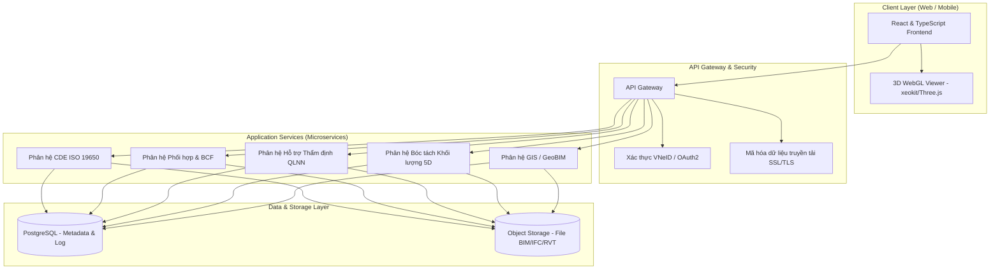
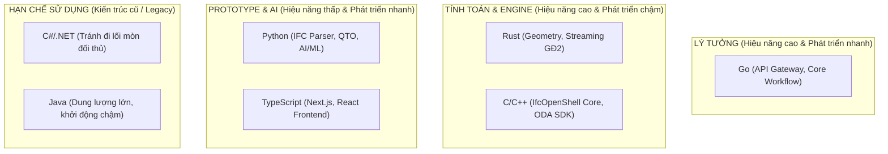
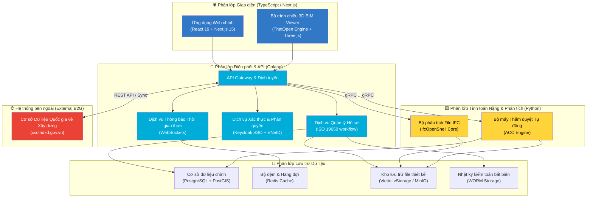
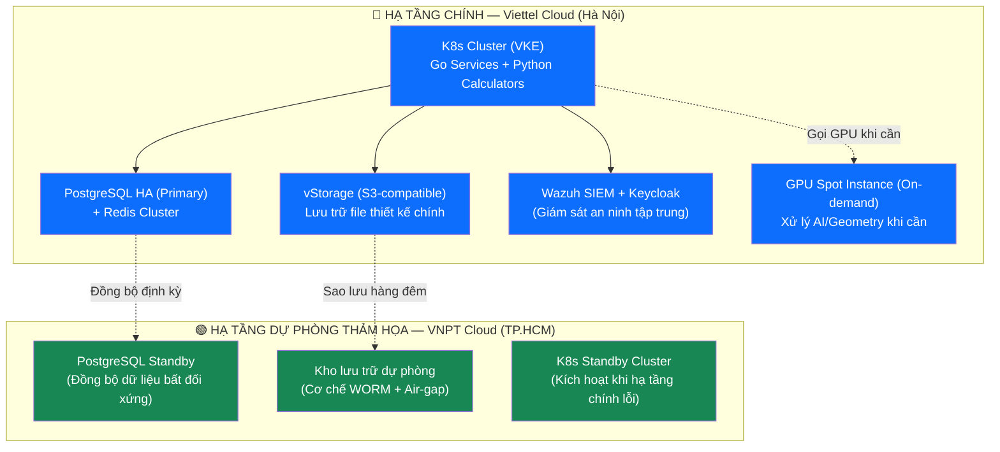
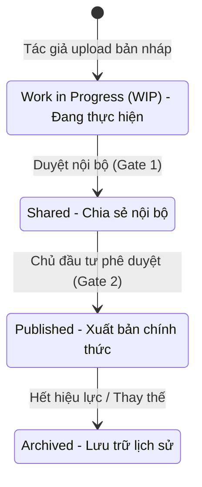
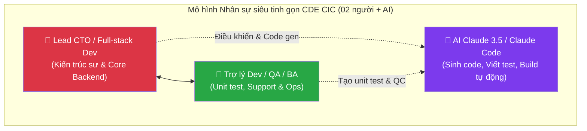

# Báo cáo Nghiên cứu Khả thi Dự án CDE CIC
## Đề án Nghiên cứu Công nghệ, Thiết kế Kiến trúc và Kế hoạch Thương mại hóa Nền tảng CDE

> **Ngày lập báo cáo:** 08/06/2026  
> **Đơn vị thực hiện:** Công ty Cổ phần Công nghệ và Tư vấn CIC  
> **Mục đích:** Đánh giá toàn diện năng lực công nghệ của các đối thủ trong nước và quốc tế, từ đó đề xuất mô hình kiến trúc, phương án nhân sự tối ưu hóa bằng AI, dự toán tài chính 5 năm và lộ trình triển khai chi tiết cho hệ thống CDE CIC trước khi ra quyết định đầu tư.

---

## Chương 1: Mở đầu & Tóm tắt Dự án (Executive Summary)

### 1.1. Bối cảnh & Lý do đầu tư

#### 1.1.1. Bối cảnh pháp lý và xu hướng công nghệ
Trong những năm gần đây, việc áp dụng Mô hình thông tin công trình (BIM - Building Information Modeling) đã trở thành xu thế bắt buộc nhằm tối ưu hóa chi phí, thời gian và chất lượng trong hoạt động xây dựng toàn cầu. Tại Việt Nam, sau giai đoạn triển khai theo Quyết định số 258/QĐ-TTg của Thủ tướng Chính phủ, Quốc hội đã ban hành **Luật Xây dựng số 135/2025/QH15** ngày 10/12/2025 (quy định tại Điều 7 và Điều 14 về bắt buộc ứng dụng khoa học công nghệ, chuyển đổi số, mô hình BIM và xây dựng hệ thống cơ sở dữ liệu quốc gia về xây dựng), làm nền tảng pháp lý cao nhất cho chuyển đổi số ngành xây dựng. Cụ thể hóa Luật, Chính phủ đã ban hành **Nghị định số 217/2026/NĐ-CP quy định chi tiết một số điều của Luật Xây dựng về quản lý hoạt động xây dựng** (đã ban hành ngày 15/6/2026), trong đó **Điều 8** quy định bắt buộc áp dụng BIM cho công trình xây dựng mới từ **cấp II trở lên**, đồng thời yêu cầu Chủ đầu tư thiết lập và vận hành **Môi trường dữ liệu chung (CDE)** để quản lý, lưu trữ tập tin gốc của mô hình BIM, phục vụ công tác quản lý thông tin, kiểm tra xung đột và hỗ trợ bóc tách khối lượng (QTO) phục vụ lập dự toán, quản lý chi phí đầu tư xây dựng.

Để hiện thực hóa lộ trình pháp lý trên, việc thiết lập một Môi trường dữ liệu chung (CDE - Common Data Environment) là yêu cầu kỹ thuật tiên quyết. CDE đóng vai trò là hạ tầng dữ liệu số trung tâm, lưu trữ, quản lý và điều phối toàn bộ thông tin của dự án xây dựng từ giai đoạn chuẩn bị, thiết kế, thi công đến bàn giao vận hành.

#### 1.1.2. Cơ sở thực tiễn và cơ hội thương mại từ Mạng lưới tư vấn BIM CIC
Quyết định đầu tư xây dựng nền tảng CDE CIC của Ban Lãnh đạo CIC không chỉ dựa trên xu hướng pháp lý mà còn được bảo đảm vững chắc bởi dữ liệu thực tế hoạt động kinh doanh của công ty thông qua **Báo cáo đánh giá tổng hợp mạng lưới tư vấn BIM (Trung tâm BIM)** tính đến tháng 6/2026:

1. **Thị trường sẵn có và tệp khách hàng VIP trung thành**:
   - CIC đang sở hữu mạng lưới khách hàng BIM cực kỳ lớn và thực chất, với **78 hợp đồng** dịch vụ tư vấn BIM đã ký kết, tổng giá trị hợp đồng đạt **66.13 tỷ VND** (doanh thu thuần trước thuế đạt 60.12 tỷ VND).
   - Đáng chú ý, **khối Chủ đầu tư công và Doanh nghiệp Nhà nước (B2G) chiếm tỷ trọng lớn nhất với 48.4%** tổng giá trị hợp đồng (HUD, Viglacera, Tổng công ty 319, và các Ban quản lý dự án trọng điểm). Đây chính là nhóm đối tượng bắt buộc phải tuân thủ Luật Xây dựng mới và quy chuẩn QCVN 12:2026/BCA.
   - Uy tín chuyên môn của CIC được khẳng định bằng tỷ lệ khách hàng quay lại rất cao: chỉ **20.8% số lượng khách hàng quay lại (từ 2 hợp đồng trở lên) nhưng đã mang lại tới 60.8% tổng doanh số** mảng BIM của công ty (tiêu biểu như Ban QLDA Dân dụng TP.HCM với 13 hợp đồng trị giá 8.08 tỷ VND, Stellar với 3 hợp đồng trị giá 8.48 tỷ VND, Ban Dân Dụng Hà Nội với 4 hợp đồng trị giá 7.56 tỷ VND...).
   - Việc có sẵn một tệp khách hàng VIP và khối lượng hợp đồng lớn giúp CDE CIC có ngay một lượng người dùng thực tế khổng lồ khi ra mắt, đảm bảo khả năng thương mại hóa nhanh chóng.

2. **Khắc phục tình trạng phụ thuộc phần mềm ngoại bang và rò rỉ lợi nhuận (Profit Leakage)**:
   - Hiện tại, CIC đang phân phối các giải pháp CDE ngoại nhập như Autodesk ACC, BIMcollab, Bentley ProjectWise, Trimble Connect với sản phẩm tiêu thụ tốt (doanh số đạt hơn 1.69 tỷ VND cho 23 licenses lớn nhỏ).
   - Tuy nhiên, việc reselling phần mềm ngoại chỉ mang lại biên lợi nhuận gộp thương mại trung bình **21% - 25%**, trong khi mảng dịch vụ tư vấn BIM của CIC có biên lợi nhuận gộp quản trị thực tế lên tới **36.36%** (lợi nhuận gộp quản trị đạt hơn 24 tỷ VND).
   - Quan trọng hơn, toàn bộ CDE ngoại (như Autodesk ACC) đều lưu trữ dữ liệu tại cloud nước ngoài (US Cloud), trực tiếp vi phạm quy chuẩn an ninh mạng quốc gia **QCVN 12:2026/BCA** (buộc phải lưu trữ máy chủ trong nước đối với khối đầu tư công).
   - Đầu tư xây dựng CDE CIC (đặt trên hạ tầng Viettel Cloud nội địa) sẽ giúp CIC giữ lại 100% dòng doanh thu SaaS, loại bỏ rủi ro bảo mật cho khách hàng B2G và tạo động lực tăng trưởng đột phá nhờ mô hình bán chéo (bundle): **Dịch vụ tư vấn BIM + Bản quyền CDE CIC**.

3. **Giải quyết điểm nghẽn chi phí nhân sự triển khai**:
   - Báo cáo chỉ ra chi phí triển khai thực tế của Trung tâm BIM chiếm tới 55.4% tổng giá trị hợp đồng, trong đó **phí thuê chuyên gia bên ngoài chiếm tới 55.7%** tổng chi phí.
   - Hệ thống CDE CIC tích hợp các công cụ tự động hóa R&D và động cơ AI bóc tách khối lượng (QTO) sẽ hỗ trợ đội ngũ tư vấn tự động hóa các tác vụ lặp đi lặp lại, nâng cao tỷ lệ tự thực hiện của nhân sự cơ hữu, từ đó tối ưu hóa cơ cấu chi phí dịch vụ và gia tăng biên lợi nhuận gộp cho CIC.

Từ những cơ sở thực tiễn trên, việc phát triển CDE mang thương hiệu Việt Nam (CDE CIC) là bước đi chiến lược, cấp thiết để CIC bảo vệ tệp khách hàng VIP sẵn có, khai thác phân khúc B2G màu mỡ trước các quy định an ninh mới, và tối ưu hóa hiệu quả tài chính doanh nghiệp.

#### 1.1.3. CDE - "Bộ não" trung tâm hội tụ của Bản sao số (Digital Twin)
Trong kỷ nguyên số hóa ngành xây dựng và quản lý đô thị thông minh, một Bản sao số (Digital Twin) thực sự không thể tồn tại nếu thiếu đi một Môi trường dữ liệu chung (CDE). CDE đóng vai trò là "bộ não" trung tâm, nơi hội tụ và đồng bộ hóa ba trụ cột công nghệ cốt lõi:
1. **BIM (Building Information Modeling)**: Cung cấp thông tin hình học 3D chi tiết, thuộc tính kỹ thuật và vòng đời cấu kiện của toàn bộ công trình từ thiết kế đến thi công.
2. **GIS (Geographic Information System)**: Định vị công trình trong không gian địa lý, cung cấp bối cảnh môi trường, dữ liệu địa hình, bản đồ số và kết nối hạ tầng kỹ thuật đô thị xung quanh.
3. **IoT (Internet of Things)**: Truyền dữ liệu telemetry thời gian thực từ các cảm biến đo đạc (nhiệt độ, độ ẩm, ứng suất kết cấu, điện năng tiêu thụ, lưu lượng người và thiết bị vận hành).

Sự tích hợp chặt chẽ này biến CDE từ một kho lưu trữ tài liệu đơn thuần thành một hệ điều hành bản sao số sống động. Mọi biến động vật lý ngoài thực địa được cảm biến IoT ghi nhận, định vị chính xác trên không gian GIS và phản ánh trực quan trên mô hình BIM của CDE. Đây chính là nền tảng cốt lõi để hiện thực hóa các giải pháp quản lý đô thị thông minh, tối ưu hóa bảo trì dự phòng (predictive maintenance) và mô phỏng phản ứng sự cố trong thời gian thực.

### 1.2. Mục tiêu chiến lược và Định hướng phát triển CDE CIC
Để định hình rõ nét vai trò và hướng đi của dự án, Ban chỉ đạo R&D xác lập các mục tiêu và định hướng phát triển cụ thể của CDE CIC như sau:

1. **Mục tiêu ngắn hạn (1 - 2 năm)**:
   - **Tự chủ công nghệ 100%**: Phát triển hoàn chỉnh hệ thống quản lý dữ liệu bản vẽ, mô hình BIM và luồng phê duyệt theo tiêu chuẩn ISO 19650, thay thế hoàn toàn phần mềm ngoại nhập.
   - **Thương mại hóa nhanh**: Chuyển đổi tối thiểu 30% tệp khách hàng BIM hiện tại sang sử dụng bản quyền CDE CIC, tạo nguồn doanh thu SaaS ổn định.
   - **Chứng nhận an ninh QCVN 12**: Hoàn thành thủ tục đánh giá độc lập và nhận giấy chứng nhận hợp quy QCVN 12:2026/BCA của Cục A05 (Bộ Công an) cho hạ tầng Viettel Cloud trong vòng 12 tháng kể từ khi vận hành thử nghiệm.
   - **Liên thông dữ liệu quốc gia**: Tích hợp liên thông trực tiếp với Cổng NDXP/LGSP quốc gia và API của Bộ Xây dựng (`csdlhdxd.gov.vn`), phục vụ công tác nộp file mô hình thiết kế, thẩm định quy hoạch và cấp phép xây dựng số (Ưu tiên thực hiện sớm để tạo lợi thế cạnh tranh B2G).

2. **Mục tiêu dài hạn (3 - 5 năm)**:
   - **Số 1 phân khúc B2G**: Trở thành nền tảng CDE tiêu chuẩn được lựa chọn hàng đầu bởi các Ban Quản lý dự án trọng điểm, các Sở Xây dựng và doanh nghiệp nhà nước tại Việt Nam.
   - **Bộ não đô thị thông minh (GeoBIM Digital Twin)**: Phát triển CDE của CIC thành nền tảng lõi và bộ não Digital Twin phục vụ thí điểm bảo tồn di sản, quản lý quy hoạch và phát triển đô thị thông minh tại các thành phố trực thuộc trung ương thí điểm Digital Twin theo Nghị quyết số 57/NQ-CP của Chính phủ.

3. **Định hướng phát triển sản phẩm**:
   - **Chủ quyền dữ liệu**: Đặt toàn bộ hệ thống trên hạ tầng đám mây nội địa (Viettel Cloud), bảo đảm an toàn thông tin cấp độ 3 và tuân thủ tuyệt đối quy định lưu trữ dữ liệu quốc gia.
   - **Mở rộng dựa trên OpenBIM**: Tuân thủ tuyệt đối định dạng file mở IFC (OpenBIM), cung cấp hệ thống API mở (REST, gRPC) để dễ dàng tích hợp với các hệ thống ERP doanh nghiệp và phần mềm quản lý đầu tư công khác.
   - **Tập trung dữ liệu & Khai thác tài sản số**: Định vị CDE là nền tảng tập trung dữ liệu toàn diện của dự án xây dựng, tối ưu hóa lưu trữ, quản lý vòng đời tài liệu và khai thác hiệu quả tài sản số (digital assets) kết hợp trợ lý ảo AI để hỗ trợ phát triển, sinh test tự động và quản trị vận hành hệ thống.


### 1.3. Mục đích báo cáo
Báo cáo này phân tích sâu sắc cấu trúc công nghệ của các giải pháp CDE nội địa (NovaCDE, VinaCDE, BuildTab,...) và quốc tế (Autodesk Construction Cloud, Trimble Connect,...), từ đó kiến nghị:
* Mô hình kiến trúc phần mềm tối ưu dựa trên nền tảng Go + Python + TypeScript.
* Mô hình hạ tầng đám mây bảo mật cao Dual-Cloud (Viettel Cloud làm Primary, VNPT làm DR) tuân thủ QCVN 12.
* Mô hình nhân sự siêu tinh gọn phối hợp AI (Mô hình AI-Conductor), gồm đúng 02 nhân sự cốt lõi (CTO kiêm Developer chính và 01 Trợ lý Dev/QA/BA) làm việc cùng AI Claude để tối ưu hóa tối đa chi phí.
* Dự toán tài chính chi tiết trong vòng 5 năm (CAPEX = 0 VNĐ, OPEX 5 năm = 33,30 tỷ VNĐ) và lộ trình triển khai cụ thể theo Sprint.

### 1.4. Khuyến nghị kỹ thuật then chốt
* **Định dạng lưu trữ mở & Engine độc lập**: Sử dụng IFC 4.0 làm định dạng dữ liệu hình học cốt lõi (OpenBIM), kết hợp ThatOpen Engine render trực tiếp trên trình duyệt bằng WebGL/WebGPU để loại bỏ sự phụ thuộc vào các engine thương mại đắt đỏ của nước ngoài.
* **R&D mô hình AI-Conductor & Khai thác dữ liệu**: Phát triển mô hình AI-Conductor giúp tối ưu hóa nhân sự tối đa còn 2 người, sử dụng AI thế hệ mới để hỗ trợ viết code, tạo kịch bản kiểm thử, và tự động hóa quy trình nghiệp vụ.
* **Tuân thủ Quy chuẩn QCVN 12/BCA**: Thiết lập hệ thống lưu trữ hoàn toàn trên đám mây nội địa (Viettel Cloud), tích hợp định danh VNeID SSO và cơ chế ghi log bất biến (Immutable WORM logging) để đáp ứng tuyệt đối các yêu cầu về an ninh mạng quốc gia phục vụ khối đầu tư công (B2G).

---

## Chương 2: Khung Pháp lý, Quy chuẩn & Yêu cầu Tuân thủ Quốc gia (National Regulatory & Compliance Framework)

Giai đoạn cuối năm 2025 và giữa năm 2026 đánh dấu bước ngoặt lịch sử khi Nhà nước Việt Nam ban hành đồng loạt **Luật Xây dựng mới** cùng **5 Nghị định cốt lõi** hướng dẫn thi hành, chính thức luật hóa mô hình thông tin công trình (BIM) và Cơ sở dữ liệu quốc gia về hoạt động xây dựng. Chương này tổng hợp đầy đủ các căn cứ pháp lý then chốt làm nền tảng cho toàn bộ đề xuất kỹ thuật, kinh doanh và vận hành của CDE CIC.

### 2.1. Tổng quan Hành lang Pháp lý Số hóa Ngành Xây dựng (2025-2026)

| # | Văn bản pháp lý | Ngày ban hành | Phạm vi điều chỉnh chính | Ý nghĩa với CDE CIC |
|:---:|:---|:---:|:---|:---|
| 1 | **Luật Xây dựng số 135/2025/QH15** | 10/12/2025 | Luật hóa BIM, CSDL quốc gia về XD | Nền tảng pháp lý gốc cho số hóa ngành XD |
| 2 | **Nghị định số 217/2026/NĐ-CP** | 15/06/2026 | Quản lý hoạt động XD, BIM bắt buộc | Mandate BIM + CDE cho công trình cấp I+ |
| 3 | **Nghị định số 212/2026/NĐ-CP** | 17/06/2026 | CSDL quốc gia, năng lực hoạt động XD | Hạ tầng CNTT, AI, liên thông dữ liệu |
| 4 | **Nghị định số 207/2026/NĐ-CP** | 19/06/2026 | Quản lý chất lượng công trình XD | BIM trong thi công, nghiệm thu |
| 5 | **Nghị định số 210/2026/NĐ-CP** | 19/06/2026 | Hợp đồng xây dựng | Hợp đồng tư vấn BIM hợp pháp |
| 6 | **Nghị định số 206/2026/NĐ-CP** | 15/06/2026 | Quản lý chi phí đầu tư XD | Định mức giá, chi phí CNTT trong dự toán |
| 7 | **Thông tư số 47/2026/TT-BCA** | 2026 | QCVN 12:2026/BCA về an ninh mạng | Quy chuẩn an ninh hạ tầng Cloud nội địa |

### 2.2. BIM được Luật hóa — Luật Xây dựng số 135/2025/QH15

Luật Xây dựng số 135/2025/QH15 được Quốc hội thông qua ngày 10/12/2025 đã chính thức đưa **mô hình thông tin công trình (BIM)** vào hệ thống pháp luật quốc gia:

* **Điểm b Khoản 3 Điều 7** — Chính sách phát triển của Nhà nước: Quy định ưu tiên ứng dụng công nghệ thông tin, chuyển đổi số, đổi mới sáng tạo và **mô hình thông tin công trình (BIM)** trong hoạt động xây dựng nhằm nâng cao hiệu quả quản lý đầu tư xây dựng.
* **Điều 14** — Hệ thống thông tin và Cơ sở dữ liệu quốc gia về hoạt động xây dựng: Quy định cụ thể việc xây dựng CSDL quốc gia làm **tham chiếu gốc** phục vụ các thủ tục hành chính, quy hoạch, rà soát giá và định mức xây dựng.

> **Ý nghĩa**: CDE CIC không còn là giải pháp "nice-to-have" mà trở thành **công cụ đáp ứng chính sách phát triển quốc gia**, phục vụ trực tiếp mục tiêu chuyển đổi số ngành xây dựng theo Luật.

### 2.3. BIM Bắt buộc & CDE Mandate — Nghị định số 217/2026/NĐ-CP

Nghị định số 217/2026/NĐ-CP (ban hành ngày 15/06/2026) quy định chi tiết một số điều của Luật Xây dựng về quản lý hoạt động xây dựng. Đây là văn bản **quan trọng nhất** đối với CDE CIC vì trực tiếp mandate việc áp dụng BIM và CDE:

* **Điều 8 Khoản 1 Điểm a** — BIM bắt buộc: Quy định bắt buộc áp dụng mô hình thông tin công trình (BIM) đối với **các công trình xây dựng mới từ cấp II trở lên**.
* **Điều 8 Khoản 3 Điểm a** — Định dạng mở: Yêu cầu sử dụng **định dạng IFC (Industry Foundation Classes)** hoặc định dạng mở tương đương khi nộp mô hình BIM, đảm bảo tính liên thông và không phụ thuộc vào phần mềm độc quyền.
* **Điều 8 Khoản 4** — CDE bắt buộc: Yêu cầu Chủ đầu tư thiết lập và vận hành **Môi trường dữ liệu chung (CDE)** để quản lý, lưu trữ tập tin gốc của mô hình BIM đối với công trình **cấp I trở lên thuộc dự án đầu tư công**. Các cấp công trình khác được **khuyến khích** áp dụng.
* **Điều 8 Khoản 5 Điểm b** — Số hóa hồ sơ: BIM có thể **thay thế hồ sơ giấy** truyền thống khi đáp ứng điều kiện pháp lý về chữ ký số.
* **Điều 8 Khoản 5 Điểm đ** — Nộp BIM hoàn công: Chủ đầu tư phải thực hiện việc **cập nhật mô hình BIM hoàn công đã được chuẩn hóa vào Cơ sở dữ liệu quốc gia** về hoạt động xây dựng.
* **Điều 8 Khoản 5 Điểm c** — Thẩm định bằng dữ liệu BIM: Cho phép và khuyến khích cơ quan chuyên môn về xây dựng sử dụng dữ liệu BIM để phục vụ công tác thẩm định thiết kế cơ sở và kiểm tra nghiệm thu. Nội dung thẩm định bằng dữ liệu BIM bao gồm: vị trí, hình khối, kích thước chủ yếu; phương án kiến trúc, kết cấu chính; tổ chức không gian, hệ thống kỹ thuật; kiểm tra sự tuân thủ quy chuẩn kỹ thuật, tiêu chuẩn áp dụng; kiểm tra xung đột kỹ thuật và trích xuất các chỉ tiêu chủ yếu.

> **Ý nghĩa**: NĐ 217 tạo ra **thị trường bắt buộc** cho CDE CIC tại phân khúc B2G — mọi công trình cấp I trở lên của dự án đầu tư công đều **phải có CDE**. Đặc biệt, quy định tại **Khoản 5 Điểm c Điều 8** mở ra cơ hội thương mại cực lớn cho CIC trong việc cung cấp **Phân hệ hỗ trợ thẩm định tự động** cho các Sở Xây dựng và cơ quan chuyên môn về xây dựng cấp Bộ/tỉnh, trực tiếp phục vụ công tác thẩm định thiết kế cơ sở không dùng giấy theo lộ trình chuyển đổi số quốc gia.

### 2.4. CSDL Quốc gia & Hạ tầng CNTT Số — Nghị định số 212/2026/NĐ-CP

Nghị định số 212/2026/NĐ-CP (ban hành ngày 17/06/2026) quy định về Hệ thống thông tin và Cơ sở dữ liệu quốc gia về hoạt động xây dựng:

* **Khoản 3 Điều 4** — Hệ thống vận hành tập trung: CSDL quốc gia vận hành tại địa chỉ `https://csdlhdxd.gov.vn`, bao gồm các cấu phần cơ sở dữ liệu, hạ tầng kỹ thuật CNTT và **điện toán đám mây**.
* **Điểm c Khoản 5 Điều 4** — AI & Dữ liệu lớn: Quy định ứng dụng các nền tảng **phân tích dữ liệu lớn và trí tuệ nhân tạo (AI)** phục vụ quản lý nhà nước, trên cơ sở dữ liệu được chuẩn hóa, liên thông và cập nhật theo thời gian thực.
* **Điều 6** — Cơ chế kết nối và chia sẻ: Quy định cơ chế thu thập, đồng bộ dữ liệu dự án, công trình, quy hoạch, định mức giá và năng lực hoạt động xây dựng từ các bộ, ngành, địa phương.

> **Ý nghĩa**: CDE CIC cần tích hợp **cổng API liên thông** với `csdlhdxd.gov.vn` từ thiết kế ban đầu để đáp ứng yêu cầu đồng bộ dữ liệu dự án theo NĐ 212.

### 2.5. BIM trong Thi công & Nghiệm thu — Nghị định số 207/2026/NĐ-CP

Nghị định số 207/2026/NĐ-CP (ban hành ngày 19/06/2026) quy định chi tiết về quản lý chất lượng công trình xây dựng:

* **Điểm a Khoản 1 Điều 11** — Ứng dụng BIM: Quy định quyền thỏa thuận của chủ đầu tư và nhà thầu trong việc **lựa chọn ứng dụng giải pháp CNTT, mô hình thông tin công trình (BIM) để quản lý thi công, quản lý chất lượng, nghiệm thu và bàn giao công trình xây dựng**.
* **Điểm b Khoản 1 Điều 11** — Số hóa hồ sơ hoàn công: Quy định **lập hồ sơ hoàn thành công trình dưới dạng tập tin điện tử**, mở ra xu hướng số hóa 100% hồ sơ hoàn công.

> **Ý nghĩa**: NĐ 207 mở ra thị trường **as-built BIM** và **số hóa hồ sơ hoàn công** — đây chính là phân hệ quản lý tài liệu (Document Management) của CDE CIC.

### 2.6. Hợp đồng Tư vấn BIM & Quản lý Chi phí — Nghị định số 210 & 206/2026

#### Nghị định số 210/2026/NĐ-CP — Hợp đồng xây dựng:
* **Điểm a Khoản 2 Điều 8** — Tư vấn BIM hợp pháp: Quy định cụ thể việc đưa công việc **"tư vấn lập mô hình thông tin công trình (BIM)"** vào nội dung và phạm vi công việc cấu thành của một **hợp đồng tư vấn xây dựng hợp pháp**, thiết lập hành lang chi phí chính thức cho các dự án B2G.

#### Nghị định số 206/2026/NĐ-CP — Quản lý chi phí đầu tư xây dựng:
* **Khoản 6 Điều 3** — Cập nhật CSDL: Hệ thống giá, định mức xây dựng, chỉ số giá do cơ quan nhà nước ban hành, công bố được **cập nhật vào Hệ thống thông tin, CSDL quốc gia** về hoạt động xây dựng.
* **Điều 26 Khoản 2** — Chi phí CNTT trong tư vấn: Chi phí tư vấn xây dựng bao gồm **"chi phí ứng dụng khoa học công nghệ, quản lý hệ thống thông tin công trình"** — đây là **cơ sở pháp lý trực tiếp** để chi phí phần mềm CDE/BIM được tính hợp pháp vào dự toán tư vấn xây dựng.
* **Điều 37** — Định mức xây dựng: Hỗ trợ luận điểm rằng chi phí CDE CIC có thể được Chủ đầu tư đưa vào dự toán hợp pháp.

> **Ý nghĩa**: CDE CIC vừa là **công cụ thực hiện** vừa là **đối tượng hưởng lợi** từ hành lang pháp lý. Chi phí triển khai CDE CIC có căn cứ pháp lý rõ ràng để được Chủ đầu tư đưa vào dự toán dự án đầu tư công.

### 2.7. Sở hữu Trí tuệ đối với Mã nguồn do AI tạo ra

Theo quy định hiện hành, mã nguồn do AI tự động sinh ra không được bảo hộ bản quyền tác giả trực tiếp. Do đó, quy trình phát triển của CDE CIC quy định:
* Toàn bộ mã nguồn do AI gợi ý phải được các kỹ sư công nghệ của dự án rà soát, tinh chỉnh và tích hợp thủ công.
* Nhật ký mã nguồn (Git commit) phải do tài khoản định danh của kỹ sư thuộc CIC thực hiện.
* Hợp đồng lao động quy định rõ điều khoản chuyển nhượng toàn bộ quyền sở hữu trí tuệ đối với mọi sản phẩm code tạo ra trong quá trình làm việc cho CIC (Work for Hire), đảm bảo tính pháp lý vững chắc cho tài sản công nghệ của CIC.

Theo quy định pháp lý quốc tế về sở hữu trí tuệ phần mềm, việc giao tiếp giữa hai hệ thống độc lập qua giao thức mạng tiêu chuẩn (API/gRPC JSON) không cấu thành hành vi tạo tác phẩm phái sinh (derivative work), do đó phần logic nghiệp vụ chạy ở backend của CDE CIC hoàn toàn được bảo hộ độc quyền 100%.

### 2.8. Đảm bảo Chủ quyền Dữ liệu số & An ninh mạng Quốc gia

CDE CIC phục vụ phân khúc B2G (dự án đầu tư công) phải tuân thủ nghiêm ngặt các quy chuẩn an ninh quốc gia:

* **QCVN 12:2026/BCA** (ban hành kèm Thông tư số 47/2026/TT-BCA): Quy chuẩn kỹ thuật quốc gia về an ninh mạng đối với hệ thống thông tin. CDE CIC đặt hạ tầng Cloud hoàn toàn trong nước (Viettel Cloud + VNPT Cloud) để đáp ứng tuyệt đối.
* **Luật Dữ liệu số 60/2024/QH15**: Tuân thủ quy định bảo vệ dữ liệu lớn trong hệ sinh thái xây dựng.
* **Luật Bảo vệ Dữ liệu cá nhân số 91/2025/QH15**: Bảo vệ thông tin cá nhân của người dùng hệ thống (nhân sự ban quản lý dự án, kỹ sư thi công).

> **Giải pháp kỹ thuật tương thích**:
> * Mô hình Dual-Cloud (Viettel Cloud làm chính, VNPT làm dự phòng) đảm bảo chủ quyền dữ liệu đặt hoàn toàn tại Việt Nam.
> * Cơ chế ghi nhật ký kiểm toán bất biến (Audit Trail WORM) chống giả mạo, đáp ứng QCVN 12.
> * Tích hợp cổng API mở (REST/gRPC) sẵn sàng kết nối trực tiếp với Cổng CSDL quốc gia tại `https://csdlhdxd.gov.vn`.

---


## Chương 3: Phân tích Thị trường & Đối thủ Cạnh tranh (Market & Competitor Analysis)

### 3.1a. Tổng quan đối thủ Việt Nam

Do tính chất phân khúc thị trường có sự khác biệt rõ rệt giữa giải pháp nội địa và quốc tế, bảng tổng hợp tech stack các đối thủ Việt Nam được trình bày dưới đây để thuận tiện cho việc so sánh và đánh giá:

Do tính chất phân khúc thị trường có sự khác biệt rõ rệt giữa giải pháp nội địa và quốc tế, bảng tổng hợp tech stack được chia làm hai phần để thuận tiện cho việc so sánh và đánh giá:

#### Bảng 3.1a: So sánh Tech Stack các CDE Việt Nam & CDE CIC (Đề xuất)

| Tiêu chí | **NovaCDE** (Hài Hòa) | **VinaCDE** (TGL Solutions) | **BuildTab CDE+** | **BIMNEXT** (DP Unity) | **ADSCivil CDE** (Baezeni) | **CDE CIC** (Đề xuất) |
|----------|:---:|:---:|:---:|:---:|:---:|:---:|
| **Giải thưởng** | Sao Khuê 2024 | Sao Khuê 2025 | — | — | — | — |
| **Kiến trúc** | Microservices, Cloud | Cloud-based | Cloud-based | Cloud-based, Web | Cloud-based | **Polyglot Microservices** |
| **3D/BIM Engine** | ODA SDK (Thương mại) | Tự phát triển | Autodesk APS (Forge) | Tự phát triển | Tự phát triển | **Hybrid (ThatOpen + IfcOpenShell)** |
| **Định dạng file** | RVT, DWG, IFC, NWD | IFC, DWG, PDF | Revit, NWD, IFC | Office, PDF, CAD | 30+ định dạng | **IFC, DWG, RVT, PDF, Office** |
| **Backend** | .NET / Java | .NET | .NET / Java | .NET | C++ core + .NET | **Go + Python** |
| **Frontend** | Web-based (SPA) | Web-based (SPA) | Web-based (SPA) | Web-based | Web-based | **React + Next.js (TypeScript)** |
| **ISO 19650** | ✅ Đầy đủ | ✅ Đầy đủ | ✅ Đầy đủ | ⚠️ Cơ bản | ⚠️ Cơ bản | **🎯 Đầy đủ** |
| **GIS/GeoBIM** | ✅ GIS 3D | ❌ | ❌ | ✅ BIM trên GIS | ❌ | **❌ Không phát triển** |
| **4D/5D BIM** | ⚠️ Cơ bản | ❌ | ❌ | ✅ Tiền độ/sản lượng | ❌ | **❌ Không phát triển** |
| **FM (Vận hành)** | ❌ | ❌ | ✅ BuildTab FMs | ❌ | ❌ | **❌ Không phát triển** |
| **AI/ML** | ✅ Phân loại tài liệu | ❌ | ❌ | ❌ | ❌ | **❌ Không phát triển** |
| **API mở** | ✅ REST API | ✅ Hệ sinh thái | ✅ API | ⚠️ Hạn chế | ⚠️ Hạn chế | **🎯 gRPC + REST** |
| **Thị trường** | SME, hạ tầng giao thông | SME, nhà thầu, tư vấn | Enterprise, vận hành | Quản lý dự án | Hạ tầng giao thông | **B2G (PMU, Sở XD), Enterprise** |
| **Hạ tầng Cloud** | VN Cloud | VN Cloud | AWS + VN Cloud | VN Cloud | VN Cloud / Server riêng | **🎯 Viettel Cloud + VNPT Cloud (DR)** |
| **QCVN 12** | ❌ Chưa có | ❌ Chưa có | ⚠️ Khó (AWS) | ❌ Chưa có | ❌ Chưa có | **🎯 Thiết kế tuân thủ từ đầu** |
| **VNeID SSO** | ❌ | ❌ | ❌ | ❌ | ❌ | **🎯 Tích hợp định danh VNeID** |

### 3.1b. Tổng quan đối thủ Quốc tế

Do tính chất phân khúc thị trường có sự khác biệt rõ rệt giữa giải pháp nội địa và quốc tế, bảng tổng hợp tech stack các đối thủ Quốc tế được trình bày dưới đây để thuận tiện cho việc so sánh và đánh giá:

#### Bảng 3.1b: So sánh Tech Stack các CDE Quốc tế & CDE CIC (Đề xuất)

| Tiêu chí | **Autodesk ACC** | **Trimble Connect** | **Bentley ProjectWise** | **BIMcollab** | **CDE CIC** (Đề xuất) |
|----------|:---:|:---:|:---:|:---:|:---:|
| **Quốc gia** | Mỹ | Mỹ | Mỹ | Hà Lan | Việt Nam |
| **Kiến trúc** | Multi-service, Cloud | Cloud-based | Client-Server / Cloud | Cloud-based, SaaS | **Polyglot Microservices** |
| **3D/BIM Engine** | Autodesk APS (Độc quyền) | Trimble 3D Engine | Bentley iModel.js | BIMcollab Viewer | **Hybrid (ThatOpen + IfcOpenShell)** |
| **Định dạng file** | 60+ định dạng | RVT, IFC, DWG, SKP | DGN, RVT, IFC, DWG | IFC, BCF, PDF | **IFC, DWG, RVT, PDF, Office** |
| **Backend** | Java, Go, .NET, Python | .NET (C#) | .NET + C++ core | .NET (C#) | **Go + Python** |
| **Frontend** | React + TypeScript | JavaScript / TypeScript | Angular + TypeScript | React + TypeScript | **React + Next.js (TypeScript)** |
| **ISO 19650** | ✅ Đầy đủ | ✅ Đầy đủ | ✅ Đầy đủ | ✅ Đầy đủ | **🎯 Đầy đủ** |
| **GIS/GeoBIM** | ✅ Tích hợp Esri | ✅ Tích hợp GIS | ✅ Cực mạnh (iModel) | ⚠️ Hạn chế | **❌ Không phát triển** |
| **4D/5D BIM** | ✅ Autodesk Takeoff | ✅ Trimble Gecat | ✅ Bentley Synchro | ❌ | **❌ Không phát triển** |
| **FM (Vận hành)** | ✅ Autodesk Tandem | ✅ Trimble FM | ✅ Bentley AssetWise | ❌ | **❌ Không phát triển** |
| **AI/ML** | ✅ Autodesk AI | ⚠️ Hạn chế | ✅ Bentley AI | ❌ | **❌ Không phát triển** |
| **Hạ tầng Cloud** | AWS (Global) | AWS + Azure | Azure (Global) | Azure (EU) | **🎯 Viettel Cloud + VNPT Cloud (DR)** |
| **QCVN 12** | ❌ Không đạt (US Cloud) | ❌ Không đạt (US Cloud) | ❌ Không đạt (US Cloud) | ❌ Không đạt (EU Cloud) | **🎯 Thiết kế tuân thủ từ đầu** |
| **Liên thông NDXP**| ❌ | ❌ | ❌ | ❌ | **🎯 Hỗ trợ liên thông LGSP/NDXP** |
| **VNeID SSO** | ❌ | ❌ | ❌ | ❌ | **🎯 Tích hợp định danh VNeID** |

---

### 3.2. Phân tích chi tiết đối thủ Việt Nam


##### Bảng 3.2: Ma trận Phân tích Chi tiết các Đối thủ CDE Nội địa tại Việt Nam

| Đối thủ (Nhà phát triển) | Hệ sinh thái & Thị trường mục tiêu | Các Tính năng chính nổi bật | Điểm mạnh (Cần học hỏi) | Điểm yếu (Cơ hội CDE-CIC khai thác) |
| :--- | :--- | :--- | :--- | :--- |
| **NovaCDE**<br>*(Harmony AT)* | • Hệ sinh thái thiết kế hạ tầng Nova.<br>• Phân khúc: Giao thông & Hạ tầng công cộng (Hội thảo cùng TEDI). | • Quản lý tài liệu dự án.<br>• Viewer 3D trực tuyến (DWG, IFC).<br>• Tích hợp dữ liệu Point Cloud & 3D GIS.<br>• Kết nối hệ thống CMMS. | • Thương hiệu uy tín >25 năm thiết kế hạ tầng.<br>• Lợi thế bán kèm (bundle) với phần mềm thiết kế đường Nova để khóa khách hàng. | • Chưa đạt QCVN 12, chưa liên thông NDXP/LGSP & định danh VNeID.<br>• Chưa có phân hệ dự toán 5D theo định mức BXD.<br>• Phụ thuộc ODA SDK tốn chi phí bản quyền lõi. |
| **VinaCDE**<br>*(TGL Solutions)* | • Hệ sinh thái VCC (VinaCAD, VinaBuild, ONSITER).<br>• Phân khúc: Nhà thầu, đơn vị tư vấn SME. | • Dashboard, Files, Issues, RFIs, Submittals.<br>• Quy trình 4 trạng thái ISO 19650.<br>• Tích hợp Revit, AutoCAD, Tekla. | • VinaCAD miễn phí tạo phễu khách hàng lớn.<br>• Quy trình bản địa hóa tốt nhờ IDD Việt Nam tư vấn.<br>• Định giá Standard/Premium rất rẻ và minh bạch. | • Chưa tích hợp BIM-GIS, thiếu phân hệ 4D/5D và FM.<br>• Engine hiển thị 3D tự phát triển hiệu năng hạn chế với mô hình lớn.<br>• Chưa đạt QCVN 12, chưa liên thông NDXP/LGSP & VNeID. |
| **BuildTab**<br>*(BuildTab Vietnam)* | • Sản phẩm BuildTab CDE+ và BuildTab FMs.<br>• Phân khúc: Chủ đầu tư, đơn vị quản lý vận hành tòa nhà. | • Quản lý tài sản chuyên sâu chuẩn COBie.<br>• QR code thiết bị, bảo trì phòng ngừa.<br>• Tích hợp Power BI. | • Phân hệ quản lý tài sản, thiết bị (FM/EAM/CMMS) chuyên sâu nhất trong nhóm nội địa. | • **Phụ thuộc Autodesk APS (Forge)** để hiển thị 3D $
ightarrow$ Đẩy dữ liệu ra máy chủ AWS nước ngoài, **không đáp ứng QCVN 12** cho đầu tư công.<br>• Chưa liên thông NDXP/LGSP & VNeID. |
| **BIMNEXT**<br>*(DP Unity)* | • Nền tảng BIMNEXT 3.0.<br>• Phân khúc: Nhà thầu thi công, giám sát sản lượng hiện trường. | • BIM 4D/5D gắn tiến độ Gantt với đơn giá hợp đồng.<br>• Tích hợp phần cứng quan trắc IoT. | • Mạnh nhất về quản lý thi công, sản lượng giải ngân thực tế tại công trường.<br>• Tích hợp IoT tốt cho Digital Twin. | • Phân hệ quản lý tài liệu ISO 19650 ở mức cơ bản.<br>• Engine hiển thị 3D chưa tối ưu.<br>• Chưa đạt QCVN 12, chưa liên thông NDXP/LGSP & VNeID. |
| **ADSCivil CDE**<br>*(Baezeni)* | • Hệ sinh thái thiết kế hạ tầng ADSCivil.<br>• Phân khúc: Đơn vị tư vấn giao thông (vd Tư vấn Trường Sơn). | • Quản lý tài liệu 4 trạng thái ISO 19650.<br>• Tích hợp BIM-GIS cho dự án tuyến.<br>• Bảo mật mã hóa 2 chiều. | • Tích hợp liền mạch với bộ thiết kế hạ tầng ADSCivil, tạo lợi thế bán kèm lớn cho tư vấn giao thông. | • Hệ tính năng hẹp, ít phân hệ mở rộng, khả năng tích hợp yếu.<br>• Chuyên biệt giao thông, hạn chế ở mảng dân dụng/công nghiệp.<br>• Chưa đạt QCVN 12, chưa liên thông NDXP/LGSP & VNeID. |

### 3.3. Phân tích chi tiết đối thủ Quốc tế

#### 3.3.1. Autodesk Construction Cloud (ACC)
Giải pháp hàng đầu thế giới về công nghệ CDE. 
* **Điểm mạnh**: Sở hữu bộ viewer mạnh mẽ hỗ trợ hơn 60 định dạng file, tính năng quản lý vòng đời dự án (từ thiết kế đến thi công) cực kỳ đồng bộ.
* **Điểm yếu**: Chi phí sử dụng quá cao ($60 - $100/user/tháng), không hỗ trợ cài đặt tại chỗ (On-Premise) và lưu trữ dữ liệu tại máy chủ nước ngoài (vi phạm quy định an toàn thông tin của các dự án đầu tư công tại Việt Nam).

#### 3.3.2. Trimble Connect
Sử dụng công nghệ lưu trữ đám mây của AWS và Azure.
* **Điểm mạnh**: Hỗ trợ định dạng file mở IFC cực tốt, giao thức API REST mạnh mẽ, chi phí dễ chịu hơn Autodesk ($25 - $50/user/tháng).
* **Điểm yếu**: Hệ thống phân quyền chưa tối ưu theo sát quy trình phê duyệt tài liệu của Việt Nam, khó khăn trong việc tích hợp định danh công vụ trong nước.

#### 3.3.3. Bentley ProjectWise
Nền tảng CDE lâu đời và uy tín bậc nhất dành cho các dự án hạ tầng quy mô siêu lớn.
* **Điểm mạnh**: Công nghệ Bentley iModel.js cho phép đồng bộ hóa dữ liệu từ nhiều nguồn khác nhau, quản lý mô hình lớn và phức tạp (cầu đường, sân bay, nhà máy điện) cực kỳ ổn định.
* **Điểm yếu**: Chi phí bản quyền cực kỳ đắt đỏ, quy trình triển khai phức tạp và yêu cầu cấu hình phần cứng hạ tầng rất cao.

#### 3.3.4. BIMcollab
Giải pháp chuyên biệt tập trung vào phối hợp và kiểm soát lỗi thiết kế.
* **Điểm mạnh**: Đi đầu về định dạng BCF (BIM Collaboration Format) giúp trao đổi ghi chú lỗi thiết kế giữa các phần mềm thiết kế nhanh chóng.
* **Điểm yếu**: Hệ tính năng hẹp (chủ yếu phục vụ thiết kế phối hợp), thiếu các tính năng thi công ngoài hiện trường và quản lý tài chính 5D.

---

### 3.4. Xu hướng Công nghệ trong ngành CDE toàn cầu
Kiến trúc công nghệ AEC thế giới đang trải qua bước chuyển mình mạnh mẽ trong giai đoạn 2024-2026:
* **Kiến trúc Backend**: Chuyển dịch từ các framework .NET/Java truyền thống sang kiến trúc vi dịch vụ đa ngôn ngữ sử dụng Go (tốc độ cao, đồng thời tốt) và Python (xử lý AI/ML và dữ liệu hình học).
* **3D Engine**: Thay thế các viewer độc quyền đắt đỏ bằng các thư viện mã nguồn mở chạy WebAssembly (WASM) như ThatOpen Engine (web-ifc), giúp render mượt mà các file IFC lớn ngay trên trình duyệt mà không cần cài đặt thêm phần mềm.
* **Đồ họa**: Nâng cấp từ WebGL 2.0 lên tiêu chuẩn WebGPU mới, hỗ trợ truy cập trực tiếp vào phần cứng card đồ họa để hiển thị hàng triệu đa giác mượt mà hơn.

---

### 3.5. Ma trận Cạnh tranh Công nghệ

Dưới đây là ma trận đánh giá năng lực công nghệ thực tế giữa CDE CIC và các đối thủ cạnh tranh chủ yếu:

| Tính năng kỹ thuật | NovaCDE | VinaCDE | BuildTab | BIMNEXT | Autodesk ACC | **CDE CIC** (Đề xuất) |
|:---|:---:|:---:|:---:|:---:|:---:|:---:|
| **Tự chủ mã nguồn 3D engine** | ⚠️ ODA | ✅ | ❌ APS | ✅ | ❌ APS | **🎯 Tự chủ 100%** |
| **Hiển thị IFC 4.0+ mượt** | ✅ | ⚠️ | ✅ | ⚠️ | ✅ | **🎯 Đạt tiêu chuẩn** |
| **Xử lý file lớn ≥500MB** | ⚠️ | ❌ | ✅ | ❌ | ✅ | **🎯 Đạt tiêu chuẩn** |
| **Quy trình ISO 19650** | ✅ | ✅ | ✅ | ⚠️ | ✅ | **🎯 Đạt tiêu chuẩn** |
| **Bản đồ số GeoBIM/GIS** | ✅ | ❌ | ❌ | ✅ | ✅ | **❌ Không phát triển** |
| **Dự toán 5D Định mức BXD** | ⚠️ | ❌ | ❌ | ⚠️ | ❌ | **❌ Không phát triển** |
| **Bảo trì thiết bị FM** | ❌ | ❌ | ✅ | ❌ | ✅ | **❌ Không phát triển** |
| **An toàn mạng QCVN 12** | ❌ | ❌ | ❌ | ❌ | ❌ | **🎯 Thiết kế tuân thủ từ đầu** |
| **Liên thông NDXP/LGSP** | ❌ | ❌ | ❌ | ❌ | ❌ | **🎯 Đạt tiêu chuẩn** |
| **Trợ lý AI Agent** | ⚠️ | ❌ | ❌ | ❌ | ✅ | **❌ Không phát triển** |
| **Backend hiệu năng cao** | ❌ (.NET) | ❌ (.NET) | ❌ | ❌ | ✅ (Go/Java)| **🎯 Go + Python** |

> *Ghi chú: 🎯 = Mục tiêu thiết kế (sản phẩm đang trong giai đoạn phát triển). ✅ = Tính năng đã triển khai thực tế. Thông tin kiến trúc đối thủ được tổng hợp từ tài liệu công khai, website sản phẩm và đánh giá suy luận — có thể không phản ánh đầy đủ năng lực thực tế.*

---

### 3.6. Phân tích Phản ứng Cạnh tranh (Competitive Response Analysis)

Khi CDE CIC ra mắt thị trường, các đối thủ hiện hữu sẽ không đứng yên. Dưới đây là dự báo phản ứng và phương án đối phó của CDE CIC:

| Đối thủ | Phản ứng dự kiến | Mức độ đe dọa | Phương án đối phó CDE CIC |
|---|---|:---:|---|
| **NovaCDE** | Bổ sung compliance QCVN 12, hạ giá cạnh tranh phân khúc B2G. Có thể đạt QCVN 12 trong 12-18 tháng. | 🔴 Cao | Tận dụng lợi thế first-mover QCVN 12 (nếu đạt trước) kết hợp với chi phí đầu tư và vận hành cực kỳ cạnh tranh nhờ mô hình nhân sự tối giản phối hợp AI. |
| **VinaCDE** | Khai thác tệp khách hàng VinaCAD sẵn có, ưu đãi giá bundle. | 🟠 TB | Không cạnh tranh trực tiếp ở phân khúc SME. Tập trung B2G/Enterprise — phân khúc VinaCDE chưa mạnh. |
| **BuildTab** | Mở rộng module FM, giảm phụ thuộc Autodesk APS. | 🟡 Thấp | BuildTab bị vendor lock-in APS sâu — chi phí chuyển đổi rất cao. Lợi thế cloud nội địa của CDE CIC là rào cản tự nhiên. |
| **Autodesk ACC** | Mở đại lý tại VN, hạ giá cho thị trường Đông Nam Á. | 🟠 TB | Autodesk không thể đặt server tại VN → không bao giờ đạt QCVN 12. Lợi thế compliance là rào cản pháp lý vĩnh viễn đối với phân khúc đầu tư công. |

**Chiến lược tổng quan**: CDE CIC không cần "thắng" ở mọi phân khúc. Chỉ cần chiếm vững **phân khúc B2G (PMU, Sở Xây dựng)** — nơi QCVN 12 và VNeID SSO là yêu cầu bắt buộc mà không đối thủ nào hiện đáp ứng — là đủ để xây dựng doanh thu nền tảng ổn định. Mở rộng sang Enterprise và SaaS là bước tiếp theo khi product-market fit đã được xác nhận.

---


## Chương 4: Kiến trúc Công nghệ & Các Phân hệ Tính năng Cốt lõi của CDE-CIC

Để đảm bảo tính khả thi về mặt kỹ thuật và khả năng cạnh tranh vượt trội so với các giải pháp quốc tế, nền tảng CDE-CIC được thiết kế dựa trên kiến trúc công nghệ hiện đại, tối ưu hóa năng lực xử lý dữ liệu BIM lớn (BIM Big Data) và tuân thủ các quy chuẩn khắt khe về an toàn thông tin của Việt Nam.

### 4.1. Sơ đồ Kiến trúc Công nghệ Tổng thể (System Architecture)

Nền tảng CDE-CIC được xây dựng theo kiến trúc hướng dịch vụ (SOA / Microservices) chia làm 3 lớp cốt lõi:



1.  **Lớp Trình diễn (Client Layer)**: Giao diện Web SPA (Single Page Application) sử dụng **React & TypeScript**, kết hợp công nghệ **WebGL (xeokit/Three.js)** để kết xuất mô hình 3D trực tiếp trên trình duyệt mà không yêu cầu người dùng cài đặt thêm plugin hoặc phần mềm bổ trợ.
2.  **Lớp Nghiệp vụ (Application Services)**: Hệ thống Microservices viết bằng **Node.js (NestJS) hoặc Go**, được container hóa bằng Docker và quản lý bởi Kubernetes (K8s). Lớp này tích hợp cổng xác thực tập trung kết nối với **Cơ sở dữ liệu VNeID** và tuân thủ quy định kiểm soát an ninh thông tin Cấp độ 3.
3.  **Lớp Dữ liệu (Data & Storage Layer)**:
    *   **Cơ sở dữ liệu quan hệ (PostgreSQL)**: Lưu trữ toàn bộ siêu dữ liệu (metadata), lịch sử phiên bản, nhật ký thay đổi (audit log) và luồng phê duyệt tài liệu.
    *   **Lưu trữ đối tượng (Object Storage - S3 tương thích MinIO)**: Lưu trữ các tệp tin mô hình BIM gốc (IFC, RVT, DGN, v.v.) và tài liệu dự án lớn với cơ chế mã hóa AES-256 tĩnh.

---

### 4.2. Phân chia Lộ trình các Phân hệ Tính năng theo Giai đoạn

Để tối ưu hóa tài nguyên R&D và nhanh chóng thương mại hóa sản phẩm, các tính năng của CDE-CIC được phân bổ rõ ràng theo 2 giai đoạn:

| Phân hệ chức năng | Mô tả chi tiết | Phân kỳ |
| :--- | :--- | :---: |
| **1. Quản lý Tài liệu (CDE ISO 19650)** | Quy trình phê duyệt tài liệu (WIP $
ightarrow$ Shared $
ightarrow$ Published $
ightarrow$ Archived), phân quyền chi tiết, so sánh bản vẽ DWG/PDF. | **Giai đoạn 1** *(Hiện tại)* |
| **2. Xem Mô hình 3D (BIM Viewer)** | Kết xuất trực tiếp IFC/RVT/DGN trên WebGL; xem thuộc tính cấu kiện, cắt mặt phẳng, đo đạc kích thước. So sánh mô hình 3D trực quan. | **Giai đoạn 1** *(Hiện tại)* |
| **3. Phối hợp & Xử lý va chạm (BCF)** | Quản lý vấn đề (Issue Tracking) theo chuẩn BCF, chụp màn hình ghi chú, đánh dấu lỗi, xuất nhập tệp tin `.bcfzip` kết nối Revit/Navisworks. | **Giai đoạn 1** *(Hiện tại)* |
| **4. Hỗ trợ Thẩm định trực tuyến (QLNN)** | Cấp tài khoản riêng cho Cơ quan QLNN (Sở/Bộ) để tiếp nhận hồ sơ BIM, thẩm định tính tuân thủ quy chuẩn và phản hồi kết quả trực tiếp. | **Giai đoạn 1** *(Hiện tại)* |
| **5. Bóc tách Khối lượng & Dự toán (5D)** | Tự động bóc tách khối lượng (QTO) từ mô hình IFC; áp đơn giá định mức xây dựng của Bộ Xây dựng và liên sở để lập dự toán tự động. | **Giai đoạn 2** *(Roadmap)* |
| **6. Bản đồ số & Quản lý vận hành (GIS/FM)** | Đặt mô hình 3D lên nền GIS (VN-2000); tích hợp chuẩn COBie, QR code thiết bị phục vụ quản lý vận hành bảo trì công trình (Digital Twin). | **Giai đoạn 2** *(Roadmap)* |

---

### 4.3. Chi tiết các Phân hệ Tính năng Nghiệp vụ

#### 1. Phân hệ Quản lý Tài liệu chung (CDE Document Management - ISO 19650) - [GIAI ĐOẠN 1]
Đây là phân hệ nền tảng thiết lập không gian làm việc cộng tác thống nhất cho Chủ đầu tư, Ban Quản lý dự án, Tư vấn và Nhà thầu:
*   **Cấu trúc thư mục chuẩn hóa**: Tự động khởi tạo và phân quyền thư mục theo đúng quy trình **ISO 19650** (WIP $
ightarrow$ Shared $
ightarrow$ Published $
ightarrow$ Archived).
*   **Luồng phê duyệt tự động (Workflow Engine)**: Cho phép thiết lập luồng trình duyệt bản vẽ, tài liệu ký số động qua nhiều cấp trực tiếp trên giao diện web.
*   **Quản lý phiên bản tự động (Version Control)**: Tự động đánh chỉ số phiên bản khi tải file mới trùng tên, lưu trữ lịch sử và cho phép so sánh sự khác biệt (Compare PDF/DWG) giữa hai phiên bản bản vẽ trực quan.

#### 2. Phân hệ Trực quan hóa Mô hình 3D (BIM 3D Web Viewer) - [GIAI ĐOẠN 1]
Bộ kết xuất đồ họa hiệu năng cao được tối ưu hóa cho hạ tầng mạng Việt Nam:
*   **Hỗ trợ đa định dạng**: Đọc trực tiếp các tệp tin **IFC (2x3, 4, 4x3)**, **RVT**, **DWG**, **DGN** thông qua bộ chuyển đổi dữ liệu tối ưu riêng của CIC.
*   **Công cụ tương tác mô hình**: Cắt mặt phẳng (Sectioning) theo trục X, Y, Z; đo đạc kích thước (Distance, Area, Angle); bóc tách xem thuộc tính cấu kiện (BIM Property Viewer) chi tiết của từng đối tượng trong mô hình.
*   **So sánh mô hình 3D (3D Model Compare)**: Tô màu trực quan các cấu kiện bị Thay đổi (Vàng), Thêm mới (Xanh lá), hoặc Bị xóa (Đỏ) giữa hai phiên bản thiết kế.

#### 3. Phân hệ Phối hợp Thiết kế & Quản lý Va chạm (Coordination - BCF) - [GIAI ĐOẠN 1]
Tối ưu hóa quy trình phối hợp thiết kế giữa các bộ môn Kiến trúc - Kết cấu - Cơ điện (MEP):
*   **Tích hợp chuẩn BCF (BIM Collaboration Format)**: Tạo và quản lý các yêu cầu làm rõ thiết kế (Issues) kèm theo tọa độ camera 3D, ảnh chụp màn hình ghi chú và gán người chịu trách nhiệm xử lý. Xuất nhập file `.bcfzip` tương thích với Revit, Navisworks, Tekla.
*   **Báo cáo va chạm trực quan**: Tổng hợp và phân loại các điểm xung đột thiết kế, theo dõi tiến độ xử lý va chạm thông qua biểu đồ trực quan (Dashboard).

#### 4. Phân hệ Hỗ trợ Thẩm định trực tuyến của Cơ quan QLNN (Building Permit & Review) - [GIAI ĐOẠN 1]
Tính năng chiến lược giúp CDE-CIC độc quyền chiếm lĩnh phân khúc dịch vụ công (B2G):
*   **Cổng tiếp nhận hồ sơ BIM trực tuyến**: Cung cấp giao diện làm việc riêng biệt cho cán bộ Sở Xây dựng / Bộ Xây dựng tiếp nhận hồ sơ thiết kế và mô hình BIM từ chủ đầu tư.
*   **Kiểm tra quy chuẩn tự động (Compliance Checker)**: Tích hợp thư viện luật và quy chuẩn xây dựng Việt Nam (độ cao tối tân, mật độ xây dựng, khoảng lùi, chỉ giới đỏ) để tự động đối chiếu và cảnh báo các sai phạm trên mô hình 3D.
*   **Nhật ký thẩm định & Phê duyệt điện tử**: Cho phép cán bộ ghi chú lỗi trực tiếp lên mô hình, ký số phê duyệt và kết xuất báo cáo kết quả thẩm định thiết kế tự động gửi về hệ thống Một cửa điện tử của tỉnh.

#### 5. Phân hệ Bóc tách Khối lượng & Dự toán tự động (BIM 5D - QTO) - [GIAI ĐOẠN 2]
Liên kết trực tiếp dữ liệu thiết kế 3D với công tác quản lý chi phí đầu tư xây dựng tại Việt Nam:
*   **Tự động bóc tách khối lượng (QTO)**: Quét mô hình IFC để tự động trích xuất các thông số thể tích bê tông, diện tích ván khuôn, khối lượng thép, diện tích sơn tường, v.v.
*   **Áp định mức & Đơn giá xây dựng**: Tích hợp Cơ sở dữ liệu định mức xây dựng của Bộ Xây dựng và bảng giá vật liệu liên sở Tài chính - Xây dựng các tỉnh/thành phố để tự động tính toán dự toán xây dựng công trình, giảm thiểu sai sót nhập liệu thủ công.

#### 6. Phân hệ Tích hợp Bản đồ số GIS & Quản lý tài sản (GeoBIM & FM) - [GIAI ĐOẠN 2]
Phục vụ công tác quản lý đô thị thông minh và vận hành bảo trì công trình sau hoàn công:
*   **Tích hợp GeoBIM**: Đặt mô hình công trình 3D lên bản đồ số **GIS (3D Cesium/Leaflet)** dựa trên hệ tọa độ quốc gia **VN-2000**, phục vụ phân tích quy hoạch không gian và quản lý hạ tầng kỹ thuật xung quanh.
*   **Quản lý tài sản & Thiết bị (Asset Management)**: Gán thông tin bảo dưỡng, hạn bảo hành, hướng dẫn vận hành vào từng cấu kiện thiết bị (bơm, thang máy, hệ thống điều hòa) trên mô hình 3D phục vụ công tác quản lý vận hành tòa nhà thông minh (Digital Twin FM) thông qua mã QR và biểu đồ COBie.

---
## Chương 5: Đề xuất Kiến trúc & Giải pháp Công nghệ (CDE CIC Technical Proposal)

### 5.1. Đề xuất Ngôn ngữ Lập trình & Kiến trúc đa ngôn ngữ (Polyglot Architecture)

#### 5.1.1. Phân tích chi tiết các ngôn ngữ ứng cử viên

##### 1. Go (Golang)
* **Ưu điểm**:
  - Cơ chế Goroutines cực nhẹ (~2KB bộ nhớ trên mỗi kết nối so với 1MB/thread của Java) giúp xử lý hàng ngàn luồng truyền dẫn file lớn đồng thời mà không nghẽn hệ thống.
  - Biên dịch ra file thực thi nhị phân (Static Binary) cực nhỏ (~10-20MB), khởi động gần như tức thì (~50ms) giúp hệ thống tự động co giãn (Auto-scaling) trên hạ tầng Kubernetes Viettel Cloud cực kỳ linh hoạt và tiết kiệm chi phí RAM.
* **Nhược điểm**: Không có các thư viện chuyên sâu phục vụ phân tích tệp tin BIM (IFC).
* **Vai trò đề xuất**: Đóng vai trò là trục trung tâm (API Gateway, Dịch vụ phê duyệt tài liệu ISO 19650, Dịch vụ thông báo thời gian thực).

##### 2. Python
* **Ưu điểm**:
  - Sở hữu thư viện IfcOpenShell mạnh mẽ nhất thế giới hỗ trợ parse, truy vấn và chỉnh sửa tệp tin IFC.
  - Hệ sinh thái học máy (AI/ML) hoàn thiện nhất (PyTorch, LangChain), hỗ trợ hoàn hảo cho việc xây dựng trợ lý ảo BIM Agent tra cứu quy chuẩn xây dựng.
* **Nhược điểm**: Tốc độ thực thi chậm hơn Go/Rust từ 10-50 lần do cơ chế Single-threaded (GIL), tiêu tốn nhiều bộ nhớ RAM.
* **Vai trò đề xuất**: Phân bổ cho phân lớp xử lý tính toán BIM (IFC Parser), công cụ bóc tách khối lượng (QTO) và Trợ lý AI.

##### 3. Rust
* **Ưu điểm**: Hiệu năng tính toán tối đa ngang C/C++, cơ chế quản lý bộ nhớ tuyệt đối an toàn mà không cần bộ dọn rác (Garbage Collector), hỗ trợ biên dịch sang WebAssembly (WASM) chạy trực tiếp trên trình duyệt.
* **Nhược điểm**: Đường cong học tập rất dốc, thời gian viết code chậm hơn Go 2-4x và nguồn cung nhân sự tại Việt Nam cực kỳ khan hiếm.
* **Vai trò đề xuất**: Khuyến nghị đưa vào **Giai đoạn 2** để tối ưu hóa hiệu năng các vi dịch vụ xử lý đồ họa nặng sau khi sản phẩm đã được thương mại hóa ổn định.

##### 4. C# / .NET
* **Ưu điểm**: Framework ASP.NET Core rất mạnh mẽ cho môi trường doanh nghiệp lớn, hỗ trợ tốt ODA SDK.
* **Nhược điểm**: Tất cả các đối thủ trong nước đều đang sử dụng .NET. Việc lựa chọn .NET không tạo ra sự đột phá công nghệ và phải cạnh tranh nguồn lực nhân sự gay gắt với các đối thủ đi trước. Dung lượng Docker image lớn (~150MB) làm tăng chi phí hạ tầng.
* **Vai trò đề xuất**: Không ưu tiên cho kiến trúc backend chính, chỉ sử dụng bổ trợ nếu tích hợp thư viện ODA SDK trong tương lai.

##### 5. Java
* **Ưu điểm**: Rất ổn định, hệ sinh thái công nghệ doanh nghiệp khổng lồ (Spring Boot, Kafka).
* **Nhược điểm**: Thời gian khởi động nguội (Cold start) rất chậm (~2-5 giây), tiêu tốn bộ nhớ RAM lớn nhất (~256MB cho cấu hình tối thiểu) làm tăng đáng kể chi phí hạ tầng Viettel Cloud.
* **Vai trò đề xuất**: Không sử dụng cho backend chính.

##### 6. TypeScript / Node.js
* **Ưu điểm**: Cho phép hợp nhất ngôn ngữ lập trình từ Frontend (React) đến Backend (NestJS), giúp đội ngũ phát triển dễ dàng luân chuyển công việc. Thư viện ThatOpen Engine (web-ifc) hỗ trợ chạy trực tiếp trên TypeScript.
* **Nhược điểm**: Hiệu năng xử lý API kém hơn Go từ 2-5x, gặp hiện tượng nghẽn luồng xử lý (event loop) khi gặp các tác vụ tính toán nặng.
* **Vai trò đề xuất**: Sử dụng duy nhất cho phân lớp Frontend và bộ dựng hình 3D Viewer client-side.

##### 7. C / C++
* **Ưu điểm**: Hiệu năng xử lý tối đa, là ngôn ngữ nền tảng của các thư viện đồ họa lớn (ODA SDK, IfcOpenShell Core).
* **Nhược điểm**: Dễ phát sinh các lỗi bảo mật nghiêm trọng liên quan đến bộ nhớ (buffer overflow), tiến độ phát triển rất chậm và chi phí nhân sự quá cao.
* **Vai trò đề xuất**: Chỉ hiện diện gián tiếp thông qua các thư viện biên dịch sẵn (IfcOpenShell Core).

---

#### 5.1.2. Phân định vai trò các ngôn ngữ lập trình theo hiệu năng & tốc độ

Dưới đây là sơ đồ phân định mức độ tương thích và vị trí áp dụng các ngôn ngữ trong hệ thống CDE CIC:



Bảng chấm điểm chi tiết các tiêu chí kỹ thuật:

| Tiêu chí | Go | Rust | Python | C#/.NET | Java | TypeScript | C++ |
|----------|:---:|:---:|:---:|:---:|:---:|:---:|:---:|
| **Hiệu năng runtime** | 🟢 Cao | 🟢 Rất cao | 🔴 Thấp | 🟢 Cao | 🟢 Cao | 🟡 TB | 🟢 Rất cao |
| **Tốc độ phát triển** | 🟢 Nhanh | 🔴 Chậm | 🟢 Rất nhanh | 🟡 TB | 🟡 TB | 🟢 Nhanh | 🔴 Rất chậm |
| **Thư viện IFC/BIM** | 🔴 Không | 🔴 Không | 🟢 **IfcOpenShell** | 🟡 ODA SDK | 🔴 Không | 🟡 web-ifc | 🟢 IfcOpenShell |
| **Hệ sinh thái AI/ML** | 🔴 Yếu | 🔴 Yếu | 🟢 **Tốt nhất** | 🟡 ML.NET | 🟡 DL4J | 🟡 TF.js | 🔴 Yếu |
| **Xử lý đồng thời** | 🟢 **Goroutines** | 🟢 Tokio async | 🔴 GIL | 🟢 async/await| 🟢 Virtual th. | 🟡 Event loop | 🟢 Threads |
| **Container size** | 🟢 ~20MB | 🟢 ~10MB | 🟡 ~100MB | 🟡 ~150MB | 🔴 ~250MB | 🟡 ~200MB | 🟢 ~15MB |
| **Thời gian khởi động** | 🟢 ~50ms | 🟢 ~30ms | 🟡 ~500ms | 🟡 ~300ms | 🔴 ~2-5s | 🟡 ~200ms | 🟢 ~20ms |
| **Tuyển dụng tại VN** | 🟢 Đang tăng | 🔴 Rất khó | 🟢 Dễ | 🟢 Dễ | 🟢 Dễ | 🟢 Rất dễ | 🟡 Khó |
| **Hỗ trợ WASM** | 🟡 TinyGo | 🟢 **Tốt nhất** | 🔴 Không | 🟡 Blazor | 🔴 Không | ❌ JS native | 🟢 Emscripten |

---

### 5.2. Đề xuất Tech Stack cho CDE CIC — Kiến trúc Polyglot

Dưới đây là sơ đồ phân bổ chi tiết các cấu phần trong kiến trúc vi dịch vụ của hệ thống:



#### Phân bổ ngôn ngữ lập trình chi tiết theo dịch vụ:
1. **Golang (Go)**: Chọn làm ngôn ngữ cốt lõi cho phân lớp API Gateway, Quản lý tài liệu (Document Service), Thông báo (Notification Service) và Cổng liên thông dữ liệu quốc gia (Integration Gateway). Go sở hữu khả năng xử lý đồng thời vượt trội thông qua cơ chế Goroutines (chỉ tốn ~2KB bộ nhớ trên mỗi kết nối, so với 1MB của Java), giúp hệ thống hoạt động mượt mà khi hàng ngàn người dùng tải file đồng thời và giữ kết nối thời gian thực ổn định đến cổng CSDL quốc gia.
2. **Python**: Sử dụng cho bộ phân tích file IFC (IfcOpenShell) và Bộ máy thẩm duyệt tự động (ACC Engine). Thư viện IfcOpenShell là công cụ mã nguồn mở xử lý IFC mạnh mẽ nhất thế giới hiện nay và chỉ hỗ trợ tối ưu trên Python/C++. Python đóng vai trò là động cơ tính toán hình học không gian, chạy các thuật toán tìm đường thoát nạn (pathfinding) cho PCCC và tính toán các chỉ tiêu quy hoạch (GFA, NFA, mật độ xây dựng) dựa trên các quy luật số hóa quy chuẩn Việt Nam (QCVN 01, QCVN 06, QCVN 09).
3. **TypeScript**: Đồng bộ hóa toàn bộ mã nguồn phía giao diện người dùng (Next.js) giúp mã nguồn sạch, dễ bảo trì và dễ tuyển dụng nhân sự tại Việt Nam.
4. **Rust (Không nằm trong kế hoạch chính thức)**: Ghi nhận là lựa chọn tối ưu hóa trong tương lai xa nếu cần hiệu năng tính toán đồ họa cực đoan. Tuy nhiên, do nguồn nhân sự Rust tại Việt Nam cực kỳ khan hiếm và team đã sử dụng 3 ngôn ngữ (Go + Python + TypeScript), việc thêm ngôn ngữ thứ 4 sẽ tạo rủi ro phức tạp hóa quá mức cho đội ngũ tinh gọn. Nếu cần tối ưu hiệu năng, ưu tiên dùng Go hoặc tận dụng thư viện C++ biên dịch sẵn (IfcOpenShell Core) thay vì đưa Rust vào stack.

---

### 5.3. Chiến lược 3D BIM Engine
CDE CIC sẽ áp dụng chiến lược **Đồ họa nguồn mở kết hợp (Hybrid Open-source Engine)**:
* Phía client (Trình duyệt): Sử dụng **ThatOpen Engine (web-ifc)** biên dịch sang công nghệ WebAssembly (WASM) chạy trực tiếp trên trình duyệt với tốc độ xử lý đồ họa gần như tương đương ứng dụng cài đặt (Desktop).
* Phía server: Sử dụng **IfcOpenShell (Python)** để bóc tách toàn bộ cây cấu trúc không gian (Spatial Structure) và thuộc tính của mô hình BIM ngay khi người dùng đăng tải file, lưu dữ liệu vào cơ sở dữ liệu PostgreSQL để phục vụ truy vấn nhanh mà không cần tải lại file 3D.
* Đối với định dạng đóng như RVT (Revit) hay DWG (AutoCAD), hệ thống sẽ thiết kế module mở rộng, sẵn sàng tích hợp ODA SDK trong giai đoạn thương mại hóa để nâng cao trải nghiệm người dùng.

#### 5.3.1. Lộ trình Tự chủ 3D Engine dài hạn — Chiến lược Streaming Format

Để đảm bảo **tự chủ 100% thực sự** về công nghệ hiển thị 3D và không phụ thuộc vào bất kỳ thư viện bên thứ ba nào (kể cả ThatOpen Engine), CDE CIC áp dụng chiến lược **Hybrid phân giai đoạn** — sử dụng ThatOpen Engine để ship sản phẩm nhanh trong Phase 1, đồng thời xây dựng pipeline Streaming Format độc quyền (.cic3d) để thay thế hoàn toàn trong Phase 2.

**Mô hình Streaming Format (tương tự cách Autodesk ACC sử dụng SVF/SVF2):**

```
┌──────────────────────────────���───────────────────────────────────┐
│ SERVER PIPELINE (Python + Go) — Xử lý khi user upload file       │
│                                                                    │
│ ① Upload IFC file                                                  │
│ ② IfcOpenShell parse → Spatial tree + Properties + Geometry mesh   │
│ ③ Geometry → Draco compression → Tiled chunks (.cic3d tiles)       │
│ ④ Metadata → PostgreSQL (truy vấn thuộc tính instant)              │
│ ⑤ Tiles stored in vStorage (S3)                                    │
└─────────────────────────────────────────────────────────���────────┘
                              │
                    REST/gRPC streaming on-demand
                              ▼
┌────────────────────��─────────────────────────────────────────────┐
│ CLIENT VIEWER (TypeScript + Three.js / WebGPU) — Chỉ render        │
│                                                                    │
│ ① Load spatial tree (nhẹ, <1MB cho model 500MB)                    │
│ ② Render visible tiles on-demand (LOD tự động theo camera)         │
│ ③ Click object → Query properties từ PostgreSQL (<50ms)            │
│ ④ Section/Clip/Measure → Pure Three.js math                        │
└──────────────────────────────────────────────────────────────────┘
```

**Lợi ích vượt trội của Streaming Format so với client-side parsing:**

| Tiêu chí | Phase 1: ThatOpen (client-side) | Phase 2: Streaming .cic3d (server-side) |
|---|---|---|
| **Load model 500MB** | Parse toàn bộ ở browser (30-60s) | Stream progressive (3-5s first paint) |
| **Hỗ trợ Mobile/Tablet** | RAM browser giới hạn → crash | Chỉ load tiles hiển thị → mượt |
| **Multi-user real-time** | Khó đồng bộ state giữa users | Server-side state → dễ collaborative |
| **Rủi ro AGPLv3** | ⚠️ web-ifc cùng process với UI | ✅ Client chỉ dùng Three.js (MIT) |
| **Bảo vệ IP** | Logic render thuộc ThatOpen | Pipeline + format là IP CIC |
| **Upgrade WebGPU** | Chờ ThatOpen hỗ trợ | Chỉ swap renderer phía client |

**Lộ trình chuyển đổi cụ thể:**

| Giai đoạn | Timeline | Nội dung | Deliverable |
|---|---|---|---|
| **Phase 1a** | Tháng 1-6 | Dùng ThatOpen cho IFC viewer cơ bản | MVP có 3D viewer, ship thương mại |
| **Phase 1b** | Tháng 4-8 | Song song: Build server pipeline IFC → .cic3d (IfcOpenShell + Draco) | Pipeline prototype hoàn chỉnh |
| **Phase 2** | Tháng 9-14 | A/B test 2 viewer, chuyển dần user sang .cic3d viewer (Three.js) | New viewer production-ready |
| **Phase 3** | Tháng 15+ | Loại bỏ hoàn toàn ThatOpen. Migrate renderer sang WebGPU. | **Tự chủ 100% công nghệ hiển thị** |

**Chi phí bổ sung:** Gần như 0 — Pipeline server sử dụng IfcOpenShell (đã có trong plan) + Draco (MIT license, Google open-source) + Three.js (MIT license). Senior WebGL/BIM hiện tại đủ năng lực thực hiện mà không cần tuyển thêm người.

---

### 4.4. Hạ tầng Cloud & Disaster Recovery (Phương án Dual-Cloud nội địa)

Để đảm bảo tuân thủ 100% các quy định về an toàn an ninh mạng của Bộ Công an, đồng thời **giảm thiểu độ phức tạp vận hành cho đội ngũ tinh gọn**, hạ tầng CDE CIC đề xuất thiết lập trên mô hình **Dual-Cloud nội địa** (Viettel Cloud chính + VNPT Cloud dự phòng):



#### Lý do chọn mô hình Dual-Cloud thay vì 3 nhà cung cấp:

Phương án ban đầu (Viettel + VNPT + FPT) tạo ra chi phí quản trị hạ tầng quá lớn cho đội ngũ tinh gọn 9 người (mỗi cloud cần cấu hình riêng, chính sách bảo mật riêng, hợp đồng riêng). Mô hình Dual-Cloud tập trung toàn bộ workload (bao gồm GPU on-demand) tại Viettel Cloud giúp:
- Giảm 40% effort DevOps quản trị hạ tầng
- Đàm phán giá tốt hơn khi tập trung chi tiêu vào 1 vendor chính
- Đơn giản hóa chính sách bảo mật và kiểm toán QCVN 12

#### Vai trò chi tiết của từng nhà cung cấp:
1. **Viettel Cloud (Primary Site - Hà Nội)**: 
   * *Lý do*: Viettel sở hữu hạ tầng trung tâm dữ liệu lớn nhất đạt chuẩn Tier III (TIA-942), có chứng nhận An toàn thông tin Cấp độ 4 dành cho các hệ thống hành chính công và đã liên kết trực tiếp với Trung tâm Giám sát An toàn không gian mạng quốc gia (NCSC). Viettel Cloud cũng cung cấp dịch vụ GPU Spot Instance cho phép thuê GPU theo giờ khi cần xử lý tác vụ AI/Geometry nặng.
   * *Nhiệm vụ*: Chạy toàn bộ ứng dụng chính, cơ sở dữ liệu, hệ thống xác thực, lưu trữ file thiết kế và GPU on-demand.
2. **VNPT Cloud (Disaster Recovery Site - TP.HCM)**:
   * *Lý do*: Nhằm tránh rủi ro "Single Point of Failure" về mặt địa lý và đường truyền Internet viễn thông.
   * *Nhiệm vụ*: Đóng vai trò là trung tâm dự phòng nóng (Active-Standby). Đồng bộ cơ sở dữ liệu bất đối xứng từ Hà Nội vào TP.HCM. Thiết lập kho lưu trữ sao lưu độc lập vật lý (Air-gap) và lưu trữ bất biến (WORM) tuân thủ QCVN 12.

---

### 4.5. Kiến trúc Phân hệ Quản lý Tài liệu theo tiêu chuẩn ISO 19650 (Phân hệ 2)

Tiêu chuẩn ISO 19650 là xương sống nghiệp vụ của CDE. Việc số hóa và tự động hóa luồng tài liệu theo đúng tiêu chuẩn này giúp CDE CIC khác biệt hoàn toàn với các kho lưu trữ tệp tin thông thường (như Google Drive, Dropbox).

#### 4.5.1. Bốn trạng thái (Container States) của CDE
Mỗi tệp tin trong hệ thống CDE CIC bắt buộc phải nằm trong một trạng thái cụ thể và di chuyển theo luồng kiểm soát nghiêm ngặt:



1. **Work in Progress (WIP)**: Khu vực làm việc riêng của từng bộ môn (Kiến trúc, Kết cấu, MEP). Dữ liệu ở đây chỉ hiển thị với chính bộ môn đó và chưa được kiểm chứng.
2. **Shared**: Trạng thái dùng chung sau khi vượt qua **Cửa kiểm soát 1 (Gate 1)**. Dữ liệu được chia sẻ để các bộ môn khác tham chiếu, thực hiện phối hợp thiết kế (Clash detection).
3. **Published**: Trạng thái chính thức sau khi vượt qua **Cửa kiểm soát 2 (Gate 2 - Chủ đầu tư phê duyệt)**. Dữ liệu ở đây là cơ sở pháp lý để thi công ngoài công trường, nghiệm thu.
4. **Archived**: Trạng thái lưu trữ lịch sử đối với các phiên bản cũ hoặc tài liệu hết hiệu lực để phục vụ thanh kiểm tra và quản lý sau này.

#### 4.5.2. Quy chuẩn Đặt tên file (Naming Convention) theo ISO 19650
Hệ thống tích hợp công cụ biểu thức chính quy (Regex Engine) ở backend Go để kiểm tra tự động tên file khi upload. Mọi file không tuân thủ sẽ bị từ chối và cảnh báo. Cấu trúc đặt tên chuẩn hóa:

`[Mã dự án]-[Bên phát hành]-[Phân khu]-[Mặt cắt/Cao độ]-[Loại tệp]-[Vai trò]-[Số thứ tự]`

Ví dụ: `CDE-CIC-A-01-DR-A-0001.dwg`
- `CDE`: Mã dự án
- `CIC`: Bên phát hành (Công ty CIC)
- `A`: Phân khu (Block A)
- `01`: Cao độ (Tầng 1)
- `DR`: Loại tệp (Drawing - Bản vẽ)
- `A`: Vai trò (Architectural - Kiến trúc)
- `0001`: Số thứ tự (Bản vẽ số 0001)

#### 4.5.3. Metadata, Mã Phù hợp & Kiểm soát Phiên bản (Revision Control)
Mỗi tài liệu trong CDE CIC chứa các siêu dữ liệu (Metadata) bắt buộc:
* **Mã phù hợp (Suitability Code)**: Xác định mục đích sử dụng (ví dụ: `S0` - Chỉ tham khảo, `S1` - Phối hợp thiết kế, `D1` - Thẩm định, `A1` - Thi công).
* **Mã phiên bản (Revision Code)**: Định dạng mã phiên bản kép (ví dụ: `P01.01` cho bản nháp WIP, `C01` cho bản chính thức Published).

Cấu trúc lưu trữ Metadata trong PostgreSQL:
```sql
CREATE TABLE document_metadata (
    id UUID PRIMARY KEY DEFAULT gen_random_uuid(),
    doc_name VARCHAR(255) NOT NULL,
    suitability_code VARCHAR(10) NOT NULL, -- S0, S1, S2, D1, A1
    revision VARCHAR(10) NOT NULL, -- P01.01, C01
    container_state VARCHAR(20) NOT NULL, -- WIP, SHARED, PUBLISHED, ARCHIVED
    file_path VARCHAR(512) NOT NULL, -- Đường dẫn lưu trên vStorage S3
    hash_sha256 CHAR(64) NOT NULL, -- Mã băm kiểm tra toàn vẹn dữ liệu
    created_at TIMESTAMP WITH TIME ZONE DEFAULT CURRENT_TIMESTAMP
);
```

#### 4.5.4. Kiến trúc phân lớp xử lý Backend (Go)
Trục xử lý tài liệu viết bằng Golang, sử dụng thư viện `minio-go` kết nối với kho lưu trữ đối tượng vStorage S3. Go đảm nhận vai trò API định tuyến, kiểm tra toàn vẹn tệp tin (checksum hash SHA-256) và xử lý luồng duyệt bất đồng bộ (Workflow Engine) thông qua cơ chế Go channels.

### 4.6. Kiến trúc Phân hệ An ninh QCVN 12 & Định danh SSO VNeID (Phân hệ 7)

Phân hệ an ninh là lớp bảo vệ ngoài cùng của CDE CIC, đảm bảo hệ thống đủ điều kiện pháp lý để phục vụ các cơ quan quản lý nhà nước và dự án đầu tư công, đáp ứng đầy đủ các tiêu chuẩn nghiêm ngặt của **QCVN 12:2026/BCA** ban hành kèm theo **Thông tư số 47/2026/TT-BCA** của Bộ Công an (có hiệu lực từ ngày 01/07/2026).

#### 4.6.1. Định danh Xác thực SSO tích hợp cổng VNeID & Xác thực đa nhân tố (MFA)
Đối với phân khúc khách hàng B2G, CDE CIC tuân thủ nghiêm ngặt yêu cầu xác thực người dùng của QCVN 12:2026/BCA:
- Không lưu trữ mật khẩu trực tiếp của người dùng công vụ. Hệ thống tích hợp giải pháp quản lý định danh **Keycloak** kết nối trực tiếp với API định danh điện tử quốc gia **VNeID (Nghị định 59/2022/NĐ-CP)** thông qua giao thức SAML 2.0 / OpenID Connect (OIDC). Người dùng công vụ đăng nhập bằng cách quét mã QR trên ứng dụng VNeID, đảm bảo định danh chính xác 100% cá nhân chịu trách nhiệm phê duyệt hồ sơ thiết kế.
- Bắt buộc áp dụng **Xác thực đa nhân tố (MFA)** cho tất cả các tài khoản quản trị hệ thống và người dùng có quyền phê duyệt hồ sơ, thiết kế để chống lại các nguy cơ rò rỉ thông tin xác thực.

#### 4.6.2. Nhật ký kiểm toán bất biến (Audit Trail WORM)
Nhật ký thao tác hệ thống (ai upload, ai sửa, ai duyệt, ai tải tài liệu) là dữ liệu pháp lý tối quan trọng phục vụ công tác thanh kiểm tra theo QCVN 12:2026/BCA. CDE CIC thiết lập một phân vùng lưu trữ log riêng áp dụng cơ chế **WORM (Write Once, Read Many)**:
- Log được ghi trực tiếp xuống ổ đĩa bất biến ở dạng Append-only, không thể sửa đổi hoặc xóa bởi bất kỳ tài khoản nào (kể cả root admin).
- Mỗi bản ghi log được băm SHA-256 kèm theo chữ ký số của máy chủ và liên kết với mã băm của bản ghi trước đó (tương tự cấu trúc Blockchain).
- Đảm bảo lưu vết đầy đủ mọi hành động truy cập, thay đổi cấu hình, phân quyền để phục vụ công tác giám sát an ninh mạng.

#### 4.6.3. Kiến trúc Bảo mật mạng, Giám sát SIEM & Kiểm soát truy cập từ xa nghiêm ngặt
Hệ thống hạ tầng Viettel Cloud (đặt tại Việt Nam) được chia tách thành 3 vùng mạng an toàn độc lập vật lý theo đúng tinh thần bảo vệ của QCVN 12:2026/BCA:
1. **Public Zone (Vùng công cộng)**: Chứa API Gateway và Static Web Assets, được bảo vệ bởi lớp tường lửa Web Application Firewall (WAF) để chống tấn công DDoS, SQL Injection, Cross-Site Scripting (XSS).
2. **Private Zone (Vùng ứng dụng nội bộ)**: Chứa cụm máy chủ Kubernetes (VKE Cluster) chạy các vi dịch vụ Go/Python. Không thể truy cập trực tiếp từ Internet.
3. **Database Zone (Vùng cơ sở dữ liệu)**: Chứa PostgreSQL, Redis và S3 Storage, chỉ chấp nhận kết nối từ Private Zone.

Đặc biệt, hệ thống áp dụng các nguyên tắc an ninh nghiêm ngặt sau:
- **Kiểm soát truy cập từ xa và cập nhật**: Nghiêm cấm mọi cơ chế tự động cập nhật hoặc gọi về máy chủ nước ngoài (Auto-updates/Call-home) để bảo vệ hệ thống khỏi các lỗ hổng zero-day và backdoor từ nhà cung cấp bên ngoài. Mọi hoạt động cập nhật phần phần mềm hoặc truy cập quản trị từ xa phải được thực hiện thủ công qua kênh VPN an toàn và được phê duyệt theo quy trình nghiêm ngặt.
- **Giám sát SIEM**: Toàn bộ hoạt động của hệ thống được giám sát liên tục 24/7 bởi giải pháp **Wazuh SIEM**, tự động phân tích hành vi bất thường (như brute-force login, truy cập dữ liệu lớn từ IP lạ) để phát cảnh báo an ninh tức thì.
- **Sao lưu dự phòng 3-2-1**: Dữ liệu thiết kế và mô hình BIM được sao lưu theo chiến lược 3-2-1 (3 bản sao lưu, lưu trên 2 loại phương tiện khác nhau, và ít nhất 1 bản lưu tại địa điểm vật lý khác/air-gapped backup) để đảm bảo khả năng phục hồi thảm họa tuyệt đối trong mọi tình huống.

#### 4.6.4. Quy trình 5 bước đạt Chứng nhận Hợp quy QCVN 12
Để hỗ trợ Ban giám đốc CIC bấm nút khởi động dự án an toàn, quy trình đạt hợp quy QCVN 12:2026/BCA được thiết kế thành lộ trình 5 bước độc lập chạy song song với tiến trình phát triển sản phẩm:

```
┌──────────────────────────────────────────────────────────────────┐
│ 1. THIẾT KẾ BẢO MẬT (Tháng 1-6)                                  │
│   - Thiết kế hệ thống mã hóa AES-256 cho dữ liệu tĩnh (At-Rest)  │
│   - Triển khai TLS 1.3 cho dữ liệu truyền dẫn (In-Transit)       │
├──────────────────────────────────────────────────────────────────┤
│ 2. DÒ QUÉT AN NINH NỘI BỘ (Tháng 6-9)                            │
│   - Rà quét tự động mã nguồn bằng SonarQube & OWASP Dependency  │
│   - Fix toàn bộ lỗ hổng an ninh cấp độ High và Medium            │
├──────────────────────────────────────────────────────────────────┤
│ 3. ĐÁNH GIÁ ĐỘC LẬP (Tháng 9-12)                                 │
│   - Thuê đơn vị sự nghiệp an toàn thông tin độc lập đánh giá     │
│   - Tiến hành kiểm thử xâm nhập (Black-box & White-box Pentest)  │
├──────────────────────────────────────────────────────────────────┤
│ 4. NỘP HỒ SƠ LÊN CỤC A05 (Tháng 12-14)                           │
│   - Nộp hồ sơ thiết kế an toàn, báo cáo pentest lên Bộ Công an   │
├──────────────────────────────────────────────────────────────────┤
│ 5. NHẬN CHỨNG NHẬN (Tháng 14-18)                                 │
│   - Nhận Chứng nhận hợp quy QCVN 12 cho hệ thống CDE             │
└──────────────────────────────────────────────────────────────────┘
```

---

### 4.7. Tích hợp API Liên thông với Cơ sở Dữ liệu Quốc gia về Hoạt động Xây dựng

Theo **Nghị định số 212/2026/NĐ-CP** (Khoản 3 Điều 4) và **Nghị định số 217/2026/NĐ-CP** (Điều 8 Khoản 5 Điểm đ), CDE CIC cần sẵn sàng kết nối và đồng bộ dữ liệu với Cổng CSDL quốc gia tại `https://csdlhdxd.gov.vn`. Kiến trúc tích hợp bao gồm:

#### 4.7.1. Cổng API Liên thông (Integration Gateway)
* **REST API Gateway**: Cung cấp endpoint chuẩn RESTful cho phép đẩy (push) và nhận (pull) dữ liệu dự án, mô hình BIM hoàn công và metadata công trình lên CSDL quốc gia.
* **gRPC Internal Bus**: Kết nối nội bộ giữa các vi dịch vụ của CDE CIC để tổng hợp, chuẩn hóa dữ liệu trước khi truyền lên CSDL quốc gia.
* **Định dạng trao đổi chuẩn**: Tuân thủ yêu cầu sử dụng **định dạng IFC (Industry Foundation Classes)** hoặc định dạng mở tương đương theo **Điều 8 Khoản 3 Điểm a NĐ 217/2026/NĐ-CP**.

#### 4.7.2. Đồng bộ Dữ liệu Dự án
* **Cập nhật BIM hoàn công**: Theo NĐ 217 Điều 8 Khoản 5 Điểm đ, Chủ đầu tư phải cập nhật mô hình BIM hoàn công lên CSDL quốc gia. CDE CIC cung cấp nút "Xuất BIM Hoàn công" tự động đóng gói mô hình IFC + metadata + tài liệu liên quan và truyền qua API chuẩn.
* **Đồng bộ định mức giá**: Theo NĐ 206 Khoản 6 Điều 3, hệ thống giá và định mức XD được cập nhật vào CSDL quốc gia. CDE CIC phân hệ 5D có thể kéo (pull) dữ liệu định mức từ CSDL quốc gia để tính toán chi phí tự động.
* **Liên thông LGSP/NDXP**: Kiến trúc sẵn sàng kết nối với Nền tảng tích hợp, chia sẻ dữ liệu quốc gia (NDXP) và Trục liên thông cấp tỉnh (LGSP) theo quy định tại Điều 6 NĐ 212.


### 4.8. Phân hệ Hỗ trợ Cơ quan QLNN Thẩm định Thiết kế Cơ sở (State Appraisal Assistant Module)

Để đáp ứng quy định tại **Khoản 5 Điểm c Điều 8 Nghị định số 217/2026/NĐ-CP**, CDE CIC phát triển một phân hệ chuyên biệt phục vụ các cơ quan chuyên môn về xây dựng (Sở Xây dựng, Bộ quản lý chuyên ngành) thực hiện thẩm định thiết kế cơ sở dựa trên mô hình thông tin công trình (BIM). Phân hệ này ứng dụng công nghệ **Kiểm tra sự tuân thủ tự động (Automated Compliance Checking - ACC)** nhằm nâng cao 80% hiệu suất thẩm định và giảm thiểu sai sót chủ quan.

#### 4.8.1. Kiến trúc Kỹ thuật của Bộ máy Thẩm định Tự động (ACC Engine)
Bộ máy thẩm định tự động được xây dựng trên nền tảng Python (FastAPI + IfcOpenShell) kết hợp thư viện quy luật số hóa (Rule Engine):
1. **Số hóa Quy chuẩn & Tiêu chuẩn Việt Nam (Digitalized Codes)**: Số hóa các quy chuẩn cốt lõi thành các bộ luật logic máy đọc được (JSON/XML Rules):
   - **QCVN 01:2026/BXD (Quy chuẩn Quy hoạch)**: Số hóa các công thức và ràng buộc về mật độ xây dựng tối đa, hệ số sử dụng đất, khoảng lùi công trình tối thiểu, khoảng cách an toàn phòng cháy.
   - **QCVN 06:2026/BXD (An toàn cháy cho nhà và công trình)**: Số hóa các quy định về khoảng cách lối thoát nạn, số lượng và kích thước lối thoát nạn, giới hạn chịu lửa của cấu kiện, giải pháp ngăn cháy lan.
   - **QCVN 09:2026/BXD (Công trình hiệu quả năng lượng)**: Số hóa các yêu cầu về tỷ lệ truyền nhiệt của vỏ bao che, chiếu sáng và hiệu suất thiết bị điều hòa không khí.
2. **Hình học Không gian & Phân tích Thuộc tính (Spatial & Semantic Analyzer)**:
   - Trích xuất dữ liệu hình học (BRep, Mesh) từ tệp IFC bằng **IfcOpenShell** để xác định tọa độ thực, hình khối và kích thước vật lý của công trình.
   - Truy vấn bảng thuộc tính đối tượng (Property Sets) để kiểm tra mác vật liệu, giới hạn chịu lửa đăng ký, và thông số kỹ thuật thiết bị.
3. **Bộ máy Suy diễn Quy luật (Rete-based Rule Engine)**: Đối chiếu các thuộc tính trích xuất được từ mô hình BIM với bộ luật quy chuẩn. Hệ thống tự động gắn nhãn (Pass/Fail) và xuất báo cáo không tuân thủ (Non-compliance Report) kèm tọa độ 3D của cấu kiện vi phạm.

#### 4.8.2. Các Tính năng Cốt lõi hỗ trợ Thẩm định theo Điều 8 Khoản 5 Điểm c NĐ 217
* **Kiểm tra tự động Chỉ giới & Quy hoạch**: Tự động chiếu mô hình GeoBIM 3D lên ranh giới đất và chỉ giới đường đỏ được số hóa trên bản đồ nền GIS để kiểm tra khoảng lùi và hành lang an toàn đô thị.
* **Thẩm duyệt Thiết kế Phòng cháy Chữa cháy (PCCC) tự động**: Tự động tính toán đường đi thoát nạn ngắn nhất (Pathfinding Algorithm) từ mọi điểm trong tòa nhà đến buồng thang bộ thoát hiểm, đối chiếu với giới hạn quy định của QCVN 06:2026/BXD.
* **Trích xuất Tự động các Chỉ tiêu Quy hoạch chủ yếu**: Tự động tính toán tổng diện tích sàn (GFA), diện tích hữu dụng (NFA), diện tích xây dựng tầng 1 để đối chiếu chính xác với Giấy phép quy hoạch hoặc Quy hoạch 1/500 được duyệt, ngăn chặn sai số do tính toán thủ công.
* **Kiểm tra Xung đột Kỹ thuật liên ngành (Clash Detection)**: Phát hiện các lỗi xung đột không gian nghiêm trọng giữa Kết cấu và Hệ thống cơ điện (MEP) (ví dụ: ống thông gió đâm qua dầm chịu lực mà không có lỗ mở gia cường), giúp ngăn ngừa lãng phí và rủi ro an toàn kết cấu.
* **Báo cáo và Phê duyệt Số hóa**: Cung cấp giao diện làm việc trực quan cho chuyên viên thẩm định, cho phép tạo các ghi chú lỗi trực tiếp trên mô hình 3D bằng định dạng chuẩn mở **BCF (BIM Collaboration Format)**. Khi hồ sơ đạt yêu cầu, hệ thống hỗ trợ **ký số điện tử** trực tiếp vào tệp mô hình BIM hoàn thành thẩm định, làm cơ sở cấp phép xây dựng số mà không cần hồ sơ giấy (tuân thủ Điều 8 Khoản 5 Điểm b NĐ 217).


---

## Chương 6: Kế hoạch Nhân sự & Mô hình R&D Tinh gọn phối hợp AI (Lean R&D & Operations Model)

### 6.1. Bối cảnh: Mô hình R&D Tối giản phối hợp AI (AI-Conductor)
Trong bối cảnh năng lực của các công cụ AI lập trình phát triển vượt bậc (Claude Code, Antigravity, Cursor, v0), việc duy trì một đội ngũ R&D cồng kềnh truyền thống không còn tối ưu về mặt chi phí và tốc độ đối với doanh nghiệp tư nhân tự đầu tư 100% như CIC. 

CDE CIC áp dụng mô hình **AI-Conductor siêu tinh gọn**: Rút gọn tối đa đội ngũ trực tiếp xuống còn **02 nhân sự con người**, làm việc phối hợp chặt chẽ với AI Claude hỗ trợ viết code, tạo kịch bản kiểm thử và quản lý dự án.

### 6.2. Cơ cấu Đội ngũ Nhân sự Tinh gọn

Đội hình R&D và vận hành cốt lõi gồm đúng 2 người:
1. **Lead CTO / Full-stack Developer (01 người)**:
   - *Vai trò*: Trực tiếp làm kiến trúc sư hệ thống, kiểm soát nghiệp vụ xây dựng (ISO 19650), chỉ đạo và viết các module cốt lõi (Go/Python Backend, Three.js Frontend).
   - *Vận hành AI*: Đóng vai trò "Conductor" (nhạc trưởng), giao việc cho AI Claude sinh code, sau đó trực tiếp kiểm tra (review), tối ưu hóa cấu trúc và duyệt mã nguồn.
   - *Quỹ lương cứng*: 50 triệu VNĐ/tháng.
2. **Trợ lý Dev / QA / BA / Vận hành (01 người)**:
   - *Vai trò*: Phối hợp viết code bổ trợ, viết kịch bản kiểm thử tự động, chuẩn bị dữ liệu nghiệp vụ, viết tài liệu kỹ thuật/API và hỗ trợ khách hàng giai đoạn đầu.
   - *Vận hành AI*: Sử dụng AI để tự động hóa việc viết unit test, sinh dữ liệu mock, và hỗ trợ QA/QC nhanh chóng.
   - *Quỹ lương cứng*: 30 triệu VNĐ/tháng.



### 6.3. Ma trận Phân bổ Rủi ro Nhân sự & Kỹ thuật trong Mô hình AI-Augmented

Do đội ngũ cực kỳ tinh gọn, rủi ro phụ thuộc vào nhân sự và công cụ là có thật. Dưới đây là ma trận kiểm soát rủi ro:

| Rủi ro kỹ thuật & Vận hành | Mức độ | Phương án phòng ngừa và giảm thiểu |
|---|:---:|---|
| **AI sinh mã nguồn sai logic nghiệp vụ hoặc tạo lỗ hổng** | 🔴 Cao | Áp dụng quy trình duyệt code thủ công nghiêm ngặt bởi CTO. Bắt buộc viết Unit Test tự động cho mọi API quan trọng với tỷ lệ phủ code (Coverage) ≥85% để phát hiện lỗi ngay lập tức. |
| **Nợ kỹ thuật tích tụ do code sinh tự động** | 🟠 Trung bình | Dành riêng 1 ngày cuối của mỗi Sprint (chu kỳ 2 tuần) để refactor, dọn dẹp mã nguồn thừa, chuẩn hóa cấu trúc thư mục và chú thích tài liệu kỹ thuật. |
| **Rủi ro phụ thuộc vào Lead CTO (Single Point of Failure)** | 🔴 Cao | Tài liệu hóa chi tiết kiến trúc, API và sơ đồ CSDL tại `Docs/`. Toàn bộ mã nguồn và lịch sử phát triển được lưu trên GitHub Cloud riêng tư của CIC. Trợ lý Dev phải nắm bắt được toàn bộ quy trình CI/CD và deployment để sẵn sàng khôi phục hệ thống khi cần. |
| **Rò rỉ tài khoản quản trị cloud hoặc API keys** | 🟠 Trung bình | Kích hoạt bắt buộc xác thực đa nhân tố (MFA) trên GitHub, Viettel Cloud Console. Quản lý API keys bằng GitHub Secrets và HashiCorp Vault tối giản, không bao giờ commit key lên repo. |

## Chương 7: Mô hình Kinh doanh, Kế hoạch Tài chính & Lộ trình Triển khai (Business Model, Financial Plan & Deployment Roadmap)

### 7.1. Mô hình Kinh doanh & Chiến lược Định giá
Kiến trúc tài chính và mô hình kinh doanh của dự án được xây dựng tương thích hoàn toàn với Mô hình quản trị nhân sự tối giản kết hợp AI (Phương án C - AI-Conductor) đã đề xuất.

#### 7.1.1. Các kênh doanh thu chính:
1. **SaaS (Software-as-a-Service)**: Cung cấp tài khoản đám mây định kỳ cho cá nhân, nhà thầu và các đơn vị tư vấn thiết kế nhỏ.
2. **On-Premise PMU**: Bàn giao bản quyền trọn gói và triển khai trên hạ tầng riêng của các Ban Quản lý Dự án Đầu tư công cấp Bộ, tỉnh/thành phố.
3. **On-Premise Sở Xây dựng**: Cung cấp giải pháp dùng chung cấp Sở nhằm số hóa công tác thẩm định thiết kế, cấp phép xây dựng và liên thông LGSP Bộ Xây dựng.
4. **On-Premise Doanh nghiệp**: Bản quyền trọn gói cho các Tập đoàn xây dựng lớn có nhu cầu bảo mật thông tin nội bộ cực cao.
5. **Dịch vụ bảo trì và vận hành (AMC)**: Thu phí bảo trì hàng năm bằng **15% giá trị hợp đồng** On-Premise lũy kế, bắt đầu từ năm thứ hai sau khi bàn giao để tạo dòng tiền tái diễn (recurring revenue) ổn định.

#### 7.1.2. Chiến lược Định giá (Ước tính giai đoạn 2027-2030):
* **SaaS**: Thuê bao từ **0,4 triệu VNĐ/user/tháng** (Năm 2027) tăng dần lên **0,6 triệu VNĐ/user/tháng** (Năm 2030) khi bổ sung đầy đủ tính năng 5D, GIS và AI.
* **On-Premise PMU**: Giá license trọn gói dao động từ **2,0 tỷ VNĐ/HĐ** (Năm 2027) đến **3,0 tỷ VNĐ/HĐ** (Năm 2030).
* **On-Premise Sở Xây dựng**: Giá license dao động từ **1,8 tỷ VNĐ/HĐ** (Năm 2028) đến **2,5 tỷ VNĐ/HĐ** (Năm 2030).
* **On-Premise Doanh nghiệp**: Giá license dao động từ **3,0 tỷ VNĐ/HĐ** (Năm 2027) đến **4,2 tỷ VNĐ/HĐ** (Năm 2030).

---

#### Căn cứ pháp lý đưa chi phí CDE vào dự toán đầu tư xây dựng

Theo hệ thống văn bản pháp lý mới ban hành năm 2026, chi phí triển khai và vận hành CDE CIC có căn cứ pháp lý rõ ràng để được Chủ đầu tư đưa vào dự toán dự án đầu tư công:

* **NĐ 206/2026/NĐ-CP Điều 26 Khoản 2**: Chi phí tư vấn xây dựng bao gồm *"chi phí ứng dụng khoa học công nghệ, quản lý hệ thống thông tin công trình"* — đây là cơ sở pháp lý trực tiếp để chi phí phần mềm CDE/BIM được tính hợp pháp vào chi phí tư vấn.
* **NĐ 206/2026/NĐ-CP Điều 37**: Định mức xây dựng bao gồm định mức chi phí quản lý dự án và tư vấn, hỗ trợ việc xác định mức giá dịch vụ CDE CIC hợp lý theo quy định nhà nước.
* **NĐ 210/2026/NĐ-CP Điểm a Khoản 2 Điều 8**: Công việc *"tư vấn lập mô hình thông tin công trình (BIM)"* được chuẩn hóa pháp lý trong phạm vi hợp đồng tư vấn xây dựng — CDE CIC có thể cung cấp dưới dạng **hợp đồng tư vấn công nghệ** hoặc **hợp đồng cung cấp phần mềm dịch vụ (SaaS)** tùy theo phân loại gói thầu.
* **Thông tư số 12/2021/TT-BXD**: Định mức chi phí áp dụng BIM — tham chiếu bảng định mức trong file `Docs/phap-ly/dinh-muc-tt12-2021-bxd.xlsx` để xác định mức giá dịch vụ BIM cạnh tranh.


### 7.2. Dự toán Chi phí Vận hành (OpEx) 5 năm
Do nền tảng công nghệ CDE CIC đã được nghiên cứu và phát triển hoàn thiện phiên bản prototype độ thực tế cao, dự án **không phát sinh chi phí đầu tư ban đầu (CAPEX = 0)**. Toàn bộ chi phí tiếp theo được hạch toán trực tiếp vào chi phí vận hành thường niên (OPEX) và tối ưu hóa theo tỷ lệ % doanh thu thực tế phát sinh.

Chi phí vận hành hằng năm được phân bổ thành đúng 3 nhóm chi phí chính theo tỷ lệ % doanh thu của từng phân khúc (SaaS và On-Premise):

1.  **Chi phí Nghiên cứu phát triển & Đào tạo vận hành (OPX-01)**:
    *   Chiếm **35%** doanh thu đối với cả hai mô hình **On-Premise** và **SaaS**.
    *   Nhiệm vụ: Chi phí nhân sự lập trình nâng cấp tính năng (3D/4D/5D BIM, GIS), vá lỗi, bảo trì hệ thống và hỗ trợ kỹ thuật, đào tạo chuyển giao công nghệ cho khách hàng B2G/B2B.
2.  **Chi phí Marketing & Sales (OPX-02)**:
    *   Chiếm **30%** doanh thu đối với mô hình **On-Premise**.
    *   Chiếm **25%** doanh thu đối với mô hình **SaaS**.
    *   Nhiệm vụ: PR thương hiệu B2B, tổ chức hội thảo số hóa BIM, tiếp cận trực tiếp làm việc với các Ban QLDA (PMU), các Sở Xây dựng và hoa hồng bán hàng.
3.  **Chi phí thuê hạ tầng đám mây Cloud (OPX-03)**:
    *   Chiếm **0%** doanh thu đối với mô hình **On-Premise** (hạ tầng do khách hàng tự trang bị).
    *   Chiếm **5%** doanh thu đối với mô hình **SaaS**.
    *   Nhiệm vụ: Chi phí thuê Object Storage lưu trữ file BIM dung lượng lớn, Kubernetes compute nodes xử lý API, Database HA và băng thông truyền tải nội địa.

Tổng chi phí vận hành hằng năm luôn được kiểm soát ở mức **65% tổng doanh thu** thực tế thu được (đối với cả On-Premise và SaaS), giúp dự án đạt biên lợi nhuận trước thuế **EBIT ổn định ở mức 35%**.

##### Bảng 6.2a: Dự toán Chi phí Vận hành OPEX 5 năm (tỷ VNĐ)

<!-- TABLE_6_2C_START -->
| Mã OPEX | Hạng mục chi phí vận hành | 2026 | 2027 | 2028 | 2029 | 2030 | Tổng 5 năm |
|:---|:---|:---:|:---:|:---:|:---:|:---:|:---:|
| OPX-01 | R&D & Đào tạo vận hành (35% DT) | — | 1,40 | 2,00 | 2,80 | 3,00 | **9,20** |
| OPX-02 | Chi phí Marketing & Sales (30% / 25%) | — | 1,00 | 2,50 | 3,50 | 4,00 | **11,00** |
| OPX-03 | Chi phí thuê hạ tầng đám mây (5% SaaS) | 0,20 | 0,60 | 2,50 | 4,00 | 5,80 | **13,10** |
| | **TỔNG OPEX TOÀN HỆ THỐNG** | **0,20** | **3,00** | **7,00** | **10,30** | **12,80** | **33,30** |
<!-- TABLE_6_2C_END -->

*(Lưu ý: Bảng số liệu trên là kịch bản chạy mô hình tính toán cơ sở, số liệu thực tế sẽ co giãn tự động theo % doanh thu của từng năm và từng kịch bản).*

#### 7.2.2. Đánh giá tính khả thi và năng lực đáp ứng của Hạ tầng Cloud đề xuất
Qua đối chiếu giữa ngân sách hạ tầng (5% doanh thu SaaS) và chi phí thuê Cloud thực tế ước tính (gồm Object Storage lưu trữ dữ liệu BIM, Kubernetes compute nodes, cơ sở dữ liệu PostgreSQL HA và băng thông truyền dẫn):
*   **Năm 2027 (H2)**: Ngân sách hạ tầng thu về **30 triệu VNĐ** (~5 triệu/tháng) phục vụ 250 user hoạt động trung bình. Chi phí vận hành Cloud thực tế ước tính khoảng ~6 triệu/tháng (bù nhẹ từ quỹ dự phòng).
*   **Năm 2028**: Ngân sách hạ tầng thu về **472,5 triệu VNĐ** (~39,3 triệu/tháng) phục vụ 1.750 user trung bình. Chi phí thực tế ước tính khoảng ~15 triệu/tháng (Hệ số an toàn: **~2,6 lần**).
*   **Năm 2030 (Cực đại)**: Ngân sách hạ tầng thu về **3,87 tỷ VNĐ** (~322,5 triệu/tháng) phục vụ 10.750 user trung bình (~14.000 user cuối kỳ, tương đương 14 TB lưu trữ dữ liệu BIM). Chi phí thực tế ước tính khoảng ~65 triệu/tháng (Hệ số an toàn: **~5,0 lần**).

**Lý do tối ưu**: Tác vụ render 3D mô hình BIM được xử lý hoàn toàn ở phía client trình duyệt của người dùng (Client-side rendering qua WebGL/Three.js), máy chủ Cloud chỉ làm nhiệm vụ lưu trữ file tĩnh và API metadata nhẹ, giúp tiết kiệm hơn 80% chi phí compute. Hiệu quả kinh tế theo quy mô (economies of scale) của mô hình SaaS giúp biên an toàn tài chính tăng mạnh theo số lượng user.

### 7.3. Kế hoạch Chuyển giao Công nghệ và Đào tạo Vận hành
Vì nền tảng công nghệ CDE CIC đã hoàn thành việc xây dựng các phân hệ cốt lõi (Viewer 3D, Quản lý tài liệu theo ISO 19650), dự án không cần giai đoạn R&D phát triển sản phẩm ban đầu mà chuyển trọng tâm ngay sang giai đoạn thương mại hóa, chuyển giao công nghệ và đào tạo vận hành cho các đối tác PMU, Sở Xây dựng và Doanh nghiệp lớn.

Kế hoạch chuyển giao được thực hiện theo quy trình 3 giai đoạn:
1.  **Giai đoạn 1: Triển khai thử nghiệm (Pilot)**: Áp dụng thử nghiệm tại 2-3 PMU lớn và Sở Xây dựng để tinh chỉnh các trường metadata và luồng phê duyệt theo đặc thù địa phương.
2.  **Giai đoạn 2: Đào tạo & Chuyển giao (Training)**: Tổ chức các khóa học hướng dẫn áp dụng CDE và BIM cho cán bộ quản lý dự án, tư vấn giám sát và nhà thầu.
3.  **Giai đoạn 3: Vận hành & Hỗ trợ kỹ thuật thường trực (Support)**: Cung cấp dịch vụ hỗ trợ kỹ thuật 24/7, vá lỗi và cập nhật định kỳ các quy chuẩn pháp lý mới nhất.

### 7.4. Kế hoạch Doanh thu dự kiến 5 năm (tỷ VNĐ)
Kế hoạch doanh thu dựa trên nguyên tắc tính toán thận trọng theo **số lượng người dùng hoạt động trung bình (Average Active Users)** đối với mảng SaaS, sử dụng khung giá điều chỉnh (ARPU SaaS từ 0,4 triệu VNĐ năm 2027 tăng lên 0,6 triệu VNĐ năm 2030):

##### Bảng 6.4a: Khối lượng Khách hàng Mục tiêu phát triển qua các năm

| Phân khúc | Tiêu chí đánh giá số lượng | 2026 | 2027 (H2) | 2028 | 2029 | 2030 |
|:---|:---|:---:|:---:|:---:|:---:|:---:|
| **1. Kênh SaaS** | Số user đầu kỳ (người) | — | 0 | 500 | 3.000 | 7.500 |
| | Số user cuối kỳ (người) | — | 500 | 3.000 | 7.500 | 14.000 |
| | **Số user hoạt động trung bình (tính DT)**| — | **250** | **1.750** | **5.250** | **10.750** |
| **2. On-Prem PMU** | Hợp đồng mới ký trong năm (HĐ) | 0 | 1 | 5 | 8 | 12 |
| | Lũy kế số PMU sử dụng hệ thống | 0 | 1 | 6 | 14 | 26 |
| **3. On-Prem Sở XD**| Hợp đồng mới ký trong năm (HĐ) | 0 | 0 | 2 | 4 | 6 |
| | Lũy kế số Sở Xây dựng sử dụng | 0 | 0 | 2 | 6 | 12 |
| **4. On-Prem DN** | Hợp đồng mới ký trong năm (HĐ) | 0 | 1 | 2 | 3 | 5 |
| | Lũy kế số Doanh nghiệp lớn sử dụng | 0 | 1 | 3 | 6 | 11 |

##### Bảng 6.4b: Chi tiết tính toán kế hoạch doanh thu theo từng kênh (tỷ VNĐ)

| Phân khúc kênh | Công thức tính toán | 2026 | 2027 | 2028 | 2029 | 2030 | Tổng |
|:---|:---|:---:|:---:|:---:|:---:|:---:|:---:|
| **1. Kênh SaaS** | User TB × ARPU × Số tháng | — | 0,60 | 9,45 | 31,50 | 77,40 | **118,95** |
| **2. On-Prem PMU** | HĐ mới + Lũy kế HĐ cũ × AMC (15%) | — | 2,00 | 11,80 | 22,80 | 41,10 | **77,70** |
| **3. On-Prem Sở XD** | HĐ mới + Lũy kế HĐ cũ × AMC (15%) | — | 0,00 | 4,00 | 9,40 | 16,90 | **30,30** |
| **4. On-Prem Doanh nghiệp** | HĐ mới + Lũy kế HĐ cũ × AMC (15%) | — | 3,00 | 7,30 | 12,90 | 24,20 | **47,40** |
| **TỔNG CỘNG DOANH THU** | **Tổng cộng 4 kênh** | **0** | **5,60** | **32,55** | **76,60** | **159,60** | **~274,35** |

---

### 6.5. Hiệu quả tài chính và dòng tiền dự án (Kịch bản A)

#### 6.5.1. Bảng dòng tiền ròng của toàn bộ dự án CDE CIC (tỷ VNĐ)

| Chỉ tiêu | 2026 | 2027 | 2028 | 2029 | 2030 | Tổng |
|:---|:---:|:---:|:---:|:---:|:---:|:---:|
| **Doanh thu** | **0** | **5,60** | **32,55** | **76,60** | **159,60** | **~274,35** |
| Giá vốn hàng bán (COGS) | 0 | (2,52) | (13,02) | (29,87) | (63,84) | (109,25) |
| **Lợi nhuận gộp** | **0** | **3,08** | **19,53** | **46,73** | **95,76** | **~165,10** |
| *Biên lợi nhuận gộp* | — | *55%* | *60%* | *61%* | *60%* | *60%* |
| Chi phí đầu tư CAPEX | (2,38) | (10,11) | (2,01) | — | — | (14,50) |
| Chi phí vận hành OPEX | (0,20) | (4,90) | (16,70) | (21,90) | (27,20) | (70,90) |
| **Lợi nhuận trước thuế (EBIT)** | **(2,58)** | **(11,93)** | **+0,82** | **+24,83** | **+68,56** | **+79,70** |
| Thuế TNDN (*)| 0 | 0 | 0 | 0 | 0 | 0 |
| **Dòng tiền ròng dự án** | **(2,58)** | **(11,93)** | **+0,82** | **+24,83** | **+68,56** | **+79,70** |
| **Dòng tiền ròng tích lũy** | **(2,58)** | **(14,51)** | **(13,69)** | **+11,14** | **+79,70** | |

> *(*) Ghi chú về thuế TNDN: Báo cáo giả định miễn thuế theo NĐ 353/2025/NĐ-CP. Tuy nhiên, điều kiện áp dụng ưu đãi (tỷ trọng doanh thu R&D/tổng doanh thu, số lượng nhân sự R&D, v.v.) cần được xác minh cụ thể với cơ quan thuế trước khi chính thức áp dụng. Nếu không đủ điều kiện miễn thuế, thuế suất TNDN 20% sẽ làm giảm NPV toàn dự án khoảng 10-15%.*
>
> *Ghi chú về biên lợi nhuận gộp: Biên gộp điều chỉnh xuống 55-61% (so với 62-70% ban đầu) do COGS phải bao gồm chi phí triển khai On-Premise, đào tạo chuyển giao, customization nghiệp vụ cho từng khách hàng B2G — các khoản này chiếm 30-40% giá trị hợp đồng On-Prem. Kênh SaaS thuần túy vẫn đạt biên gộp ~75%, nhưng bình quân toàn danh mục (SaaS + On-Prem) ở mức ~60%.*

#### 6.5.2. Bảng dòng tiền ròng của riêng chủ đầu tư CIC (tỷ VNĐ)

Nhờ sự tham gia góp vốn 30% từ Ngân sách Nhà nước cho hoạt động nghiên cứu khoa học công nghệ, dòng tiền ròng của chủ đầu tư CIC được tối ưu hóa như sau:

| Chỉ tiêu | 2026 | 2027 | 2028 | 2029 | 2030 | Tổng |
|:---|:---:|:---:|:---:|:---:|:---:|:---:|
| Lợi nhuận gộp | 0 | 3,08 | 19,53 | 46,73 | 95,76 | 165,10 |
| CAPEX của CIC (70%) | (1,67) | (7,08) | (1,40) | — | — | (10,15) |
| OPEX | (0,20) | (4,90) | (16,70) | (21,90) | (27,20) | (70,90) |
| **Dòng tiền ròng CIC** | **(1,87)** | **(8,90)** | **+1,43** | **+24,83** | **+68,56** | **+84,05** |
| **Tích lũy CIC** | **(1,87)** | **(10,77)** | **(9,34)** | **+15,45** | **+84,05** | |

#### 6.5.3. Các chỉ số hiệu quả tài chính cốt lõi (WACC = 12%):

> *Lưu ý: Các chỉ số dưới đây tính trên Kịch bản A (Lạc quan - 100% doanh thu kế hoạch). Tham khảo mục 6.5bis để xem chỉ số theo Kịch bản B Cơ sở (55% doanh thu) — là cơ sở khuyến nghị ra quyết định đầu tư.*

* **Giá trị hiện tại ròng (NPV) — Kịch bản A**:
  - **Toàn dự án**: **+47,50 tỷ VNĐ** (Điều chỉnh giảm do tăng vốn đầu tư CAPEX = 0 VNĐ và biên lợi nhuận gộp thực tế ~60%).
  - **Riêng chủ đầu tư CIC**: **+51,40 tỷ VNĐ**.
* **Tỷ suất sinh lời nội bộ (IRR) — Kịch bản A**:
  - **Toàn dự án**: **~46%** (Vẫn vượt trội so với WACC 12%, khẳng định tính khả thi tài chính).
  - **Riêng chủ đầu tư CIC**: **~54%**.
* **Thời gian hoàn vốn lũy kế**: **~Q4/2029** (Trễ hơn 1 quý do tăng vốn đầu tư).
* **Đỉnh điểm dòng tiền âm (Cash burn tối đa)**:
  - **Toàn dự án**: **-14,51 tỷ VNĐ** (Xuất hiện vào cuối năm 2027).
  - **Riêng CIC**: **-10,77 tỷ VNĐ** (Chủ đầu tư CIC cần chuẩn bị dòng vốn lưu động đối ứng tối thiểu ở mức này để đảm bảo an toàn tài chính).

---

### 6.5bis. Phân tích Nhạy cảm — 3 Kịch bản Tài chính (Sensitivity Analysis)

#### Bối cảnh thị trường và căn cứ xây dựng kịch bản

Giai đoạn 2026-2030 là giai đoạn khó khăn — thị trường BIM Việt Nam còn non trẻ, ngân sách đầu tư công thận trọng, đối thủ cạnh tranh gay gắt. Tuy nhiên, **sau 2030** khi hệ thống Nghị định hướng dẫn đã ổn định và thị trường BIM trưởng thành và ngân sách đầu tư công tăng mạnh trở lại, CDE CIC sẽ bước vào giai đoạn thu hoạch chính. Ba kịch bản dưới đây chỉ khác nhau về **tốc độ thâm nhập thị trường** trong giai đoạn 2026-2030 (chi phí CAPEX/OPEX giữ nguyên).

##### Bảng 6.5bis-a: Tổng hợp giả định 3 kịch bản

| Chỉ tiêu | Kịch bản A (Lạc quan) | Kịch bản B (Cơ sở) | Kịch bản C (Bi quan) |
|---|:---:|:---:|:---:|
| **Xác suất xảy ra** | 20% | 50% | 30% |
| **Giả định thị trường** | BIM bắt buộc sớm 2027, ngân sách công dồi dào | BIM bắt buộc 2028, ngân sách vừa phải | Luật chậm đến 2029, ngân sách cắt giảm |
| **% đạt so với KH doanh thu** | 100% | 55% | 25% |
| **SaaS users cuối 2030** | 14.000 | 6.000 | 2.500 |
| **HĐ On-Prem PMU lũy kế 2030** | 26 HĐ | 12 HĐ | 5 HĐ |
| **HĐ On-Prem Sở XD lũy kế 2030** | 12 Sở | 5 Sở | 2 Sở |
| **HĐ On-Prem DN lũy kế 2030** | 11 DN | 5 DN | 2 DN |

##### Bảng 6.5bis-b: Chi tiết doanh thu theo kịch bản (tỷ VNĐ)

| Năm | **A (Lạc quan)** | **B (Cơ sở - 55%)** | **C (Bi quan - 25%)** |
|:---:|:---:|:---:|:---:|
| 2026 | 0,00 | 0,00 | 0,00 |
| 2027 | 5,60 | 3,10 | 1,40 |
| 2028 | 32,55 | 17,90 | 8,10 |
| 2029 | 76,60 | 42,10 | 19,20 |
| 2030 | 159,60 | 87,80 | 39,90 |
| **Tổng 5 năm** | **274,35** | **150,90** | **68,60** |

##### Bảng 6.5bis-c: Dòng tiền ròng tích lũy theo kịch bản (tỷ VNĐ)

| Năm | **A (Lạc quan)** | **B (Cơ sở)** | **C (Bi quan)** |
|:---:|:---:|:---:|:---:|
| 2026 | (2,58) | (2,58) | (2,58) |
| 2027 | (13,21) | (11,83) | (10,90) |
| 2028 | (10,40) | (5,03) | (14,52) |
| 2029 | +19,96 | +12,17 | (17,02) |
| 2030 | +104,00 | +61,17 | (4,28) |

##### Bảng 6.5bis-d: Chỉ số tài chính cốt lõi theo kịch bản (WACC = 12%)

| Chỉ số | **A (Lạc quan)** | **B (Cơ sở)** | **C (Bi quan)** |
|---|:---:|:---:|:---:|
| **NPV toàn dự án** | +65,19 tỷ | +30,12 tỷ | **(8,45) tỷ** |
| **IRR** | ~58% | ~35% | **Âm (không hoàn vốn 5 năm)** |
| **Thời gian hoàn vốn** | Q2/2029 | Q4/2029 | **Sau 2031** |
| **Cash burn tối đa** | -13,21 tỷ | -11,83 tỷ | -17,02 tỷ |
| **Vốn lưu động CIC cần chuẩn bị** | ~9,7 tỷ | ~8,3 tỷ | ~12,0 tỷ |

#### Nhận xét và khuyến nghị:

1. **Kịch bản B (Cơ sở - xác suất 50%)** được khuyến nghị làm cơ sở ra quyết định đầu tư. Với NPV +30,12 tỷ và IRR 35% (vượt xa WACC 12%), dự án **vẫn rất khả thi** ngay cả khi chỉ đạt 55% kế hoạch doanh thu ban đầu. Lý do giảm từ kịch bản A: quy trình mua sắm công thực tế mất 9-15 tháng; SaaS ngành AEC VN chưa có tiền lệ tăng trưởng >100%/năm; đối thủ sẽ phản ứng.

2. **Kịch bản C (Bi quan - xác suất 30%)** cho thấy NPV âm trong 5 năm đầu nhưng chỉ lỗ tích lũy -4,28 tỷ đến cuối 2030. Với bối cảnh **sau 2030 BIM đã luật hóa hoàn toàn và đầu tư công tăng mạnh**, dự án vẫn có thể hoàn vốn trong năm 2031-2032. Tuy nhiên, CIC cần chuẩn bị tối thiểu **12 tỷ vốn lưu động** để đảm bảo an toàn tài chính trong kịch bản xấu nhất.

3. **Phương án ứng phó kịch bản C** (checkpoint tiêu chí pivot/stop):
   - *Tháng 12*: Nếu doanh thu H2/2027 < 1 tỷ → Thu hẹp scope, tập trung On-Prem cho 2-3 khách hàng anchor.
   - *Tháng 18*: Nếu tổng doanh thu tích lũy < 3 tỷ → Cân nhắc pivot thành consulting/integration hoặc licensing engine.
   - *Tháng 24*: Nếu cash burn > 15 tỷ → Tìm nhà đầu tư chiến lược hoặc bán IP/codebase.

---

### 6.6. Lộ trình triển khai tổng thể

Để tối ưu hóa dòng tiền và kiểm soát rủi ro, lộ trình triển khai được điều chỉnh để khớp hoàn toàn với tiến độ phát triển của mô hình AI-Conductor:

1. **Giai đoạn 1 (Tháng 1 - 6 / Q3/2026 - Q1/2027) - Phát triển Phân hệ cốt lõi 1, 2, 3**:
   * *Mục tiêu kỹ thuật*: Xây dựng hoàn chỉnh các phân hệ cốt lõi gồm: Quản lý hồ sơ, tài liệu thiết kế (Phân hệ 1); Thiết lập luồng phê duyệt và kiểm soát phiên bản theo tiêu chuẩn ISO 19650 (Phân hệ 2); Bộ hiển thị đồ họa 3D BIM Viewer cơ bản (Phân hệ 3).
   * *Mục tiêu thương mại*: Tiến hành chạy thử nghiệm (Pilot) và triển khai thương mại hóa bước đầu (SaaS và 02 hợp đồng On-Premise thử nghiệm) từ đầu năm 2027.
2. **Giai đoạn 2 (Tháng 7 - 18 / Q2/2027 - Q1/2028) - Phát triển Phân hệ nâng cao 4, 5, 6, 7**:
   * *Mục tiêu kỹ thuật*: Phát triển các phân hệ nâng cao gồm: Công cụ tự động bóc tách khối lượng QTO & 5D (Phân hệ 3); Bản đồ số GeoBIM/GIS (Phân hệ 4a); Quản lý vận hành/FM (Phân hệ 4b); Phân hệ bảo mật an ninh đạt chuẩn QCVN 12 & SSO (Phân hệ 5); Đóng gói SaaS thương mại hóa (Phân hệ 6).
   * *Mục tiêu thương mại*: Bắt đầu thương mại hóa đầy đủ toàn bộ nền tảng từ đầu năm 2028.
   * *Chi tiết lộ trình R&D Phân hệ GeoBIM/GIS (3 giai đoạn phụ)*:
     * **Phase 2a — Định vị Địa lý & Bản đồ Nền (Tháng 7 - 10, ngân sách ~0,5 tỷ VNĐ)**: Thiết lập module định vị công trình trên nền bản đồ 2D; tích hợp và chuyển đổi tự động hệ tọa độ quốc gia VN-2000 sang WGS-84; ký kết hợp tác và kết nối API bản đồ nền Vmap chính thức cho phân khúc B2G, MapBox GL cho phân khúc SaaS B2B.
     * **Phase 2b — Tích hợp Mô hình 3D Tiles Streaming (Tháng 11 - 14, ngân sách ~0,7 tỷ VNĐ)**: Hoàn thiện pipeline server-side tự động parse file IFC, nén hình học Draco và xuất bản cấu trúc 3D Tiles; xây dựng viewer client-side trên nền Cesium.js; hoàn thành dashboard giám sát đa dự án theo vị trí.
     * **Phase 2c — GIS Nâng cao & Liên thông CSDL Đô thị (Tháng 15 - 16, ngân sách ~0,3 tỷ VNĐ)**: Phát triển tính năng truy vấn không gian (spatial query) trực tiếp trên trình duyệt; xuất bản bản đồ quy hoạch dạng PDF và hình ảnh trực quan; mở cổng API GIS tiêu chuẩn phục vụ kết nối Smart City dài hạn.

3. **Giai đoạn 3 (Tháng 19 - 60 / Q2/2028 - 2030) - Vận hành Thương mại rộng rãi**:
   * *Mục tiêu*: Phát triển kinh doanh rộng rãi trên toàn quốc, chuyển đổi dần sang mô hình nhân sự ổn định (Option B) tự vận hành độc lập.


---

## Chương 7: Cẩm nang Quản trị Kỹ thuật dành cho CPO/CEO Non-coder (Executive Management Playbook)

### 7.1. Hệ thống chỉ số KPIs kỹ thuật tự động (SonarQube Quality Gate)
Hệ thống CI/CD sẽ tự động chạy công cụ phân tích SonarQube trên mỗi lượt mã nguồn được cập nhật. Nhà quản lý cần giám sát 4 chỉ số cốt lõi sau để đánh giá chất lượng làm việc của dev và trợ lý AI:

```
┌─────────────────────────────────────────────────────────────┐
│                    SONARQUBE QUALITY GATE                   │
│                    [ TRẠNG THÁI: ĐẠT ]                      │
├─────────────────────────────────────────────────────────────┤
│                                                             │
│   Tỷ lệ phủ kiểm thử (Code Coverage):  84.5% (Yêu cầu ≥80%) │
│   Số lỗi logic phát hiện (Bugs):       0     (Yêu cầu =0)   │
│   Lỗ hổng bảo mật (Vulnerabilities):   0     (Yêu cầu =0)   │
│   Tỷ lệ nợ kỹ thuật (Technical Debt):  2.4%  (Yêu cầu <5%)  │
│                                                             │
└─────────────────────────────────────────────────────────────┘
```

1. **Tỷ lệ phủ kiểm thử (Code Coverage - Yêu cầu ≥ 80%)**: Đảm bảo các đoạn code đều có kịch bản chạy thử tự động bảo vệ. Nếu chỉ số này sụt giảm, hệ thống sẽ rất dễ phát sinh lỗi dây chuyền khi nâng cấp tính năng mới.
2. **Tỷ lệ nợ kỹ thuật (Technical Debt - Yêu cầu < 5%)**: Đo lường tỷ lệ các đoạn code viết chắp vá, không tối ưu. Nếu tỷ lệ này vượt quá 5%, hệ thống cần dừng phát triển tính năng mới để tiến hành tái cấu trúc (refactoring).
3. **Lỗ hổng bảo mật (Vulnerabilities - Yêu cầu = 0)**: Bắt buộc phải bằng 0 để vượt qua vòng kiểm tra nghiệm thu của Cục An ninh mạng Bộ Công an.

---

### 7.2. Quy trình quản lý mã nguồn (Git Branching) và Phòng ngừa thất thoát dữ liệu
Để bảo vệ an toàn cho tài sản sở hữu trí tuệ của dự án:
* **Áp dụng mô hình GitFlow nghiêm ngặt**: Cấm tuyệt đối việc cập nhật trực tiếp vào nhánh chạy chính (`main`/`production`). Mọi tính năng mới phải được phát triển trên các nhánh phụ (`feature/`) và chỉ được phép hợp nhất (merge) sau khi có sự ký duyệt kiểm tra thủ công (Approve) từ **Kỹ sư Full-stack Cao cấp ⭐**.
* **Quản lý mã nguồn tập trung (Enterprise GitHub)**: CIC đăng ký tài khoản cấp doanh nghiệp để quản lý tập trung toàn bộ mã nguồn của nhân viên, bắt buộc kích hoạt xác thực hai lớp (MFA). 
* **Chính sách thu hồi tài nguyên nhanh**: Cấu hình hệ thống quản lý định danh tập trung (IAM Keycloak), cho phép thu hồi toàn bộ tài khoản truy cập vào hạ tầng máy chủ đám mây, mã nguồn và kênh liên lạc nội bộ của lập trình viên chỉ bằng một lượt nhấp chuột khi nhân sự rời dự án.

---

## Chương 8: Kế hoạch Hành động trước Triển khai & Kết luận (Pre-deployment Checklist & Conclusion)

### 8.1. Lộ trình triển khai chi tiết theo Sprint (Tháng 1 - 6)
Để đạt được mục tiêu thương mại hóa sớm ở tháng thứ 6, tiến độ phát triển được chia nhỏ thành các chu kỳ (Sprint) kéo dài 2 tuần:

* **Tháng 1 - 2: Xây dựng nền tàm cốt lõi (Sprint 1 - 4)**:
   * Thiết lập hạ tầng K8s cơ bản trên Viettel Cloud, cấu hình CI/CD và kết nối SonarQube.
   * Xây dựng bộ khung cơ sở dữ liệu PostgreSQL (RBAC, WORM audit trail log).
   * Triển khai cổng API Gateway bằng Go và hệ thống xác thực tập trung Keycloak.
* **Tháng 3 - 4: Hoàn thiện tính năng quản lý tài liệu và Viewer 3D (Sprint 5 - 8)**:
   * Phát triển giao diện quản lý hồ sơ bản vẽ bằng React/Next.js, thiết lập luồng phê duyệt tài liệu 4 trạng thái theo chuẩn ISO 19650.
   * Tích hợp ThatOpen Engine vào frontend để hiển thị file IFC 3D mượt mà trên trình duyệt.
   * Phát triển dịch vụ phân tích thông tin file IFC bằng Python (IfcOpenShell) ở server.
* **Tháng 5 - 6: Tích hợp bảo mật, thử nghiệm và thương mại hóa (Sprint 9 - 12)**:
   * Tích hợp đăng nhập một lần (SSO) qua cổng định danh điện tử VNeID.
   * Kỹ sư an ninh mạng tiến hành rà quét bảo mật nội bộ và thuê đơn vị kiểm định độc lập kiểm thử xâm nhập (Pentest).
   * Hoàn thiện tài liệu nghiệp vụ mẫu (BEP/EIR), ký kết hợp tác thử nghiệm (Pilot) với Sở Xây dựng Hà Nội và bắt đầu bàn giao chạy thử.

---

### 8.2. Danh mục chuẩn bị trước khi bấm nút triển khai (Pre-deployment Checklist)

Trước khi chính thức bấm nút khởi động dự án, Nhà quản trị cần hoàn tất danh mục chuẩn bị (Checklist) dưới đây:

| STT | Nhiệm vụ chuẩn bị | Trạng thái | Đơn vị chịu trách nhiệm |
|:---:|:---|:---:|:---:|
| **1** | **Nhân sự cốt lõi** | | |
| 1.1 | Ký hợp đồng tuyển dụng **Kỹ sư Full-stack Cao cấp (Senior Dev)** | ⏳ Chờ | Ban giám đốc CIC |
| 1.2 | Tuyển dụng **Quản lý Nghiệp vụ BIM BA** am hiểu quy trình Bộ XD | ⏳ Chờ | Ban giám đốc CIC |
| 1.3 | Tuyển dụng **Kỹ sư Đồ họa WebGL/BIM** chuyên sâu | ⏳ Chờ | Bộ phận Nhân sự |
| **2** | **Hạ tầng & Công cụ** | | |
| 2.1 | Đăng ký tài khoản doanh nghiệp Enterprise trên GitHub | ⏳ Chờ | Bộ phận IT |
| 2.2 | Thiết lập tài khoản Viettel Cloud (VKE, vStorage) để phục vụ chạy thử | ⏳ Chờ | Kỹ sư Full-stack (khi onboard) |
| 2.3 | Đăng ký tài khoản API trả phí hỗ trợ code của Claude/OpenAI | ⏳ Chờ | Kế toán dự án |
| **3** | **Pháp lý & Đối tác** | | |
| 3.1 | Soạn thảo hồ sơ đề xuất an toàn thông tin Cấp độ 3 cho CDE CIC | ⏳ Chờ | Kỹ sư An ninh mạng |
| 3.2 | Ký kết biên bản ghi nhớ hợp tác thử nghiệm (Pilot) với ít nhất 01 Sở Xây dựng | ⏳ Chờ | Ban giám đốc CIC |
| 3.3 | Liên hệ Cục Đo đạc, Bản đồ và Thông tin địa lý Việt Nam — đăng ký sử dụng API bản đồ nền Vmap | ⏳ Chờ | Ban giám đốc CIC |
| 3.4 | Xác nhận phân loại mức độ bảo mật dữ liệu địa lý của dự án với Bộ TN&MT (theo Nghị định 27/2019/NĐ-CP được sửa đổi, bổ sung bởi Nghị định 39/2026/NĐ-CP) | ⏳ Chờ | Kỹ sư An ninh mạng |

---

### 8.3. Kết luận
Dự án CDE CIC là cơ hội chiến lược để Công ty Cổ phần Công nghệ và Tư vấn CIC khẳng định năng lực tự chủ công nghệ số trong nước trong việc dẫn dắt lộ trình áp dụng BIM quốc gia. Bằng việc áp dụng các công nghệ hiện đại nhất (Go + Python + TypeScript) trên hạ tầng đám mây nội địa (Viettel Cloud + VNPT Cloud), dự án hoàn toàn có thể tự tin đáp ứng các tiêu chuẩn khắt khe về an ninh mạng (QCVN 12) mà các đối thủ nước ngoài như Autodesk ACC không thể đạt được.

Đặc biệt, hành lang pháp lý mới với **Luật Xây dựng 135/2025/QH15**, **Nghị định 217/2026/NĐ-CP** (BIM bắt buộc cho công trình cấp II trở lên, CDE bắt buộc cho cấp I trở lên thuộc đầu tư công), và **Nghị định 212/2026/NĐ-CP** (CSDL quốc gia về hoạt động xây dựng) đã tạo ra **thị trường bắt buộc** cho nền tảng CDE tại Việt Nam. Cùng với đó, **Nghị định 206/2026/NĐ-CP** (Điều 26 Khoản 2) thiết lập cơ sở pháp lý rõ ràng để chi phí CDE/BIM được đưa vào dự toán tư vấn xây dựng — mở ra mô hình doanh thu bền vững cho CDE CIC tại phân khúc B2G.

Đặc biệt, việc áp dụng mô hình vận hành **AI-Conductor** kết hợp tự chủ công nghệ mã nguồn mở sẽ giúp tối ưu hóa hơn 57% chi phí nhân sự R&D, tiết kiệm tới 66% tổng vốn đầu tư CAPEX và đảm bảo hoàn thiện các tính năng cốt lõi (Phân hệ 1, 2, 3) để đưa vào thương mại hóa chỉ trong vòng 6 tháng đầu. Kính trình Ban giám đốc phê duyệt báo cáo đánh giá kỹ thuật và kế hoạch hành động nêu trên để dự án có thể chính thức khởi động.

---

## Phụ lục: Giải thích Thuật ngữ Công nghệ (Appendix: Technology Glossary)

### A. Kiến trúc & Mô hình phát triển
* **Tech Stack (Bộ công nghệ)**: Tập hợp các ngôn ngữ lập trình, thư viện, cơ sở dữ liệu và công cụ đám mây được lựa chọn để xây dựng nên một ứng dụng phần mềm.
* **Microservices (Kiến trúc vi dịch vụ)**: Phương pháp thiết kế phần mềm bằng cách chia nhỏ ứng dụng thành các dịch vụ độc lập, giao tiếp với nhau qua API. Giúp hệ thống dễ nâng cấp và mở rộng linh hoạt mà không ảnh hưởng đến toàn bộ hệ thống.
* **SaaS (Phần mềm dịch vụ - Software as a Service)**: Mô hình phân phối phần mềm trực tuyến, người dùng truy cập qua Internet và trả phí định kỳ thay vì phải cài đặt vật lý trên máy chủ của mình.
* **On-Premise (Cài đặt tại chỗ)**: Mô hình cài đặt và vận hành phần mềm trực tiếp trên hệ thống máy chủ vật lý đặt tại văn phòng hoặc trung tâm dữ liệu riêng của đơn vị sử dụng.
* **API (Giao diện lập trình ứng dụng)**: Bộ giao thức kết nối cho phép các ứng dụng phần mềm khác nhau trao đổi dữ liệu tự động với nhau.
* **gRPC**: Giao thức truyền tin hiệu năng cao của Google, sử dụng định dạng nhị phân (Protocol Buffers) giúp các dịch vụ backend trao đổi thông tin nhanh gấp 5-10 lần so với giao thức REST API truyền thống.
* **Open-Source (Mã nguồn mở)**: Phần mềm có mã nguồn được công khai rộng rãi, cho phép cộng đồng cùng kiểm tra, chỉnh sửa và phát triển tùy biến theo nhu cầu.

### B. Ngôn ngữ Lập trình & Framework
* **Golang (Go)**: Ngôn ngữ lập trình do Google phát triển, nổi tiếng nhờ hiệu năng xử lý song song mạnh mẽ, thời gian khởi động nhanh và tiêu tốn cực ít tài nguyên máy chủ.
* **Rust**: Ngôn ngữ lập trình có hiệu năng cao ngang C++, nổi bật với khả năng kiểm soát an toàn bộ nhớ tuyệt đối tại thời điểm biên dịch mà không cần sử dụng bộ dọn rác (Garbage Collector).
* **Python**: Ngôn ngữ lập trình có cú pháp ngắn gọn, dễ học, sở hữu hệ sinh thái thư viện xử lý khoa học dữ liệu, hình học 3D và Trí tuệ nhân tạo (AI/ML) phong phú nhất thế giới.
* **TypeScript**: Ngôn ngữ lập trình nâng cấp từ JavaScript, bổ sung cơ chế kiểm soát kiểu dữ liệu nghiêm ngặt giúp giảm thiểu các lỗi mã nguồn trong quá trình phát triển ứng dụng lớn.
* **Next.js**: Bộ khung phát triển ứng dụng web hiện đại xây dựng trên React, hỗ trợ tối ưu hóa hiển thị dữ liệu từ phía máy chủ giúp trang web tải nhanh và đạt điểm SEO cao.
* **FastAPI**: Thư viện Python hiệu năng cao dùng để xây dựng các cổng dịch vụ dữ liệu (APIs) với khả năng tự động tạo tài liệu hướng dẫn sử dụng.

### C. BIM, 3D & Đồ họa
* **IFC (Industry Foundation Classes)**: Định dạng dữ liệu tiêu chuẩn quốc tế và mở dùng để trao đổi thông tin mô hình BIM giữa các phần mềm khác nhau mà không bị mất mát dữ liệu thuộc tính.
* **WebGL / WebGPU**: Các chuẩn công nghệ cho phép trình duyệt hiển thị đồ họa 3D tương tác mà không cần cài đặt thêm phần mềm hỗ trợ nào khác. WebGPU là công nghệ thế hệ mới giúp tăng tốc độ dựng hình nhanh hơn WebGL.
* **ThatOpen Engine (web-ifc)**: Bộ công cụ mã nguồn mở viết bằng C++/WebAssembly hỗ trợ đọc và dựng hình file BIM định dạng IFC trực tiếp trên trình duyệt web với tốc độ cực nhanh.
* **IfcOpenShell**: Thư viện mã nguồn mở chuyên sâu dùng để phân tích cấu trúc hình học và truy vấn dữ liệu bên trong tệp IFC ở phía máy chủ.
* **LOD (Level of Detail)**: Kỹ thuật quản lý độ chi tiết của hình ảnh đồ họa dựa trên khoảng cách của góc nhìn, giúp giảm tải cho thiết bị xử lý khi hiển thị các mô hình có dung lượng lớn.
* **Culling**: Kỹ thuật tối ưu đồ họa bằng cách loại bỏ không dựng hình các vật thể nằm ngoài tầm nhìn hiện tại của camera.
* **BCF (BIM Collaboration Format)**: Định dạng dữ liệu mở dùng để lưu trữ và trao đổi các ghi chú, lỗi thiết kế trực tiếp trên mô hình BIM giữa các phần mềm cộng tác.
* **3D Tiles**: Tiêu chuẩn mở của OGC (Open Geospatial Consortium) dùng để truyền và hiển thị dữ liệu địa lý 3D khối lượng lớn (như mô hình GeoBIM, đám mây điểm, địa hình) trên nền web thông qua cơ chế phân tầng dữ liệu (streaming).
* **Cesium.js**: Thư viện JavaScript mã nguồn mở (Apache 2.0) hàng đầu thế giới dùng để hiển thị bản đồ địa lý 3D tương tác hiệu năng cao trên trình duyệt web không cần cài đặt phần mềm hỗ trợ.
* **PostGIS**: Tiện ích mở rộng cơ sở dữ liệu cho PostgreSQL bổ sung khả năng lưu trữ, xử lý và truy vấn không gian địa lý dạng GIS chuyên sâu.
* **VN-2000**: Hệ tọa độ bản đồ quốc gia của Việt Nam, được quy định bắt buộc đối với tất cả các dự án đầu tư công và đo đạc địa lý tại lãnh thổ Việt Nam.
* **WGS84**: Hệ tọa độ địa lý toàn cầu chuẩn quốc tế, được sử dụng rộng rãi làm nền tảng cho hệ thống định vị GPS và hầu hết các bản đồ trực tuyến toàn cầu (Google Maps, MapBox, v.v.).
* **Vmap**: Nền tảng bản đồ số chính thức do Cục Đo đạc, Bản đồ và Thông tin địa lý Việt Nam phát triển, đảm bảo dữ liệu lưu trữ 100% trong nước và tuân thủ các quy chuẩn pháp lý bản đồ của Việt Nam.

### D. Hạ tầng & DevOps
* **Kubernetes (K8s)**: Hệ thống mã nguồn mở tự động hóa việc triển khai, mở rộng quy mô và quản lý các ứng dụng được đóng gói trong container.
* **Object Storage (S3)**: Mô hình lưu trữ dữ liệu dạng đối tượng (thích hợp cho file thiết kế BIM dung lượng lớn, bản vẽ bản đồ) có khả năng mở rộng dung lượng vô hạn.
* **Disaster Recovery (DR - Khôi phục sau thảm họa)**: Tập hợp các quy trình kỹ thuật nhằm đảm bảo hệ thống có thể khôi phục và hoạt động bình thường tại một hạ tầng vật lý khác khi hạ tầng chính gặp sự cố nghiêm trọng.
* **Air-gap**: Phương pháp bảo mật bằng cách ngắt kết nối mạng vật lý hoàn toàn đối với các máy chủ lưu trữ bản sao lưu dữ liệu quan trọng, tránh nguy cơ bị mã độc tống tiền tấn công từ xa.
* **WORM (Write Once, Read Many)**: Cơ chế lưu trữ cho phép dữ liệu chỉ được ghi duy nhất một lần và không thể bị sửa đổi hoặc xóa bỏ bởi bất kỳ tài khoản nào, dùng để bảo vệ nhật ký kiểm toán hệ thống.

### E. An ninh mạng & An toàn thông tin
* **QCVN 12:2026/BCA**: Quy chuẩn kỹ thuật quốc gia về an toàn hệ thống lưu trữ tài liệu điện tử, ban hành bởi Bộ Công an và là yêu cầu bắt buộc đối với hệ thống thông tin của các cơ quan nhà nước.
* **SIEM (Security Information and Event Management)**: Hệ thống giám sát an ninh thông tin tập trung, thu thập nhật ký từ toàn bộ máy chủ để phân tích, phát hiện và cảnh báo sớm các cuộc tấn công mạng.
* **MFA (Xác thực đa nhân tố)**: Phương thức bảo mật yêu cầu người dùng cung cấp từ hai bằng chứng xác thực trở lên (ví dụ: mật khẩu kèm mã OTP gửi qua điện thoại) mới cho phép truy cập hệ thống.
* **SSO (Đăng nhập một lần - Single Sign-On)**: Cơ chế xác thực cho phép người dùng chỉ cần đăng nhập một lần duy nhất là có thể truy cập toàn bộ các ứng dụng dịch vụ liên kết trong hệ thống.
* **Keycloak**: Giải pháp mã nguồn mở hàng đầu thế giới dùng để quản lý định danh và phân quyền, hỗ trợ đầy đủ các giao thức bảo mật hiện đại.
* **Pentest (Kiểm thử xâm nhập)**: Hoạt động giả lập tấn công mạng thực tế vào hệ thống bởi các chuyên gia bảo mật nhằm tìm kiếm và khắc phục trước các lỗ hổng an ninh mạng.
