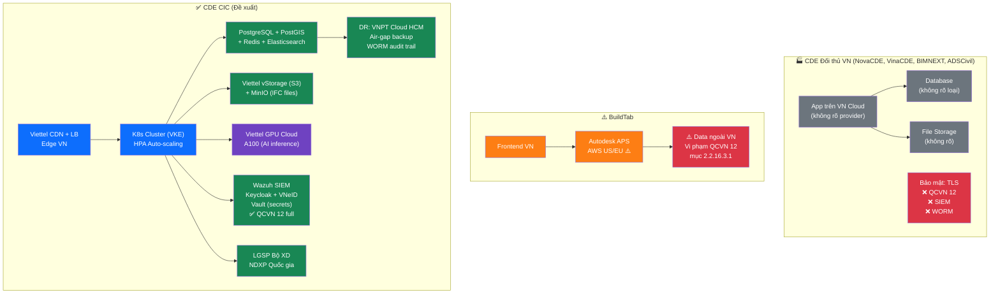
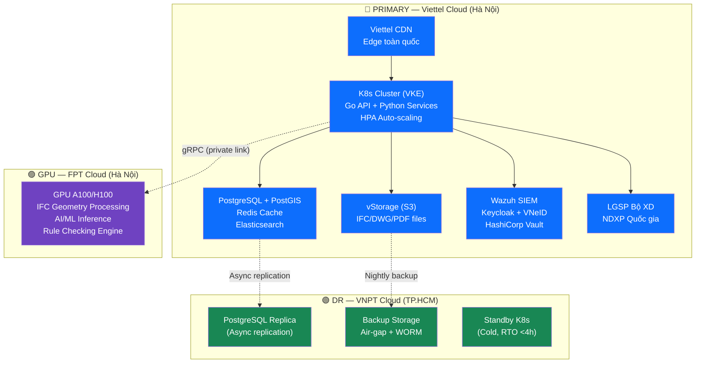
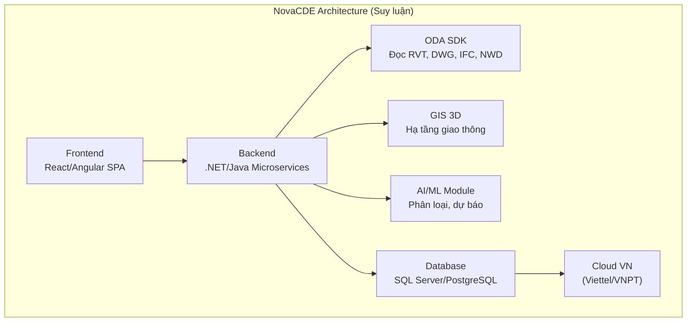
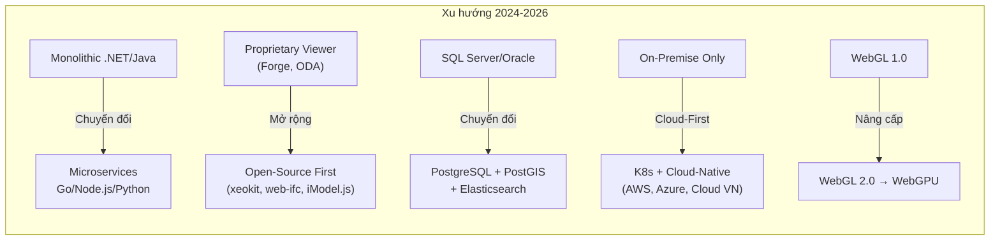
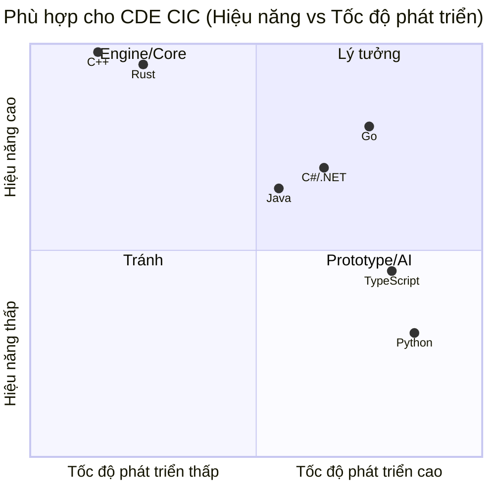
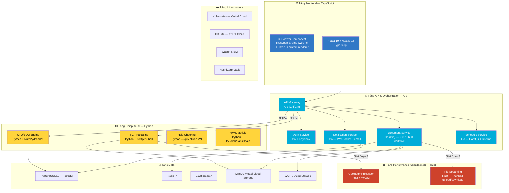
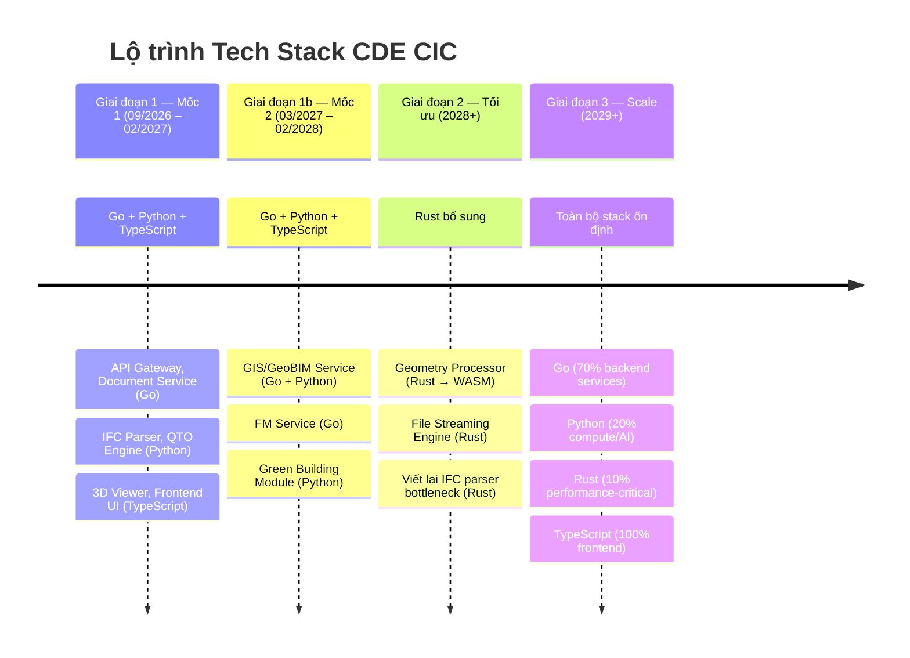
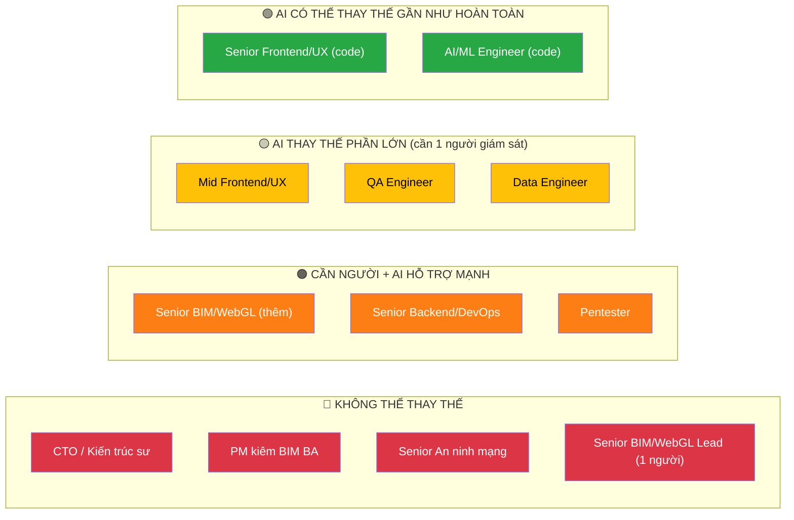
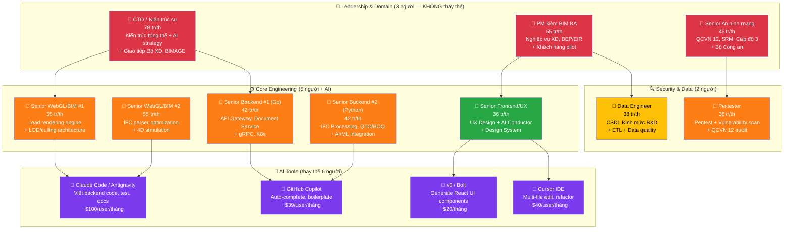
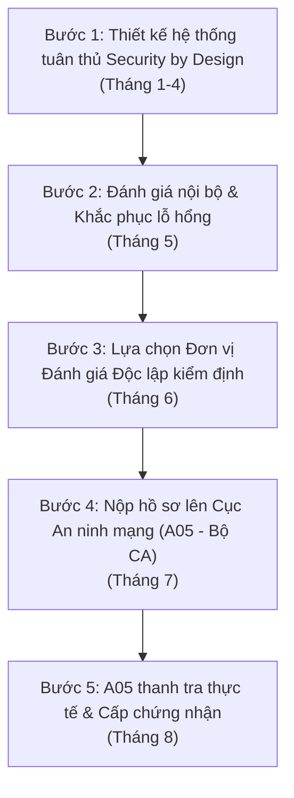

# Phân tích Nền tảng Công nghệ các CDE Việt Nam & Quốc tế
## Rút bài học cho lựa chọn Tech Stack CDE CIC

> **Ngày phân tích:** 07/06/2026
> **Mục đích:** Hiểu rõ đối thủ đang dùng công nghệ gì, từ đó đưa ra quyết định tech stack tối ưu cho CDE CIC

---

## Bảng Giải thích Thuật ngữ Công nghệ

> [!NOTE]
> Bảng dưới đây giải thích các thuật ngữ kỹ thuật xuất hiện trong tài liệu, giúp người đọc không chuyên IT có thể hiểu nội dung phân tích.

### A. Kiến trúc & Mô hình phát triển

| Thuật ngữ | Tiếng Việt | Giải thích dễ hiểu |
|-----------|-----------|---------------------|
| **Tech Stack** | Bộ công nghệ | Tập hợp các ngôn ngữ lập trình, framework, database, cloud... được chọn để xây dựng một phần mềm. Ví dụ: "Go + React + PostgreSQL" là một tech stack. |
| **Microservices** | Kiến trúc vi dịch vụ | Chia phần mềm thành nhiều "dịch vụ nhỏ" độc lập (ví dụ: dịch vụ quản lý tài liệu, dịch vụ xử lý IFC, dịch vụ thông báo...), mỗi dịch vụ có thể nâng cấp/sửa riêng mà không ảnh hưởng phần còn lại. Ngược lại là **Monolithic** (1 khối lớn). |
| **Monolithic** | Kiến trúc nguyên khối | Toàn bộ phần mềm nằm trong 1 cục code duy nhất — dễ bắt đầu nhưng khó mở rộng và bảo trì khi lớn. |
| **SaaS** | Phần mềm dạng dịch vụ | Người dùng trả phí hàng tháng để sử dụng phần mềm qua internet (như Gmail, Zoom), không cần cài đặt server riêng. |
| **On-Premise** | Cài đặt tại chỗ | Phần mềm được cài trên máy chủ riêng của khách hàng, dữ liệu không ra ngoài. Nhiều cơ quan nhà nước yêu cầu mô hình này. |
| **API** | Giao diện lập trình | "Cửa nối" cho phép các phần mềm khác nhau giao tiếp với nhau. Ví dụ: CDE có API để ERP lấy dữ liệu dự án. |
| **REST API** | API kiểu REST | Loại API phổ biến nhất, dùng giao thức HTTP (giống truy cập web). Dễ hiểu, dễ dùng nhưng chậm hơn gRPC. |
| **gRPC** | API hiệu năng cao | Giao thức API nhanh gấp 5-10 lần REST, dùng để các dịch vụ nội bộ (Go ↔ Python) nói chuyện nhanh với nhau. Không dùng cho frontend. |
| **SDK** | Bộ công cụ phát triển | Bộ thư viện + tài liệu mà nhà cung cấp đưa cho lập trình viên để tích hợp vào phần mềm. Ví dụ: ODA SDK để đọc file DWG. |
| **Open-Source** | Mã nguồn mở | Phần mềm có mã nguồn công khai, ai cũng có thể xem, sửa, dùng miễn phí (tuân thủ license). Ví dụ: PostgreSQL, IfcOpenShell. |
| **Vendor Lock-in** | Phụ thuộc nhà cung cấp | Khi dùng công nghệ độc quyền của 1 hãng, rất khó chuyển sang hãng khác. Ví dụ: BuildTab phụ thuộc Autodesk APS — nếu Autodesk tăng giá thì không có lựa chọn thay thế. |
| **Polyglot Architecture** | Kiến trúc đa ngôn ngữ | Dùng nhiều ngôn ngữ lập trình khác nhau cho các phần khác nhau — chọn ngôn ngữ nào giỏi nhất cho từng việc. Ví dụ: Go cho API, Python cho AI. |

### B. Ngôn ngữ Lập trình & Framework

| Thuật ngữ | Giải thích dễ hiểu |
|-----------|---------------------|
| **Go (Golang)** | Ngôn ngữ do Google phát triển, rất nhanh, nhẹ, xử lý nhiều việc cùng lúc tốt. Giống "nhân viên giao hàng nhanh nhẹn" — chạy file nhỏ, khởi động nhanh, tiết kiệm tài nguyên. |
| **Rust** | Ngôn ngữ cực kỳ nhanh và an toàn bộ nhớ, nhưng khó học. Giống "kỹ sư cơ khí chính xác" — làm chậm nhưng sản phẩm không bao giờ lỗi. |
| **Python** | Ngôn ngữ dễ viết, có rất nhiều thư viện sẵn cho AI, xử lý dữ liệu, BIM. Giống "con dao đa năng Thụy Sĩ" — làm được mọi thứ nhưng không nhanh bằng Go/Rust. |
| **TypeScript** | Phiên bản nâng cấp của JavaScript, thêm kiểm tra lỗi khi viết code. Dùng cho cả frontend (giao diện web) và backend. |
| **C# / .NET** | Ngôn ngữ của Microsoft, phổ biến trong phần mềm doanh nghiệp. Hầu hết CDE Việt Nam hiện tại đều dùng .NET. |
| **Java** | Ngôn ngữ doanh nghiệp lâu đời, rất ổn định nhưng nặng nề (tốn nhiều bộ nhớ, khởi động chậm). |
| **C / C++** | Ngôn ngữ "gốc" — nhanh nhất nhưng khó viết và dễ lỗi bảo mật. Dùng cho engine xử lý đồ họa, không dùng cho web. |
| **Framework** | Bộ khung sẵn | Bộ code mẫu + quy tắc giúp lập trình viên xây phần mềm nhanh hơn. Ví dụ: React là framework cho giao diện web, Gin là framework cho API bằng Go. |
| **React** | Framework giao diện web phổ biến nhất (do Meta/Facebook phát triển). Autodesk ACC và BIMcollab đều dùng React. |
| **Next.js** | Phiên bản nâng cấp của React, thêm khả năng SEO, render phía server, tối ưu tốc độ tải trang. |
| **FastAPI** | Framework Python để viết API rất nhanh, tự động tạo tài liệu API. Dùng cho các dịch vụ xử lý IFC, QTO. |
| **Gin / Chi** | Framework Go để viết API — nhẹ, nhanh, phù hợp xây dựng microservices. |
| **NestJS** | Framework Node.js cho backend — giống Spring Boot (Java) nhưng dùng TypeScript. |

### C. BIM, 3D & Đồ họa

| Thuật ngữ | Giải thích dễ hiểu |
|-----------|---------------------|
| **IFC** (Industry Foundation Classes) | Định dạng file chuẩn quốc tế cho mô hình BIM. Giống "PDF của ngành xây dựng" — mọi phần mềm BIM đều có thể đọc file IFC. CDE CIC bắt buộc hỗ trợ IFC 4.0+. |
| **RVT** | Định dạng file riêng của Autodesk Revit — phổ biến nhất VN nhưng là format đóng (chỉ Revit đọc chính xác). |
| **DWG** | Định dạng bản vẽ 2D của AutoCAD — rất phổ biến trong thiết kế xây dựng VN. |
| **WebGL / WebGPU** | Công nghệ cho phép hiển thị đồ họa 3D ngay trên trình duyệt web (Chrome, Edge...) mà không cần cài phần mềm. WebGPU là thế hệ mới, nhanh hơn WebGL. |
| **ThatOpen Engine (web-ifc)** | Thư viện mã nguồn mở giúp đọc và hiển thị file IFC trên trình duyệt web. Chạy bằng WASM (WebAssembly) nên nhanh. |
| **IfcOpenShell** | Thư viện mã nguồn mở (Python/C++) mạnh nhất để phân tích, truy vấn dữ liệu trong file IFC. Dùng để bóc tách khối lượng, kiểm tra quy chuẩn. |
| **xeokit** | Thư viện 3D BIM viewer — hiệu năng rất tốt cho file lớn, nhưng license AGPL (bắt buộc mở mã nguồn) hoặc trả phí thương mại. |
| **ODA SDK** (Open Design Alliance) | Bộ SDK thương mại cho phép đọc file RVT, DWG, IFC... NovaCDE dùng ODA. License đắt (~$50K+/năm). |
| **Three.js** | Thư viện JavaScript phổ biến nhất để vẽ 3D trên web. CDE CIC dùng Three.js làm nền tảng render. |
| **LOD** (Level of Detail) | Kỹ thuật hiển thị: vật ở xa thì vẽ đơn giản, vật ở gần thì vẽ chi tiết → giúp file lớn chạy mượt. |
| **Culling** | Kỹ thuật "cắt bỏ" các vật thể nằm ngoài tầm nhìn camera → không render những thứ người dùng không thấy, tiết kiệm tài nguyên. |
| **Shader** | Chương trình nhỏ chạy trên GPU (card đồ họa) để tính toán màu sắc, ánh sáng, bóng đổ cho mô hình 3D. |
| **WASM** (WebAssembly) | Công nghệ cho phép code viết bằng C++/Rust/Go chạy trong trình duyệt web với tốc độ gần bằng phần mềm desktop. web-ifc dùng WASM. |
| **QTO** (Quantity Take-Off) | Bóc tách khối lượng — tự động đo đếm số lượng vật liệu, diện tích, thể tích từ mô hình BIM. |
| **BOQ** (Bill of Quantities) | Bảng khối lượng — danh sách vật liệu + đơn giá + thành tiền, dùng để lập dự toán chi phí. |
| **4D BIM** | Mô hình 3D + thời gian (tiến độ thi công). Mô phỏng quá trình xây dựng theo từng giai đoạn. |
| **5D BIM** | Mô hình 3D + thời gian + chi phí. Tích hợp dự toán vào mô hình, biết chi phí thay đổi khi thiết kế thay đổi. |
| **BEP** (BIM Execution Plan) | Kế hoạch thực hiện BIM — tài liệu quy định cách áp dụng BIM trong dự án cụ thể. |
| **EIR** (Exchange Information Requirements) | Yêu cầu trao đổi thông tin — tài liệu chủ đầu tư đưa ra, quy định cần thông tin gì từ nhà thầu/tư vấn. |
| **ISO 19650** | Tiêu chuẩn quốc tế về quản lý thông tin BIM, quy định 4 trạng thái dữ liệu: WIP → Shared → Published → Archive. |
| **BCF** (BIM Collaboration Format) | Định dạng chuẩn để trao đổi ghi chú, lỗi, yêu cầu chỉnh sửa trên mô hình BIM giữa các phần mềm. |
| **COBie** | Định dạng chuẩn để bàn giao thông tin BIM cho giai đoạn vận hành (Facility Management). |

### D. Hạ tầng & DevOps

| Thuật ngữ | Giải thích dễ hiểu |
|-----------|---------------------|
| **Cloud** | Điện toán đám mây — thuê máy chủ qua internet thay vì mua máy chủ vật lý. CDE CIC dùng Viettel Cloud. |
| **K8s (Kubernetes)** | Hệ thống tự động quản lý, mở rộng các ứng dụng chạy trong container. Giống "đội trưởng" phân công container nào chạy ở đâu, tự động thay thế khi có container hỏng. |
| **Docker / Container** | Đóng gói phần mềm + tất cả thứ cần thiết vào 1 "hộp" (container) — đảm bảo chạy giống nhau ở mọi nơi (máy dev, server test, server production). |
| **CI/CD** | Quy trình tự động: code → test → deploy. Mỗi khi lập trình viên hoàn thành code, hệ thống tự động kiểm tra và đưa lên server. |
| **Cold Start** | Thời gian khởi động từ trạng thái "tắt" → "sẵn sàng". Go cold start ~50ms (rất nhanh), Java ~2-5 giây (chậm). Quan trọng khi K8s cần tự động tăng server. |
| **Container Size** | Kích thước "hộp" Docker. Go ~20MB (nhẹ, tiết kiệm cloud cost), Java ~250MB (nặng, tốn tiền cloud). |
| **PostgreSQL** | Cơ sở dữ liệu mã nguồn mở mạnh nhất, miễn phí. Hỗ trợ PostGIS cho dữ liệu bản đồ/GIS. |
| **PostGIS** | Phần mở rộng của PostgreSQL để lưu và truy vấn dữ liệu không gian/bản đồ (GIS). Cần cho phân hệ GeoBIM. |
| **Redis** | Cơ sở dữ liệu "siêu nhanh" lưu trong bộ nhớ RAM, dùng cho cache (bộ đệm) và real-time notification. |
| **Elasticsearch** | Hệ thống tìm kiếm toàn văn bản, rất nhanh. Dùng để tìm kiếm tài liệu trong CDE và lưu audit log. |
| **MinIO** | Phần mềm lưu trữ file tương thích Amazon S3, mã nguồn mở. Dùng để lưu file IFC, bản vẽ, tài liệu lớn. |
| **Message Queue** (NATS, RabbitMQ) | Hệ thống "hàng đợi tin nhắn" — khi service A cần nói với service B nhưng B đang bận, tin nhắn được xếp hàng chờ, đảm bảo không mất. |
| **Celery** | Hệ thống xử lý tác vụ nặng trong nền (Python). Ví dụ: khi user upload file IFC 500MB, Celery xử lý phía sau trong khi user vẫn dùng web bình thường. |
| **Binary** | File thực thi đã compile — chạy trực tiếp trên server, không cần cài thêm gì. Go và Rust compile ra binary. |
| **GC** (Garbage Collector) | Bộ dọn rác bộ nhớ tự động — giải phóng bộ nhớ không dùng nữa. Go/Java/.NET có GC, Rust không cần (tự quản lý). |
| **Goroutine** | Đơn vị xử lý đồng thời của Go — cực nhẹ (~2KB), có thể chạy hàng triệu goroutine cùng lúc. Java thread cần ~1MB/thread. |
| **GIL** (Global Interpreter Lock) | Hạn chế của Python — chỉ cho phép 1 thread chạy tại 1 thời điểm, làm Python chậm cho tác vụ tính toán nặng. |

### E. An ninh mạng

| Thuật ngữ | Giải thích dễ hiểu |
|-----------|---------------------|
| **QCVN 12:2026/BCA** | Quy chuẩn kỹ thuật quốc gia về an ninh mạng cho hệ thống lưu trữ tài liệu điện tử (ban hành theo TT 47/2026/TT-BCA, hiệu lực 01/07/2026). Có 22 nhóm yêu cầu kỹ thuật. CDE CIC bắt buộc tuân thủ vì phục vụ cơ quan nhà nước. |
| **SIEM** (Security Information and Event Management) | Hệ thống giám sát an ninh tập trung — thu thập log từ mọi server, phân tích, phát hiện tấn công. CDE CIC dùng Wazuh (mã nguồn mở). |
| **RBAC** (Role-Based Access Control) | Phân quyền theo vai trò — ví dụ: "Chủ đầu tư" chỉ xem được tài liệu Published, "Nhà thầu" chỉ sửa được tài liệu WIP của mình. |
| **MFA** (Multi-Factor Authentication) | Xác thực đa nhân tố — đăng nhập cần cả mật khẩu + mã OTP (hoặc vân tay). Bắt buộc theo QCVN 12. |
| **SSO** (Single Sign-On) | Đăng nhập 1 lần, dùng được nhiều ứng dụng. CDE CIC tích hợp VNeID để cán bộ nhà nước đăng nhập bằng tài khoản VNeID. |
| **Keycloak** | Phần mềm quản lý đăng nhập/phân quyền mã nguồn mở. Hỗ trợ SSO, RBAC, MFA, VNeID. |
| **Vault** (HashiCorp) | Phần mềm quản lý bí mật (mật khẩu, API key, chứng chỉ SSL) — lưu trữ an toàn, tự động xoay mật khẩu. |
| **Wazuh** | Phần mềm SIEM mã nguồn mở — giám sát, phát hiện xâm nhập, quét lỗ hổng, tuân thủ QCVN 12. |
| **WORM** (Write Once Read Many) | Lưu trữ bất biến — ghi 1 lần, đọc nhiều lần, không thể sửa/xóa. Dùng cho Audit Trail (nhật ký kiểm toán). Bắt buộc theo QCVN 12 mục 2.2.9. |
| **Pentest** (Penetration Testing) | Kiểm tra xâm nhập — thuê chuyên gia "hack thử" hệ thống để tìm lỗ hổng trước khi kẻ xấu tìm ra. |
| **SRM** | Hệ thống quản lý rủi ro an ninh mạng của Bộ Xây dựng. |
| **DR** (Disaster Recovery) | Kế hoạch khôi phục sau thảm họa — nếu Viettel Cloud Hà Nội gặp sự cố, VNPT Cloud TP.HCM tiếp quản trong <24h. |
| **Air-gap** | Cách ly vật lý — bản sao lưu được ngắt hoàn toàn khỏi mạng, kẻ tấn công không thể truy cập từ xa. |

### F. Quy chuẩn & Liên thông

| Thuật ngữ | Giải thích dễ hiểu |
|-----------|---------------------|
| **NDXP** | Nền tảng Dữ liệu và Xử lý số quốc gia — hệ thống kết nối chia sẻ dữ liệu giữa các bộ ngành. CDE CIC cần kết nối NDXP để liên thông với Bộ XD. |
| **LGSP** | Nền tảng chia sẻ, tích hợp dùng chung cấp Bộ — CDE CIC kết nối LGSP Bộ Xây dựng để chia sẻ dữ liệu dự án. |
| **TCVN 14423:2025** | Tiêu chuẩn an ninh mạng cho hệ thống thông tin quan trọng — QCVN 12 viện dẫn tiêu chuẩn này. |
| **VNeID** | Ứng dụng định danh điện tử quốc gia — cán bộ nhà nước dùng VNeID để đăng nhập vào CDE CIC (thay vì tạo tài khoản riêng). |
| **B2G** (Business to Government) | Doanh nghiệp bán sản phẩm/dịch vụ cho cơ quan nhà nước. CDE CIC bán cho Sở XD, PMU là B2G. |
| **PMU** | Ban Quản lý Dự án — đơn vị nhà nước quản lý các dự án đầu tư công (đường, cầu, trường học...). |

---

## 1. Bảng Tổng hợp Tech Stack — CDE Việt Nam

| Tiêu chí | **NovaCDE** (Hài Hòa) | **VinaCDE** (TGL Solutions) | **BuildTab CDE+** | **BIMNEXT** (DP Unity) | **ADSCivil CDE** (Baezeni) |
|----------|:---:|:---:|:---:|:---:|:---:|
| **Giải thưởng** | Sao Khuê 2024 | Sao Khuê 2025 | — | — | — |
| **Kiến trúc** | Microservices, Cloud | Cloud-based | Cloud-based | Cloud-based, Web | Cloud-based |
| **3D/BIM Engine** | **ODA SDK** (thương mại) | Tự phát triển (VinaBIM) | **Autodesk APS** (Forge) | Tự phát triển | Tự phát triển |
| **Định dạng hỗ trợ** | RVT, DWG, IFC, NWD, SKP, Civil3D | IFC, DWG, PDF | Revit, Navisworks, IFC | Office, PDF, AutoCAD | 30+ format (DWG, IFC, PDF...) |
| **Backend (suy luận)** | .NET/Java + ODA SDK | .NET/Java (*) | .NET/Java (*) | .NET/Java (*) | C++ core + .NET/Java (*) |
| **Frontend** | Web-based (SPA) | Web-based (SPA) | Web-based (SPA) | Web-based | Web-based |
| **ISO 19650** | ✅ 4 trạng thái | ✅ 4 trạng thái | ✅ 4 trạng thái | ⚠️ Cơ bản | ⚠️ Cơ bản |
| **GIS/GeoBIM** | ✅ GIS 3D, hạ tầng giao thông | ❌ | ❌ | ✅ BIM trên GIS | ❌ |
| **4D/5D** | ⚠️ Cơ bản | ❌ | ❌ | ✅ Tiến độ/sản lượng | ❌ |
| **FM (Vận hành)** | ❌ | ❌ | ✅ BuildTab FMs (EAM/CMMS) | ❌ | ❌ |
| **AI/ML** | ✅ Phân loại tài liệu, dự báo | ❌ | ❌ | ❌ | ❌ |
| **API mở** | ✅ REST API (ERP, IoT, BMS) | ✅ Hệ sinh thái VinaCAD | ✅ API (Excel, Power BI, Autodesk) | ⚠️ Hạn chế | ⚠️ Hạn chế |
| **Thị trường mục tiêu** | SME, hạ tầng giao thông | SME, nhà thầu, tư vấn | Enterprise, FM/vận hành | Quản lý dự án tổng thể | Hạ tầng giao thông (ngách) |
| **Điểm yếu** | Chưa phủ rộng B2G | Đội nhỏ, chưa QCVN 12 | Phụ thuộc Autodesk APS | Chưa có 5D chi phí | Ít phân hệ, thị trường ngách |

> [!NOTE]
> **(*) Suy luận:** Các CDE VN đều không công bố công khai tech stack backend. Tuy nhiên dựa trên đặc điểm ngành (AEC/BIM), ODA SDK integration, và thực tế tuyển dụng trên ITviec/LinkedIn, **phần lớn các đội phát triển CDE VN sử dụng .NET (C#) hoặc Java** cho backend, kết hợp JavaScript/TypeScript cho frontend.

---

### 1.1. Hạ tầng Cloud của các CDE Việt Nam

| Tiêu chí | **NovaCDE** (Hài Hòa) | **VinaCDE** (TGL Solutions) | **BuildTab CDE+** | **BIMNEXT** (DP Unity) | **ADSCivil CDE** (Baezeni) | **CDE CIC** (đề xuất) |
|----------|------|------|------|------|------|------|
| **Mô hình triển khai** | SaaS + On-Premise | SaaS + On-Premise | SaaS (chính) | SaaS + On-Premise | SaaS + On-Premise | **SaaS + On-Premise + Hybrid** |
| **Cloud Provider** | VN Cloud (*) — không công bố cụ thể | VN Cloud (*) — máy chủ tại VN | Phụ thuộc **Autodesk APS** (AWS global) + VN Cloud cho data | VN Cloud (*) — máy chủ tại VN | VN Cloud (*) hoặc server khách hàng | **Viettel Cloud** (primary) + VNPT Cloud (DR) |
| **Vị trí Data Center** | Việt Nam ✅ | Việt Nam ✅ | **Nước ngoài** ⚠️ (Autodesk APS trên AWS US/EU) + VN | Việt Nam ✅ | Việt Nam ✅ | **Việt Nam** ✅ (Viettel IDC Tier III HN + HCM) |
| **Datacenter Tier** | Không công bố | Không công bố | AWS Tier III+ (Autodesk) | Không công bố | Không công bố | **Tier III** (Viettel IDC Hòa Lạc + HCM) |
| **Container/K8s** | Không rõ (có thể VM truyền thống) | Không rõ | Quản lý bởi Autodesk | Không rõ | Không rõ | **K8s (Kubernetes)** trên VKE Viettel Cloud |
| **Object Storage** | Không công bố | Không công bố | AWS S3 (qua Autodesk) | Không công bố | Không công bố | **Viettel vStorage** (S3-compatible) + MinIO |
| **CDN** | Không rõ | Không rõ | Autodesk CDN | Không rõ | Không rõ | **Viettel CDN** (edge VN) |
| **Disaster Recovery** | Không công bố | Không công bố | Phụ thuộc Autodesk | Không công bố | Không công bố | **Active-Passive** (VT HN → VNPT HCM, RTO <4h) |
| **Backup Strategy** | Không rõ | Không rõ | Phụ thuộc Autodesk | Không rõ | Không rõ | **3-2-1 + Air-gap + WORM** (tuân thủ QCVN 12 mục 2.2.12) |
| **Mã hóa dữ liệu** | TLS (truyền) | TLS (truyền) | AES-256 (lưu + truyền) bởi AWS | Không rõ | Mã hóa 2 chiều | **AES-256 at-rest + TLS 1.3 in-transit** |
| **Tuân thủ QCVN 12** | ❌ Chưa | ❌ Chưa | ⚠️ Khó (data ở nước ngoài) | ❌ Chưa | ❌ Chưa | ✅ **Thiết kế từ đầu** |
| **LGSP/NDXP** | ❌ | ❌ | ❌ | ❌ | ❌ | ✅ **Kết nối LGSP Bộ XD + NDXP** |
| **VNeID SSO** | ❌ | ❌ | ❌ | ❌ | ❌ | ✅ **Tích hợp VNeID** |
| **Auto-scaling** | Không rõ (có thể manual) | Không rõ | Tự động (AWS) | Không rõ | Không rõ | **HPA + VPA trên K8s** (tự động) |
| **GPU cho 3D/AI** | Không rõ | Không rõ | Xử lý phía client | Không rõ | Không rõ | **Viettel GPU Cloud** (A100/H100 cho AI inference) |
| **Giám sát (SIEM)** | Không công bố | Không công bố | Phụ thuộc Autodesk SOC | Không công bố | Không công bố | **Wazuh + Grafana/Loki** (tự vận hành) |
| **Chi phí cloud ước tính** | ~15-30 tr/th (*) | ~10-20 tr/th (*) | ~$500-2000/th (Autodesk APS) | ~10-20 tr/th (*) | ~5-15 tr/th (*) | **~40-60 tr/th** (K8s + GPU + DR) |

> [!IMPORTANT]
> ### Phát hiện quan trọng về Cloud đối thủ
>
> **① Không ai công bố cloud chi tiết:** Tất cả 5 CDE VN đều giữ bí mật hạ tầng cloud. Đây là "hộp đen" — khách hàng không biết data được lưu ở đâu, backup thế nào, có air-gap không. **CDE CIC có thể biến tính minh bạch hạ tầng thành lợi thế cạnh tranh** khi bán B2G.
>
> **② BuildTab bị lộ điểm yếu QCVN 12:** Do phụ thuộc Autodesk APS (host trên AWS US/EU), dữ liệu dự án có thể lưu ngoài VN → **vi phạm QCVN 12 mục 2.2.16.3.1** (yêu cầu lưu trữ trong lãnh thổ VN) và **mục 2.2.16.1.4** (hạ tầng vật lý phải đặt tại VN). Đây là điểm yếu chí mạng khi bán B2G.
>
> **③ Không ai có DR/Backup đạt chuẩn:** QCVN 12 mục 2.2.12.2.2 yêu cầu **quy tắc 3-2-1 + air-gap** — không CDE VN nào công bố đáp ứng. CDE CIC thiết kế sẵn → vượt chuẩn.
>
> **④ Không ai có LGSP/NDXP/VNeID:** Đây là bài toán liên thông chính phủ số mà CDE CIC **độc quyền** nếu làm sớm.
>
> **⑤ Chi phí cloud CIC cao hơn nhưng hợp lý:** ~40-60 tr/th cho K8s + GPU + DR + SIEM là premium nhưng đáp ứng chuẩn nhà nước. Đối thủ rẻ hơn vì **chưa đầu tư security/compliance**.

#### Sơ đồ so sánh hạ tầng Cloud



---

### 1.2. So sánh Nhà cung cấp Hạ tầng Cloud Việt Nam

> [!NOTE]
> Bảng dưới đây so sánh **7 nhà cung cấp cloud nội địa hàng đầu** theo các tiêu chí quan trọng cho CDE CIC: datacenter, K8s, GPU, bảo mật, compliance chính phủ, và chi phí.

#### Bảng so sánh tổng hợp

| Tiêu chí | **Viettel Cloud** | **FPT Cloud** | **VNPT Cloud** | **CMC Cloud** | **VNG Cloud (GreenNode)** | **Bizfly Cloud** (VCCorp) | **Sunteco Cloud** |
|----------|:---:|:---:|:---:|:---:|:---:|:---:|:---:|
| **Công ty mẹ** | Tập đoàn Viettel (Bộ QP) | FPT Corporation | Tập đoàn VNPT | CMC Corporation | VNG Corporation | VCCorp | Sunteco JSC |
| **Tính chất** | Viễn thông nhà nước | Công nghệ tư nhân | Viễn thông nhà nước | Công nghệ tư nhân | Công nghệ tư nhân | Internet/Media | Startup cloud |
| | | | | | | | |
| **📍 Datacenter** | | | | | | | |
| Số lượng DC tại VN | **8+** (HN, HCM, ĐN, CT...) | 4 (HN, HCM) | 5+ (toàn quốc) | 3 (HN, HCM) | 2 (HN, HCM) | 2 (HN, HCM) | 1 (HCM) |
| Tiêu chuẩn Tier | **Tier III** (ANSI/TIA-942 Rated 3, một số hạng mục Rated 4) | Tier III | Tier III | **Tier III** (Uptime Certified) | Tier III | Tier III | Không rõ |
| | | | | | | | |
| **🔧 Dịch vụ Cloud** | | | | | | | |
| Managed Kubernetes | ✅ **VKE** (Viettel K8s Engine) | ✅ **FKE** (FPT K8s Engine) | ✅ (có nhưng ít tài liệu) | ✅ **CKE** (CMC K8s Engine) | ✅ **VKS** (VNG K8s Service) — control plane miễn phí | ✅ K8s Engine (Standard-0 miễn phí) | ⚠️ Hạn chế |
| GPU Cloud | ✅ A100, H100 | ✅ **A100, H100, H200** — GPU Sharing (MIG) | ⚠️ Hạn chế | ⚠️ Đang phát triển | ✅ GPU VM (A100) | ⚠️ Cơ bản | ✅ A100, H100 (giá rẻ, pay-as-you-go) |
| Object Storage (S3) | ✅ **vStorage** (S3-compatible) | ✅ FPT Object Storage | ✅ VNPT Storage | ✅ CMC Object Storage | ✅ vStorage (S3) | ✅ S3-compatible | ⚠️ Hạn chế |
| CDN | ✅ **Viettel CDN** (mạng lưới viễn thông toàn quốc) | ✅ FPT CDN | ✅ VNPT CDN | ✅ CMC CDN | ✅ VNG CDN | ✅ Bizfly CDN | ❌ |
| Database Managed | ✅ MySQL, PostgreSQL, Redis | ✅ MySQL, PostgreSQL, Redis, MongoDB | ✅ MySQL, PostgreSQL | ✅ MySQL, PostgreSQL, Redis | ✅ MySQL, PostgreSQL, Redis, MongoDB | ✅ MySQL, PostgreSQL, Redis | ⚠️ Cơ bản |
| Load Balancer | ✅ | ✅ | ✅ | ✅ | ✅ | ✅ | ⚠️ |
| DRaaS (Disaster Recovery) | ✅ **Active-Passive** (HN↔HCM, Đà Nẵng backup) | ✅ DR (HN↔HCM) | ✅ DR (nhiều vùng) | ✅ DR (HN↔HCM) | ⚠️ Hạn chế | ⚠️ Cơ bản | ❌ |
| | | | | | | | |
| **🔒 Bảo mật & Compliance** | | | | | | | |
| ISO 27001 | ✅ | ✅ | ✅ | ✅ | ✅ | ⚠️ | ❌ |
| PCI DSS | ✅ Level 1 | ✅ | ⚠️ | ✅ **V4.0.1** (mới nhất) | ⚠️ | ❌ | ❌ |
| SOC 2 | ⚠️ | ⚠️ | ❌ | ✅ | ⚠️ | ❌ | ❌ |
| AN TTCĐ 4 (Chính phủ) | ✅ **Cấp độ 4** | ⚠️ | ✅ **Cấp độ 4** | ✅ **Cấp độ 4** | ❌ | ❌ | ❌ |
| Kết nối NCSC (Bộ CA) | ✅ **Tích hợp sẵn** (vSOC + AI) | ⚠️ | ✅ | ⚠️ | ❌ | ❌ | ❌ |
| Kinh nghiệm Chính phủ số | ✅ **Nhiều nhất** (LGSP, 1 cửa, thuế, hải quan...) | ✅ (FPT.eGov) | ✅ (VNPT-IT, dịch vụ công) | ⚠️ Ít | ❌ | ❌ | ❌ |
| | | | | | | | |
| **💰 Chi phí (ước tính)** | | | | | | | |
| Cloud Server 4vCPU/8GB | ~800K-1.2M/th | ~700K-1M/th | ~600K-900K/th | ~700K-1M/th | ~600K-900K/th | ~500K-800K/th | ~400K-700K/th |
| GPU A100 80GB/tháng | ~50-80M/th | ~45-75M/th | Không rõ | Không rõ | ~50-70M/th | Không rõ | ~35-55M/th (rẻ nhất) |
| Mô hình giá | Enterprise quote | Enterprise quote + Pay-as-you-go | Enterprise quote | Enterprise quote + Pay-as-you-go | Pay-as-you-go + Enterprise | Pay-as-you-go | **Pay-as-you-go** (giá công khai) |
| | | | | | | | |
| **📞 Hỗ trợ** | | | | | | | |
| SLA uptime | **99.99%** | 99.95% | 99.9% | 99.95% | 99.9% | 99.9% | 99.5% |
| Support 24/7 | ✅ Hotline + NOC | ✅ Hotline + TAC | ✅ Hotline | ✅ Hotline + NOC | ✅ Ticket + Hotline | ✅ Ticket | ⚠️ Business hours |
| Managed DevOps | ✅ | ✅ | ⚠️ | ✅ | ⚠️ | ⚠️ | ❌ |

> [!NOTE]
> **(*) Chi phí là ước tính** dựa trên bảng giá công khai (nếu có) và mức thị trường 2026. Giá thực tế phụ thuộc vào hợp đồng doanh nghiệp, cam kết dài hạn, và cấu hình cụ thể. Cần RFQ (Request for Quotation) để có giá chính xác.

---

#### Ma trận Chấm điểm cho CDE CIC

Chấm điểm theo thang 1-5 (5 = tốt nhất) dựa trên **các yêu cầu đặc thù của CDE CIC** (B2G, QCVN 12, BIM/3D, AI):

| Tiêu chí (trọng số) | **Viettel** | **FPT** | **VNPT** | **CMC** | **VNG** | **Bizfly** | **Sunteco** |
|---------------------|:---:|:---:|:---:|:---:|:---:|:---:|:---:|
| **Compliance Chính phủ** (×3) | ⭐⭐⭐⭐⭐ | ⭐⭐⭐ | ⭐⭐⭐⭐ | ⭐⭐⭐ | ⭐⭐ | ⭐ | ⭐ |
| **Managed K8s** (×2) | ⭐⭐⭐⭐ | ⭐⭐⭐⭐⭐ | ⭐⭐⭐ | ⭐⭐⭐⭐ | ⭐⭐⭐⭐ | ⭐⭐⭐ | ⭐⭐ |
| **GPU cho AI/3D** (×2) | ⭐⭐⭐⭐ | ⭐⭐⭐⭐⭐ | ⭐⭐ | ⭐⭐ | ⭐⭐⭐⭐ | ⭐⭐ | ⭐⭐⭐⭐ |
| **DR/Backup** (×2) | ⭐⭐⭐⭐⭐ | ⭐⭐⭐⭐ | ⭐⭐⭐⭐ | ⭐⭐⭐⭐ | ⭐⭐⭐ | ⭐⭐ | ⭐ |
| **Datacenter phủ sóng** (×1) | ⭐⭐⭐⭐⭐ | ⭐⭐⭐⭐ | ⭐⭐⭐⭐⭐ | ⭐⭐⭐ | ⭐⭐⭐ | ⭐⭐⭐ | ⭐⭐ |
| **Chi phí** (×1) | ⭐⭐⭐ | ⭐⭐⭐ | ⭐⭐⭐⭐ | ⭐⭐⭐ | ⭐⭐⭐⭐ | ⭐⭐⭐⭐⭐ | ⭐⭐⭐⭐⭐ |
| **SLA/Support** (×1) | ⭐⭐⭐⭐⭐ | ⭐⭐⭐⭐⭐ | ⭐⭐⭐⭐ | ⭐⭐⭐⭐ | ⭐⭐⭐ | ⭐⭐⭐ | ⭐⭐ |
| **Hệ sinh thái dịch vụ** (×1) | ⭐⭐⭐⭐⭐ | ⭐⭐⭐⭐⭐ | ⭐⭐⭐⭐ | ⭐⭐⭐⭐ | ⭐⭐⭐⭐ | ⭐⭐⭐ | ⭐⭐ |
| | | | | | | | |
| **TỔNG (có trọng số /65)** | **⭐ 56** | **⭐ 51** | **⭐ 44** | **⭐ 41** | **⭐ 40** | **⭐ 32** | **⭐ 28** |
| **Xếp hạng** | **🥇 #1** | **🥈 #2** | **🥉 #3** | #4 | #5 | #6 | #7 |

---

#### Phân tích SWOT Top 3 cho CDE CIC

````carousel
### 🥇 Viettel Cloud — Ứng viên Primary

| | Phân tích |
|---|------|
| **Strengths** | ① Hạ tầng DC lớn nhất VN (8+ DC, Tier III Rated 3-4). ② Compliance Chính phủ tốt nhất (LGSP, 1 cửa, thuế, hải quan — kinh nghiệm triển khai thực tế nhiều nhất). ③ SLA 99.99% — cao nhất thị trường. ④ Tích hợp sẵn vSOC/NCSC (Bộ Công an) — thuận lợi cho QCVN 12. ⑤ CDN mạng viễn thông phủ sóng toàn quốc. ⑥ **CIC là đơn vị thuộc Bộ XD** — Viettel có kinh nghiệm làm việc với các Bộ ngành. |
| **Weaknesses** | ① Giá cao hơn 15-30% so với thị trường. ② GPU Cloud chưa mạnh bằng FPT (chưa có H200, chưa có GPU Sharing/MIG). ③ Documentation/API kém hơn FPT/VNG — developer experience không cao. ④ Quy trình enterprise cứng nhắc, ký hợp đồng lâu. |
| **Verdict** | ✅ **Chọn làm Primary Cloud** — compliance + DR + SLA vượt trội cho B2G. Chi phí cao hơn nhưng giảm rủi ro pháp lý đáng kể. |

<!-- slide -->

### 🥈 FPT Cloud — Ứng viên GPU/AI + Secondary

| | Phân tích |
|---|------|
| **Strengths** | ① GPU Cloud mạnh nhất VN (A100, H100, H200, GPU Sharing MIG). ② FPT AI Factory — hệ sinh thái AI/ML hoàn chỉnh. ③ Managed K8s (FKE) chất lượng tốt, documentation đầy đủ. ④ Developer experience tốt nhất (API docs, SDK, community). ⑤ FPT.eGov có kinh nghiệm chính phủ số. |
| **Weaknesses** | ① Compliance chính phủ không mạnh bằng Viettel/VNPT (FPT là tư nhân). ② DC chỉ 4 location (HN, HCM) — ít hơn Viettel. ③ Kết nối NCSC chưa tích hợp sẵn. ④ Giá GPU cao (~$2.54/giờ H100). |
| **Verdict** | ✅ **Chọn cho GPU/AI workload** — thuê GPU A100/H100 từ FPT cho IFC Processing, AI/ML inference. Không làm primary vì yếu hơn compliance. |

<!-- slide -->

### 🥉 VNPT Cloud — Ứng viên Disaster Recovery

| | Phân tích |
|---|------|
| **Strengths** | ① Hạ tầng viễn thông phủ sóng toàn quốc (5+ DC). ② Compliance Chính phủ tốt (VNPT-IT, dịch vụ công, AN TTCĐ 4). ③ Chi phí thấp hơn Viettel 20-30%. ④ Kết nối NCSC sẵn. ⑤ **Khác ISP** với Viettel → DR cross-provider an toàn. |
| **Weaknesses** | ① K8s/GPU Cloud yếu hơn Viettel và FPT. ② Documentation ít, developer experience thấp. ③ Hệ sinh thái dịch vụ cloud chưa phong phú. ④ SLA 99.9% — thấp hơn Viettel. |
| **Verdict** | ✅ **Chọn làm DR site** — VNPT HCM làm Disaster Recovery cho Viettel HN. Khác ISP = giảm rủi ro "single point of failure" viễn thông. |
````

---

#### Khuyến nghị Kiến trúc Multi-Cloud cho CDE CIC



#### Chi phí ước tính Multi-Cloud hàng tháng

| Hạng mục | Provider | Cấu hình | Chi phí/tháng |
|----------|:---:|------|:---:|
| **K8s Cluster** (6 worker nodes) | Viettel | 6× (8vCPU, 32GB RAM, 100GB SSD) | ~18-25M |
| **PostgreSQL HA** | Viettel | Primary + Standby, 500GB SSD | ~5-8M |
| **vStorage** (files) | Viettel | 2TB, S3-compatible | ~1-2M |
| **Redis** | Viettel | 4GB RAM, HA | ~1-2M |
| **Elasticsearch** | Viettel | 3-node cluster, 200GB | ~3-5M |
| **CDN** | Viettel | 500GB bandwidth/tháng | ~1-2M |
| **Wazuh SIEM** | Viettel | 2-node (self-managed trên K8s) | ~0 (self-hosted) |
| **GPU AI/3D** | FPT | 1× A100 80GB (on-demand, ~40h/tháng) | ~8-15M |
| **DR PostgreSQL Replica** | VNPT | Standby, 500GB | ~3-5M |
| **DR Backup Storage** | VNPT | 2TB, WORM + Air-gap | ~2-3M |
| **DR Standby K8s** | VNPT | 3 nodes (cold standby) | ~5-8M |
| | | | |
| **TỔNG** | | | **~47-75M/tháng** |
| **TỔNG/năm** | | | **~560-900M/năm** |

> [!TIP]
> ### Tóm tắt Khuyến nghị
>
> | Vai trò | Nhà cung cấp | Lý do chính |
> |---------|:---:|------|
> | **🔵 Primary Cloud** | **Viettel Cloud** | ① Compliance chính phủ tốt nhất — CIC thuộc Bộ XD, Viettel làm việc với các Bộ nhiều nhất. ② SLA 99.99%. ③ Tích hợp NCSC/vSOC sẵn → QCVN 12 dễ đạt. ④ 8+ DC toàn quốc → mở rộng tương lai. ⑤ CDN viễn thông phủ sóng tốt nhất. |
> | **🟣 GPU/AI** | **FPT Cloud** | ① GPU Cloud mạnh nhất VN (A100, H100, H200). ② GPU Sharing (MIG) → tiết kiệm chi phí. ③ Developer experience tốt. ④ Chỉ dùng on-demand cho IFC processing + AI → không cần full-time. |
> | **🟢 Disaster Recovery** | **VNPT Cloud** | ① **Khác ISP** với Viettel → nếu đường trục Viettel gặp sự cố, VNPT vẫn hoạt động. ② Compliance chính phủ tốt (AN TTCĐ 4). ③ Chi phí DR rẻ hơn Viettel 20-30%. ④ DC HCM → cách ly địa lý với Viettel HN. |
>
> **Không chọn VNG/Bizfly/Sunteco** vì: ① Thiếu compliance chính phủ (không có AN TTCĐ 4, không kết nối NCSC). ② B2G yêu cầu nhà cung cấp có uy tín với cơ quan nhà nước — Viettel/VNPT/FPT đều có track record, VNG/Bizfly chưa có.

---

## 2. Bảng Tổng hợp Tech Stack — CDE Quốc tế

| Tiêu chí | **Autodesk Construction Cloud** | **Trimble Connect** | **Bentley ProjectWise** | **BIMcollab** |
|----------|:---:|:---:|:---:|:---:|
| **Quốc gia** | Mỹ | Mỹ | Mỹ | Hà Lan |
| **Backend** | Multi-language (Java, Go, C#, Python) | **.NET (C#)** chính, REST API | **.NET (C#)** + C++ core | C#, .NET |
| **Frontend** | React + TypeScript | JavaScript/TypeScript | Angular + TypeScript | React + TypeScript |
| **3D Engine** | **Autodesk Viewer (APS/Forge)** — proprietary | **Trimble 3D Viewer** — proprietary | **Bentley iModel.js** — open-source | **BIMcollab BIM Viewer** |
| **Cloud** | AWS | AWS + Azure | Azure | Azure |
| **SDK ngôn ngữ** | Node.js, Python, .NET | .NET, JavaScript | TypeScript (iModel.js), C++ | REST API, C# |
| **IFC support** | ⚠️ Hạn chế (ưu tiên RVT) | ✅ IFC 2x3, IFC4 | ✅ Mạnh (iModel.js) | ✅ BCF + IFC |
| **Giá** | $60-100/user/tháng | $25-50/user/tháng | Theo dự án (rất đắt) | €6-15/user/tháng |

---

## 3. Phân tích Chi tiết từng Đối thủ Nội địa

### 3.1. NovaCDE (Hài Hòa) — Đối thủ mạnh nhất



**Điểm mạnh cần học:**
- Microservices từ đầu → scale tốt
- **ODA SDK** cho phép đọc RVT (Revit native) — không chỉ IFC
- GIS 3D cho hạ tầng giao thông — niche market tốt
- AI/ML tích hợp sớm (phân loại tài liệu, dự báo rủi ro)

**Điểm yếu CDE CIC có thể khai thác:**
- Chưa phủ rộng B2G (Ban QLDA, Sở XD)
- Chưa có QCVN 12 certification
- Chưa có 5D chi phí tích hợp định mức BXD
- Chưa liên thông NDXP/LGSP

### 3.2. VinaCDE (TGL Solutions) — Hệ sinh thái VinaCAD

**Điểm mạnh cần học:**
- Hệ sinh thái tích hợp (VinaCAD → TakaCAD → VinaBIM → VinaCDE) — khép kín
- Sao Khuê 2025
- Hợp tác IDD Việt Nam cho nghiệp vụ

**Điểm yếu CDE CIC có thể khai thác:**
- Đội ngũ nhỏ, tập trung SME
- Không có GeoBIM, GIS, 4D/5D
- Chưa có QCVN 12

### 3.3. BuildTab — Phụ thuộc Autodesk

**Điểm mạnh cần học:**
- FM/vận hành (EAM/CMMS, QR code bảo trì) — ít đối thủ VN có
- Tích hợp Power BI cho báo cáo

**Điểm yếu CDE CIC có thể khai thác:**
- **Vendor lock-in nghiêm trọng** — phụ thuộc Autodesk APS (Forge) cho 3D viewer
- Nếu Autodesk thay đổi pricing/API → BuildTab bị ảnh hưởng nặng
- Đây chính xác là bài học cho CDE CIC: **PHẢI tự chủ 3D engine**

---

## 4. Xu hướng Công nghệ trong ngành CDE toàn cầu



### Bảng xu hướng ngôn ngữ Backend cho CDE/AEC platform

| Thời kỳ | Ngôn ngữ phổ biến | Đại diện |
|---------|-------------------|---------|
| **2015-2020** | **.NET (C#), Java** | Trimble, Bentley, hầu hết CDE VN | 
| **2020-2024** | **Node.js/TypeScript, Python** | BIMcollab, startups mới |
| **2024-2026** | **Go, Rust (emerging), Python** | Autodesk ACC (Go cho một số service mới), các startup hiệu suất cao |
| **Tương lai** | **Go + Python + Rust (hybrid)** | Tối ưu từng ngôn ngữ cho từng service |

---

## 5. So sánh Chiến lược 3D Engine

| Chiến lược | Đối thủ sử dụng | Ưu điểm | Nhược điểm | Phù hợp CDE CIC? |
|-----------|-----------------|---------|-----------|:---:|
| **ODA SDK (thương mại)** | NovaCDE | Đọc được RVT, DWG native; nhanh triển khai | License đắt (~$50K+/năm); **không tự chủ mã nguồn**; RVT reader là closed-source | ⚠️ Có thể dùng bổ trợ |
| **Autodesk APS/Forge** | BuildTab | 3D viewer mạnh, hỗ trợ 60+ format | **Vendor lock-in 100%**; phí API theo usage; Autodesk kiểm soát roadmap | ❌ Không phù hợp |
| **Tự phát triển (open-source base)** | VinaCDE, BIMNEXT | Tự chủ hoàn toàn; giá thành thấp | Cần đội ngũ mạnh; thời gian phát triển lâu | ✅ **Đúng hướng CDE CIC** |
| **Hybrid (ThatOpen + IfcOpenShell + custom)** | *Đề xuất cho CDE CIC* | Tự chủ 100% mã nguồn; linh hoạt; có fallback | Cần 4 Senior WebGL; benchmark sớm | ✅ **Khuyến nghị** |

---

## 6. Bài học Rút ra cho CDE CIC

### 6.1. Điều CÁC ĐỐI THỦ đang THIẾU (= cơ hội CDE CIC)

| Khoảng trống | Đối thủ nào thiếu | CDE CIC giải quyết |
|-------------|-------------------|---------------------|
| **QCVN 12:2026/BCA** | TẤT CẢ | ✅ Thiết kế Security by Design từ đầu |
| **Liên thông NDXP/LGSP** | TẤT CẢ | ✅ API mã định danh 13/12 ký tự |
| **5D Chi phí (định mức BXD)** | NovaCDE (cơ bản), VinaCDE (❌), BuildTab (❌) | ✅ QTO→BOQ theo định mức VN |
| **B2G (PMU, Sở XD)** | NovaCDE chưa phủ rộng, còn lại yếu | ✅ Lợi thế CIC/Bộ XD |
| **Tự chủ 100% mã nguồn** | BuildTab (Autodesk APS), NovaCDE (ODA SDK) | ✅ Open-source first |

### 6.2. Điều CÁC ĐỐI THỦ đang LÀM TỐT (= cần học)

| Bài học | Từ đối thủ | Áp dụng cho CDE CIC |
|---------|-----------|---------------------|
| **Microservices từ đầu** | NovaCDE | ✅ Đã plan trong kiến trúc |
| **Hệ sinh thái tích hợp** | VinaCDE (VinaCAD ecosystem) | ⚠️ Cần có chiến lược ecosystem (API mở, marketplace) |
| **FM/Vận hành** | BuildTab (QR, CMMS) | ✅ Phân hệ 5 (Mốc 2) |
| **AI/ML sớm** | NovaCDE | ✅ AI/ML Engineer trong đội 16 người |
| **Đọc format native (RVT, DWG)** | NovaCDE (ODA) | ⚠️ Cân nhắc ODA SDK bổ trợ cho RVT reader |

### 6.3. Khuyến nghị Tech Stack cuối cùng cho CDE CIC

Dựa trên phân tích đối thủ, xu hướng công nghệ, và yêu cầu đặc thù dự án:

```
┌─────────────────────────────────────────────────────────┐
│                    CDE CIC TECH STACK                    │
├─────────────────────────────────────────────────────────┤
│                                                          │
│  Frontend:  React 19 + Next.js 15 + TypeScript          │
│  3D Engine: ThatOpen (web-ifc) + Three.js custom        │
│             + IfcOpenShell (server-side)                 │
│             + ODA SDK (tùy chọn, đọc RVT/DWG native)   │
│                                                          │
│  Backend:   Go (API Gateway, Workflow, Notification)    │
│             Python (IFC processing, QTO, AI/ML)         │
│             Rust (tùy chọn giai đoạn 2, performance)   │
│                                                          │
│  Database:  PostgreSQL 16 + PostGIS                     │
│             Redis 7 (cache, pub/sub)                    │
│             Elasticsearch (search, audit log)           │
│                                                          │
│  Infra:     Viettel Cloud (Primary, K8s)                │
│             VNPT Cloud (DR)                              │
│             Docker + Kubernetes                          │
│                                                          │
│  Security:  Keycloak (IAM, RBAC, MFA, SSO, VNeID)      │
│             Wazuh (SIEM) + Vault (Secrets)              │
│             WORM storage (Audit Trail)                   │
│                                                          │
│  Ưu thế so với đối thủ VN:                              │
│  ✅ Tự chủ 100% mã nguồn (≠ BuildTab/Autodesk APS)    │
│  ✅ Go+Python (≠ .NET/Java cũ của NovaCDE/VinaCDE)     │
│  ✅ QCVN 12 + NDXP (chưa đối thủ nào có)              │
│  ✅ 5D định mức BXD (domain knowledge CIC 30+ năm)     │
│                                                          │
└─────────────────────────────────────────────────────────┘
```

> [!TIP]
> ### Vì sao Go + Python thay vì .NET/Java như đối thủ?
> 
> Đối thủ VN (NovaCDE, VinaCDE) chọn .NET/Java vì đó là **công nghệ phổ biến khi họ bắt đầu phát triển (2020-2023)**. CDE CIC bắt đầu năm 2026 — có lợi thế **chọn công nghệ mới hơn**:
> 
> - **Go**: Deploy nhẹ hơn .NET 5-10x (quan trọng khi scale trên Viettel Cloud), concurrent tốt hơn Java cho file upload/download, binary nhỏ → container nhỏ → tiết kiệm cloud cost
> - **Python**: IfcOpenShell (thư viện IFC mạnh nhất) chỉ có Python/C++, không có .NET/.Java; AI/ML ecosystem Python vượt trội
> - **Không chọn .NET**: Tránh đi theo vệt bánh xe của đối thủ; tạo sự khác biệt kỹ thuật; Go community đang tăng mạnh tại VN (Grab, VNG, Tiki)

---

## 7. Ma trận Cạnh tranh Công nghệ

| Tính năng kỹ thuật | NovaCDE | VinaCDE | BuildTab | BIMNEXT | ADSCivil | **CDE CIC** |
|:---|:---:|:---:|:---:|:---:|:---:|:---:|
| Tự chủ mã nguồn 3D engine | ⚠️ ODA | ✅ | ❌ APS | ✅ | ✅ | ✅ |
| IFC 4.0+ trên Web | ✅ | ⚠️ | ✅ | ⚠️ | ⚠️ | ✅ |
| File ≤500MB mượt | ⚠️ | ❌ | ✅ | ❌ | ❌ | ✅ (target) |
| ISO 19650 đầy đủ | ✅ | ✅ | ✅ | ⚠️ | ⚠️ | ✅ |
| 5D Định mức BXD | ⚠️ | ❌ | ❌ | ⚠️ | ❌ | ✅ |
| GeoBIM/GIS | ✅ | ❌ | ❌ | ✅ | ❌ | ✅ (Mốc 2) |
| FM/Vận hành | ❌ | ❌ | ✅ | ❌ | ❌ | ✅ (Mốc 2) |
| Green Building | ❌ | ❌ | ❌ | ❌ | ❌ | ✅ (Mốc 2) |
| QCVN 12 | ❌ | ❌ | ❌ | ❌ | ❌ | ✅ |
| NDXP/LGSP liên thông | ❌ | ❌ | ❌ | ❌ | ❌ | ✅ |
| AI/ML tích hợp | ✅ | ❌ | ❌ | ❌ | ❌ | ✅ |
| Backend hiện đại (Go/Rust) | ❌ (.NET) | ❌ (.NET) | ❌ | ❌ | ❌ | ✅ (Go+Python) |

---

## 8. Giới thiệu Ngôn ngữ Lập trình & Đề xuất Tech Stack cho CDE CIC

### 8.1. Tổng quan các ngôn ngữ ứng cử viên

Nền tảng CDE là hệ thống phức tạp, đa tầng — không có ngôn ngữ nào "hoàn hảo cho tất cả". Dưới đây là phân tích 7 ngôn ngữ phổ biến trong bối cảnh phát triển CDE/BIM, đánh giá trên các tiêu chí đặc thù của dự án CDE CIC.

#### 8.1.1. Go (Golang)

| Mục | Chi tiết |
|-----|---------|
| **Nhà phát triển** | Google (2009), open-source |
| **Triết lý** | Đơn giản, nhanh, concurrent-first. "Ít hơn là nhiều hơn" |
| **Paradigm** | Imperative, concurrent (goroutines + channels) |
| **Compile** | Compiled → static binary, cross-platform |

**Ưu điểm cho CDE CIC:**

| # | Ưu điểm | Giải thích áp dụng cho CDE |
|---|---------|---------------------------|
| 1 | **Goroutines** — concurrent cực mạnh | Xử lý hàng nghìn file upload/download đồng thời; WebSocket cho notification; mỗi goroutine chỉ ~2KB stack (vs ~1MB/thread Java) |
| 2 | **Binary deploy nhỏ** — ~10-20MB | Docker image ~20MB (vs Java ~200MB, .NET ~150MB) → tiết kiệm Viettel Cloud cost khi chạy K8s |
| 3 | **Startup nhanh** — ~50ms | Cold start nhanh → auto-scaling K8s hiệu quả; không có JVM warm-up như Java |
| 4 | **Garbage Collector tối ưu** | GC pause <1ms (Go 1.22+) → phù hợp API real-time, WebSocket |
| 5 | **Standard library mạnh** | HTTP server, JSON, crypto, compression built-in → ít dependency |
| 6 | **Tuyển dụng VN** | Grab, VNG, Tiki, MoMo, ZaloPay đều dùng Go → pool dev đang tăng mạnh |

**Nhược điểm:**

| # | Nhược điểm | Ảnh hưởng đến CDE CIC |
|---|-----------|----------------------|
| 1 | Không có thư viện IFC/BIM native | Không dùng cho xử lý IFC — cần Python cho phần này |
| 2 | Generic mới (Go 1.18+) còn hạn chế | Code có thể verbose hơn Rust/TypeScript cho abstraction phức tạp |
| 3 | Error handling verbose | `if err != nil` lặp nhiều, nhưng rõ ràng |

**Ai đang dùng trong ngành:** Autodesk Construction Cloud (một số service mới), Grab, Uber, Docker, Kubernetes

---

#### 8.1.2. Rust

| Mục | Chi tiết |
|-----|---------|
| **Nhà phát triển** | Mozilla → Rust Foundation (2010), open-source |
| **Triết lý** | An toàn bộ nhớ không cần GC. "Fearless concurrency" |
| **Paradigm** | Multi-paradigm (functional, imperative, concurrent) |
| **Compile** | Compiled → native binary, zero-cost abstractions |

**Ưu điểm cho CDE CIC:**

| # | Ưu điểm | Giải thích áp dụng cho CDE |
|---|---------|---------------------------|
| 1 | **Memory safety tuyệt đối** | Borrow checker loại bỏ 70% bug bảo mật (buffer overflow, use-after-free) → cực kỳ phù hợp cho module xử lý file IFC lớn, nơi memory corruption là rủi ro |
| 2 | **Hiệu năng ngang C/C++** | Xử lý geometry IFC 500MB, streaming binary data — nhanh nhất có thể |
| 3 | **Không có GC** | Không có GC pause → predictable latency cho real-time 3D data streaming |
| 4 | **WASM support tốt nhất** | Compile Rust → WebAssembly chạy trong browser → có thể viết IFC parser chạy client-side cực nhanh |
| 5 | **Ecosystem đang lớn nhanh** | Tokio (async runtime), Actix/Axum (web framework), wgpu (WebGPU) |

**Nhược điểm:**

| # | Nhược điểm | Ảnh hưởng đến CDE CIC |
|---|-----------|----------------------|
| 1 | **Đường cong học tập dốc nhất** | Borrow checker, lifetimes, ownership — dev mới cần 3-6 tháng làm quen |
| 2 | **Compile time chậm** | Dự án lớn có thể compile 5-15 phút → dev cycle chậm |
| 3 | **Tuyển dụng tại VN cực khó** | Ước tính <200 Rust dev experienced tại VN (2026) → **rủi ro nhân sự rất cao cho deadline 7 tháng** |
| 4 | **Tốc độ phát triển chậm** | Viết code Rust chậm hơn Go/Python 2-4x cho business logic CRUD |
| 5 | **Không có thư viện IFC** | IfcOpenShell không có binding Rust |

**Ai đang dùng trong ngành:** Discord (backend), Cloudflare (edge computing), Figma (rendering engine), Dropbox (file sync)

> [!WARNING]
> **Đánh giá cho CDE CIC:** Rust là ngôn ngữ tuyệt vời nhưng **KHÔNG phù hợp cho giai đoạn 1** (Mốc 1, deadline 7 tháng) vì:
> 1. Không thể tuyển đủ 3 Backend dev biết Rust tại VN trong 2 tháng
> 2. Tốc độ phát triển chậm 2-4x so với Go → rủi ro trễ Mốc 1
> 3. Không có IfcOpenShell
>
> **Khuyến nghị:** Sử dụng Rust ở **giai đoạn 2 (2028+)** để viết lại các service bottleneck về hiệu năng (IFC geometry processing, file streaming) khi đã có sản phẩm ổn định.

---

#### 8.1.3. Python

| Mục | Chi tiết |
|-----|---------|
| **Nhà phát triển** | Guido van Rossum (1991), open-source |
| **Triết lý** | Đọc dễ, viết nhanh. "Batteries included" |
| **Paradigm** | Multi-paradigm (OOP, functional, procedural) |
| **Runtime** | Interpreted (CPython), JIT (PyPy) |

**Ưu điểm cho CDE CIC:**

| # | Ưu điểm | Giải thích áp dụng cho CDE |
|---|---------|---------------------------|
| 1 | **IfcOpenShell** — thư viện IFC mạnh nhất thế giới | Parse IFC 2x3/4/4.3, truy vấn geometry, thuộc tính, spatial structure — **KHÔNG CÓ tương đương ở Go, Rust, Java** |
| 2 | **AI/ML ecosystem vượt trội** | PyTorch, TensorFlow, scikit-learn, LangChain → auto rule checking, phân loại tài liệu, AI-assisted QTO |
| 3 | **FastAPI** — framework async hiện đại | Auto OpenAPI docs, type hints, async/await, hiệu năng gần Node.js |
| 4 | **Tốc độ phát triển nhanh nhất** | Prototype QTO engine, rule checking logic trong vài ngày |
| 5 | **Data science & ETL** | Pandas, NumPy cho xử lý CSDL định mức, đơn giá → BOQ calculation |
| 6 | **Tuyển dụng VN** | Pool rất lớn, đặc biệt AI/ML và data engineering |

**Nhược điểm:**

| # | Nhược điểm | Ảnh hưởng đến CDE CIC |
|---|-----------|----------------------|
| 1 | **GIL (Global Interpreter Lock)** | Single-threaded cho CPU-bound → cần multiprocessing cho IFC parsing nặng |
| 2 | **Hiệu năng thấp hơn Go/Rust** | ~10-50x chậm hơn cho thuần compute → dùng cho logic, KHÔNG cho high-throughput API |
| 3 | **Memory footprint lớn** | Tiêu tốn RAM nhiều hơn Go/Rust → cần instance lớn hơn trên Viettel Cloud |
| 4 | **Type system yếu** (dù có type hints) | Runtime errors nhiều hơn Go/Rust → cần test coverage cao |

**Ai đang dùng trong ngành:** IfcOpenShell (core), BlenderBIM, Speckle (backend), Autodesk ACC (SDK/automation)

---

#### 8.1.4. C# / .NET

| Mục | Chi tiết |
|-----|---------|
| **Nhà phát triển** | Microsoft (2000), open-source (.NET 5+) |
| **Triết lý** | Enterprise-grade, type-safe, cross-platform (từ .NET 5) |
| **Paradigm** | OOP-first, functional (LINQ), async/await |
| **Runtime** | JIT compiled (.NET CLR), AOT (NativeAOT .NET 8+) |

**Ưu điểm cho CDE CIC:**

| # | Ưu điểm | Giải thích áp dụng cho CDE |
|---|---------|---------------------------|
| 1 | **ODA SDK** hỗ trợ .NET native | Nếu dùng ODA để đọc RVT/DWG → .NET là lựa chọn tự nhiên nhất |
| 2 | **ASP.NET Core** — framework enterprise mạnh | Built-in DI, middleware, authentication, Entity Framework ORM |
| 3 | **Trimble, Bentley đều dùng .NET** | Ecosystem AEC/BIM truyền thống xây trên .NET |
| 4 | **Hiệu năng tốt** (.NET 8+) | Gần Go trong nhiều benchmark; NativeAOT cho startup nhanh |
| 5 | **SignalR** — real-time tốt | WebSocket/SSE cho notification, live collaboration |

**Nhược điểm:**

| # | Nhược điểm | Ảnh hưởng đến CDE CIC |
|---|-----------|----------------------|
| 1 | **Đối thủ VN đều dùng .NET** | Không tạo được khác biệt kỹ thuật; khó tuyển dev giỏi vì phải cạnh tranh với NovaCDE, VinaCDE, BuildTab |
| 2 | **Container size lớn** | Docker image ~150MB (vs Go ~20MB) → cloud cost cao hơn |
| 3 | **Không có IfcOpenShell** | Phải gọi Python subprocess hoặc dùng ODA SDK (thương mại) |
| 4 | **Microsoft ecosystem dependency** | Dù đã open-source nhưng vẫn bị ảnh hưởng bởi roadmap Microsoft |

**Ai đang dùng:** Trimble Connect, Bentley ProjectWise, NovaCDE (*), VinaCDE (*), BuildTab (*)

---

#### 8.1.5. Java

| Mục | Chi tiết |
|-----|---------|
| **Nhà phát triển** | Sun Microsystems → Oracle (1995) |
| **Triết lý** | "Write once, run anywhere". Enterprise-grade |
| **Paradigm** | OOP-first, functional (Java 8+ streams/lambdas) |
| **Runtime** | JVM (JIT compiled) |

**Ưu điểm cho CDE CIC:**

| # | Ưu điểm | Giải thích |
|---|---------|-----------|
| 1 | **Ecosystem enterprise lớn nhất** | Spring Boot, Hibernate, Kafka — đã chứng minh ở scale khổng lồ |
| 2 | **JVM hiệu năng cao** (sau warm-up) | G1/ZGC collector cho low-latency |
| 3 | **Tuyển dụng VN dễ** | Pool Java dev rất lớn (FPT, Viettel, VNPT đều dùng Java) |
| 4 | **Autodesk ACC dùng Java** | Cho một số core service |

**Nhược điểm:**

| # | Nhược điểm | Ảnh hưởng đến CDE CIC |
|---|-----------|----------------------|
| 1 | **JVM startup chậm** | ~2-5 giây cold start → K8s auto-scaling chậm |
| 2 | **Memory footprint rất lớn** | JVM cần tối thiểu ~256MB RAM/instance → cloud cost cao nhất |
| 3 | **Container size lớn** | Docker image ~200-300MB |
| 4 | **Verbose** | Code dài hơn Go/Python 2-3x cho cùng chức năng |
| 5 | **Không có IfcOpenShell** | Như .NET — phải gọi Python subprocess |
| 6 | **Cũ kỹ cho startup 2026** | Xu hướng ngành CDE đang chuyển sang Go/TypeScript/Rust |

---

#### 8.1.6. TypeScript / Node.js

| Mục | Chi tiết |
|-----|---------|
| **Nhà phát triển** | Microsoft (TypeScript, 2012) + Node.js Foundation |
| **Triết lý** | JavaScript + Type Safety. Full-stack unified language |
| **Runtime** | V8 Engine (JIT compiled), event-loop based |

**Ưu điểm cho CDE CIC:**

| # | Ưu điểm | Giải thích |
|---|---------|-----------|
| 1 | **Full-stack unified** | Frontend (React) + Backend (NestJS) cùng ngôn ngữ → dev có thể làm cả hai |
| 2 | **NestJS** — framework enterprise tốt | DI, decorators, modules — tương tự Spring Boot nhưng nhẹ hơn |
| 3 | **web-ifc (ThatOpen)** viết bằng TS | Tích hợp liền mạch với 3D viewer cùng ngôn ngữ |
| 4 | **Tuyển dụng VN rất dễ** | Pool lớn nhất, đặc biệt fullstack |
| 5 | **Real-time tốt** | Socket.io, Server-Sent Events — event loop phù hợp I/O-bound |

**Nhược điểm:**

| # | Nhược điểm | Ảnh hưởng đến CDE CIC |
|---|-----------|----------------------|
| 1 | **Single-threaded** | CPU-bound tasks (IFC parsing) block event loop → cần worker threads |
| 2 | **Memory leak tiềm ẩn** | V8 GC không deterministic → long-running server có thể leak |
| 3 | **Hiệu năng kém Go 2-5x** | Cho high-throughput API, file streaming |
| 4 | **Container size ~200MB** | node_modules nặng |
| 5 | **Không có IfcOpenShell** | Phải gọi Python subprocess |

---

#### 8.1.7. C / C++

| Mục | Chi tiết |
|-----|---------|
| **Nhà phát triển** | Dennis Ritchie (C, 1972) / Bjarne Stroustrup (C++, 1985) |
| **Triết lý** | Hiệu năng tối đa, kiểm soát phần cứng trực tiếp |
| **Compile** | Native compiled |

**Ưu điểm cho CDE CIC:**

| # | Ưu điểm | Giải thích |
|---|---------|-----------|
| 1 | **IfcOpenShell core viết bằng C++** | Binding Python gọi xuống C++ → hiệu năng gốc |
| 2 | **ODA SDK viết bằng C++** | Xử lý RVT, DWG ở tốc độ native |
| 3 | **Hiệu năng cao nhất** | Xử lý geometry, rendering pipeline |

**Nhược điểm:**

| # | Nhược điểm | Ảnh hưởng đến CDE CIC |
|---|-----------|----------------------|
| 1 | **Memory unsafe** | Buffer overflow, use-after-free → rủi ro bảo mật QCVN 12 |
| 2 | **Tốc độ phát triển rất chậm** | Viết API CRUD bằng C++ là không hợp lý |
| 3 | **Tuyển dụng khó cho web backend** | C++ web dev rất hiếm |
| 4 | **Không dùng cho business logic** | Chỉ phù hợp cho engine/core library, không cho service layer |

> [!NOTE]
> C/C++ không phải ứng cử viên cho backend CDE CIC, nhưng **gián tiếp có mặt** thông qua IfcOpenShell (Python binding → C++ core) và có thể qua ODA SDK.

---

### 8.2. Ma trận So sánh Tổng hợp



| Tiêu chí | Go | Rust | Python | C#/.NET | Java | TypeScript | C++ |
|----------|:---:|:---:|:---:|:---:|:---:|:---:|:---:|
| **Hiệu năng runtime** | 🟢 Cao | 🟢 Rất cao | 🔴 Thấp | 🟢 Cao | 🟢 Cao (sau warm-up) | 🟡 TB | 🟢 Rất cao |
| **Tốc độ phát triển** | 🟢 Nhanh | 🔴 Chậm | 🟢 Rất nhanh | 🟡 TB | 🟡 TB | 🟢 Nhanh | 🔴 Rất chậm |
| **Thư viện IFC/BIM** | 🔴 Không | 🔴 Không | 🟢 **IfcOpenShell** | 🟡 ODA SDK (thương mại) | 🔴 Không | 🟡 web-ifc (client) | 🟢 IfcOpenShell core |
| **AI/ML ecosystem** | 🔴 Yếu | 🔴 Yếu | 🟢 **Tốt nhất** | 🟡 ML.NET | 🟡 DL4J | 🟡 TensorFlow.js | 🔴 Yếu |
| **Concurrent/Parallel** | 🟢 **Goroutines** | 🟢 Tokio async | 🔴 GIL | 🟢 async/await | 🟢 Threads/Virtual | 🟡 Event loop | 🟢 Threads |
| **Container size** | 🟢 ~20MB | 🟢 ~10MB | 🟡 ~100MB | 🟡 ~150MB | 🔴 ~250MB | 🟡 ~200MB | 🟢 ~15MB |
| **Cold start (K8s)** | 🟢 ~50ms | 🟢 ~30ms | 🟡 ~500ms | 🟡 ~300ms | 🔴 ~2-5s | 🟡 ~200ms | 🟢 ~20ms |
| **Tuyển dụng VN (2026)** | 🟢 Đang tăng | 🔴 Rất khó | 🟢 Dễ | 🟢 Dễ | 🟢 Dễ | 🟢 Rất dễ | 🟡 Khó |
| **WASM support** | 🟡 TinyGo | 🟢 **Tốt nhất** | 🔴 Không | 🟡 Blazor | 🔴 Không | ❌ (JS native) | 🟢 Emscripten |
| **Đối thủ VN dùng** | ❌ | ❌ | ❌ | ✅ NovaCDE, VinaCDE | ✅ (legacy) | ⚠️ Frontend only | ⚠️ ADSCivil core |
| **Đối thủ quốc tế dùng** | ✅ Autodesk ACC | ❌ | ✅ ACC SDK, Speckle | ✅ Trimble, Bentley | ✅ ACC core | ✅ BIMcollab, xeokit | ✅ Bentley core |

---

### 8.3. Đề xuất Tech Stack cho CDE CIC — Kiến trúc Polyglot

Dựa trên toàn bộ phân tích đối thủ VN, quốc tế, và đặc thù dự án CDE CIC, đề xuất chiến lược **Polyglot Architecture** — dùng đúng ngôn ngữ cho đúng tầng:



### 8.4. Phân bổ Ngôn ngữ theo Service — Chi tiết

| Service | Ngôn ngữ | Framework | Lý do chọn | Tham chiếu đối thủ |
|---------|----------|-----------|------------|-------------------|
| **API Gateway** | **Go** | Chi / Gin | Concurrent tốt nhất, latency thấp, binary nhỏ triển khai K8s | Autodesk ACC dùng Go cho API layer |
| **Auth & IAM** | **Go** | Go + Keycloak | Keycloak (Java) cho UI quản trị, Go wrapper cho performance; SSO + VNeID integration | Trimble dùng OAuth/OIDC (.NET) |
| **Document Service** | **Go** | Gin + GORM | CRUD workflow ISO 19650, state machine 4 trạng thái, file metadata; Go xử lý concurrent upload tốt | NovaCDE dùng .NET — CDE CIC nhẹ hơn |
| **Notification** | **Go** | Go + gorilla/websocket | WebSocket real-time + email queue; goroutines xử lý hàng nghìn connections | — |
| **Schedule/Gantt** | **Go** | Gin | Gantt chart data API, 4D timeline linking | — |
| **IFC Processing** | **Python** | FastAPI + IfcOpenShell | **Bắt buộc** — IfcOpenShell chỉ có Python/C++; parse IFC 2x3/4/4.3, spatial tree, properties | Speckle dùng Python, ACC dùng Python SDK |
| **QTO/BOQ Engine** | **Python** | FastAPI + Pandas/NumPy | Tính toán khối lượng, mapping mã công tác, đơn giá; cần data processing mạnh | Chưa đối thủ VN nào có |
| **Rule Checking** | **Python** | FastAPI + IfcOpenShell | Logic kiểm tra quy chuẩn VN (chỉ giới, mật độ, PCCC); prototype nhanh | NovaCDE có AI/ML (Python suy luận) |
| **AI/ML Module** | **Python** | PyTorch / LangChain | Phân loại tài liệu, AI-assisted design review, dự báo tiến độ | NovaCDE đang làm tương tự |
| **3D Viewer** | **TypeScript** | React + ThatOpen (web-ifc) + Three.js | Client-side IFC rendering; web-ifc viết bằng TS/WASM | xeokit (TS), Bentley iModel.js (TS) |
| **Frontend App** | **TypeScript** | React 19 + Next.js 15 | UI quản lý tài liệu, dashboard, workflow forms | Autodesk ACC (React), BIMcollab (React) |
| **Geometry Processor** *(GĐ2)* | **Rust** | Tokio + wgpu | Tối ưu hiệu năng xử lý geometry file >300MB; compile → WASM cho client | Figma dùng Rust cho rendering |
| **File Streaming** *(GĐ2)* | **Rust** | Tokio + Hyper | Chunked upload/download file lớn, zero-copy I/O | Dropbox dùng Rust cho file sync |

### 8.5. Giao tiếp giữa các Tầng Ngôn ngữ

| Giao tiếp | Phương thức | Lý do |
|-----------|------------|-------|
| **Go ↔ Python** | **gRPC** (Protocol Buffers) | Type-safe, nhanh hơn REST 5-10x, streaming support cho IFC data |
| **Go ↔ Frontend** | **REST API** (JSON) + **WebSocket** | REST cho CRUD, WebSocket cho real-time notifications |
| **Go ↔ Go** (giữa services) | **NATS / RabbitMQ** | Message queue cho async tasks (file processing, email) |
| **Python ↔ Python** | **Celery** (task queue) | Distributed task processing cho IFC parsing nặng |
| **Go/Python ↔ Rust** *(GĐ2)* | **gRPC** hoặc **FFI** | gRPC cho network call, FFI (PyO3/CGo) cho in-process call |

### 8.6. Lộ trình Áp dụng Ngôn ngữ theo Giai đoạn



### 8.7. So sánh Tech Stack: CDE CIC vs Đối thủ

| Tầng | NovaCDE | VinaCDE | BuildTab | Trimble | ACC | **CDE CIC** | Ưu thế CDE CIC |
|------|:---:|:---:|:---:|:---:|:---:|:---:|:---|
| **Backend** | .NET | .NET | .NET | .NET | Java/Go | **Go + Python** | Nhẹ hơn 5-10x, concurrent tốt hơn, AI/ML native |
| **3D Engine** | ODA SDK | Tự build | Autodesk APS | Proprietary | Proprietary | **Open-source hybrid** | Tự chủ 100%, không vendor lock-in |
| **Frontend** | SPA | SPA | SPA | JS/TS | React | **React + Next.js** | SSR/SSG, SEO, hiện đại nhất |
| **Database** | SQL Server? | SQL Server? | SQL Server? | Cloud DB | Cloud DB | **PostgreSQL + PostGIS** | Open-source, GIS native, chi phí thấp |
| **Cloud** | VN Cloud | VN Cloud | VN Cloud | AWS+Azure | AWS | **Viettel Cloud (K8s)** | Tuân thủ QCVN 12, chi phí nội địa |
| **Giao tiếp service** | REST? | REST? | REST? | REST | REST+gRPC | **gRPC + NATS** | Nhanh hơn REST 5-10x giữa Go↔Python |
| **Performance tier** | ❌ | ❌ | ❌ | ❌ | ❌ | **Rust (GĐ2)** | Tối ưu hiệu năng vượt trội giai đoạn 2 |

> [!IMPORTANT]
> ### Tổng kết: Vì sao Go + Python + TypeScript (+ Rust GĐ2)?
>
> 1. **Go** thay .NET/Java → Nhẹ hơn, nhanh hơn, tiết kiệm cloud cost, concurrent vượt trội. CDE CIC bắt đầu 2026 — **không cần đi theo vệt bánh xe công nghệ 2020 của đối thủ**.
>
> 2. **Python** là bắt buộc → IfcOpenShell (thư viện IFC duy nhất thực sự mạnh) chỉ có Python. AI/ML ecosystem không thay thế được.
>
> 3. **TypeScript** cho Frontend → React + Next.js là chuẩn ngành (Autodesk ACC, BIMcollab đều dùng). Tích hợp web-ifc (ThatOpen) liền mạch.
>
> 4. **Rust ở giai đoạn 2** → Khi sản phẩm ổn định, viết lại service bottleneck (geometry, streaming) bằng Rust để đạt hiệu năng ngang C++ nhưng memory-safe. Không dùng Rust ở GĐ1 vì rủi ro nhân sự và deadline.

---

## 9. Phân tích Nhân sự: Vị trí Bắt buộc vs AI Có thể Thay thế

### 9.1. Bối cảnh: AI Coding Tools năm 2026

Năm 2026, các công cụ AI coding đã đạt mức năng lực đáng kể:

| Công cụ | Nhà phát triển | Năng lực chính | Giới hạn |
|---------|---------------|----------------|----------|
| **Claude Code / Antigravity** | Anthropic / Google DeepMind | Viết code full-stack, debug, refactor, review, tạo test, viết tài liệu, phân tích kiến trúc | Không hiểu ngữ cảnh nghiệp vụ xây dựng sâu; không thể đàm phán khách hàng; không chịu trách nhiệm pháp lý |
| **GitHub Copilot / Codex** | OpenAI / GitHub | Auto-complete code, generate boilerplate, viết test | Cần dev giỏi để review và điều hướng; không tự thiết kế kiến trúc |
| **Cursor / Windsurf** | Cursor Inc / Codeium | IDE tích hợp AI, multi-file edit, codebase-aware | Tương tự Copilot nhưng mạnh hơn ở codebase navigation |
| **v0 / Bolt / Lovable** | Vercel / StackBlitz | Generate UI component từ prompt, prototype nhanh | Chỉ UI/frontend, không backend logic phức tạp |

> [!IMPORTANT]
> **Nguyên tắc cốt lõi:** AI năm 2026 là **"junior dev siêu nhanh, siêu rộng nhưng không có não nghiệp vụ"**. AI viết code rất nhanh nhưng KHÔNG THỂ:
> - Hiểu quy chuẩn xây dựng Việt Nam (PCCC, chỉ giới, khoảng lùi)
> - Đàm phán hợp đồng B2G với PMU/Sở XD
> - Chịu trách nhiệm pháp lý về an ninh mạng QCVN 12
> - Thiết kế trải nghiệm BIM phù hợp kỹ sư công trường VN
> - Ra quyết định kiến trúc hệ thống khi có trade-off phức tạp

---

### 9.2. Phân loại Vị trí: 4 mức độ thay thế bởi AI



---

### 9.3. Phân tích Chi tiết từng Vị trí

#### 🔴 KHÔNG THỂ THAY THẾ — Bắt buộc phải có con người

| # | Vị trí | Lương (tr/tháng) | Vì sao AI KHÔNG thay thế được |
|---|--------|:---:|------|
| 1 | **CTO kiêm Kiến trúc sư hệ thống** | 78 | ① Quyết định kiến trúc Microservices, trade-off Go vs Python cho từng service — cần kinh nghiệm thực tế, không phải kiến thức sách vở. ② Giao tiếp với Bộ XD, BIMAGE, đối tác kiểm định QCVN 12. ③ Quản lý kỹ thuật đội 16 người — leadership, giải quyết xung đột, mentoring. ④ Chịu trách nhiệm pháp lý về mã nguồn và bảo mật. ⑤ Ra quyết định "build vs buy" (ODA SDK hay tự build). **AI không thể thay con người ở vai trò này.** |
| 2 | **PM kiêm BIM BA** | 55 | ① Am hiểu **nghiệp vụ xây dựng VN** sâu — quy trình thẩm định, cấp phép, định mức, BEP/EIR. ② Giao tiếp trực tiếp với khách hàng pilot B2G (Sở Xây dựng, PMU các tỉnh/thành). ③ Viết user story từ góc nhìn kỹ sư công trường và cán bộ quản lý nhà nước — AI không có trải nghiệm thực tế này. ④ Đàm phán scope, timeline với stakeholder công và hiểu quy trình hành chính. ⑤ Hiểu cách PMU/Sở XD làm việc để thiết kế workflow phù hợp quy trình thẩm định, phê duyệt công. |
| 3 | **Senior Chuyên viên An ninh mạng** | 45 | ① QCVN 12:2026/BCA (TT 47/2026/TT-BCA, hiệu lực 01/07/2026) có **22 nhóm yêu cầu kỹ thuật** (mục 2.2.1–2.2.22): Quản lý rủi ro, An toàn vật lý, QL tài sản phần cứng/mềm/thông tin, Cấu hình an toàn, Quản lý tài khoản & quyền truy cập, QL lỗ hổng bảo mật, QL nhật ký ANM, Bảo vệ trình duyệt/email, Phòng chống mã độc, Sao lưu & khôi phục (quy tắc 3-2-1 + air-gap + WORM), QL hạ tầng mạng, Giám sát & phòng thủ ANM, Nhân sự vận hành, QL nhà cung cấp (gồm 6 nhóm con: định danh, an toàn truyền dữ liệu, cloud VN, quản lý truy cập, truy cập từ xa, call-home), Phát triển ứng dụng an toàn, Ứng phó sự cố (báo cáo ≤24h), QL kiểm tra ANM (do đơn vị được cấp phép), Bảo trì hệ thống, Đảm bảo phục hồi (BCP/DR), Dấu thời gian (UTC, NTP/PTP) — cần chuyên gia hiểu sâu từng điều khoản pháp lý VN. ② Làm việc trực tiếp với Cục ANM (A05) Bộ Công an và đơn vị kiểm định — **trách nhiệm pháp lý**. ③ Thiết kế kiến trúc SRM, lập hồ sơ Cấp độ 3 theo TCVN 14423:2025 — quy trình hành chính phức tạp. ④ AI không được phép đưa ra quyết định về an ninh quốc gia. ⑤ Giám sát SIEM 24/7, incident response — cần con người phản ứng. |
| 4 | **Senior BIM/WebGL Lead** (1 trong 4) | 55 | ① Kiến trúc rendering engine — quyết định LOD strategy, culling algorithm, shader design cho IFC data model cụ thể. ② Debug hiệu năng WebGL/WebGPU ở mức thấp (GPU profiling, draw call optimization) — AI chưa thể làm. ③ Đánh giá và tùy biến sâu ThatOpen Engine / IfcOpenShell — cần hiểu internals của thư viện. ④ Benchmark và quyết định chuyển sang xeokit commercial hay không (Sprint 8). |

**Tổng 🔴: 4 người — KHÔNG thể cắt giảm**

---

#### 🟠 CẦN NGƯỜI NHƯNG AI HỖ TRỢ MẠNH — Giảm số lượng hoặc tăng năng suất

| # | Vị trí gốc (v2) | SL gốc | SL tối ưu (AI-augmented) | Lương | AI hỗ trợ cụ thể | Con người vẫn phải làm |
|---|-----------------|:---:|:---:|:---:|------|------|
| 5 | **Senior Đồ họa WebGL/BIM** | **4** | **2** (+AI) | 55 | Claude Code/Antigravity viết shader boilerplate, Three.js component, IFC parser glue code, unit test cho geometry functions. Tốc độ viết code tăng 3-5x. | Thiết kế thuật toán LOD/culling mới, GPU profiling, debug rendering artifact, tối ưu memory cho file 500MB, quyết định kiến trúc render pipeline. |
| 6 | **Senior Backend/DevOps** | **3** | **2** (+AI) | 42 | AI viết CRUD API (Go/Python), Dockerfile, K8s manifests, CI/CD pipeline, database migration, unit/integration test. AI rất giỏi boilerplate infrastructure code. | Thiết kế schema database phức tạp (ISO 19650 state machine), tối ưu query PostgreSQL với PostGIS, troubleshoot production incident trên Viettel Cloud, thiết kế gRPC interface giữa Go↔Python. |
| 7 | **Pentester An ninh mạng** | **1** | **1** (không giảm) | 38 | AI scan vulnerability tự động (OWASP ZAP, Burp Suite automation), generate payload, viết report template. | **Bắt buộc có người**: tư duy adversarial thực tế, test logic business-specific (workflow bypass, privilege escalation trong RBAC CDE), viết báo cáo pentest cho Bộ Công an. AI không đủ "creative hacking mindset". |

**Tổng 🟠: 5 người → giảm còn 5 người (giảm 2 Senior WebGL, 1 Senior BE, nhưng giữ nguyên Pentester)**

---

#### 🟡 AI THAY THẾ PHẦN LỚN CÔNG VIỆC — Cần 1 người giám sát/review

| # | Vị trí gốc (v2) | SL gốc | SL tối ưu | Lương | AI thay thế được gì (%) | Con người vẫn cần làm gì |
|---|-----------------|:---:|:---:|:---:|:---:|------|
| 8 | **Mid Frontend/UX** | **1** | **0** (gộp vào Senior FE) | 30 | **~80%** — AI (v0, Bolt, Claude) generate React component, responsive layout, form validation, animation CSS rất tốt. Tạo UI từ mockup/screenshot gần như instant. | Senior Frontend review, đảm bảo accessibility, UX flow phù hợp kỹ sư xây dựng (không phải tech user). |
| 9 | **QA Engineer chuyên trách** | **1** | **0** (phân bổ cho dev + AI) | 32 | **~70%** — AI viết unit test, integration test, E2E test (Playwright) từ code có sẵn. Generate test data, edge case. AI rất giỏi "viết test cho code vừa viết". | Con người thiết kế test strategy, exploratory testing (tìm bug AI không nghĩ tới), UAT với khách hàng pilot, validation nghiệp vụ (QTO accuracy check). **Mỗi dev tự viết test với AI hỗ trợ.** |
| 10 | **Data Engineer** | **1** | **1** (giữ nhưng AI hỗ trợ mạnh) | 38 | **~60%** — AI viết ETL pipeline, SQL migration, data transformation script. Generate mapping rules IFC→mã công tác. | **Giữ nguyên**: Hiểu nghiệp vụ định mức/đơn giá BXD, validate data quality, thiết kế data model cho CSDL định mức — đây là domain knowledge đặc thù CIC. |

**Tổng 🟡: 3 người → giảm còn 1 người (cắt Mid FE + QA, giữ Data Engineer)**

---

#### 🟢 AI CÓ THỂ THAY THẾ GẦN NHƯ HOÀN TOÀN (công việc code)

| # | Vị trí gốc (v2) | SL gốc | SL tối ưu | Lương | Phân tích |
|---|-----------------|:---:|:---:|:---:|------|
| 11 | **Senior Frontend/UX** | **1** | **1** (giữ nhưng vai trò thay đổi) | 36 | **Vai trò thay đổi hoàn toàn**: Từ "người viết code" → **"UX Designer + AI Conductor"**. Người này thiết kế UX flow, wireframe, design system; AI (Claude/v0) generate toàn bộ React component code. Năng suất 1 người = 3-4 dev frontend truyền thống. Giữ 1 người vì cần **cảm nhận UX cho kỹ sư xây dựng** — AI không có. |
| 12 | **AI/ML Engineer** | **1** | **0** (gộp vào Python dev + AI tools) | 45 | **Nghịch lý**: AI coding tools đã đủ mạnh để... viết code AI/ML. Claude Code có thể implement model classification, fine-tune LLM, tích hợp LangChain/RAG. **Cần người hiểu AI ở mức kiến trúc** (chọn model, thiết kế pipeline) nhưng không cần chuyên gia full-time. Gộp vào CTO hoặc Senior Backend có kinh nghiệm AI. |

**Tổng 🟢: 2 người → giữ 1 Senior FE (đổi vai trò), cắt AI/ML Engineer**

---

### 9.4. Bảng Tổng hợp: Đội hình Gốc vs Đội hình AI-Augmented

| # | Vị trí | Đội gốc (v2) | Đội AI-augmented | Thay đổi | Lương (tr/th) | Tiết kiệm |
|---|--------|:---:|:---:|:---:|:---:|:---:|
| 1 | CTO kiêm Kiến trúc sư | 1 | **1** 🔴 | Giữ nguyên | 78 | — |
| 2 | Senior Đồ họa WebGL/BIM | **4** | **2** 🟠 | -2 (AI viết code, 2 người lead + review) | 55×2=110 | **110 tr/th** |
| 3 | PM kiêm BIM BA | 1 | **1** 🔴 | Giữ nguyên | 55 | — |
| 4 | Senior Backend/DevOps | **3** | **2** 🟠 | -1 (AI viết CRUD, infra code) | 42×2=84 | **42 tr/th** |
| 5 | Senior Frontend/UX | 1 | **1** 🟢 | Giữ, đổi vai trò → UX Lead + AI Conductor | 36 | — |
| 6 | Mid Frontend/UX | **1** | **0** 🟡 | Cắt (AI thay thế, Senior FE giám sát) | 0 | **30 tr/th** |
| 7 | Senior An ninh mạng | 1 | **1** 🔴 | Giữ nguyên | 45 | — |
| 8 | Pentester | **1** | **1** 🟠 | Giữ nguyên (AI hỗ trợ scan) | 38 | — |
| 9 | AI/ML Engineer | 1 | **0** 🟢 | Cắt (gộp CTO + AI tools) | 0 | **45 tr/th** |
| 10 | Data Engineer | **1** | **1** 🟡 | Giữ (domain knowledge định mức BXD) | 38 | — |
| 11 | QA Engineer | **1** | **0** 🟡 | Cắt (dev tự test + AI generate test) | 0 | **32 tr/th** |
| | **TỔNG** | **16** | **10** | **-6 người** | **~484 tr/th** | **~259 tr/th** |

### 9.5. So sánh Chi phí Nhân sự R&D (18 tháng)

| Mô hình | Số người | Quỹ lương/tháng | Chi phí 18 tháng (×1.5 overhead) | Chi phí AI tools/tháng | Tổng 18 tháng |
|---------|:---:|:---:|:---:|:---:|:---:|
| **Đội gốc v2 (không AI)** | 16 | ~780 tr | **~21,1 tỷ** | 0 | **~21,1 tỷ** |
| **Đội AI-augmented** | 10 | ~484 tr | **~13,1 tỷ** | ~30 tr* | **~13,6 tỷ** |
| | | | | | **Tiết kiệm: ~7,5 tỷ (35%)** |

*Chi phí AI tools ước tính: Claude Pro/Team ($100/user/tháng × 10 người) + GitHub Copilot Business ($39/user/tháng × 10) + v0 Pro ($20/tháng × 2 FE) + API credits (IFC processing automation) ≈ ~30 triệu VNĐ/tháng.*

> [!CAUTION]
> ### Rủi ro của mô hình AI-augmented
>
> | Rủi ro | Mức độ | Phương án giảm thiểu |
> |--------|:---:|------|
> | **AI generate code sai logic nghiệp vụ** | 🔴 Cao | Code review bắt buộc bởi Senior cho mọi AI-generated code; test coverage ≥80% |
> | **Over-reliance vào AI** | 🟠 TB | Dev phải hiểu code AI viết, không copy-paste mù quáng; pair programming AI+human |
> | **AI hallucination trong BIM domain** | 🔴 Cao | PM/BIM BA validate mọi rule checking logic; test với file IFC thực tế từ pilot |
> | **Key person risk tăng** (ít người hơn) | 🟠 TB | Knowledge sharing sessions hàng tuần; documentation tự động bởi AI; bus factor ≥2 cho mỗi service |
> | **Bảo mật code khi dùng AI cloud** | 🟠 TB | Dùng AI self-hosted hoặc enterprise plan (data không training); sensitive code (security, PKI) viết thủ công |

---

### 9.6. Đội hình Đề xuất Chi tiết — 10 người AI-Augmented



### 9.7. Workflow AI-Augmented trong thực tế

#### Ví dụ 1: Senior Backend viết Document Service (Go)

```
┌─────────────────────────────────────────────────────────────────┐
│  TRƯỚC (không AI): 1 Senior + 2 Junior = 3 người, 4 tuần      │
├─────────────────────────────────────────────────────────────────┤
│  SAU (AI-augmented): 1 Senior + Claude Code = 1 người, 3 tuần │
│                                                                 │
│  1. Senior thiết kế:                                            │
│     - Database schema (ISO 19650 state machine)                 │
│     - API contract (OpenAPI spec)                               │
│     - gRPC proto file (Go ↔ Python)                            │
│     → Viết tay, 2 ngày                                         │
│                                                                 │
│  2. Claude Code / Antigravity implement:                        │
│     - Generate Go struct từ schema                              │
│     - Generate CRUD handlers từ API spec                        │
│     - Generate unit test cho mọi handler                        │
│     - Generate Dockerfile + K8s manifest                        │
│     → AI viết, Senior review, 3 ngày                           │
│                                                                 │
│  3. Senior tinh chỉnh:                                          │
│     - Tối ưu query PostgreSQL                                   │
│     - Fix edge case AI bỏ sót                                   │
│     - Integration test với IFC service                          │
│     → 2 ngày                                                    │
│                                                                 │
│  Tổng: 1 tuần thay vì 4 tuần, 1 người thay vì 3 người         │
└─────────────────────────────────────────────────────────────────┘
```

#### Ví dụ 2: Senior Frontend + AI tạo UI quản lý tài liệu

```
┌─────────────────────────────────────────────────────────────────┐
│  TRƯỚC: 1 Senior FE + 1 Mid FE = 2 người, 3 tuần              │
├─────────────────────────────────────────────────────────────────┤
│  SAU: 1 Senior FE + v0 + Claude = 1 người, 2 tuần             │
│                                                                 │
│  1. Senior FE thiết kế:                                         │
│     - Wireframe UX flow (4 trạng thái ISO 19650)               │
│     - Design tokens (colors, spacing, typography)               │
│     → Figma, 2 ngày                                            │
│                                                                 │
│  2. v0/Bolt generate:                                           │
│     - React component từ wireframe screenshot                   │
│     - Responsive layout, dark mode                              │
│     - Form validation, loading states                           │
│     → AI generate, Senior review + adjust, 3 ngày              │
│                                                                 │
│  3. Claude Code bổ sung:                                        │
│     - API integration (fetch, mutation, cache)                  │
│     - Real-time notification WebSocket                          │
│     - Drag-and-drop file upload                                 │
│     → AI viết, Senior review, 3 ngày                           │
│                                                                 │
│  Tổng: 8 ngày thay vì 15 ngày, 1 người thay vì 2 người        │
└─────────────────────────────────────────────────────────────────┘
```

---

### 9.8. Ma trận Năng lực AI theo Nhiệm vụ CDE

| Nhiệm vụ cụ thể trong CDE CIC | AI làm được (%) | Con người phải làm |
|------|:---:|------|
| **Viết Go CRUD API** | 🟢 90% | Review, edge case, performance tuning |
| **Viết React component** | 🟢 85% | UX design, accessibility, BIM-specific interactions |
| **Viết unit/integration test** | 🟢 85% | Test strategy, exploratory testing |
| **Viết Dockerfile, K8s manifest** | 🟢 90% | Production tuning, monitoring setup |
| **Viết CI/CD pipeline** | 🟢 80% | Secret management, deployment strategy |
| **Database migration SQL** | 🟢 75% | Schema design, index optimization |
| **Viết tài liệu API (OpenAPI)** | 🟢 90% | Nghiệp vụ domain-specific |
| **IFC parser tùy biến** | 🟡 40% | Thuật toán geometry, memory optimization, IFC spec deep knowledge |
| **WebGL shader / rendering** | 🟡 30% | GPU profiling, render pipeline architecture, visual quality |
| **QTO bóc tách khối lượng** | 🟡 50% | Mapping nghiệp vụ định mức VN, validation accuracy |
| **Rule checking quy chuẩn VN** | 🔴 20% | Hiểu QCVN, TCVN, NĐ, TT — AI không có training data VN đủ |
| **UX cho kỹ sư công trường** | 🔴 15% | User research, hiểu context sử dụng ngoài công trường |
| **QCVN 12 compliance design** | 🔴 10% | Pháp lý VN, giao tiếp Bộ Công an |
| **Đàm phán B2G, ký HĐ** | 🔴 0% | Hoàn toàn con người |
| Cắt Mid Frontend (gộp Senior FE + AI) | 30 tr/th |
| Cắt AI/ML Engineer (gộp CTO + AI tools) | 45 tr/th |
| Cắt QA (dev tự test + AI) | 32 tr/th |
| **Tổng cắt: 6 người** | **~259 tr/th (~7,5 tỷ/18 tháng)** |

> [!TIP]
> ### Khuyến nghị cuối cùng
>
> **Bắt đầu bằng Phương án A (13 người)** trong 3 tháng đầu (09-11/2026). Sau khi đội ngũ quen với AI tools và đo lường được năng suất thực tế, **chuyển dần sang Phương án B** bằng cách không gia hạn hợp đồng các vị trí AI có thể thay thế.
>
> Khoản tiết kiệm 2,6 → 7,5 tỷ có thể chuyển sang:
> - Tăng ngân sách bản quyền/SDK (ODA SDK cho đọc RVT)
> - Tăng marketing & thương mại hóa sớm
> - Thưởng hiệu quả cho đội còn lại (giữ chân nhân tài)
> - Dự phòng outsource khi cao điểm

---

#### Phương án C: AI-Conductor Mode — 6-7 người (đã có bằng chứng thực tế)

> [!IMPORTANT]
> ### ⚡ Bằng chứng đột phá: Non-coder xây dựng sản phẩm production bằng AI
>
> Anh **hoàn toàn không biết code** — chỉ sử dụng **prompt** cho Claude Code và Antigravity để xây dựng toàn bộ sản phẩm. Đây là mô hình **AI-Conductor**: con người ra lệnh chiến lược, AI viết toàn bộ code.
>
> | Metric | Giá trị | Đánh giá |
> |--------|:---:|------|
> | **Source files** | 992 files | Tương đương output của 4-5 dev trong 3-4 tháng |
> | **Code size** | 31.15 MB | Production-grade, không phải MVP |
> | **Feature modules** | 28 phân hệ | auth, BIM viewer, CDE, contracts, bidding, payments, calendar, workflows, reports, regulation scoring, construction management... |
> | **Service layer** | 38 services | ProjectService (30KB), PlanService (34KB), ConstructionService (15KB) — logic nghiệp vụ phức tạp |
> | **Database** | 139 migrations, 162KB schema SQL | RBAC, RLS, triggers, RPCs, WORM audit, full-text search |
> | **Backend APIs** | IFC Converter (Node.js) + BIM Agent (Python RAG) | 2 backend services bằng 2 ngôn ngữ khác nhau |
> | **3D/BIM** | ThatOpen Engine + Three.js + web-ifc | Hiển thị IFC 3D trên web |
> | **Deployment** | Vercel + Supabase + Railway | Đã deploy thực tế, có user sử dụng |
> | **Anh đọc được code?** | ❌ Không | 100% do AI viết theo prompt của anh |

##### Sức mạnh mô hình AI-Conductor (đã chứng minh)

| Anh LÀM ĐƯỢC (qua prompt AI) | Anh CHƯA LÀM ĐƯỢC (giới hạn hiện tại) |
|------|------|
| ✅ Thiết kế kiến trúc tổng thể (28 module) | ❌ Debug lỗi memory leak WebGL khi file IFC >500MB |
| ✅ Xây dựng RBAC/RLS phức tạp (139 migrations) | ❌ Tối ưu GPU rendering, LOD/culling thuật toán |
| ✅ Tích hợp BIM viewer (ThatOpen + Three.js) | ❌ Đánh giá code quality sâu (technical debt ẩn) |
| ✅ AI Agent cho BIM (Python RAG) | ❌ Pentest, QCVN 12 audit chuyên sâu |
| ✅ Deploy full-stack (Vercel + Supabase + Railway) | ❌ Vận hành K8s production (Viettel Cloud) |
| ✅ UX/UI flow phức tạp (28 phân hệ liên kết) | ❌ Performance profiling khi 100+ concurrent users |
| ✅ Quyết định nghiệp vụ chính xác (BXD domain) | ❌ Migration từ Supabase → self-hosted PostgreSQL |

> [!NOTE]
> ### Vai trò mới: "AI Product Conductor" (không phải CTO truyền thống)
>
> Anh **KHÔNG** cần biết code. Anh cần:
> - **Domain expertise** (nghiệp vụ xây dựng, BIM, quy trình Bộ XD) → ĐÃ CÓ
> - **AI prompting mastery** (chỉ đạo AI viết code đúng) → ĐÃ CHỨNG MINH
> - **Product vision** (biết cần xây gì, ưu tiên gì) → ĐÃ CHỨNG MINH
> - **1 người biết code ngồi cạnh** để kiểm soát chất lượng → CẦN TUYỂN

##### Đội hình Phương án C (điều chỉnh cho non-coder founder)

| # | Vị trí | SL | Lương (tr) | Vai trò cụ thể | Tại sao BẮT BUỘC |
|---|--------|:---:|:---:|------|------|
| 1 | **Anh — AI Product Conductor** | 1 | — | Ra lệnh cho AI viết code. Quyết định sản phẩm, nghiệp vụ BXD, giao tiếp Bộ XD/Sở XD. Prompt engineering cho toàn bộ features. | **Anh = Product Owner + 3-4 dev** (qua AI). Không ai thay được domain + AI skill. |
| 2 | **Senior Full-stack Dev** ⭐ | 1 | 55 | **Vị trí QUAN TRỌNG NHẤT cần tuyển.** Code review output AI, debug lỗi phức tạp AI không fix được, kiến trúc hệ thống, migration Supabase→Go/K8s, mentoring AI workflow. | Anh prompt AI viết code → **người này kiểm tra code đó có đúng, có an toàn, có scale được không**. Thiếu người này = "xây nhà không có kỹ sư giám sát". |
| 3 | **PM kiêm BIM BA** | 1 | 55 | Nghiệp vụ xây dựng chuyên sâu, BEP/EIR, giao tiếp Sở XD/PMU pilot, user research, acceptance test | AI không hiểu nghiệp vụ QLDA VN |
| 4 | **Senior WebGL/BIM** | 1 | 55 | GPU profiling, LOD/culling architecture, tối ưu rendering file 500MB+, debug Three.js/WebGL | AI viết 3D code được nhưng **không thể debug performance** |
| 5 | **Senior An ninh mạng** | 1 | 45 | QCVN 12, TCVN 14423, pentest, giao tiếp Cục ANM Bộ CA, SIEM setup | Trách nhiệm pháp lý — **không thể prompt AI xong bỏ qua** |
| 6 | **Data Engineer / BIM Data** | 1 | 38 | CSDL định mức BXD, mapping IFC→mã công tác, ETL đơn giá, QTO validation | Domain knowledge đặc thù CIC |
| 7 | *(Khuyến nghị cao)* **DevOps/SRE** | 0-1 | 38 | K8s trên Viettel Cloud, CI/CD, monitoring, DR setup. Anh đã deploy Vercel/Supabase nhưng **K8s production khác hoàn toàn**. | Viettel Cloud VKE cần hands-on ops experience |
| | **TỔNG** | **6-7** | **~248-286 tr/th** | | |

> [!WARNING]
> ### Vị trí #2 (Senior Full-stack Dev) là THEN CHỐT
>
> **Với `qlda-ddcn-ht`**, anh đã thành công vì:
> - Supabase xử lý backend phức tạp (RLS, triggers, auth) → AI dễ prompt
> - Vercel auto-deploy → không cần DevOps
> - User ít → chưa đụng vấn đề scale/performance
>
> **Với CDE CIC**, sẽ khác hoàn toàn:
> - Backend Go tự viết (không còn Supabase) → cần người hiểu Go runtime
> - K8s production (không còn Vercel 1-click) → cần DevOps
> - 100+ concurrent users, file IFC 500MB → cần performance tuning
> - QCVN 12 audit → cần code review chuyên sâu
>
> **Senior Full-stack Dev** sẽ là "cánh tay phải kỹ thuật" — anh prompt AI, người này kiểm tra, tối ưu, và fix những thứ AI làm sai.

##### So sánh 3 Phương án (cập nhật)

| | PA A (Bảo thủ) | PA B (AI-first) | **PA C (AI-Conductor)** |
|---|:---:|:---:|:---:|
| **Mô hình** | Đội dev truyền thống + AI hỗ trợ | Dev thành thạo AI | **Non-coder founder + AI + chuyên gia** |
| **Số người** | 13 | 10 | **6-7** |
| **Quỹ lương/tháng** | ~638 tr | ~484 tr | **~248-286 tr** |
| **Chi phí 18 tháng (×1.5)** | ~17,2 tỷ | ~13,1 tỷ | **~6,7-7,7 tỷ** |
| **AI tools/tháng** | ~30 tr | ~30 tr | **~60 tr** (dùng rất nhiều, cả Claude Max + Antigravity Pro) |
| **Tổng 18 tháng** | ~17,7 tỷ | ~13,6 tỷ | **~7,8-8,8 tỷ** |
| **Tiết kiệm vs đội gốc 16** | ~3,4 tỷ | ~7,5 tỷ | **~12,3-13,3 tỷ** |
| **Rủi ro** | Thấp | Trung bình | **Cao** (key person + code quality) |
| **Phù hợp khi** | CIC chưa quen AI | Đội thành thạo AI | **Founder có domain + AI mastery, kèm 1 Senior Dev giám sát** |

##### Phân tích Rủi ro Phương án C (non-coder specific)

| Rủi ro | Mức | Giảm thiểu |
|--------|:---:|------|
| **Technical debt ẩn** (AI viết code "chạy được" nhưng cấu trúc kém) | 🔴 Rất cao | ① Senior Full-stack Dev review 100% code AI viết. ② Tuần 1 lần: Senior Dev refactor + cleanup. ③ AI đặt rule "mọi function phải có unit test". ④ Chạy SonarQube/ESLint tự động. |
| **Bus factor = 1** (anh nghỉ → không ai biết prompt AI cách anh làm) | 🔴 Rất cao | ① Ghi lại MỌI prompt quan trọng vào `prompts-log/` (đã có `.brain/`, `.claude/`). ② Mỗi feature viết 1 trang "Intent Doc" (ý đồ thiết kế). ③ Senior Dev phải hiểu codebase đủ để tiếp quản. |
| **Không debug được khi AI bó tay** | 🟠 Cao | ① Đây là lý do Senior Full-stack Dev là **BẮT BUỘC**. ② AI fail ở ~5-10% edge cases → người này giải quyết. ③ Nếu AI + Senior Dev đều fail → outsource specialist (1-2 ngày). |
| **Scale từ Supabase → K8s** | 🟠 Cao | ① DevOps/SRE xử lý migration. ② Anh vẫn prompt AI viết code Go/API. ③ Senior Dev review architecture Go. |
| **Burnout** (anh làm quá nhiều vai: product + design + prompt + stakeholder) | 🟠 Cao | ① PM/BIM BA phải mạnh → chia sẻ stakeholder management. ② AI xử lý 80% coding → anh focus chiến lược. ③ Giới hạn scope GĐ1 (MVP). |
| **Code quality cho B2G audit** (Sở XD/Bộ CA kiểm tra source code) | 🟡 TB | ① Senior Dev + Senior Security review trước mỗi release. ② AI generate documentation tự động. ③ SonarQube scan mỗi commit. |
| **Recruitment** (Senior Dev + Senior WebGL khó tuyển) | 🟡 TB | ① Chỉ cần 5-6 người → nhanh hơn. ② Offer mức lương cạnh tranh (tiết kiệm headcount → tăng lương/người). |

> [!CAUTION]
> ### Điều kiện tiên quyết cho Phương án C (cập nhật)
>
> 1. ✅ **Domain expertise BXD** — đã chứng minh (28 module nghiệp vụ chính xác)
> 2. ✅ **AI prompting mastery** — đã chứng minh (992 files, 139 migrations, 38 services)
> 3. ⚠️ **PHẢI tuyển được Senior Full-stack Dev giỏi** — đây là điều kiện SỐ 1. Không có người này → KHÔNG dùng PA C.
> 4. ⚠️ **Chấp nhận rủi ro technical debt** trong 6 tháng đầu (sẽ refactor dần)
> 5. ⚠️ **Budget outsource** ~100-200 tr cho burst work (pentest, load test, K8s setup ban đầu)
> 6. ✅ **PM/BIM BA mạnh** — chia sẻ gánh nặng stakeholder management

##### Workflow hàng ngày của AI-Conductor

```
┌─────────────────────────────────────────────────────────┐
│                    WORKFLOW HÀNG NGÀY                    │
├─────────────────────────────────────────────────────────┤
│                                                         │
│  8:00  Anh (Conductor) + PM review backlog → chọn task  │
│        ↓                                                │
│  8:30  Anh prompt AI (Claude/Antigravity):              │
│        "Xây module thanh toán theo NĐ 99/2023,         │
│         kết nối bảng contracts, validate theo           │
│         thông tư 11/2024, output PDF + Excel"           │
│        ↓                                                │
│  9:00  AI viết code (React + Go + SQL) → auto commit    │
│        ↓                                                │
│  10:00 Senior Dev REVIEW code:                          │
│        - Kiến trúc OK? Scale được?                      │
│        - Security OK? SQL injection?                    │
│        - Test coverage ≥80%?                            │
│        - Nếu FAIL → feedback → Anh prompt lại           │
│        ↓                                                │
│  11:00 Anh tiếp tục prompt feature tiếp theo            │
│        Senior Dev fix edge cases AI bỏ lỡ               │
│        ↓                                                │
│  14:00 PM test nghiệp vụ (acceptance test)              │
│        Senior Security scan (nếu liên quan auth/data)   │
│        ↓                                                │
│  16:00 Deploy staging → PM demo cho stakeholder          │
│        ↓                                                │
│  17:00 Retrospective: ghi lại prompt log + intent doc   │
│                                                         │
│  OUTPUT: 2-3 features/ngày (vs 1 feature/2 ngày đội    │
│          truyền thống 5 dev)                            │
└─────────────────────────────────────────────────────────┘
```

##### Lộ trình Phương án C

```
Tháng 1-3 (09-11/2026): 4 người — Foundation
├── Anh (Conductor) + AI → Prompt toàn bộ Backend + Frontend + DB
├── Senior Full-stack Dev ⭐ → Review code AI, setup K8s, Go boilerplate
├── PM/BIM BA → User research, BEP/EIR, khảo sát 2-3 Sở XD pilot
└── Senior Security → QCVN 12 checklist, Keycloak + VNeID design

Tháng 4-6 (12/2026-02/2027): 6 người — Build Core
├── + Senior WebGL → Tối ưu IFC viewer cho file lớn
├── + Data Engineer → CSDL định mức, ETL đơn giá BXD
├── Anh + AI tiếp tục prompt phân hệ 1,2,3
├── Senior Dev review + refactor technical debt sprint 1
└── Demo pilot cho 1-2 Sở XD

Tháng 7-18 (03/2027-02/2028): 6-7 người + outsource (Mốc 2: Phân hệ 4, 5, 6)
├── + (khuyến nghị) DevOps/SRE → K8s production, monitoring
├── Outsource: Pentest (2 tuần), Load test (1 tuần)
├── Senior Dev dẫn dắt kỹ thuật (anh giảm prompt, tăng kinh doanh)
└── Go-live pilot & Thương mại hóa phân hệ 4, 5, 6
```

Tháng 19+ (03/2028→): Scale → 9-10 người (chuyển PA B)
├── Revenue từ dự án thương mại → tuyển thêm 2-3 dev
├── Anh chuyển hoàn toàn sang CEO/CPO (quản lý kinh doanh)
└── Senior Dev → CTO thực sự (quản lý kỹ thuật toàn bộ)
```

> [!TIP]
> ### Khuyến nghị cuối cùng (tổng hợp 3 phương án)
>
> | Giai đoạn | Khuyến nghị | Lý do |
> |-----------|:---:|------|
> | **GĐ1: MVP (tháng 1-6)** | **Phương án C** (6-7 người) | Anh đã chứng minh AI-Conductor hoạt động. Tiết kiệm 12+ tỷ. Phát triển Phân hệ 1, 2, 3. |
> | **GĐ2: Pilot (tháng 7-18)** | **C → B** (dần lên 8-10 người) | Phát triển Phân hệ 4, 5, 6 (12 tháng tiếp theo). Khi có khách hàng, tăng dev cho support + bug fix + feature requests. |
> | **GĐ3: Scale (tháng 19+)** | **B** (10-13 người) | Anh chuyển sang CEO/CPO. Senior Dev lên CTO. Đội tự vận hành được. |
>
> **Bài học từ `qlda-ddcn-ht`:** Anh đã chứng minh 1 non-coder + AI = 4-5 dev. Nhưng CDE CIC cần **1 người biết code ngồi cạnh** (Senior Full-stack Dev) vì: ① K8s production ≠ Vercel, ② QCVN 12 cần code audit, ③ File IFC 500MB cần performance tuning mà AI chưa làm tốt.

---

## 10. Phân tích Tài chính: Chi phí Đầu tư (CapEx) & Vận hành (OpEx) trong 3 năm

> [!NOTE]
> Phân tích này giúp một CPO/CEO không chuyên về công nghệ hình dung rõ dòng tiền cần chuẩn bị cho hạ tầng, API và bản quyền phần mềm khi dự án phát triển từ chạy thử đến vận hành quy mô lớn.

### 10.1. Chi phí Hạ tầng Cloud (Ước tính)

Chúng ta áp dụng mô hình multi-cloud để đáp ứng tính sẵn sàng cao (High Availability) và phòng ngừa thảm họa (Disaster Recovery).

| Giai đoạn | Quy mô sử dụng | Cấu hình đề xuất | Chi phí/tháng | Chi phí/năm |
|-----------|----------------|------------------|:---:|:---:|
| **Giai đoạn 1**<br/>(Tháng 1-6)<br/>*MVP Dev & Test* | Chỉ sử dụng trong đội ngũ dự án và chạy thử nghiệm nhỏ (<50 người). | **Viettel Cloud (Dev):**<br/>- 3 Worker Nodes K8s (4vCPU, 16GB RAM)<br/>- Database PostgreSQL đơn lẻ<br/>- Object Storage 500GB<br/>- Chưa có DR và GPU. | **~15 - 20M** | **~90 - 120M** |
| **Giai đoạn 2**<br/>(Tháng 7-18)<br/>*Pilot (500 users)* | Chạy thử nghiệm thực tế tại 2-3 Sở Xây dựng và PMU địa phương. | **Viettel Cloud (Primary Staging):**<br/>- 3 Worker Nodes K8s (8vCPU, 32GB RAM)<br/>- PostgreSQL HA (Primary + Standby)<br/>- Object Storage 2TB<br/>**VNPT Cloud (DR Site - Cold Standby):**<br/>- Backup Storage 2TB<br/>**FPT Cloud (GPU on-demand):**<br/>- GPU A100 (~40 giờ/tháng). | **~35 - 45M** | **~420 - 540M** |
| **Giai đoạn 3**<br/>(Tháng 19+)<br/>*Production (5000+ users)* | Vận hành thương mại rộng rãi trên toàn quốc, phục vụ hàng chục PMU và nhà thầu. | **Viettel Cloud (Primary Production):**<br/>- 6 Worker Nodes K8s (8vCPU, 32GB RAM)<br/>- PostgreSQL HA + Redis Cluster + Elasticsearch HA<br/>- Object Storage 5TB + CDN Edge<br/>**VNPT Cloud (DR Site - Active Standby):**<br/>- Standby K8s, PostgreSQL replica async<br/>**FPT Cloud (GPU on-demand):**<br/>- GPU A100/H100 (~100 giờ/tháng). | **~60 - 80M** | **~720 - 960M** |

### 10.2. Chi phí Bản quyền & SDK (CapEx)

Để phát triển CDE nhanh chóng và tự chủ, chúng ta tận dụng open-source làm nền tảng. Tuy nhiên, có một số thành phần thương mại cần cân nhắc đầu tư để tăng tốc hoặc đọc các định dạng file đóng:

* **Bản quyền ODA SDK (Open Design Alliance):** 
  * *Mục đích:* Hỗ trợ đọc trực tiếp định dạng RVT (Revit native) và DWG mà không cần convert qua IFC. Đây là tính năng rất hấp dẫn với nhà thầu/chủ đầu tư tại VN.
  * *Chi phí:* Khoảng **$50,000/năm** (cho gói Enterprise / Founding member). 
  * *Thời điểm đầu tư:* Khuyến nghị ở Giai đoạn 2 (Tháng 7-18) khi bắt đầu thương mại hóa. Giai đoạn 1 chỉ tập trung vào open-source IFC.
* **Bản quyền xeokit SDK commercial:**
  * *Mục đích:* Dùng làm công cụ hiển thị 3D viewer dự phòng nếu ThatOpen Engine (web-ifc) gặp giới hạn hiệu năng với file >300MB.
  * *Chi phí:* Khoảng **$5,000/năm** (giấy phép commercial không bắt buộc mở mã nguồn).
  * *Thời điểm đầu tư:* Đánh giá lại tại Sprint 8 (Tháng thứ 4).

### 10.3. Chi phí AI API & Bảo mật (OpEx)

* **AI Agent API credits (Claude/DeepSeek/Gemini):** Phục vụ cho tính năng BIM Agent hỏi đáp quy chuẩn, tra cứu thông tư định mức. Ước tính **~10 - 20 triệu VNĐ/tháng** ở Giai đoạn 2 và tăng dần theo lượng user sử dụng.
* **Chi phí An toàn thông tin:**
  * *Chứng chỉ SSL/TLS tổ chức (OV/EV):* ~5 - 10 triệu VNĐ/năm.
  * *Chữ ký số Server (HSM) để ký số tài liệu:* ~15 - 20 triệu VNĐ/năm.
  * *Giám sát vSOC (dịch vụ SIEM managed):* ~10 triệu VNĐ/tháng (nếu thuê ngoài Viettel vSOC ở GĐ3).

---

## 11. Cẩm nang Pháp lý & Chứng nhận An toàn thông tin (QCVN 12 & Cấp độ 3)

> [!IMPORTANT]
> Đối với các phần mềm B2G bán cho cơ quan nhà nước (Sở Xây dựng, PMU), chứng nhận an ninh mạng và an toàn thông tin là **giấy thông hành bắt buộc**. Không có chứng nhận này, dự án không thể nghiệm thu và giải ngân vốn đầu tư công.

### 11.1. Quy trình 5 bước đạt Chứng nhận QCVN 12:2026/BCA tại Việt Nam

Quy chuẩn kỹ thuật quốc gia QCVN 12:2026/BCA quy định an toàn hệ thống lưu trữ tài liệu điện tử, do Bộ Công an đánh giá và cấp phép. Quy trình thực tế gồm:



1. **Bước 1: Thiết kế tuân thủ Security by Design (Tháng 1-4):**
   * Tích hợp mã hóa AES-256 cho dữ liệu lưu trữ, TLS 1.3 cho đường truyền.
   * Xây dựng module dấu thời gian (Timestamping) và cơ chế lưu trữ audit log bất biến (WORM).
   * Triển khai xác thực đa nhân tố (MFA) và liên kết SSO định danh qua VNeID.
2. **Bước 2: Đánh giá nội bộ & Khắc phục lỗ hổng (Tháng 5):**
   * Pentester tiến hành hack thử nghiệm hệ thống để tìm lỗi Logic, lỗi OWASP Top 10.
   * Chạy rà quét an toàn mã nguồn tĩnh (SAST).
3. **Bước 3: Lựa chọn Đơn vị Đánh giá Độc lập (Tháng 6):**
   * Thuê đơn vị sự nghiệp có chức năng kiểm định an toàn thông tin (được Bộ Công an hoặc Bộ TT&TT cấp phép) thực hiện pentest độc lập và cấp **Báo cáo kết quả kiểm thử an toàn thông tin**.
4. **Bước 4: Nộp hồ sơ lên Cục An ninh mạng (A05 - Bộ Công an) (Tháng 7):**
   * Hồ sơ gồm: Đơn đề nghị, Báo cáo kỹ thuật hệ thống, Báo cáo kiểm định độc lập, Quy trình vận hành bảo mật.
5. **Bước 5: Thanh tra thực tế & Cấp chứng nhận (Tháng 8):**
   * Đoàn thanh tra A05 kiểm tra thực tế hạ tầng tại Viettel Data Center và giao diện phần mềm. Nếu đạt yêu cầu, Cục cấp **Giấy chứng nhận hợp quy QCVN 12**.

### 11.2. Hồ sơ Đảm bảo An toàn thông tin Cấp độ 3 (NĐ 85/2016/NĐ-CP)

CDE CIC được xác định là hệ thống dùng chung cấp Bộ/Ngành, phục vụ quản lý nhà nước về xây dựng, do đó bắt buộc phải làm hồ sơ phê duyệt **Cấp độ 3**.

* **Thẩm quyền phê duyệt:** Bộ trưởng Bộ Xây dựng hoặc ủy quyền cho Giám đốc Trung tâm Thông tin (CIC).
* **Danh mục Hồ sơ cần chuẩn bị:**
  1. *Thuyết minh Hồ sơ đề xuất cấp độ:* Mô tả kiến trúc, danh mục tài sản thông tin, danh sách người dùng, sơ đồ kết nối mạng.
  2. *Phương án bảo đảm an toàn thông tin trong thiết kế:* Chi tiết giải pháp tường lửa (Firewall), hệ thống SIEM (Wazuh), chống mã độc, phân vùng mạng (DMZ, DB zone).
  3. *Phương án bảo đảm an toàn thông tin trong vận hành:* Quy trình tuyển dụng nhân sự vận hành, quy trình sao lưu backup (quy tắc 3-2-1, air-gap), quy trình ứng phó sự cố an ninh mạng (báo cáo trong vòng 24 giờ).
  4. *Báo cáo đánh giá rủi ro an toàn thông tin.*

---

## 12. Đánh giá Rủi ro Sở hữu trí tuệ (IP) & Giấy phép Mã nguồn mở (Licenses)

> [!WARNING]
> Sử dụng thư viện nguồn mở giúp giảm 80% thời gian phát triển nhưng ẩn chứa rủi ro pháp lý nghiêm trọng về mặt bản quyền thương mại nếu không được thiết kế đúng kiến trúc ngay từ đầu.

### 12.1. Rủi ro Giấy phép AGPLv3 từ Thư viện Đồ họa (xeokit, web-ifc)

Các thư viện đồ họa 3D BIM viewer như **web-ifc (ThatOpen)** và bản miễn phí của **xeokit** được phát hành dưới giấy phép **AGPLv3 (Affero General Public License)**.

* **Bản chất của AGPLv3:** Giấy phép này quy định: *Nếu bạn sử dụng mã nguồn AGPLv3 để chạy một dịch vụ phần mềm qua mạng (SaaS) và có bất kỳ chỉnh sửa nào trên thư viện đó, bạn phải công khai toàn bộ mã nguồn của phần mềm chứa nó dưới giấy phép AGPLv3 (tức là phải mở mã nguồn CDE CIC miễn phí cho cộng đồng).*
* **Giải pháp khắc phục: Kiến trúc Cô lập (Architectural Isolation)**
  Để bảo vệ tính độc quyền thương mại của CDE CIC, chúng ta thiết kế kiến trúc cô lập nghiêm ngặt:

```
┌────────────────────────────────────────────────────────────────────────┐
│ 🌐 CLIENT BROWSER (Chạy độc lập trên máy Client)                      │
│ ┌──────────────────────┐        ┌────────────────────────────────────┐ │
│ │  ThatOpen / WebGL    │        │  React UI (Giao diện CDE)          │ │
│ │  (Mã nguồn AGPLv3)   │ <════> │  (Mã nguồn độc quyền - Proprietary)│ │
│ └──────────────────────┘        └────────────────────────────────────┘ │
└────────────────────────────────────╪───────────────────────────────────┘
                                     │ (REST API / gRPC chuẩn)
                                     ▼
┌────────────────────────────────────────────────────────────────────────┐
│ 🖥️ SERVER BACKEND (Mã nguồn độc quyền - Proprietary)                   │
│ - Document Service (Go)     - QTO Engine (Python)                      │
│ - PostgreSQL Database       - WORM Audit Trail                         │
└────────────────────────────────────────────────────────────────────────┘
```

* *Quy tắc cô lập:* 
  1. Không nhúng mã nguồn AGPLv3 trực tiếp vào backend logic.
  2. Phần 3D Viewer client-side giao tiếp với API backend hoàn toàn thông qua giao thức API chuẩn (REST/gRPC JSON).
  3. Theo luật bản quyền phần mềm, việc giao tiếp qua giao thức mạng tiêu chuẩn (API) không cấu thành hành vi "tạo tác phẩm phái sinh" (derivative work), do đó backend CDE CIC hoàn toàn an toàn và được giữ độc quyền mã nguồn 100%.

### 12.2. Bản quyền Mã nguồn do AI (Claude, Antigravity) sinh ra

* **Vấn đề pháp lý:** Hiện nay, hầu hết các cơ quan đăng ký bản quyền (bao gồm Cục Bản quyền tác giả Việt Nam và US Copyright Office) đều quy định: *Chỉ tác phẩm do con người trực tiếp sáng tạo mới được bảo hộ bản quyền. Code do AI tự sinh ra không có tư cách tác giả.*
* **Giải pháp cho CDE CIC:**
  * Toàn bộ mã nguồn do AI gợi ý phải được **Senior Full-stack Dev** review, chỉnh sửa, tích hợp và tổ chức lại.
  * Việc commit code lên GitHub/GitLab của dự án phải do tài khoản cá nhân của dev thực hiện.
  * Trong hợp đồng lao động với dev, phải ghi rõ điều khoản: *Mọi mã nguồn lập trình viên tạo ra hoặc tổng hợp, tích hợp trong quá trình làm việc tại CIC đều thuộc quyền sở hữu trí tuệ của CIC (Work for Hire).* Điều này hợp pháp hóa 100% quyền sở hữu của CIC đối với toàn bộ codebase.

---

## 13. Cẩm nang Giám sát Kỹ thuật dành cho Non-coder (CEO/CPO)

> [!TIP]
> Là người chỉ đạo AI viết code nhưng không chuyên về lập trình, anh cần các công cụ tự động để kiểm soát chất lượng công việc của dev và AI, tránh tình trạng nhận bàn giao một hệ thống "chạy được nhưng bên trong nát bét" (Technical Debt).

### 13.1. Các chỉ số KPIs kỹ thuật cần giám sát tự động

Chúng ta sẽ thiết lập công cụ **SonarQube** kết hợp vào quy trình CI/CD. Mỗi khi anh prompt AI viết code và dev push lên hệ thống, SonarQube sẽ tự động quét và xuất báo cáo trực quan cho anh theo các chỉ số sau:

```
┌─────────────────────────────────────────────────────────────┐
│                    SONARQUBE QUALITY GATE                   │
├─────────────────────────────────────────────────────────────┤
│                                                             │
│   [  PASSED  ]  Gate Status                                 │
│                                                             │
│   ⚡ Code Coverage:    84.5%     (Yêu cầu: ≥ 80%)            │
│   🐞 Bugs found:        0         (Yêu cầu: 0)               │
│   🛡️ Vulnerabilities:  0         (Yêu cầu: 0 - QCVN 12)     │
│   ⏳ Technical Debt:    2.4%      (Yêu cầu: < 5.0%)          │
│   📝 Code Smells:       12        (Độ sạch của mã nguồn)     │
│                                                             │
└─────────────────────────────────────────────────────────────┘
```

1. **Code Coverage (Tỷ lệ phủ kiểm thử - Yêu cầu ≥80%):**
   * *Ý nghĩa:* Cho biết có bao nhiêu % dòng code đã được viết kịch bản test tự động bảo vệ. AI rất giỏi viết test tự động, nếu chỉ số này dưới 80%, nghĩa là dev hoặc AI đang lười viết test → hệ thống rất dễ lỗi khi nâng cấp.
2. **Technical Debt Ratio (Tỷ lệ nợ kỹ thuật - Yêu cầu <5%):**
   * *Ý nghĩa:* Đo lường thời gian cần thiết để dọn dẹp, tối ưu hóa các đoạn code viết ẩu so với tổng thời gian viết code. Nếu tỷ lệ này >5%, code đang ở trạng thái chắp vá, khó bảo trì về sau.
3. **Vulnerabilities & Security Hotspots (Lỗ hổng bảo mật - Yêu cầu = 0):**
   * *Ý nghĩa:* Phát hiện các lỗi bảo mật nghiêm trọng như SQL Injection, rò rỉ password, thiếu mã hóa dữ liệu. Chỉ số này bắt buộc phải bằng 0 để đạt QCVN 12.

### 13.2. Quy trình quản lý mã nguồn (Git Branching) và Phòng ngừa mất mát

Để tránh rủi ro dev nghỉ việc mang theo mã nguồn hoặc vô tình làm lộ dữ liệu của Bộ Xây dựng:

1. **Quy tắc GitFlow nghiêm ngặt:**
   * Dev và AI không được phép can thiệp trực tiếp vào nhánh chạy chính (`main` hoặc `production`).
   * Mọi tính năng mới phải viết trên nhánh phụ (`feature/name`). 
   * Khi hoàn thành, phải tạo **Pull Request (Yêu cầu hợp nhất)**. Nhánh chính chỉ được merge sau khi:
     * SonarQube quét đạt Quality Gate (Pass).
     * **Senior Full-stack Dev ⭐** review thủ công và ký duyệt Approve.
2. **Quản lý tài khoản Enterprise:**
   * CIC đăng ký tài khoản tổ chức (Enterprise Organization) trên GitHub hoặc GitLab.
   * Cấm dev sử dụng tài khoản cá nhân không thuộc tổ chức để commit code.
   * Kích hoạt xác thực 2 lớp (MFA) bắt buộc cho toàn bộ tài khoản dev.
3. **Chính sách thu hồi tài nguyên nhanh:**
   * Khi một dev rời dự án, DevOps lập tức thu hồi quyền truy cập GitHub, AWS/Viettel Cloud và tài khoản chat của dự án chỉ bằng 1-click thông qua hệ thống Identity Access Management (IAM - Keycloak).
   * Không lưu trữ mã nguồn cục bộ trên máy cá nhân của dev mà không mã hóa ổ đĩa. Khuyến nghị cấp máy ảo cloud (Cloud Workstation) để dev làm việc từ xa nhằm tránh thất thoát dữ liệu.


